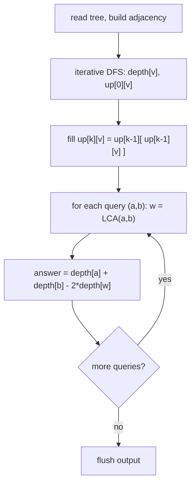

# Distance Queries (CSES — Tree Distances via LCA)

| Meta | Value |
|------|-------|
| Source | CSES Problem Set — Tree Algorithms |
| Difficulty | Hard |
| Topics | Binary Lifting, Lowest Common Ancestor, Tree, Distance |
| Link | https://cses.fi/problemset/task/1135 |

---

## Problem Statement
You are given a tree of `n` nodes rooted at node `1`. Process `q` queries: for each pair `(a, b)`,
report the **number of edges** on the unique path between `a` and `b`.

Constraints are large (`n, q` up to `2 \cdot 10^5`), so each query must be answered in
**O(log n)** — a per-query BFS would be far too slow.

**Example**
```
n = 5, edges: (1,2) (1,3) (3,4) (3,5)

Tree:        1
            / \
           2   3
              / \
             4   5

Query (4, 2):  path 4 - 3 - 1 - 2   -> 3 edges
Query (4, 5):  path 4 - 3 - 5       -> 2 edges
Query (2, 5):  path 2 - 1 - 3 - 5   -> 3 edges
```

---

## Why LCA Solves This

The unique path between `a` and `b` always goes **up** from each node to their **lowest common
ancestor** `w`, then there is no need to go higher. So the path splits into two vertical segments:
`a → w` of length `depth[a] - depth[w]`, and `b → w` of length `depth[b] - depth[w]`. Adding them:

$$
\operatorname{dist}(a, b) = depth[a] + depth[b] - 2 \cdot depth[\operatorname{lca}(a, b)]
$$

So the problem reduces to a fast LCA. **Binary lifting** precomputes each node's `2^k`-th ancestor
(`up[k][v]`), giving `O(n \log n)` preprocessing and `O(\log n)` per LCA — exactly what we need.

Because the tree can be a long path (depth up to `2e5`), the depth/parent precompute uses an
**iterative** DFS to avoid a recursion-stack overflow.

---

## Solution — Binary Lifting + Distance Formula

```python
import sys
from sys import setrecursionlimit

def main():
    data = sys.stdin.buffer.read().split()
    idx = 0
    n = int(data[idx]); idx += 1
    q = int(data[idx]); idx += 1

    adj = [[] for _ in range(n + 1)]
    for _ in range(n - 1):
        a = int(data[idx]); b = int(data[idx + 1]); idx += 2
        adj[a].append(b)
        adj[b].append(a)

    LOG = max(1, n.bit_length())
    up = [[1] * (n + 1) for _ in range(LOG)]
    depth = [0] * (n + 1)
    visited = [False] * (n + 1)

    # iterative DFS: parent (up[0]) and depth, root = 1
    up[0][1] = 1                       # root sentinel: parent of root is root
    visited[1] = True
    stack = [1]
    while stack:
        v = stack.pop()
        for w in adj[v]:
            if not visited[w]:
                visited[w] = True
                up[0][w] = v
                depth[w] = depth[v] + 1
                stack.append(w)

    for k in range(1, LOG):            # doubling table
        upk, upk1 = up[k], up[k - 1]
        for v in range(1, n + 1):
            upk[v] = upk1[upk1[v]]

    def lca(a, b):
        if depth[a] < depth[b]:
            a, b = b, a
        diff = depth[a] - depth[b]
        for k in range(LOG):
            if diff & (1 << k):
                a = up[k][a]
        if a == b:
            return a
        for k in range(LOG - 1, -1, -1):
            if up[k][a] != up[k][b]:
                a = up[k][a]
                b = up[k][b]
        return up[0][a]

    out = []
    for _ in range(q):
        a = int(data[idx]); b = int(data[idx + 1]); idx += 2
        w = lca(a, b)
        out.append(depth[a] + depth[b] - 2 * depth[w])
    sys.stdout.write("\n".join(map(str, out)) + "\n")

main()
```

```cpp
#include <bits/stdc++.h>
using namespace std;

int main() {
    ios::sync_with_stdio(false);
    cin.tie(nullptr);

    int n, q;
    cin >> n >> q;

    vector<vector<int>> adj(n + 1);
    for (int i = 0; i < n - 1; ++i) {
        int a, b;
        cin >> a >> b;
        adj[a].push_back(b);
        adj[b].push_back(a);
    }

    int LOG = max(1, (int)(32 - __builtin_clz((unsigned)n)));
    vector<vector<int>> up(LOG, vector<int>(n + 1, 1));
    vector<int> depth(n + 1, 0);
    vector<char> visited(n + 1, false);

    // iterative DFS: parent (up[0]) and depth, root = 1
    up[0][1] = 1;                       // root sentinel: parent of root is root
    visited[1] = true;
    stack<int> st;
    st.push(1);
    while (!st.empty()) {
        int v = st.top(); st.pop();
        for (int w : adj[v]) {
            if (!visited[w]) {
                visited[w] = true;
                up[0][w] = v;
                depth[w] = depth[v] + 1;
                st.push(w);
            }
        }
    }

    for (int k = 1; k < LOG; ++k)       // doubling table
        for (int v = 1; v <= n; ++v)
            up[k][v] = up[k - 1][up[k - 1][v]];

    auto lca = [&](int a, int b) -> int {
        if (depth[a] < depth[b]) swap(a, b);
        int diff = depth[a] - depth[b];
        for (int k = 0; k < LOG; ++k)
            if (diff & (1 << k))
                a = up[k][a];
        if (a == b) return a;
        for (int k = LOG - 1; k >= 0; --k)
            if (up[k][a] != up[k][b]) {
                a = up[k][a];
                b = up[k][b];
            }
        return up[0][a];
    };

    string out;
    for (int i = 0; i < q; ++i) {
        int a, b;
        cin >> a >> b;
        int w = lca(a, b);
        long long d = (long long)depth[a] + depth[b] - 2LL * depth[w];
        out += to_string(d);
        out += '\n';
    }
    cout << out;
    return 0;
}
```

---

## Trace — Query `(2, 5)` in the Example Tree

Depths: `depth[1]=0`, `depth[2]=1`, `depth[3]=1`, `depth[4]=2`, `depth[5]=2`.

1. **LCA(2, 5).** `depth[2] = 1`, `depth[5] = 2`, so swap → deeper node `a = 5`, `b = 2`.
2. **Phase 1 (equalize):** `diff = 1`, set bit `0` → `a = up[0][5] = 3`. Now `a = 3`, `b = 2`, both at
   depth `1`.
3. `a != b`, so **Phase 2 (lift together):** for the top `k`, `up[k][3]` and `up[k][2]` both reach the
   root `1` → equal, don't jump. At `k = 0`: `up[0][3] = 1`, `up[0][2] = 1` → equal, don't jump.
4. Loop ends; return `up[0][3] = 1`. So `lca(2, 5) = 1`.
5. **Distance:** `depth[2] + depth[5] - 2·depth[1] = 1 + 2 - 0 = 3`. ✓ (path `2 - 1 - 3 - 5`).

---

## Mermaid — Query Pipeline



---

## Math & Complexity

The distance identity holds because the `a → b` path is the concatenation of `a → w` and `w → b`,
which share only the vertex `w`:

$$
\operatorname{dist}(a, b) = (depth[a] - depth[w]) + (depth[b] - depth[w])
= depth[a] + depth[b] - 2 \cdot depth[w]
$$

| Phase | Time | Space |
|-------|------|-------|
| Build `up` table | $O(n \log n)$ | $O(n \log n)$ |
| Each distance query | $O(\log n)$ | — |
| Total (`q` queries) | $O((n + q) \log n)$ | $O(n \log n)$ |

With `n, q = 2 \cdot 10^5` and `LOG \approx 18`, this is a few million operations — well within limits.

---

## Takeaway
Tree distance is **just LCA plus depths**: `dist(a,b) = depth[a] + depth[b] - 2*depth[lca(a,b)]`.
Binary lifting delivers the LCA in `O(log n)` after `O(n log n)` preprocessing, and an **iterative**
DFS keeps the precompute safe for deep trees up to `2e5` nodes.
