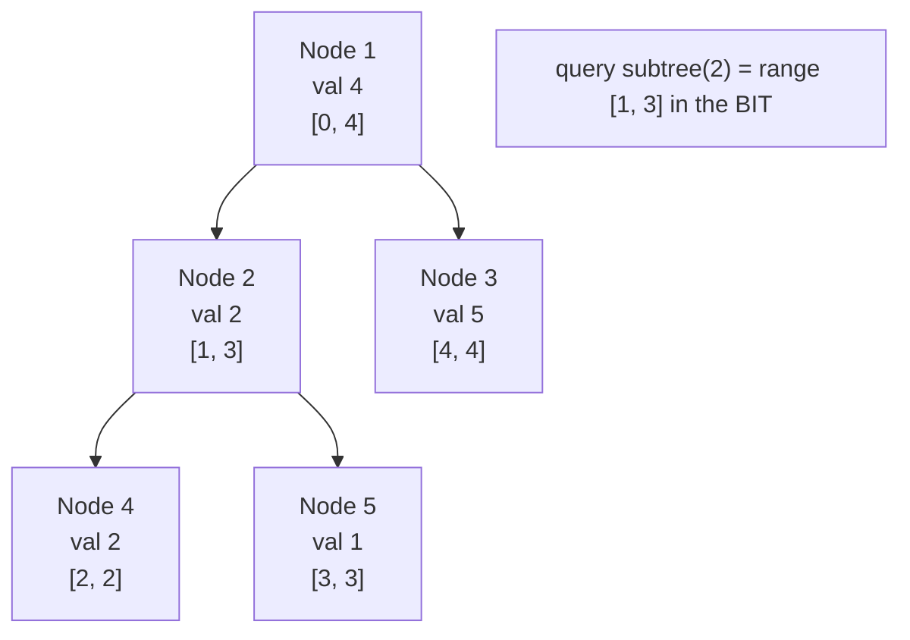

# CSES 1137 — Subtree Queries

| Meta | Value |
|------|-------|
| Source | CSES Problem Set — Tree Algorithms |
| Difficulty | Medium |
| Topics | Euler Tour Flattening, Fenwick Tree (BIT), Subtree Sum |
| Technique | tin/tout flatten → point update + range-sum |
| Link | https://cses.fi/problemset/task/1137 |

---

## Problem Statement

You are given a rooted tree of `n` nodes (root is node `1`). Each node has a value. Process `q`
queries of two kinds:

1. `1 s x` — change the value of node `s` to `x`.
2. `2 s` — compute the **sum of values in the subtree of `s`** (including `s` itself).

Constraints: `n, q` up to $2 \cdot 10^5$, values up to $10^9$. We need $O(\log n)$ per operation.

**Example**
```
n = 5, q = 3
values = [4, 2, 5, 2, 1]        # for nodes 1..5
edges:
  1 - 2
  1 - 3
  2 - 4
  2 - 5

tree:
        1(4)
       /    \
     2(2)   3(5)
    /   \
  4(2)  5(1)

query 2 2  -> subtree of 2 = {2,4,5} = 2+2+1 = 5
update 1 5 9 -> node 5 becomes 9
query 2 1  -> subtree of 1 = {1,2,3,4,5} = 4+2+5+2+9 = 22
```

---

## Why Euler Tour Flattening?

A subtree is a *set of tree nodes*, which is awkward for arrays — until we flatten. Running one DFS
and recording entry time `tin[v]` and exit time `tout[v]` makes the subtree of `v` the **contiguous
interval** $[tin[v], tout[v]]$ in a preorder array. Then:

- `update node s to x` → **point update** at index `tin[s]` (apply the delta `x - current[s]`).
- `subtree sum of s` → **range sum** over $[tin[s], tout[s]]$.

A **Fenwick tree (BIT)** does both in $O(\log n)$. The flattening is computed **once**; the BIT does
the rest.

| Approach | Subtree sum | Update node |
|----------|-------------|-------------|
| Re-walk subtree each query | $O(n)$ | $O(1)$ |
| Flatten + BIT | $O(\log n)$ | $O(\log n)$ |

---

## Solution — Paired Python + C++

We flatten with an **iterative DFS** (safe for a bamboo tree of $2 \cdot 10^5$ nodes), seed the BIT
with each node's initial value at its `tin` slot, then answer queries.

```python
import sys
input = sys.stdin.buffer.read

class BIT:
    def __init__(self, n: int):
        self.n = n
        self.tree = [0] * (n + 1)  # 1-indexed internally

    def update(self, i: int, delta: int) -> None:
        i += 1  # 0-indexed position -> 1-indexed
        while i <= self.n:
            self.tree[i] += delta
            i += i & (-i)

    def prefix(self, i: int) -> int:
        i += 1
        s = 0
        while i > 0:
            s += self.tree[i]
            i -= i & (-i)
        return s

    def range_sum(self, l: int, r: int) -> int:
        return self.prefix(r) - (self.prefix(l - 1) if l > 0 else 0)


def solve():
    data = sys.stdin.buffer.read().split()
    idx = 0
    n = int(data[idx]); idx += 1
    q = int(data[idx]); idx += 1
    val = [0] * (n + 1)
    for v in range(1, n + 1):
        val[v] = int(data[idx]); idx += 1
    adj = [[] for _ in range(n + 1)]
    for _ in range(n - 1):
        a = int(data[idx]); b = int(data[idx + 1]); idx += 2
        adj[a].append(b)
        adj[b].append(a)

    tin = [0] * (n + 1)
    tout = [0] * (n + 1)
    timer = 0
    stack = [(1, 0, False)]  # (node, parent, is_exit)
    while stack:
        v, parent, is_exit = stack.pop()
        if is_exit:
            tout[v] = timer - 1
            continue
        tin[v] = timer
        timer += 1
        stack.append((v, parent, True))
        for u in reversed(adj[v]):
            if u != parent:
                stack.append((u, v, False))

    bit = BIT(n)
    cur = [0] * (n + 1)  # current stored value per node
    for v in range(1, n + 1):
        bit.update(tin[v], val[v])
        cur[v] = val[v]

    out = []
    for _ in range(q):
        t = int(data[idx]); idx += 1
        if t == 1:
            s = int(data[idx]); x = int(data[idx + 1]); idx += 2
            bit.update(tin[s], x - cur[s])
            cur[s] = x
        else:
            s = int(data[idx]); idx += 1
            out.append(str(bit.range_sum(tin[s], tout[s])))
    sys.stdout.write("\n".join(out) + ("\n" if out else ""))


solve()
```

```cpp
#include <bits/stdc++.h>
using namespace std;

struct BIT {
    int n;
    vector<long long> tree;  // 1-indexed internally
    BIT(int n) : n(n), tree(n + 1, 0) {}

    void update(int i, long long delta) {
        i += 1;  // 0-indexed position -> 1-indexed
        for (; i <= n; i += i & (-i)) tree[i] += delta;
    }

    long long prefix(int i) {
        i += 1;
        long long s = 0;
        for (; i > 0; i -= i & (-i)) s += tree[i];
        return s;
    }

    long long range_sum(int l, int r) {
        return prefix(r) - (l > 0 ? prefix(l - 1) : 0LL);
    }
};

int main() {
    ios::sync_with_stdio(false);
    cin.tie(nullptr);

    int n, q;
    cin >> n >> q;
    vector<long long> val(n + 1);
    for (int v = 1; v <= n; ++v) cin >> val[v];
    vector<vector<int>> adj(n + 1);
    for (int i = 0; i < n - 1; ++i) {
        int a, b;
        cin >> a >> b;
        adj[a].push_back(b);
        adj[b].push_back(a);
    }

    vector<int> tin(n + 1, 0), tout(n + 1, 0);
    int timer = 0;
    struct Frame { int v, parent; bool is_exit; };
    vector<Frame> stk;
    stk.push_back({1, 0, false});
    while (!stk.empty()) {
        Frame f = stk.back();
        stk.pop_back();
        if (f.is_exit) {
            tout[f.v] = timer - 1;
            continue;
        }
        tin[f.v] = timer;
        timer += 1;
        stk.push_back({f.v, f.parent, true});
        for (auto it = adj[f.v].rbegin(); it != adj[f.v].rend(); ++it) {
            if (*it != f.parent) stk.push_back({*it, f.v, false});
        }
    }

    BIT bit(n);
    vector<long long> cur(n + 1, 0);  // current stored value per node
    for (int v = 1; v <= n; ++v) {
        bit.update(tin[v], val[v]);
        cur[v] = val[v];
    }

    string out;
    for (int i = 0; i < q; ++i) {
        int t;
        cin >> t;
        if (t == 1) {
            int s;
            long long x;
            cin >> s >> x;
            bit.update(tin[s], x - cur[s]);
            cur[s] = x;
        } else {
            int s;
            cin >> s;
            out += to_string(bit.range_sum(tin[s], tout[s]));
            out += '\n';
        }
    }
    cout << out;
    return 0;
}
```

---

## Trace

Using the example tree, a DFS from `1` visiting children in input order (`1`→`2`→`4`, then `5`,
then `3`) produces:

| node `v` | 1 | 2 | 4 | 5 | 3 |
|----------|---|---|---|---|---|
| `tin[v]` | 0 | 1 | 2 | 3 | 4 |
| `tout[v]`| 4 | 3 | 2 | 3 | 4 |

Flattened array indexed by `tin` (node : value): `[1:4, 2:2, 4:2, 5:1, 3:5]`.

1. **`2 2`** → subtree of `2` is range $[tin[2], tout[2]] = [1, 3]$ → values `2 + 2 + 1 = 5`. ✓
2. **`1 5 9`** → `tin[5] = 3`, delta `= 9 - 1 = 8`, point update at index `3`. Now index 3 holds `9`.
3. **`2 1`** → subtree of `1` is range $[0, 4]$ → `4 + 2 + 2 + 9 + 5 = 22`. ✓

---

## Mermaid



---

## Math & Complexity

The correctness rests on the interval characterization of a subtree:

$$u \in \text{subtree}(s) \iff tin[s] \le tin[u] \le tout[s].$$

A subtree sum is therefore a range sum, evaluated as the difference of two BIT prefixes:

$$\text{subtree\_sum}(s) = \mathrm{prefix}(tout[s]) - \mathrm{prefix}(tin[s] - 1).$$

| Phase | Time | Space |
|-------|------|-------|
| Flatten (iterative DFS) | $O(n)$ | $O(n)$ |
| Each update / query | $O(\log n)$ | — |
| Total | $O((n + q)\log n)$ | $O(n)$ |

Values up to $10^9$ and up to $2 \cdot 10^5$ of them sum beyond 32 bits, so C++ uses `long long`.

---

## Takeaway

When a problem says **"subtree"** with point updates, flatten the tree once with `tin/tout` and let
a Fenwick tree do range sums. The subtree-as-interval identity is the whole solution; everything
else is a standard BIT.
