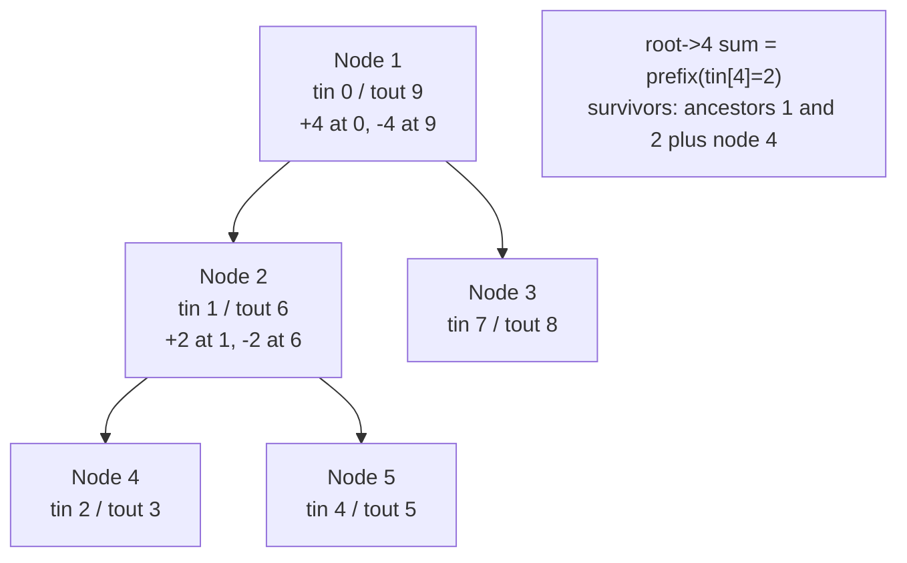

# CSES 1138 — Path Queries

| Meta | Value |
|------|-------|
| Source | CSES Problem Set — Tree Algorithms |
| Difficulty | Medium |
| Topics | Euler Tour Flattening, Fenwick Tree, Root-Path Sum, +1/−1 Trick |
| Technique | doubled-tour positions → point update / prefix query duality |
| Link | https://cses.fi/problemset/task/1138 |

---

## Problem Statement

You are given a rooted tree of `n` nodes (root is node `1`), each with a value. Process `q` queries:

1. `1 s x` — change the value of node `s` to `x`.
2. `2 s` — report the **sum of values on the path from the root to node `s`** (both endpoints
   included).

Constraints: `n, q` up to $2 \cdot 10^5$, values up to $10^9$. We need $O(\log n)$ per operation.

**Example**
```
n = 5, q = 3
values = [4, 2, 5, 2, 1]        # for nodes 1..5
edges:
  1 - 2
  1 - 3
  2 - 4
  2 - 5

tree:
        1(4)
       /    \
     2(2)   3(5)
    /   \
  4(2)  5(1)

query 2 4  -> path 1->2->4 = 4+2+2 = 8
update 1 2 9 -> node 2 becomes 9
query 2 4  -> path 1->2->4 = 4+9+2 = 15
```

---

## Why the +1/−1 Euler Trick?

A root-to-node path is the chain of **ancestors** of `s` (plus `s`). The Euler-tour insight: with
**entry** position `tin[v]` and **exit** position `tout[v]` from a DFS that increments a timer on
*both* enter and leave, a node `u` is an ancestor of `s` iff $tin[u] \le tin[s] \le tout[u]$.

So store each node's value **twice** in a BIT: **`+value` at `tin[v]`** and **`−value` at
`tout[v]`**. Then:

$$\text{root\_path\_sum}(s) = \mathrm{prefix}(tin[s]).$$

Every **ancestor** `u` of `s` contributes its `+value` (its `tin[u] \le tin[s]`) while its
cancelling `−value` sits at `tout[u] > tin[s]`, so it is **not** subtracted yet — net `+value`. Any
non-ancestor either contributes both marks (they cancel) or neither. The survivors are exactly the
path nodes.

This is the **dual** of subtree-sum: there we *queried a range and updated a point*; here we *update
a point pair and query a prefix*. Updating node `s` to `x` is two BIT updates (delta at `tin[s]` and
`−`delta at `tout[s]`).

---

## Solution — Paired Python + C++

We use a DFS that increments the timer on **both** entry and exit, giving each node distinct `tin`
and `tout` positions in a length-`2n` coordinate space.

```python
import sys

class BIT:
    def __init__(self, n: int):
        self.n = n
        self.tree = [0] * (n + 1)  # 1-indexed internally

    def update(self, i: int, delta: int) -> None:
        i += 1  # 0-indexed position -> 1-indexed
        while i <= self.n:
            self.tree[i] += delta
            i += i & (-i)

    def prefix(self, i: int) -> int:
        i += 1
        s = 0
        while i > 0:
            s += self.tree[i]
            i -= i & (-i)
        return s


def solve():
    data = sys.stdin.buffer.read().split()
    idx = 0
    n = int(data[idx]); idx += 1
    q = int(data[idx]); idx += 1
    val = [0] * (n + 1)
    for v in range(1, n + 1):
        val[v] = int(data[idx]); idx += 1
    adj = [[] for _ in range(n + 1)]
    for _ in range(n - 1):
        a = int(data[idx]); b = int(data[idx + 1]); idx += 2
        adj[a].append(b)
        adj[b].append(a)

    tin = [0] * (n + 1)
    tout = [0] * (n + 1)
    timer = 0
    stack = [(1, 0, False)]  # (node, parent, is_exit)
    while stack:
        v, parent, is_exit = stack.pop()
        if is_exit:
            tout[v] = timer
            timer += 1
            continue
        tin[v] = timer
        timer += 1
        stack.append((v, parent, True))
        for u in reversed(adj[v]):
            if u != parent:
                stack.append((u, v, False))

    size = 2 * n
    bit = BIT(size)
    cur = [0] * (n + 1)
    for v in range(1, n + 1):
        bit.update(tin[v], val[v])
        bit.update(tout[v], -val[v])
        cur[v] = val[v]

    out = []
    for _ in range(q):
        t = int(data[idx]); idx += 1
        if t == 1:
            s = int(data[idx]); x = int(data[idx + 1]); idx += 2
            d = x - cur[s]
            bit.update(tin[s], d)
            bit.update(tout[s], -d)
            cur[s] = x
        else:
            s = int(data[idx]); idx += 1
            out.append(str(bit.prefix(tin[s])))
    sys.stdout.write("\n".join(out) + ("\n" if out else ""))


solve()
```

```cpp
#include <bits/stdc++.h>
using namespace std;

struct BIT {
    int n;
    vector<long long> tree;  // 1-indexed internally
    BIT(int n) : n(n), tree(n + 1, 0) {}

    void update(int i, long long delta) {
        i += 1;  // 0-indexed position -> 1-indexed
        for (; i <= n; i += i & (-i)) tree[i] += delta;
    }

    long long prefix(int i) {
        i += 1;
        long long s = 0;
        for (; i > 0; i -= i & (-i)) s += tree[i];
        return s;
    }
};

int main() {
    ios::sync_with_stdio(false);
    cin.tie(nullptr);

    int n, q;
    cin >> n >> q;
    vector<long long> val(n + 1);
    for (int v = 1; v <= n; ++v) cin >> val[v];
    vector<vector<int>> adj(n + 1);
    for (int i = 0; i < n - 1; ++i) {
        int a, b;
        cin >> a >> b;
        adj[a].push_back(b);
        adj[b].push_back(a);
    }

    vector<int> tin(n + 1, 0), tout(n + 1, 0);
    int timer = 0;
    struct Frame { int v, parent; bool is_exit; };
    vector<Frame> stk;
    stk.push_back({1, 0, false});
    while (!stk.empty()) {
        Frame f = stk.back();
        stk.pop_back();
        if (f.is_exit) {
            tout[f.v] = timer;
            timer += 1;
            continue;
        }
        tin[f.v] = timer;
        timer += 1;
        stk.push_back({f.v, f.parent, true});
        for (auto it = adj[f.v].rbegin(); it != adj[f.v].rend(); ++it) {
            if (*it != f.parent) stk.push_back({*it, f.v, false});
        }
    }

    int size = 2 * n;
    BIT bit(size);
    vector<long long> cur(n + 1, 0);
    for (int v = 1; v <= n; ++v) {
        bit.update(tin[v], val[v]);
        bit.update(tout[v], -val[v]);
        cur[v] = val[v];
    }

    string out;
    for (int i = 0; i < q; ++i) {
        int t;
        cin >> t;
        if (t == 1) {
            int s;
            long long x;
            cin >> s >> x;
            long long d = x - cur[s];
            bit.update(tin[s], d);
            bit.update(tout[s], -d);
            cur[s] = x;
        } else {
            int s;
            cin >> s;
            out += to_string(bit.prefix(tin[s]));
            out += '\n';
        }
    }
    cout << out;
    return 0;
}
```

---

## Trace

DFS from `1` (children in input order), incrementing the timer on **both** enter and exit:

```
events:   in1 in2 in4 out4 in5 out5 out2 in3 out3 out1
position:  0   1   2    3   4    5    6   7    8    9
```

| node `v` | 1 | 2 | 4 | 5 | 3 |
|----------|---|---|---|---|---|
| `tin[v]` | 0 | 1 | 2 | 4 | 7 |
| `tout[v]`| 9 | 6 | 3 | 5 | 8 |

BIT marks (`+value` at `tin`, `−value` at `tout`):

```
idx:  0    1    2    3    4    5    6    7    8    9
mark: +4   +2   +2   -2   +1   -1   -2   +5   -5   -4
node: 1in  2in  4in  4out 5in 5out 2out 3in 3out 1out
```

1. **`2 4`** → `prefix(tin[4]) = prefix(2) = +4 +2 +2 = 8`. The ancestors `1, 2` contributed `+4, +2`
   and their `−` marks lie at positions `9, 6 > 2`, so they survive. ✓
2. **`1 2 9`** → delta `= 9 - 2 = 7`; update `+7` at `tin[2]=1` and `−7` at `tout[2]=6`.
3. **`2 4`** → `prefix(2) = +4 +(2+7) +2 = 15`. ✓

---

## Mermaid



---

## Math & Complexity

Ancestry as an interval test drives the trick:

$$u \in \text{ancestors}(s) \cup \{s\} \iff tin[u] \le tin[s] \le tout[u].$$

Storing $+a_u$ at $tin[u]$ and $-a_u$ at $tout[u]$, the prefix up to $tin[s]$ keeps a node's
contribution iff $tin[u] \le tin[s]$ **and** $tout[u] > tin[s]$ — precisely the ancestors:

$$\mathrm{prefix}(tin[s]) = \sum_{u \,:\, tin[u] \le tin[s] < tout[u]} a_u = \sum_{u \in \text{path}(root, s)} a_u.$$

| Phase | Time | Space |
|-------|------|-------|
| Flatten (iterative DFS) | $O(n)$ | $O(n)$ |
| Each update (two BIT ops) / query | $O(\log n)$ | — |
| Total | $O((n + q)\log n)$ | $O(n)$ |

`long long` is required in C++: a path can hold up to $2 \cdot 10^5$ values near $10^9$.

---

## Takeaway

**Root-to-node path sums** are the mirror image of subtree sums. Encode each node as **+value on
enter, −value on exit** in a BIT over the doubled tour; a single **prefix query at `tin[s]`** sums
the path because every ancestor's `−` mark is still ahead of you. Point update, prefix query — the
exact dual of CSES 1137.
