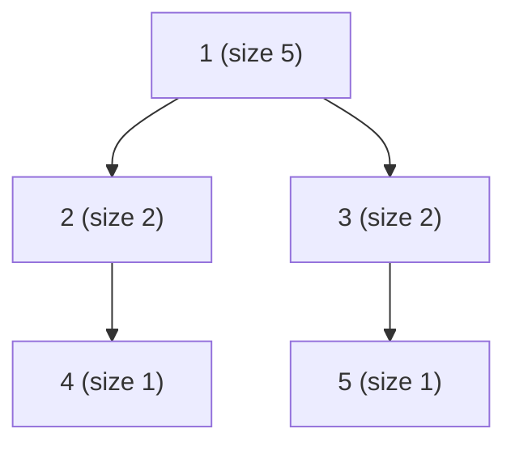

# Subordinates (CSES — Subtree Sizes via DFS)

| Meta | Value |
|------|-------|
| Source | CSES Problem Set — Tree Algorithms |
| Difficulty | Easy–Medium |
| Topics | Tree DFS, Subtree Aggregation |
| Link | https://cses.fi/problemset/task/1674 |

---

## Problem Statement
A company has `n` employees forming a tree rooted at employee 1 (the boss). Each employee except
the boss has exactly one direct superior. For **each** employee, count the number of
**subordinates** (all employees in their subtree, excluding themselves).

**Example**
```
n = 5, boss[2..5] = [1, 1, 2, 3]
Tree:        1
            / \
           2   3
           |   |
           4   5
subordinates = [4, 1, 1, 0, 0]   // employee 1 has 4, employee 2 has 1 (node 4), etc.
```

---

## Subtree Size = 1 + Sum of Children's Subtree Sizes

Define `size[v]` = number of nodes in the subtree rooted at `v` (including `v`). Then the number
of **subordinates** of `v` is `size[v] - 1`. The recurrence is the classic post-order aggregation:

$$
size[v] = 1 + \sum_{c \in \text{children}(v)} size[c]
$$

We compute it bottom-up with a single DFS — a child's size is finalized **before** the parent
adds it in.



```python
import sys
from sys import setrecursionlimit

def subordinates(n, boss):
    # boss[i] = direct superior of employee i (2..n); employees are 1-indexed
    children = [[] for _ in range(n + 1)]
    for emp in range(2, n + 1):
        children[boss[emp]].append(emp)

    size = [1] * (n + 1)

    # iterative post-order DFS to avoid recursion-limit issues on deep trees
    stack = [(1, False)]
    while stack:
        node, processed = stack.pop()
        if processed:
            for c in children[node]:
                size[node] += size[c]     # children already finalized
        else:
            stack.append((node, True))    # revisit after children
            for c in children[node]:
                stack.append((c, False))

    return [size[v] - 1 for v in range(1, n + 1)]   # subordinates = subtree size − 1
```

```cpp
vector<long long> subordinates(int n, const vector<int>& boss) {
    // boss[i] = direct superior of employee i (2..n); employees are 1-indexed
    vector<vector<int>> children(n + 1);
    for (int emp = 2; emp <= n; ++emp)
        children[boss[emp]].push_back(emp);

    vector<long long> size(n + 1, 1);

    // iterative post-order DFS to avoid recursion-limit issues on deep trees
    vector<pair<int,bool>> stack = {{1, false}};
    while (!stack.empty()) {
        auto [node, processed] = stack.back();
        stack.pop_back();
        if (processed) {
            for (int c : children[node])
                size[node] += size[c];    // children already finalized
        } else {
            stack.push_back({node, true});    // revisit after children
            for (int c : children[node])
                stack.push_back({c, false});
        }
    }

    vector<long long> res;
    for (int v = 1; v <= n; ++v)
        res.push_back(size[v] - 1);       // subordinates = subtree size − 1
    return res;
}
```

> CSES trees can be deep (chains up to 2·10⁵), so an **iterative DFS** (or
> `sys.setrecursionlimit(300000)`) avoids stack overflow.

---

## Trace — `n = 5`, `boss = {2:1, 3:1, 4:2, 5:3}`

Children: `1→[2,3]`, `2→[4]`, `3→[5]`.

Post-order visit order: `4, 2, 5, 3, 1` (leaves finalize first).

| node | children sizes added | size[node] | subordinates = size−1 |
|------|----------------------|------------|------------------------|
| 4 | — | 1 | 0 |
| 2 | size[4]=1 | 1 + 1 = 2 | 1 |
| 5 | — | 1 | 0 |
| 3 | size[5]=1 | 1 + 1 = 2 | 1 |
| 1 | size[2]+size[3]=2+2 | 1 + 4 = 5 | 4 |

Output (employees 1..5): `[4, 1, 1, 0, 0]`. ✓ Each parent's size is the sum of already-computed
child sizes plus itself.

---

## Why Post-Order

A node's subtree size depends on its children's sizes, so children **must** be fully processed
first. Post-order DFS guarantees exactly that ordering. This "combine children, then yourself"
pattern generalizes to subtree sums, max depth, subtree min/max, counts of special nodes, and
tree DP in general.

---

## Complexity

| Metric | Value |
|--------|-------|
| Time | O(n) — each node/edge visited once |
| Space | O(n) — children lists + explicit stack |

---

## Tree-DP Cousins (same DFS skeleton)
| Problem | Aggregate stored |
|---------|-----------------|
| **Subordinates** (1674) | subtree size |
| **Tree Distances** | max depth down each subtree |
| **Tree Matching** (1130) | DP: matched / unmatched at node |
| Sum of subtree values | running subtree sum |

## Takeaway
**Subtree size = 1 + sum of children's sizes**, computed in a single **post-order DFS**. This
bottom-up aggregation is the entry point to all of tree DP — and on large CP trees, prefer an
**iterative DFS** to dodge recursion limits.
