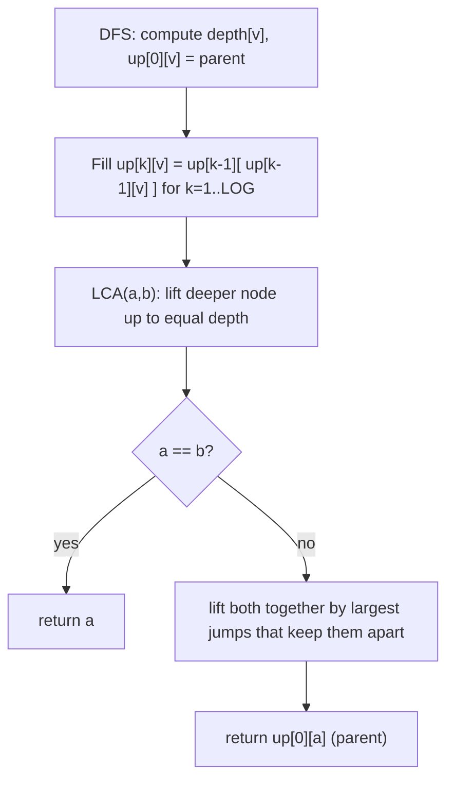

# Company Queries II (CSES — LCA via Binary Lifting)

| Meta | Value |
|------|-------|
| Source | CSES Problem Set — Tree Algorithms |
| Difficulty | Hard |
| Topics | Binary Lifting, Lowest Common Ancestor, Tree |
| Link | https://cses.fi/problemset/task/1688 |

---

## Problem Statement
A company tree is rooted at employee 1. Answer `q` queries: for employees `a` and `b`, find their
**lowest common ancestor (LCA)** — the deepest node that is an ancestor of both.

**Example**
```
Tree:        1
            / \
           2   3
          /|   |
         4 5   6
LCA(4, 5) = 2,  LCA(4, 6) = 1,  LCA(5, 3) = 1
```

---

## Binary Lifting — Precompute Ancestors at Power-of-Two Heights

Store `up[k][v]` = the `2^k`-th ancestor of `v`. Then any ancestor jump of height `h` decomposes
into jumps of sizes that are the **set bits of `h`** (binary representation). This answers
"k-th ancestor" in **O(log n)** and LCA in **O(log n)**.

**Recurrence** (a `2^k` jump is two `2^{k-1}` jumps):
$$
up[k][v] = up[k-1]\bigl(up[k-1][v]\bigr)
$$



```python
import sys
from collections import deque

def build_lca(n, parent):
    LOG = max(1, (n).bit_length())
    up = [[0] * (n + 1) for _ in range(LOG)]
    depth = [0] * (n + 1)

    # up[0] = direct parent; root's parent = itself (sentinel)
    for v in range(1, n + 1):
        up[0][v] = parent[v] if parent[v] != 0 else v

    # BFS/iterative to set depths (root = 1)
    children = [[] for _ in range(n + 1)]
    for v in range(2, n + 1):
        children[parent[v]].append(v)
    q = deque([1])
    while q:
        x = q.popleft()
        for c in children[x]:
            depth[c] = depth[x] + 1
            q.append(c)

    # fill binary-lifting table
    for k in range(1, LOG):
        for v in range(1, n + 1):
            up[k][v] = up[k - 1][up[k - 1][v]]
    return up, depth, LOG

def lca(a, b, up, depth, LOG):
    if depth[a] < depth[b]:
        a, b = b, a
    diff = depth[a] - depth[b]
    for k in range(LOG):                 # lift a up to b's depth
        if diff & (1 << k):
            a = up[k][a]
    if a == b:
        return a
    for k in range(LOG - 1, -1, -1):     # lift both while ancestors differ
        if up[k][a] != up[k][b]:
            a = up[k][a]
            b = up[k][b]
    return up[0][a]                      # parent of where they meet
```

```cpp
// returns {up table, depth, LOG}
tuple<vector<vector<int>>, vector<int>, int> build_lca(int n, const vector<int>& parent) {
    int LOG = max(1, (int)(sizeof(unsigned) * 8 - __builtin_clz((unsigned)n)));
    vector<vector<int>> up(LOG, vector<int>(n + 1, 0));
    vector<int> depth(n + 1, 0);

    // up[0] = direct parent; root's parent = itself (sentinel)
    for (int v = 1; v <= n; ++v)
        up[0][v] = parent[v] != 0 ? parent[v] : v;

    // BFS/iterative to set depths (root = 1)
    vector<vector<int>> children(n + 1);
    for (int v = 2; v <= n; ++v)
        children[parent[v]].push_back(v);
    queue<int> q;
    q.push(1);
    while (!q.empty()) {
        int x = q.front(); q.pop();
        for (int c : children[x]) {
            depth[c] = depth[x] + 1;
            q.push(c);
        }
    }

    // fill binary-lifting table
    for (int k = 1; k < LOG; ++k)
        for (int v = 1; v <= n; ++v)
            up[k][v] = up[k - 1][up[k - 1][v]];
    return {up, depth, LOG};
}

int lca(int a, int b, const vector<vector<int>>& up, const vector<int>& depth, int LOG) {
    if (depth[a] < depth[b])
        swap(a, b);
    int diff = depth[a] - depth[b];
    for (int k = 0; k < LOG; ++k)            // lift a up to b's depth
        if (diff & (1 << k))
            a = up[k][a];
    if (a == b)
        return a;
    for (int k = LOG - 1; k >= 0; --k)       // lift both while ancestors differ
        if (up[k][a] != up[k][b]) {
            a = up[k][a];
            b = up[k][b];
        }
    return up[0][a];                         // parent of where they meet
}
```

---

## How LCA Works in Two Phases

**Phase 1 — equalize depth.** Lift the deeper node up by `depth[a] - depth[b]`, decomposed into
power-of-two jumps via the set bits of the difference. Now both nodes sit at the same depth.

**Phase 2 — lift together.** From the highest power down, jump both nodes up **only if their
ancestors at that height still differ**. This stops them **just below** the LCA; the answer is
then their common parent `up[0][a]`.

---

## Trace — LCA(4, 6) in the example tree

Depths: `depth[4]=2`, `depth[6]=2`, `depth[2]=1`, `depth[3]=1`, `depth[1]=0`.

**Phase 1:** equal depth already (both depth 2), no lift.
**Phase 2:** check largest k:
- `up[1][4]` (4's grandparent) = 1, `up[1][6]` = 1 → **equal**, don't jump.
- `up[0][4]` = 2, `up[0][6]` = 3 → **differ**, jump both: `a=2`, `b=3`.

Loop ends. Return `up[0][2] = 1`. So **LCA(4,6) = 1**. ✓

For **LCA(4,5)**: depths equal (2). Phase 2: `up[0][4]=2`, `up[0][5]=2` equal → never jump. After
loop return `up[0][4] = 2` → **LCA = 2**. ✓

---

## Complexity

| Phase | Time | Space |
|-------|------|-------|
| Preprocessing | O(n log n) | O(n log n) for `up` table |
| Each LCA query | O(log n) | — |
| `q` queries total | O(q log n) | — |

---

## Distance & Other Uses
- **Distance(a,b)** = `depth[a] + depth[b] − 2·depth[lca(a,b)]`.
- **k-th ancestor** (Company Queries I, 1687): just Phase 1 lifting by `k`.
- **Path queries** on trees (sum/min on `a→b`) combine LCA with prefix or sparse structures.

## Takeaway
**Binary lifting** precomputes `2^k`-ancestors so any vertical jump becomes O(log n) via the
binary expansion of the height. LCA = equalize depths, then lift both nodes together until just
below their meeting point. It's the standard tool for ancestor, k-th-ancestor, and tree-path
queries.
