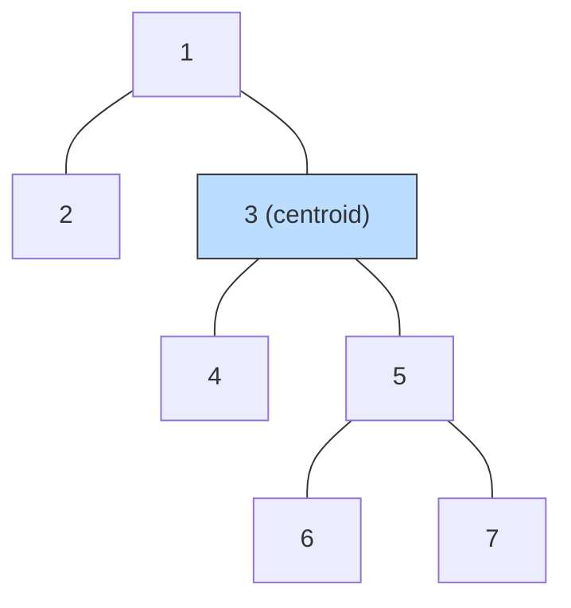

# Find the Tree Centroid (Subtree Sizes)

| Meta | Value |
|------|-------|
| Source | Self-contained classic |
| Difficulty | Medium |
| Topics | Trees, DFS, Subtree Sizes, Centroid |
| Link | — (self-contained) |

---

## Problem Statement
Given a tree with `n` nodes, find its **centroid(s)**: a node whose removal leaves every remaining
component with at most $\lfloor n/2 \rfloor$ nodes. Every tree has **one or two** centroids; if two,
they are adjacent. Return all of them.

**Example**
```
n = 7
edges:
  1 - 2
  1 - 3
  3 - 4
  3 - 5
  5 - 6
  5 - 7

          2
          |
          1
          |
          3
         / \
        4   5
           / \
          6   7

Removing 3: components {1,2}=2, {4}=1, {5,6,7}=3 -> max 3 <= 3. Centroid!
Answer: [3]
```

---

## WHY This Works
Root the tree anywhere and compute subtree sizes `sz(v)`. Removing node `v` produces these
components:
- each child subtree `c`, of size `sz(c)`;
- the **upward** component containing the root, of size `n - sz(v)`.

So `v` is a centroid exactly when its **largest branch** is at most $\lfloor n/2 \rfloor$:

$$
\max\!\left(\, n - \text{sz}(v),\ \max_{c \in \text{children}(v)} \text{sz}(c)\,\right) \le \left\lfloor \tfrac{n}{2} \right\rfloor.
$$

This is correct because, in a tree, deleting a node cleanly separates it into the subtrees hanging
off each neighbor — there are no cycles to merge components. Forgetting the upward part
`n - sz(v)` is the single most common bug, so we always include it.

---

## Solution (paired Python + C++)

```python
def find_tree_centroid(n, edges):
    adj = [[] for _ in range(n + 1)]
    for u, v in edges:
        adj[u].append(v)
        adj[v].append(u)

    parent = [0] * (n + 1)
    order = []
    visited = [False] * (n + 1)
    st = [1]
    visited[1] = True
    while st:                              # iterative DFS for post-order
        x = st.pop()
        order.append(x)
        for y in adj[x]:
            if not visited[y]:
                visited[y] = True
                parent[y] = x
                st.append(y)

    sz = [1] * (n + 1)
    for x in reversed(order):              # children before parents
        if parent[x]:
            sz[parent[x]] += sz[x]

    centroids = []
    for x in range(1, n + 1):
        biggest = n - sz[x]                # upward component
        for y in adj[x]:
            if y != parent[x]:
                biggest = max(biggest, sz[y])
        if biggest <= n // 2:
            centroids.append(x)
    return centroids
```

```cpp
#include <bits/stdc++.h>
using namespace std;

vector<int> find_tree_centroid(int n, const vector<pair<int,int>>& edges) {
    vector<vector<int>> adj(n + 1);
    for (const auto& [u, v] : edges) {
        adj[u].push_back(v);
        adj[v].push_back(u);
    }

    vector<int> parent(n + 1, 0);
    vector<int> order;
    vector<char> visited(n + 1, false);
    vector<int> st = {1};
    visited[1] = true;
    while (!st.empty()) {                  // iterative DFS for post-order
        int x = st.back(); st.pop_back();
        order.push_back(x);
        for (int y : adj[x]) {
            if (!visited[y]) {
                visited[y] = true;
                parent[y] = x;
                st.push_back(y);
            }
        }
    }

    vector<int> sz(n + 1, 1);
    for (int i = (int)order.size() - 1; i >= 0; --i) {   // children before parents
        int x = order[i];
        if (parent[x]) sz[parent[x]] += sz[x];
    }

    vector<int> centroids;
    for (int x = 1; x <= n; ++x) {
        int biggest = n - sz[x];           // upward component
        for (int y : adj[x]) {
            if (y != parent[x]) biggest = max(biggest, sz[y]);
        }
        if (biggest <= n / 2) centroids.push_back(x);
    }
    return centroids;
}
```

---

## Trace — the example (`n = 7`, rooted at `1`)

Post-order: `2, 4, 6, 7, 5, 3, 1`. Subtree sizes accumulate:

| Node | `sz` |
|------|------|
| 2 | 1 |
| 4 | 1 |
| 6 | 1 |
| 7 | 1 |
| 5 | 3 (5,6,7) |
| 3 | 5 (3,4,5,6,7) |
| 1 | 7 (all) |

Now check each node against $\lfloor 7/2 \rfloor = 3$:

| Node `x` | upward `n-sz` | child branches | biggest | $\le 3$? |
|----------|---------------|----------------|---------|----------|
| 1 | 0 | sz(3)=5 | 5 | no |
| 3 | 2 | sz(4)=1, sz(5)=3 | 3 | **yes** |
| 5 | 4 | sz(6)=1, sz(7)=1 | 4 | no |

Only node `3` passes. **Answer: `[3]`**.

---

## Mermaid



Removing the blue centroid `3` yields components of sizes `2`, `1`, `3` — all $\le \lfloor n/2 \rfloor = 3$.

---

## Math & Complexity
Two linear passes — one to gather subtree sizes, one to test the balance condition:

$$
O(n + m) = O(n), \qquad m = n - 1.
$$

Space is $O(n)$. The proof that the result has size **1 or 2** is in
[02-tree-diameter-centroid.md](../guide/02-tree-diameter-centroid.md): moving toward the heaviest
branch strictly shrinks the part you leave, so the process halts at a balanced node, and two
centroids can only occur as an adjacent pair on a perfectly even split.

---

## Takeaway
A centroid is the node whose **largest branch is minimized**. Compute `sz(v)` with one post-order
pass, then accept any node where $\max(n - \text{sz}(v), \max_c \text{sz}(c)) \le \lfloor n/2 \rfloor$.
This $O(n)$ routine is the foundation of **centroid decomposition**.
