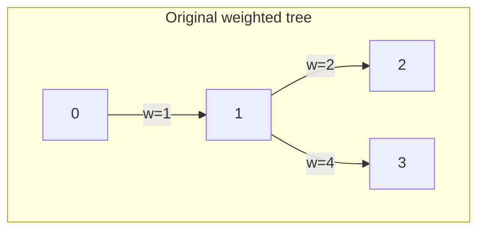
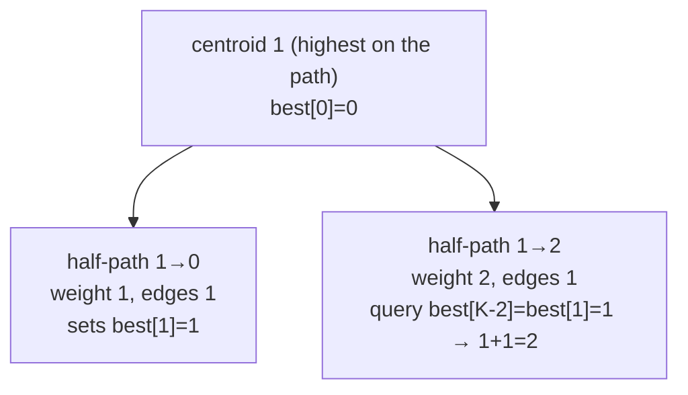

# IOI 2011 "Race" — Minimum Edges on a Path of Total Length Exactly K

| Meta | Value |
|------|-------|
| Source | IOI 2011, Day 1, Problem "Race" |
| Difficulty | Hard |
| Topics | Trees, Centroid Decomposition, Divide & Conquer on Paths |
| Technique | centroid decomposition + `best[weight]` accumulator queried as `best[K - w]` |
| Link | https://oj.uz/problem/view/IOI11_race |

---

## Problem Statement

You are given a tree with $n$ nodes (numbered $0 \ldots n-1$) and $n-1$ **weighted** edges (weights are
positive integers). Given a target length $K$, find a path whose edge weights sum to **exactly $K$**
and that uses the **fewest edges**. Output that minimum number of edges, or $-1$ if no path sums to
exactly $K$.

Constraints: $n$ up to $2 \times 10^5$, $K$ up to $10^6$, edge weights up to $10^6$. A path's weighted
length can reach $2 \times 10^{11}$, so use 64-bit arithmetic.

**Example**
```
n = 4, K = 3
edges (u v w):
  0 1 1
  1 2 2
  1 3 4

tree:
        0
        | 1
        1
       / \
     2|   |4
      2     3

Paths summing to exactly 3:
  0 - 1 - 2  : weight 1 + 2 = 3, uses 2 edges
  (no shorter one exists)

Answer: 2
```

---

## Why Centroid Decomposition?

A path summing to exactly $K$ might live anywhere in the tree, and there are $O(n^2)$ paths — far too
many to enumerate. Centroid decomposition lets us count/optimize over **all** paths in $O(n \log n)$
by the highest-centroid lemma: every path passes through exactly one **highest** centroid $c$, where
it splits into two centroid-rooted halves $u \to c$ and $c \to v$ with

$$\text{dist}(u, v) = \text{dist}(u, c) + \text{dist}(c, v), \qquad \text{edges}(u, v) = \text{edges}(u, c) + \text{edges}(c, v).$$

At centroid $c$ we want two half-paths whose weights add to $K$ while minimizing total edges. Keep a
table `best[w]` = the fewest edges to reach weighted distance `w` from `c` over the branches seen so
far. When we visit a node at weighted distance `dw` (≤ K) with `ec` edges, the best completion through
$c$ costs `ec + best[K - dw]`. Processing branches one at a time (query, then merge) guarantees the
two halves come from **different** branches, so the resulting path is simple — this is the
one-branch-at-a-time form of inclusion–exclusion.

Because edge weights are positive, any partial distance exceeding $K$ can be **pruned** (all
descendants only grow). The `best[]` array is sized $K+1$ and reset only on the indices touched, so the
per-centroid cost is proportional to the component size and the total is $O(n \log n)$.

---

## Solution — Paired Python + C++

```python
import sys
from sys import stdin

def race(n, K, adj):                 # adj[x] = list of (y, w); nodes 0..n-1
    INF = 1 << 60
    removed = [False] * n
    sz = [0] * n
    par = [0] * n
    best = [INF] * (K + 1)           # best[w] = fewest edges to reach weighted dist w from centroid
    ans = INF

    def find_centroid(root):
        order = [root]
        par[root] = -1
        i = 0
        while i < len(order):
            x = order[i]
            i += 1
            for y, _ in adj[x]:
                if not removed[y] and y != par[x]:
                    par[y] = x
                    order.append(y)
        total = len(order)
        for x in reversed(order):
            sz[x] = 1
            for y, _ in adj[x]:
                if not removed[y] and y != par[x]:
                    sz[x] += sz[y]
        c, pc = root, -1
        while True:
            nxt = -1
            for y, _ in adj[c]:
                if not removed[y] and y != pc and sz[y] * 2 > total:
                    nxt = y
                    break
            if nxt == -1:
                return c
            pc, c = c, nxt

    stack = [0]
    while stack:
        root = stack.pop()
        c = find_centroid(root)
        removed[c] = True
        best[0] = 0                  # the centroid itself: weight 0, 0 edges
        touched = [0]
        for y0, w0 in adj[c]:
            if removed[y0]:
                continue
            # gather (weighted dist, edges) for this branch, pruning when dist > K
            branch = []
            st = [(y0, c, w0, 1)]
            while st:
                x, p, dw, ec = st.pop()
                if dw > K:
                    continue
                branch.append((dw, ec))
                for y, w in adj[x]:
                    if not removed[y] and y != p:
                        st.append((y, x, dw + w, ec + 1))
            # query against previous branches first (keeps the two halves in different branches)
            for dw, ec in branch:
                if best[K - dw] + ec < ans:
                    ans = best[K - dw] + ec
            # then merge this branch in
            for dw, ec in branch:
                if ec < best[dw]:
                    best[dw] = ec
                    touched.append(dw)
        for d in touched:            # reset only the entries we touched
            best[d] = INF
        for y, _ in adj[c]:
            if not removed[y]:
                stack.append(y)

    return ans if ans < INF else -1

def main():
    data = stdin.buffer.read().split()
    idx = 0
    n = int(data[idx]); K = int(data[idx + 1]); idx += 2
    adj = [[] for _ in range(n)]
    for _ in range(n - 1):
        a = int(data[idx]); b = int(data[idx + 1]); w = int(data[idx + 2]); idx += 3
        adj[a].append((b, w))
        adj[b].append((a, w))
    print(race(n, K, adj))

main()
```

```cpp
#include <bits/stdc++.h>
using namespace std;

int race(int n, long long K, const vector<vector<pair<int,long long>>>& adj) {
    const long long INF = 1e18;
    vector<char> removed(n, false);
    vector<int> sz(n, 0), par(n, 0);
    vector<long long> best(K + 1, INF);      // best[w] = fewest edges to reach weighted dist w
    long long ans = INF;

    auto find_centroid = [&](int root) -> int {
        vector<int> order = {root};
        par[root] = -1;
        for (size_t i = 0; i < order.size(); ++i) {
            int x = order[i];
            for (auto [y, w] : adj[x]) {
                (void)w;
                if (!removed[y] && y != par[x]) {
                    par[y] = x;
                    order.push_back(y);
                }
            }
        }
        int total = (int)order.size();
        for (int i = total - 1; i >= 0; --i) {
            int x = order[i];
            sz[x] = 1;
            for (auto [y, w] : adj[x]) {
                (void)w;
                if (!removed[y] && y != par[x])
                    sz[x] += sz[y];
            }
        }
        int c = root, pc = -1;
        while (true) {
            int nxt = -1;
            for (auto [y, w] : adj[c]) {
                (void)w;
                if (!removed[y] && y != pc && sz[y] * 2 > total) { nxt = y; break; }
            }
            if (nxt == -1) return c;
            pc = c;
            c = nxt;
        }
    };

    vector<int> stk = {0};
    while (!stk.empty()) {
        int root = stk.back();
        stk.pop_back();
        int c = find_centroid(root);
        removed[c] = true;
        best[0] = 0;                          // the centroid itself: weight 0, 0 edges
        vector<long long> touched = {0};
        for (auto [y0, w0] : adj[c]) {
            if (removed[y0]) continue;
            // gather (weighted dist, edges) for this branch, pruning when dist > K
            vector<pair<long long,long long>> branch;
            vector<array<long long,4>> st = {{(long long)y0, (long long)c, w0, 1}};
            while (!st.empty()) {
                auto top = st.back();
                st.pop_back();
                int x = (int)top[0], p = (int)top[1];
                long long dw = top[2], ec = top[3];
                if (dw > K) continue;
                branch.push_back({dw, ec});
                for (auto [y, w] : adj[x])
                    if (!removed[y] && y != p)
                        st.push_back({(long long)y, (long long)x, dw + w, ec + 1});
            }
            // query against previous branches first (halves stay in different branches)
            for (auto [dw, ec] : branch)
                if (best[K - dw] + ec < ans)
                    ans = best[K - dw] + ec;
            // then merge this branch in
            for (auto [dw, ec] : branch)
                if (ec < best[dw]) {
                    best[dw] = ec;
                    touched.push_back(dw);
                }
        }
        for (long long d : touched) best[d] = INF;   // reset only the entries we touched
        for (auto [y, w] : adj[c]) {
            (void)w;
            if (!removed[y]) stk.push_back(y);
        }
    }

    return ans < INF ? (int)ans : -1;
}

int main() {
    int n; long long K;
    scanf("%d %lld", &n, &K);
    vector<vector<pair<int,long long>>> adj(n);
    for (int i = 0; i < n - 1; ++i) {
        int a, b; long long w;
        scanf("%d %d %lld", &a, &b, &w);
        adj[a].push_back({b, w});
        adj[b].push_back({a, w});
    }
    printf("%d\n", race(n, K, adj));
    return 0;
}
```

---

## Trace

Tree from the example, $K = 3$. Sizes: total $4$, the centroid is node `1` (removing it leaves pieces
of size $1, 1, 1$, all $\le 2$).

Process centroid `1`. Set `best[0] = 0`.

| Branch from `1` | nodes (weighted dist, edges) | query `best[K - dw] + ec` | merge into `best` |
|-----------------|------------------------------|---------------------------|-------------------|
| toward `0` (w=1) | `(1, 1)` | `best[3-1]=best[2]=INF` → no path | `best[1] = 1` |
| toward `2` (w=2) | `(2, 1)` | `best[3-2]=best[1]=1` → `1 + 1 = 2` ✓ | `best[2] = 1` |
| toward `3` (w=4) | pruned: `4 > K` | — | — |

The pair found is the half-path `1 → 0` (weight 1, 1 edge) plus the half-path `1 → 2` (weight 2, 1
edge): together weight $3$ using $2$ edges. `ans = 2`.

After resetting `best`, the pieces `{0}`, `{2}`, `{3}` are singletons — no further paths. Final answer
**2**.

Note how querying *before* merging branch `2` is what pairs it with branch `0` (a different branch),
producing a genuine simple path through the centroid.

---

## Mermaid





---

## Math & Complexity

At centroid $c$, a candidate path is built from two centroid-rooted halves in different branches:

$$\text{answer candidate} = \text{edges}(u \to c) + \text{edges}(c \to v), \quad \text{subject to } \; \text{w}(u \to c) + \text{w}(c \to v) = K.$$

The table $\text{best}[w] = \min \, \text{edges}$ to reach weight $w$ from $c$ turns the constraint into
a single lookup $\text{best}[K - \text{w}(c \to v)]$. Querying before merging each branch enforces the
"different branch" requirement.

| Phase | Time | Space |
|-------|------|-------|
| One centroid's branch scan (component size $m$) | $O(m)$ | $O(m)$ |
| All centroids (sizes telescope, height $O(\log n)$) | $O(n \log n)$ | $O(n + K)$ |
| `best[]` reset (touched indices only) | amortized $O(n \log n)$ total | — |

Total: $O(n \log n)$ time, $O(n + K)$ space. Weighted distances up to $2 \times 10^{11}$ require
`long long`; `INF = 1e18` safely exceeds any real edge count.

---

## Takeaway

Race is the archetypal centroid-decomposition optimization: **split every path at its highest
centroid**, express the two halves with a `best[weight]` accumulator, and combine via `best[K - w]`.
Process branches one at a time (query, then merge) for free inclusion–exclusion, prune on positive
weights, and reset only the touched table entries to keep the whole thing $O(n \log n)$.
