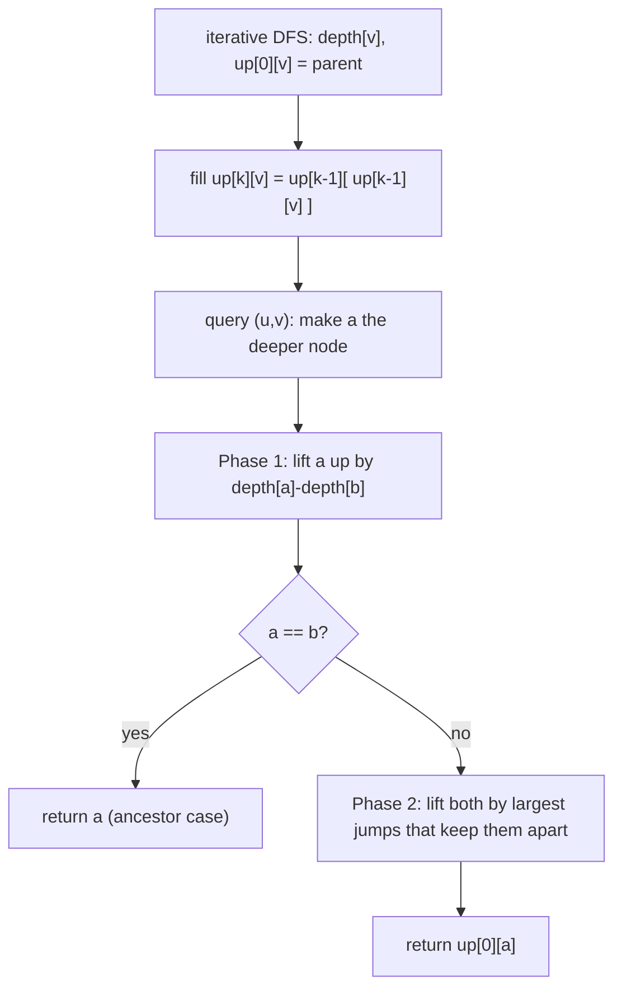

# LCA Queries via Binary Lifting (Self-Contained)

| Meta | Value |
|------|-------|
| Source | Classic technique (self-contained) |
| Difficulty | Medium–Hard |
| Topics | Binary Lifting, Lowest Common Ancestor, Tree |
| Link | — (general LCA query problem) |

---

## Problem Statement
You are given a rooted tree with `n` nodes (rooted at node `1`) and a list of `q` queries. Each query
gives two nodes `u` and `v`; output their **lowest common ancestor (LCA)** — the deepest node that is
an ancestor of both `u` and `v`.

This is the canonical building block behind tree-distance, path-aggregate, and ancestor-relationship
queries. With `n, q` up to `2 \cdot 10^5`, each query must run in **O(log n)**.

**Example**
```
n = 7, edges: (1,2) (1,3) (2,4) (2,5) (3,6) (3,7)

Tree:          1
             /   \
            2     3
           / \   / \
          4   5 6   7

LCA(4, 5) = 2
LCA(4, 6) = 1
LCA(6, 7) = 3
LCA(2, 4) = 2   (2 is an ancestor of 4)
```

---

## Why Binary Lifting

The LCA of `u` and `v` is found by walking both nodes **upward** until they meet. Doing that one
parent step at a time is `O(n)` per query — far too slow. Binary lifting precomputes `up[k][v]` = the
**`2^k`-th ancestor** of `v`, so each upward move can skip a power-of-two number of levels:

$$
up[k][v] = up[k-1]\bigl(up[k-1][v]\bigr)
$$

The query then runs in two phases — **equalize depth**, then **lift both together** — each taking
`O(log n)`. Because the tree may be a deep chain, the depth/parent precompute uses an **iterative**
DFS to stay safe for `n` up to `2e5`.

---

## Solution — Build Table, Then Answer Queries

```python
import sys

def main():
    data = sys.stdin.buffer.read().split()
    idx = 0
    n = int(data[idx]); idx += 1
    q = int(data[idx]); idx += 1

    adj = [[] for _ in range(n + 1)]
    for _ in range(n - 1):
        a = int(data[idx]); b = int(data[idx + 1]); idx += 2
        adj[a].append(b)
        adj[b].append(a)

    LOG = max(1, n.bit_length())
    up = [[1] * (n + 1) for _ in range(LOG)]
    depth = [0] * (n + 1)
    visited = [False] * (n + 1)

    # iterative DFS: up[0] = parent, depth; root = 1
    up[0][1] = 1                       # root sentinel
    visited[1] = True
    stack = [1]
    while stack:
        v = stack.pop()
        for w in adj[v]:
            if not visited[w]:
                visited[w] = True
                up[0][w] = v
                depth[w] = depth[v] + 1
                stack.append(w)

    for k in range(1, LOG):            # doubling table
        upk, upk1 = up[k], up[k - 1]
        for v in range(1, n + 1):
            upk[v] = upk1[upk1[v]]

    def lca(a, b):
        if depth[a] < depth[b]:
            a, b = b, a                # a is deeper
        diff = depth[a] - depth[b]
        for k in range(LOG):           # Phase 1: equalize depth
            if diff & (1 << k):
                a = up[k][a]
        if a == b:
            return a                    # b was an ancestor of a
        for k in range(LOG - 1, -1, -1):  # Phase 2: lift together
            if up[k][a] != up[k][b]:
                a = up[k][a]
                b = up[k][b]
        return up[0][a]                 # common parent

    out = []
    for _ in range(q):
        u = int(data[idx]); v = int(data[idx + 1]); idx += 2
        out.append(lca(u, v))
    sys.stdout.write("\n".join(map(str, out)) + "\n")

main()
```

```cpp
#include <bits/stdc++.h>
using namespace std;

int main() {
    ios::sync_with_stdio(false);
    cin.tie(nullptr);

    int n, q;
    cin >> n >> q;

    vector<vector<int>> adj(n + 1);
    for (int i = 0; i < n - 1; ++i) {
        int a, b;
        cin >> a >> b;
        adj[a].push_back(b);
        adj[b].push_back(a);
    }

    int LOG = max(1, (int)(32 - __builtin_clz((unsigned)n)));
    vector<vector<int>> up(LOG, vector<int>(n + 1, 1));
    vector<int> depth(n + 1, 0);
    vector<char> visited(n + 1, false);

    // iterative DFS: up[0] = parent, depth; root = 1
    up[0][1] = 1;                       // root sentinel
    visited[1] = true;
    stack<int> st;
    st.push(1);
    while (!st.empty()) {
        int v = st.top(); st.pop();
        for (int w : adj[v]) {
            if (!visited[w]) {
                visited[w] = true;
                up[0][w] = v;
                depth[w] = depth[v] + 1;
                st.push(w);
            }
        }
    }

    for (int k = 1; k < LOG; ++k)       // doubling table
        for (int v = 1; v <= n; ++v)
            up[k][v] = up[k - 1][up[k - 1][v]];

    auto lca = [&](int a, int b) -> int {
        if (depth[a] < depth[b]) swap(a, b);   // a is deeper
        int diff = depth[a] - depth[b];
        for (int k = 0; k < LOG; ++k)          // Phase 1: equalize depth
            if (diff & (1 << k))
                a = up[k][a];
        if (a == b) return a;                  // b was an ancestor of a
        for (int k = LOG - 1; k >= 0; --k)     // Phase 2: lift together
            if (up[k][a] != up[k][b]) {
                a = up[k][a];
                b = up[k][b];
            }
        return up[0][a];                       // common parent
    };

    string out;
    for (int i = 0; i < q; ++i) {
        int u, v;
        cin >> u >> v;
        out += to_string(lca(u, v));
        out += '\n';
    }
    cout << out;
    return 0;
}
```

---

## Trace — `LCA(4, 6)` in the Example Tree

Depths: `depth[1]=0`, `depth[2]=depth[3]=1`, `depth[4]=depth[5]=depth[6]=depth[7]=2`.
Table: `up[0][4]=2`, `up[0][6]=3`, `up[1][4]=1`, `up[1][6]=1`.

1. `depth[4] = depth[6] = 2` → already equal, **Phase 1** does nothing.
2. `a = 4`, `b = 6`, `a != b` → **Phase 2**, scan `k` high to low:
   - High `k`: `up[k][4] = up[k][6] = 1` (both reach root) → equal, **don't jump**.
   - `k = 0`: `up[0][4] = 2`, `up[0][6] = 3` → **differ**, jump both → `a = 2`, `b = 3`.
3. Loop ends. Return `up[0][2] = 1`. So `LCA(4, 6) = 1`. ✓

Check `LCA(2, 4)`: deeper is `4`, `diff = 1` → `a = up[0][4] = 2`. Now `a == b == 2`, **Phase 1**
returns `2` immediately (node `2` is an ancestor of `4`). ✓

---

## Mermaid — Two-Phase LCA



---

## Math & Complexity

Phase 1 aligns depths using the set bits of `depth[a] - depth[b]`; Phase 2 lifts both nodes using a
greedy high-to-low scan that stops them **just below** the LCA. Each phase performs at most
$\lceil \log_2 n \rceil$ jumps:

$$
\text{query cost} = O(\log n), \qquad
\text{build cost} = O(n \log n)
$$

| Phase | Time | Space |
|-------|------|-------|
| Build `up` table | $O(n \log n)$ | $O(n \log n)$ |
| Each LCA query | $O(\log n)$ | — |
| Total (`q` queries) | $O((n + q) \log n)$ | $O(n \log n)$ |

---

## Takeaway
LCA via binary lifting = **equalize depths, then lift both nodes together** until they sit just below
their meeting point. Precomputing `2^k`-ancestors turns each phase into `O(log n)`, and an
**iterative** DFS keeps the precompute robust for trees as large as `2e5` nodes. This routine is the
foundation for tree distance, path queries, and ancestor tests.
