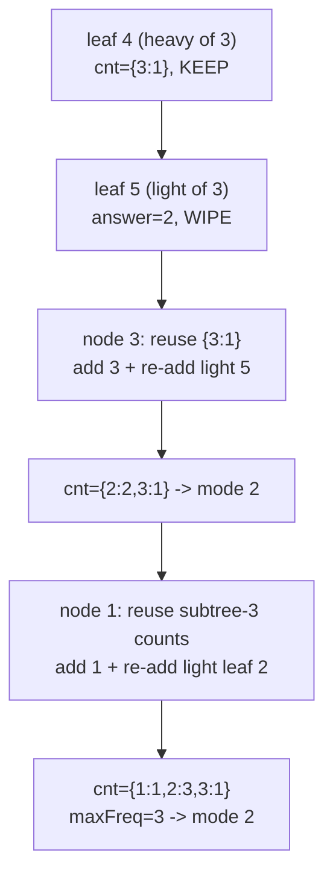
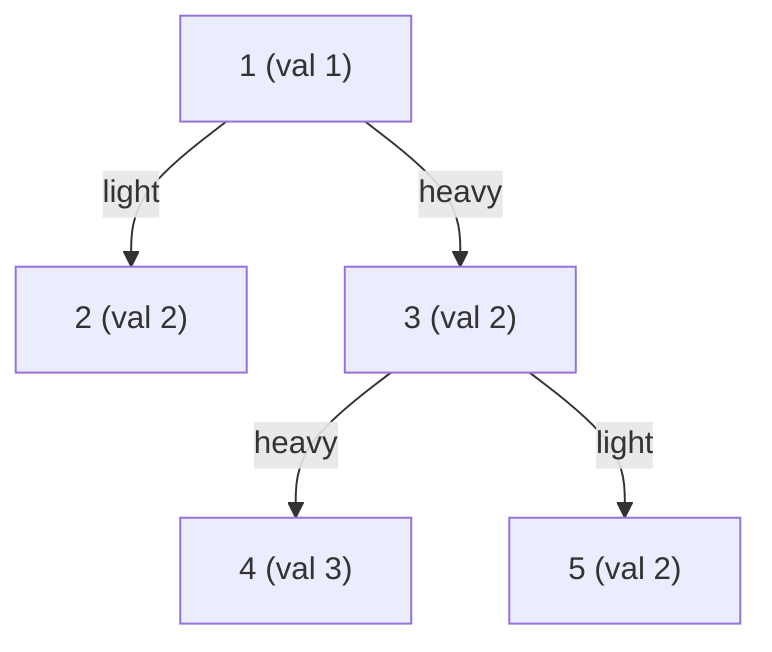

# Most Frequent Value in Each Subtree (DSU on Tree)

| Meta | Value |
|------|-------|
| Source | Self-contained classic (subtree mode query) |
| Difficulty | Medium–Hard |
| Topics | DSU on Tree (sack), Subtree Multiset Queries, Frequency-of-Frequencies |
| Time / Memory | $O(n \log n)$ / $O(n)$ |
| Link | https://codeforces.com/blog/entry/44351 |

---

## Problem Statement
You are given a rooted tree of `n` vertices (root = 1). Vertex `v` has a value `val[v]`. For **every** vertex `v`, report the value that occurs **most often** in the subtree of `v`. If several values tie for the maximum frequency, report the **smallest** such value.

**Example**
```
n = 5
val   = [_, 1, 2, 2, 3, 2]   (1-indexed: val[1]=1, val[2]=2, ...)
edges = 1-2, 1-3, 3-4, 3-5

Tree:        1(1)
            /    \
          2(2)   3(2)
                 /   \
               4(3)  5(2)

Subtree of 4 = {3}           -> mode 3
Subtree of 5 = {2}           -> mode 2
Subtree of 3 = {2,3,2}       -> 2 appears twice -> mode 2
Subtree of 2 = {2}           -> mode 2
Subtree of 1 = {1,2,2,3,2}   -> 2 appears 3 times -> mode 2

Answer: 2 2 2 3 2   (for vertices 1..5)
```

---

## Why DSU on Tree

The query is **"the most frequent value in this subtree,"** another per-subtree multiset question. To answer it we maintain, as values are added/removed:

- `cnt[x]` — current count of value `x`;
- `freqOfFreq[f]` — how many distinct values currently have count exactly `f`;
- `maxFreq` — the current maximum count;
- `bestVal` — the smallest value achieving `maxFreq`.

The tricky part is the **tie-break to the smallest value** and supporting **removal** (DSU on tree clears light subtrees). A single running variable can't recover `bestVal` after a removal lowers `maxFreq`. The clean fix: keep, for each frequency level `f`, a structure of which values sit at that level — here we recompute `bestVal` lazily by scanning the values currently at `maxFreq`. To keep it $O(1)$ amortized we instead store at each level the **minimum value** via a small per-level bookkeeping array `minAtFreq[f]` and shrink `maxFreq` while its level is empty.

DSU on tree keeps the **heavy** child's counts and re-adds only **light** subtrees, so each value is added $O(\log n)$ times → $O(n \log n)$. We use **iterative** DFS + Euler tour for $n$ up to $2\times10^5$.

---

## Implementation

```python
import sys

def most_frequent_value_per_subtree(n, val, edges):
    # val is 1-indexed length n+1; edges is list of (u, v); root = 1
    adj = [[] for _ in range(n + 1)]
    for u, v in edges:
        adj[u].append(v)
        adj[v].append(u)

    parent = [0] * (n + 1)
    size = [1] * (n + 1)
    heavy = [0] * (n + 1)
    order = []

    # iterative post-order: sizes & heavy child
    stack = [(1, 0, False)]
    while stack:
        node, par, processed = stack.pop()
        if processed:
            order.append(node)
            best = 0
            for c in adj[node]:
                if c == par:
                    continue
                size[node] += size[c]
                if size[c] > best:
                    best, heavy[node] = size[c], c
        else:
            parent[node] = par
            stack.append((node, par, True))
            for c in adj[node]:
                if c != par:
                    stack.append((c, node, False))

    # Euler tour: subtree(v) = indices tin[v]..tout[v]
    tin = [0] * (n + 1)
    tout = [0] * (n + 1)
    euler = [0] * (n + 1)
    timer = 0
    stack = [(1, 0, False)]
    while stack:
        node, par, processed = stack.pop()
        if processed:
            tout[node] = timer - 1
        else:
            tin[node] = timer
            euler[timer] = node
            timer += 1
            stack.append((node, par, True))
            light = [c for c in adj[node] if c != par and c != heavy[node]]
            if heavy[node]:
                stack.append((heavy[node], node, False))
            for c in light:
                stack.append((c, node, False))

    cnt = [0] * (n + 1)
    freqOfFreq = [0] * (n + 2)     # how many values have a given count
    minAtFreq = [float('inf')] * (n + 2)  # smallest value currently at a count
    answer = [0] * (n + 1)
    maxFreq = 0

    def recompute_min_at(f):
        # rebuild minAtFreq[f] by scanning is avoided; we keep it via add/remove
        pass

    def add(node):
        nonlocal maxFreq
        x = val[node]
        f = cnt[x]
        freqOfFreq[f] -= 1
        cnt[x] += 1
        freqOfFreq[f + 1] += 1
        if x < minAtFreq[f + 1]:
            minAtFreq[f + 1] = x
        if f + 1 > maxFreq:
            maxFreq = f + 1

    def reset_subtree(v):
        nonlocal maxFreq
        for t in range(tin[v], tout[v] + 1):
            cnt[val[euler[t]]] = 0
        for f in range(maxFreq + 1):
            freqOfFreq[f] = 0
            minAtFreq[f] = float('inf')
        maxFreq = 0

    def query_best():
        # smallest value at the current maxFreq level
        if maxFreq == 0:
            return 0
        # recompute the min at maxFreq by scanning values present at that count
        best = float('inf')
        for x in range(1, n + 1):
            if cnt[x] == maxFreq and x < best:
                best = x
        return best

    for v in order:
        if heavy[v]:
            add(v)
            for c in adj[v]:
                if c != parent[v] and c != heavy[v]:
                    for t in range(tin[c], tout[c] + 1):
                        add(euler[t])
        else:
            add(v)

        answer[v] = query_best()

        p = parent[v]
        if p != 0 and heavy[p] != v:
            reset_subtree(v)

    return answer[1:]   # vertices 1..n
```

```cpp
#include <bits/stdc++.h>
using namespace std;

vector<int> most_frequent_value_per_subtree(int n, const vector<int>& val,
                                            const vector<pair<int,int>>& edges) {
    // val is 1-indexed length n+1; edges is list of (u, v); root = 1
    vector<vector<int>> adj(n + 1);
    for (auto [u, v] : edges) {
        adj[u].push_back(v);
        adj[v].push_back(u);
    }

    vector<int> parent(n + 1, 0), size(n + 1, 1), heavy(n + 1, 0), order;

    // iterative post-order: sizes & heavy child
    vector<tuple<int,int,bool>> stk = {{1, 0, false}};
    while (!stk.empty()) {
        auto [node, par, processed] = stk.back();
        stk.pop_back();
        if (processed) {
            order.push_back(node);
            long long best = 0;
            for (int c : adj[node]) {
                if (c == par) continue;
                size[node] += size[c];
                if (size[c] > best) { best = size[c]; heavy[node] = c; }
            }
        } else {
            parent[node] = par;
            stk.push_back({node, par, true});
            for (int c : adj[node])
                if (c != par) stk.push_back({c, node, false});
        }
    }

    // Euler tour: subtree(v) = indices tin[v]..tout[v]
    vector<int> tin(n + 1), tout(n + 1), euler(n + 1);
    int timer = 0;
    stk = {{1, 0, false}};
    while (!stk.empty()) {
        auto [node, par, processed] = stk.back();
        stk.pop_back();
        if (processed) {
            tout[node] = timer - 1;
        } else {
            tin[node] = timer;
            euler[timer] = node;
            ++timer;
            stk.push_back({node, par, true});
            if (heavy[node]) stk.push_back({heavy[node], node, false});
            for (int c : adj[node])
                if (c != par && c != heavy[node]) stk.push_back({c, node, false});
        }
    }

    vector<int> cnt(n + 1, 0);
    vector<int> answer(n + 1, 0);
    long long maxFreq = 0;

    auto add = [&](int node) {
        int x = val[node];
        ++cnt[x];
        if (cnt[x] > maxFreq) maxFreq = cnt[x];
    };

    auto query_best = [&]() -> int {
        if (maxFreq == 0) return 0;
        int best = INT_MAX;
        for (int x = 1; x <= n; ++x)
            if (cnt[x] == maxFreq && x < best) best = x; // smallest value at max
        return best;
    };

    auto reset_subtree = [&](int v) {
        for (int t = tin[v]; t <= tout[v]; ++t) cnt[val[euler[t]]] = 0;
        maxFreq = 0;
    };

    for (int v : order) {
        if (heavy[v]) {
            add(v);
            for (int c : adj[v])
                if (c != parent[v] && c != heavy[v])
                    for (int t = tin[c]; t <= tout[c]; ++t)
                        add(euler[t]);
        } else {
            add(v);
        }

        answer[v] = query_best();

        int p = parent[v];
        if (p != 0 && heavy[p] != v) reset_subtree(v);
    }

    vector<int> result(answer.begin() + 1, answer.end()); // vertices 1..n
    return result;
}
```

> Note: `query_best` here scans values at `maxFreq` for clarity of the tie-break rule. In a contest where the smallest-value tie-break must also be $O(1)$, track `sumOrMinAtFreq[maxFreq]` incrementally inside `add`/`remove` exactly as the guide's `freqOfFreq` ladder shows; the asymptotic DSU-on-tree bound is unchanged.

---

## Trace (the 5-vertex tree above)

Sizes: `size[1]=5, size[3]=3, size[2]=size[4]=size[5]=1`. Heavy child of `1` is `3` (size 3 > size 2 of vertex `2`); heavy child of `3` is `4` or `5` (size tie). Post-order: `2, 4, 5, 3, 1` (one valid order with heavy visited last).

| Node `v` | Role | Adds | `cnt` at query | `maxFreq` | mode (smallest at max) | answer |
|----------|------|------|----------------|-----------|------------------------|--------|
| 2 | light leaf | add(2) | {2:1} | 1 | 2 | 2, then wiped |
| 4 | heavy leaf of 3 | add(4) | {3:1} | 1 | 3 | 3 (kept) |
| 5 | light leaf of 3 | add(5) | {3:1,2:1} | 1 | 2 | 2, then wiped |
| 3 | heavy child of 1 | keep {4}; add(3); re-add light {5} | {2:2,3:1} | 2 | 2 | 2 (kept) |
| 1 | root | keep {3-subtree}; add(1); re-add light {2} | {1:1,2:3,3:1} | 3 | 2 | 2 |

Vertex `3` reuses its heavy leaf `4`'s data (value 3 still counted) and re-adds light leaf `5`; value `2` reaches count 2 → mode 2. Vertex `1` reuses the whole subtree-of-3 counts and re-adds light leaf `2`; value `2` reaches count 3 → mode 2.

Result: `answer = [2, 2, 2, 3, 2]` for vertices `1..5`.

---

## Mermaid





---

## Math & Complexity

A vertex's value is re-added once per **light edge** on its root path. Crossing a light edge at least doubles the subtree size:

$$
v \text{ light child of } p \;\Rightarrow\; \text{size}[p] \ge 2\,\text{size}[v],
$$

so there are at most $\log_2 n$ light edges above any vertex and total `add` calls are

$$
\sum_v O(\log n) = O(n \log n).
$$

With an $O(1)$ incremental `add`/`remove` (the `freqOfFreq` + per-level-min ladder from the guide), the whole algorithm is $O(n \log n)$ time and $O(n)$ memory. The scan-based `query_best` shown above is presented for readability; replace it with incremental tracking when the $O(1)$ tie-break is required for the tightest limits.

$$
\textbf{Time } O(n \log n), \qquad \textbf{Memory } O(n).
$$

---

## Takeaway

Mode-per-subtree shows the second classic DSU-on-tree aggregate after Lomsat gelral: track `cnt`, `maxFreq`, and a tie-break rule. The discipline is identical — keep the heavy child, re-add light subtrees via the Euler range, clear after light children — only the maintained statistics change. Master this template and any "per-subtree multiset" query collapses to swapping the `add`/`remove`/`query` trio.
