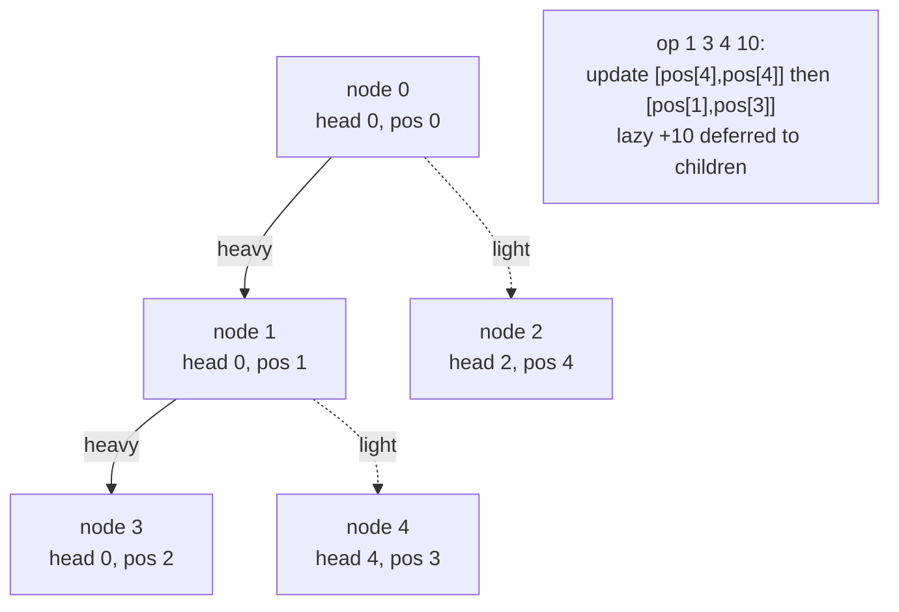

# Range-Add on a Path + Max on a Path (HLD + Lazy Segment Tree)

| Meta | Value |
|------|-------|
| Source | Self-contained (classic HLD + lazy exercise) |
| Difficulty | Hard |
| Topics | Heavy-Light Decomposition, Lazy Segment Tree (range-add / range-max), Vertex Weights |
| Technique | HLD decomposition; each chain segment receives a **range add** and answers a **range max**, both via lazy propagation |
| Link | (self-contained — no external judge) |

---

## Problem Statement

You are given a tree of `n` nodes (`0`-indexed, rooted at `0`). Each node `v` holds an integer value
`a[v]`. Process `q` operations of two kinds:

1. `1 u v d` — **add `d` to every node on the path** from `u` to `v` (inclusive).
2. `2 u v` — report the **maximum value among the nodes on the path** from `u` to `v` (inclusive).

Constraints: `n, q` up to $2\cdot10^5$; values and adds up to $10^9$ in magnitude, so use
`long long` and `const long long INF = 1e18` for the empty-max identity.

**Example**
```
n = 5, q = 4
a = [1, 2, 3, 4, 5]      # nodes 0..4
edges:
  0 - 1
  0 - 2
  1 - 3
  1 - 4

tree:
        0(1)
       /    \
     1(2)    2(3)
    /   \
  3(4)   4(5)

op 2 3 2      -> path 3-1-0-2 values {4,2,1,3} -> max = 4
op 1 3 4 10   -> add 10 on path 3-1-4 -> a[3]=14, a[1]=12, a[4]=15
op 2 3 2      -> path 3-1-0-2 values {14,12,1,3} -> max = 14
op 2 4 2      -> path 4-1-0-2 values {15,12,1,3} -> max = 15
```

---

## Why HLD + Lazy Segment Tree?

Now **both** the update and the query span a **path**: a range-add along `u → v` and a range-max
along `u → v`. A point-update structure is not enough — applying `+d` to a whole chain segment in
$O(\log n)$ requires a **lazy tag** that defers the add to children. HLD splits each path into
$O(\log n)$ contiguous segments; a **lazy segment tree supporting range-add + range-max** services
each segment in $O(\log n)$, so every operation is $O(\log^2 n)$.

The values sit on **vertices**, so both loops **include the LCA** (`[pos[u], pos[v]]` final segment).
The lazy rule is the standard one: an add `d` raises a node's stored max by `d` and accumulates into
its pending tag.

| Operation pair | Right tool |
|----------------|-----------|
| Path point-update, path sum | HLD + plain segment tree |
| **Path range-add, path range-max** | **HLD + lazy segment tree** |
| Subtree range-add, subtree max | Euler tour + lazy segment tree |

---

## Solution — Paired Python + C++

Decompose iteratively, store `a[v]` at `base[pos[v]]`, build a lazy (add, max) segment tree, and run
the include-LCA loop for both update and query.

```python
import sys

class LazyMaxSeg:
    NEG = -(1 << 62)
    def __init__(self, base):
        self.n = len(base)
        self.mx = [self.NEG] * (4 * self.n)
        self.lazy = [0] * (4 * self.n)
        self._build(1, 0, self.n - 1, base)

    def _build(self, node, l, r, base):
        if l == r:
            self.mx[node] = base[l]
            return
        m = (l + r) // 2
        self._build(2 * node, l, m, base)
        self._build(2 * node + 1, m + 1, r, base)
        self.mx[node] = max(self.mx[2 * node], self.mx[2 * node + 1])

    def _apply(self, node, d):
        self.mx[node] += d
        self.lazy[node] += d

    def _push(self, node):
        if self.lazy[node]:
            self._apply(2 * node, self.lazy[node])
            self._apply(2 * node + 1, self.lazy[node])
            self.lazy[node] = 0

    def update(self, ql, qr, d, node=1, l=0, r=None):
        if r is None:
            r = self.n - 1
        if qr < l or r < ql:
            return
        if ql <= l and r <= qr:
            self._apply(node, d)
            return
        self._push(node)
        m = (l + r) // 2
        self.update(ql, qr, d, 2 * node, l, m)
        self.update(ql, qr, d, 2 * node + 1, m + 1, r)
        self.mx[node] = max(self.mx[2 * node], self.mx[2 * node + 1])

    def query(self, ql, qr, node=1, l=0, r=None):
        if r is None:
            r = self.n - 1
        if qr < l or r < ql:
            return self.NEG
        if ql <= l and r <= qr:
            return self.mx[node]
        self._push(node)
        m = (l + r) // 2
        return max(self.query(ql, qr, 2 * node, l, m),
                   self.query(ql, qr, 2 * node + 1, m + 1, r))


def main():
    data = sys.stdin.buffer.read().split()
    idx = 0
    n = int(data[idx]); idx += 1
    q = int(data[idx]); idx += 1
    a = [0] * n
    for v in range(n):
        a[v] = int(data[idx]); idx += 1
    adj = [[] for _ in range(n)]
    for _ in range(n - 1):
        x = int(data[idx]); y = int(data[idx + 1]); idx += 2
        adj[x].append(y)
        adj[y].append(x)

    # ---- HLD decompose (iterative) ----
    root = 0
    parent = [-1] * n
    depth = [0] * n
    size = [1] * n
    heavy = [-1] * n
    head = [0] * n
    pos = [0] * n

    order = []
    stack = [root]
    seen = [False] * n
    while stack:
        v = stack.pop()
        if seen[v]:
            continue
        seen[v] = True
        order.append(v)
        for u in adj[v]:
            if u != parent[v]:
                parent[u] = v
                depth[u] = depth[v] + 1
                stack.append(u)
    for v in reversed(order):
        best = 0
        for u in adj[v]:
            if u != parent[v]:
                size[v] += size[u]
                if size[u] > best:
                    best = size[u]
                    heavy[v] = u

    timer = 0
    stack = [(root, root)]
    while stack:
        v, h = stack.pop()
        while v != -1:
            head[v] = h
            pos[v] = timer
            timer += 1
            for u in adj[v]:
                if u != parent[v] and u != heavy[v]:
                    stack.append((u, u))
            v = heavy[v]

    base = [0] * n
    for v in range(n):
        base[pos[v]] = a[v]
    seg = LazyMaxSeg(base)

    def path_add(u, v, d):
        while head[u] != head[v]:
            if depth[head[u]] < depth[head[v]]:
                u, v = v, u
            seg.update(pos[head[u]], pos[u], d)
            u = parent[head[u]]
        if depth[u] > depth[v]:
            u, v = v, u
        seg.update(pos[u], pos[v], d)  # vertex weights: include LCA

    def path_max(u, v):
        res = seg.NEG
        while head[u] != head[v]:
            if depth[head[u]] < depth[head[v]]:
                u, v = v, u
            res = max(res, seg.query(pos[head[u]], pos[u]))
            u = parent[head[u]]
        if depth[u] > depth[v]:
            u, v = v, u
        res = max(res, seg.query(pos[u], pos[v]))  # include LCA
        return res

    out = []
    for _ in range(q):
        t = int(data[idx]); idx += 1
        if t == 1:
            u = int(data[idx]); v = int(data[idx + 1]); d = int(data[idx + 2]); idx += 3
            path_add(u, v, d)
        else:
            u = int(data[idx]); v = int(data[idx + 1]); idx += 2
            out.append(str(path_max(u, v)))
    sys.stdout.write("\n".join(out) + ("\n" if out else ""))

main()
```

```cpp
#include <bits/stdc++.h>
using namespace std;

const long long INF = 1e18;

struct LazyMaxSeg {
    int n;
    vector<long long> mx, lazy;

    LazyMaxSeg(const vector<long long>& base) {
        n = (int)base.size();
        mx.assign(4 * n, -INF);
        lazy.assign(4 * n, 0);
        build(1, 0, n - 1, base);
    }

    void build(int node, int l, int r, const vector<long long>& base) {
        if (l == r) {
            mx[node] = base[l];
            return;
        }
        int m = (l + r) / 2;
        build(2 * node, l, m, base);
        build(2 * node + 1, m + 1, r, base);
        mx[node] = max(mx[2 * node], mx[2 * node + 1]);
    }

    void applyAdd(int node, long long d) {
        mx[node] += d;
        lazy[node] += d;
    }

    void push(int node) {
        if (lazy[node]) {
            applyAdd(2 * node, lazy[node]);
            applyAdd(2 * node + 1, lazy[node]);
            lazy[node] = 0;
        }
    }

    void update(int ql, int qr, long long d, int node, int l, int r) {
        if (qr < l || r < ql) return;
        if (ql <= l && r <= qr) {
            applyAdd(node, d);
            return;
        }
        push(node);
        int m = (l + r) / 2;
        update(ql, qr, d, 2 * node, l, m);
        update(ql, qr, d, 2 * node + 1, m + 1, r);
        mx[node] = max(mx[2 * node], mx[2 * node + 1]);
    }

    long long query(int ql, int qr, int node, int l, int r) {
        if (qr < l || r < ql) return -INF;
        if (ql <= l && r <= qr) return mx[node];
        push(node);
        int m = (l + r) / 2;
        return max(query(ql, qr, 2 * node, l, m),
                   query(ql, qr, 2 * node + 1, m + 1, r));
    }

    void update(int ql, int qr, long long d) { update(ql, qr, d, 1, 0, n - 1); }
    long long query(int ql, int qr) { return query(ql, qr, 1, 0, n - 1); }
};

int main() {
    int n, q;
    scanf("%d %d", &n, &q);
    vector<long long> a(n);
    for (int v = 0; v < n; ++v) scanf("%lld", &a[v]);
    vector<vector<int>> adj(n);
    for (int i = 0; i < n - 1; ++i) {
        int x, y;
        scanf("%d %d", &x, &y);
        adj[x].push_back(y);
        adj[y].push_back(x);
    }

    // ---- HLD decompose (iterative) ----
    int root = 0;
    vector<int> parent(n, -1), depth(n, 0), size(n, 1), heavy(n, -1),
                head(n, 0), pos(n, 0);
    vector<int> order;
    order.reserve(n);
    vector<char> seen(n, 0);
    vector<int> stack;
    stack.push_back(root);
    while (!stack.empty()) {
        int v = stack.back();
        stack.pop_back();
        if (seen[v]) continue;
        seen[v] = 1;
        order.push_back(v);
        for (int u : adj[v]) {
            if (u != parent[v]) {
                parent[u] = v;
                depth[u] = depth[v] + 1;
                stack.push_back(u);
            }
        }
    }
    for (int i = (int)order.size() - 1; i >= 0; --i) {
        int v = order[i];
        long long best = 0;
        for (int u : adj[v]) {
            if (u != parent[v]) {
                size[v] += size[u];
                if ((long long)size[u] > best) {
                    best = size[u];
                    heavy[v] = u;
                }
            }
        }
    }
    int timer = 0;
    vector<pair<int,int>> st;
    st.push_back({root, root});
    while (!st.empty()) {
        auto [v, h] = st.back();
        st.pop_back();
        while (v != -1) {
            head[v] = h;
            pos[v] = timer++;
            for (int u : adj[v]) {
                if (u != parent[v] && u != heavy[v]) st.push_back({u, u});
            }
            v = heavy[v];
        }
    }

    vector<long long> base(n, 0);
    for (int v = 0; v < n; ++v) base[pos[v]] = a[v];
    LazyMaxSeg seg(base);

    auto path_add = [&](int u, int v, long long d) {
        while (head[u] != head[v]) {
            if (depth[head[u]] < depth[head[v]]) swap(u, v);
            seg.update(pos[head[u]], pos[u], d);
            u = parent[head[u]];
        }
        if (depth[u] > depth[v]) swap(u, v);
        seg.update(pos[u], pos[v], d);  // vertex weights: include LCA
    };
    auto path_max = [&](int u, int v) -> long long {
        long long res = -INF;
        while (head[u] != head[v]) {
            if (depth[head[u]] < depth[head[v]]) swap(u, v);
            res = max(res, seg.query(pos[head[u]], pos[u]));
            u = parent[head[u]];
        }
        if (depth[u] > depth[v]) swap(u, v);
        res = max(res, seg.query(pos[u], pos[v]));  // include LCA
        return res;
    };

    for (int i = 0; i < q; ++i) {
        int t;
        scanf("%d", &t);
        if (t == 1) {
            int u, v; long long d;
            scanf("%d %d %lld", &u, &v, &d);
            path_add(u, v, d);
        } else {
            int u, v;
            scanf("%d %d", &u, &v);
            printf("%lld\n", path_max(u, v));
        }
    }
    return 0;
}
```

---

## Trace

Tree rooted at `0`. `size = [5,3,1,1,1]`; heavy child of `0` is `1`, heavy child of `1` is `3`.
Heavy-first preorder:

| node | 0 | 1 | 3 | 4 | 2 |
|------|---|---|---|---|---|
| head | 0 | 0 | 0 | 4 | 2 |
| pos  | 0 | 1 | 2 | 3 | 4 |

Leaves by `pos`: `[1, 2, 4, 5, 3]` (values of nodes `0,1,3,4,2`).

1. `2 3 2` (max on path 3↔2): `head[2]=2` deeper → `query(pos[2],pos[2]) = 3`, hop to `parent[2]=0`.
   Same chain now → `query(pos[0],pos[3]) = max(1,2,4) = 4`. Overall `max(3,4)=4`. **Output 4.**
2. `1 3 4 10` (add 10 on path 3↔4): `head[4]=4` deeper → `update(pos[4],pos[4],10)`, hop to
   `parent[4]=1`. Same chain (`head[3]=head[1]=0`) → `update(pos[1],pos[3],10)`. Leaves become
   `[1, 12, 14, 15, 3]`.
3. `2 3 2`: `query(pos[2],pos[2])=3`, then `query(pos[0],pos[3]) = max(1,12,14)=14`. Max `14`.
   **Output 14.**
4. `2 4 2` (path 4↔2): `head[4]=4` deeper → `query(pos[4],pos[4])=15`, hop to `parent[4]=1`. Then
   `head[2]=2` deeper than `head[1]=0`? `depth[head[2]]=depth[2]=1`, `depth[head[1]]=depth[0]=0`, so
   swap and `query(pos[2],pos[2])=3`, hop to `parent[2]=0`. Same chain → `query(pos[0],pos[1])`
   `= max(1,12)=12`. Overall `max(15,3,12)=15`. **Output 15.**

---

## Mermaid

Each path operation touches $O(\log n)$ chain segments; a lazy tag carries the pending `+d` down on
demand.



---

## Math / Complexity

With `n` nodes and `q` operations:

- **Decompose:** $O(n)$, two iterative passes.
- **Path add (`1 u v d`):** $O(\log n)$ chains $\times\ O(\log n)$ lazy range-add $=O(\log^2 n)$.
- **Path max (`2 u v`):** $O(\log n)$ chains $\times\ O(\log n)$ range-max $=O(\log^2 n)$.

Total: $O\big(n + q \log^2 n\big)$ time, $O(n)$ memory. The lazy tag is what lets a whole chain
segment absorb `+d` in $O(\log n)$ rather than touching every node:

$$\text{lazy add: } mx[\text{node}] \mathrel{+}= d, \quad lazy[\text{node}] \mathrel{+}= d
  \;\Rightarrow\; \text{range-add} = O(\log n).$$

---

## Takeaway

When **both** endpoints of every operation are paths — *range-add along a path* **and** *range-max
along a path* — HLD stays the same but the leaf structure must become a **lazy segment tree**. The
decomposition turns each path into $O(\log n)$ contiguous segments, and the lazy `(add, max)` rule
applies `+d` to a whole segment in $O(\log n)$. Values on vertices means **include the LCA** in the
final segment; swap the lazy rule (e.g. `(add, sum)` with the `*(r-l+1)` factor) to answer path-sum
instead, with zero change to the HLD scaffolding.
