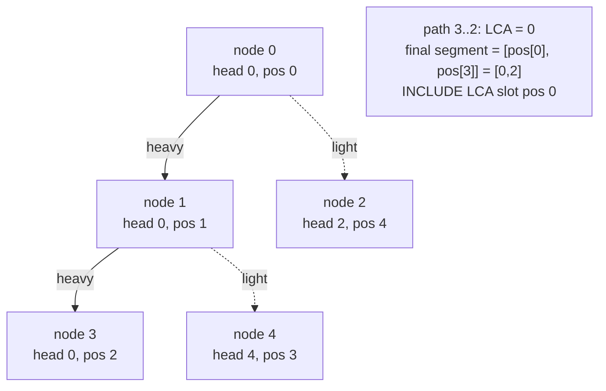

# Path Sum with Point Vertex Update (HLD + Segment Tree)

| Meta | Value |
|------|-------|
| Source | Self-contained (classic HLD exercise) |
| Difficulty | Medium–Hard |
| Topics | Heavy-Light Decomposition, Segment Tree (sum), Vertex Weights |
| Technique | HLD over a heavy-first preorder; point update a vertex; path-sum loop **including** the LCA |
| Link | (self-contained — no external judge) |

---

## Problem Statement

You are given a tree of `n` nodes (`0`-indexed, rooted at `0`). Each node `v` has an integer value
`a[v]`. Process `q` operations of two kinds:

1. `1 v x` — **set** `a[v] = x` (a point update on a vertex).
2. `2 u v` — report the **sum of the values of all nodes on the path** from `u` to `v`, **inclusive**
   of both endpoints.

Constraints: `n, q` up to $2\cdot10^5$, values up to $10^9$ in magnitude, so path sums need
`long long`.

**Example**
```
n = 5, q = 4
a = [10, 20, 30, 40, 50]      # nodes 0..4
edges:
  0 - 1
  0 - 2
  1 - 3
  1 - 4

tree:
        0(10)
       /    \
     1(20)   2(30)
    /   \
  3(40)  4(50)

op 2 3 2     -> path 3-1-0-2 = 40 + 20 + 10 + 30 = 100
op 1 1 100   -> a[1] = 100
op 2 3 4     -> path 3-1-4      = 40 + 100 + 50 = 190
op 2 4 2     -> path 4-1-0-2 = 50 + 100 + 10 + 30 = 190
```

---

## Why HLD + Segment Tree (Vertex)?

The query is "**sum of vertex values on a path**" while values **change** by point update. A path is
not a contiguous array range on its own, but HLD breaks it into $O(\log n)$ contiguous segments in
the `pos` ordering. A **segment tree with point update + range sum** then handles each segment in
$O(\log n)$, giving $O(\log^2 n)$ per path query.

Because the values live **on vertices**, the path-sum loop must **include the LCA** node: the final
same-chain segment is `[pos[u], pos[v]]` with `u` the shallower (LCA). This is the *opposite* of the
edge-weight convention, where the LCA slot is skipped.

| Want | Tool |
|------|------|
| Subtree sum, point update | Euler tour + BIT |
| **Path sum, point vertex update** | **HLD + segment tree (vertex, include LCA)** |
| Path max, edge update | HLD + segment tree (edge-as-node, skip LCA) |

---

## Solution — Paired Python + C++

We decompose iteratively, place each vertex value at `base[pos[v]]`, build a sum segment tree, and
run the include-LCA path loop.

```python
import sys

def main():
    data = sys.stdin.buffer.read().split()
    idx = 0
    n = int(data[idx]); idx += 1
    q = int(data[idx]); idx += 1
    a = [0] * n
    for v in range(n):
        a[v] = int(data[idx]); idx += 1
    adj = [[] for _ in range(n)]
    for _ in range(n - 1):
        x = int(data[idx]); y = int(data[idx + 1]); idx += 2
        adj[x].append(y)
        adj[y].append(x)

    # ---- HLD decompose (iterative) ----
    root = 0
    parent = [-1] * n
    depth = [0] * n
    size = [1] * n
    heavy = [-1] * n
    head = [0] * n
    pos = [0] * n

    order = []
    stack = [root]
    seen = [False] * n
    while stack:
        v = stack.pop()
        if seen[v]:
            continue
        seen[v] = True
        order.append(v)
        for u in adj[v]:
            if u != parent[v]:
                parent[u] = v
                depth[u] = depth[v] + 1
                stack.append(u)
    for v in reversed(order):
        best = 0
        for u in adj[v]:
            if u != parent[v]:
                size[v] += size[u]
                if size[u] > best:
                    best = size[u]
                    heavy[v] = u

    timer = 0
    stack = [(root, root)]
    while stack:
        v, h = stack.pop()
        while v != -1:
            head[v] = h
            pos[v] = timer
            timer += 1
            for u in adj[v]:
                if u != parent[v] and u != heavy[v]:
                    stack.append((u, u))
            v = heavy[v]

    base = [0] * n
    for v in range(n):
        base[pos[v]] = a[v]

    # ---- Segment tree: point update, range sum ----
    sz = n
    tree = [0] * (2 * sz)
    for i in range(n):
        tree[sz + i] = base[i]
    for i in range(sz - 1, 0, -1):
        tree[i] = tree[2 * i] + tree[2 * i + 1]

    def seg_set(p, val):
        p += sz
        tree[p] = val
        p >>= 1
        while p >= 1:
            tree[p] = tree[2 * p] + tree[2 * p + 1]
            p >>= 1

    def seg_sum(l, r):  # inclusive
        res = 0
        l += sz
        r += sz + 1
        while l < r:
            if l & 1:
                res += tree[l]; l += 1
            if r & 1:
                r -= 1; res += tree[r]
            l >>= 1; r >>= 1
        return res

    def path_sum(u, v):
        res = 0
        while head[u] != head[v]:
            if depth[head[u]] < depth[head[v]]:
                u, v = v, u
            res += seg_sum(pos[head[u]], pos[u])
            u = parent[head[u]]
        if depth[u] > depth[v]:
            u, v = v, u
        # vertex weights: INCLUDE the LCA node
        res += seg_sum(pos[u], pos[v])
        return res

    out = []
    for _ in range(q):
        t = int(data[idx]); idx += 1
        if t == 1:
            v = int(data[idx]); x = int(data[idx + 1]); idx += 2
            seg_set(pos[v], x)
        else:
            u = int(data[idx]); v = int(data[idx + 1]); idx += 2
            out.append(str(path_sum(u, v)))
    sys.stdout.write("\n".join(out) + ("\n" if out else ""))

main()
```

```cpp
#include <bits/stdc++.h>
using namespace std;

int main() {
    int n, q;
    scanf("%d %d", &n, &q);
    vector<long long> a(n);
    for (int v = 0; v < n; ++v) scanf("%lld", &a[v]);
    vector<vector<int>> adj(n);
    for (int i = 0; i < n - 1; ++i) {
        int x, y;
        scanf("%d %d", &x, &y);
        adj[x].push_back(y);
        adj[y].push_back(x);
    }

    // ---- HLD decompose (iterative) ----
    int root = 0;
    vector<int> parent(n, -1), depth(n, 0), size(n, 1), heavy(n, -1),
                head(n, 0), pos(n, 0);
    vector<int> order;
    order.reserve(n);
    vector<char> seen(n, 0);
    vector<int> stack;
    stack.push_back(root);
    while (!stack.empty()) {
        int v = stack.back();
        stack.pop_back();
        if (seen[v]) continue;
        seen[v] = 1;
        order.push_back(v);
        for (int u : adj[v]) {
            if (u != parent[v]) {
                parent[u] = v;
                depth[u] = depth[v] + 1;
                stack.push_back(u);
            }
        }
    }
    for (int i = (int)order.size() - 1; i >= 0; --i) {
        int v = order[i];
        long long best = 0;
        for (int u : adj[v]) {
            if (u != parent[v]) {
                size[v] += size[u];
                if ((long long)size[u] > best) {
                    best = size[u];
                    heavy[v] = u;
                }
            }
        }
    }
    int timer = 0;
    vector<pair<int,int>> st;
    st.push_back({root, root});
    while (!st.empty()) {
        auto [v, h] = st.back();
        st.pop_back();
        while (v != -1) {
            head[v] = h;
            pos[v] = timer++;
            for (int u : adj[v]) {
                if (u != parent[v] && u != heavy[v]) st.push_back({u, u});
            }
            v = heavy[v];
        }
    }

    vector<long long> base(n, 0);
    for (int v = 0; v < n; ++v) base[pos[v]] = a[v];

    // ---- Segment tree: point update, range sum ----
    int sz = n;
    vector<long long> tree(2 * sz, 0);
    for (int i = 0; i < n; ++i) tree[sz + i] = base[i];
    for (int i = sz - 1; i >= 1; --i) tree[i] = tree[2 * i] + tree[2 * i + 1];

    auto seg_set = [&](int p, long long val) {
        p += sz;
        tree[p] = val;
        for (p >>= 1; p >= 1; p >>= 1) tree[p] = tree[2 * p] + tree[2 * p + 1];
    };
    auto seg_sum = [&](int l, int r) -> long long {  // inclusive
        long long res = 0;
        l += sz; r += sz + 1;
        while (l < r) {
            if (l & 1) res += tree[l++];
            if (r & 1) res += tree[--r];
            l >>= 1; r >>= 1;
        }
        return res;
    };
    auto path_sum = [&](int u, int v) -> long long {
        long long res = 0;
        while (head[u] != head[v]) {
            if (depth[head[u]] < depth[head[v]]) swap(u, v);
            res += seg_sum(pos[head[u]], pos[u]);
            u = parent[head[u]];
        }
        if (depth[u] > depth[v]) swap(u, v);
        // vertex weights: INCLUDE the LCA node
        res += seg_sum(pos[u], pos[v]);
        return res;
    };

    for (int i = 0; i < q; ++i) {
        int t;
        scanf("%d", &t);
        if (t == 1) {
            int v; long long x;
            scanf("%d %lld", &v, &x);
            seg_set(pos[v], x);
        } else {
            int u, v;
            scanf("%d %d", &u, &v);
            printf("%lld\n", path_sum(u, v));
        }
    }
    return 0;
}
```

---

## Trace

Tree rooted at `0`. Heavy children by subtree size: `size = [5,3,1,1,1]`; node `0`'s heavy child is
`1` (size 3 > 1); node `1`'s heavy child is `3` (tie with `4`, pick first). Heavy-first preorder:

| node | 0 | 1 | 3 | 4 | 2 |
|------|---|---|---|---|---|
| head | 0 | 0 | 0 | 4 | 2 |
| pos  | 0 | 1 | 2 | 3 | 4 |

Chain `0 → 1 → 3` occupies `pos [0,2]`; node `4` and node `2` are their own chain heads. Leaves by
`pos`: `[10, 20, 40, 50, 30]`.

1. `2 3 2` (path 3↔2): `head[3]=0`, `head[2]=2`. `head[2]` deeper → add `seg_sum(pos[2],pos[2])=30`,
   hop to `parent[2]=0`. Now `head[3]=head[0]=0`; shallower is `0` → add `seg_sum(pos[0],pos[3])`
   `= 10+20+40 = 70`. Total `30+70 = 100`. **Output 100.**
2. `1 1 100`: `seg_set(pos[1]=1, 100)`. Leaves → `[10,100,40,50,30]`.
3. `2 3 4` (path 3↔4): `head[3]=0`, `head[4]=4` deeper → add `seg_sum(pos[4],pos[4])=50`, hop to
   `parent[4]=1`. Now `head[3]=head[1]=0`; shallower is `1` → add `seg_sum(pos[1],pos[3])`
   `= 100+40 = 140`. Total `50+140 = 190`. **Output 190.**
4. `2 4 2`: `50 + 100 + 10 + 30 = 190`. **Output 190.**

---

## Mermaid

Vertex weights keep the LCA on the path, so the final same-chain segment is `[pos[u], pos[v]]`.



---

## Math / Complexity

With `n` nodes and `q` operations:

- **Decompose:** $O(n)$, two iterative passes.
- **Point update (`1 v x`):** one segment-tree write, $O(\log n)$.
- **Path sum (`2 u v`):** $O(\log n)$ chains $\times\ O(\log n)$ per range-sum $=O(\log^2 n)$.

Total: $O\big(n + q \log^2 n\big)$ time, $O(n)$ memory.

$$\text{path } u\!\to\!v \text{ uses } \le 2\lfloor \log_2 n \rfloor + 1 \text{ segments}
  \;\Rightarrow\; \text{query} = O(\log^2 n).$$

---

## Takeaway

This is the **vertex-weighted** sibling of QTREE. The decomposition code is identical; the only
difference is the **final segment**: for vertex values you **include the LCA** (`[pos[u], pos[v]]`),
whereas for edge values you skip it. Remember the rule — *values on vertices keep the LCA, values on
edges drop it* — and you can switch any HLD path problem between the two conventions by changing a
single line.
