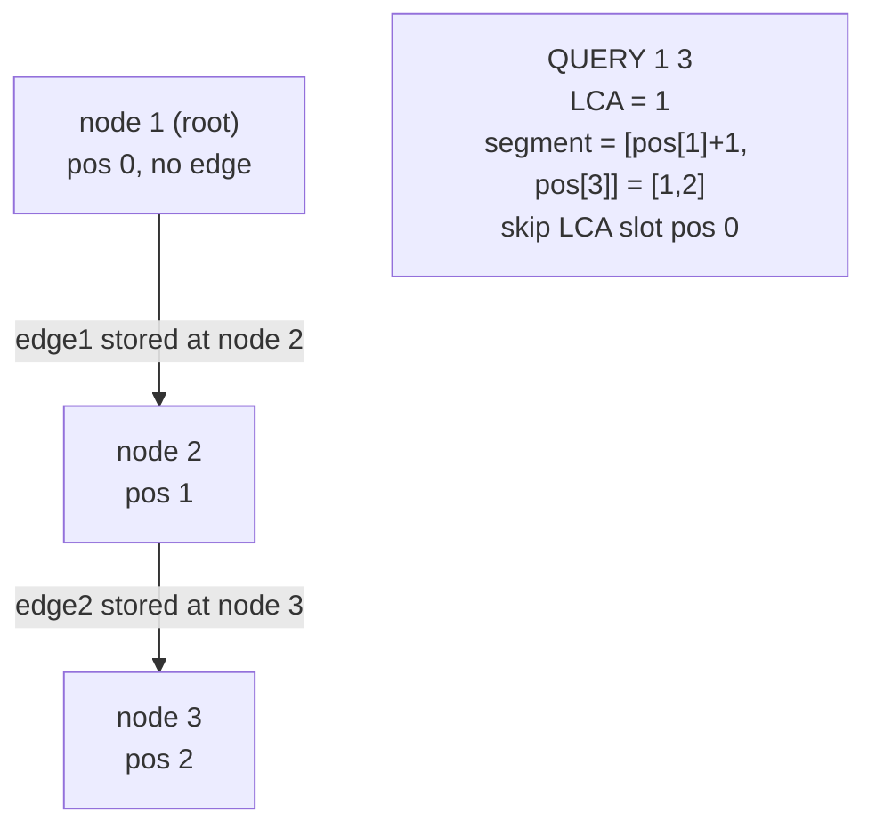

# SPOJ QTREE — Max Edge Weight on a Path (HLD + Segment Tree, Edge-as-Node)

| Meta | Value |
|------|-------|
| Source | SPOJ QTREE |
| Difficulty | Hard |
| Topics | Heavy-Light Decomposition, Segment Tree (max), Edge-as-Deeper-Node |
| Technique | HLD over a heavy-first preorder; store each edge at its deeper endpoint; path-max with the LCA slot skipped |
| Link | https://www.spoj.com/problems/QTREE/ |

---

## Problem Statement

You are given a tree of `n` nodes. Each edge has an integer weight. Process a sequence of
operations, each of two kinds:

- `CHANGE i w` — set the weight of the **`i`-th edge** (in input order) to `w`.
- `QUERY a b` — report the **maximum edge weight** on the path between nodes `a` and `b`
  (if `a == b`, the answer is `0`).

The sequence ends with `DONE`. There are multiple test cases. Constraints: `n` up to $10^4$ per case
(the HLD here scales cleanly to $2\cdot10^5$), weights up to $2^{31}-1$.

**Example**
```
1

3
1 2 1
2 3 2
QUERY 1 2
CHANGE 1 3
QUERY 1 2
QUERY 1 3
DONE
```
```
1
3
3
```
Edges: edge 1 = (1,2,w=1), edge 2 = (2,3,w=2).
- `QUERY 1 2` → only edge (1,2), weight `1`.
- `CHANGE 1 3` → edge (1,2) now has weight `3`.
- `QUERY 1 2` → weight `3`.
- `QUERY 1 3` → path uses edges (1,2)=3 and (2,3)=2, max = `3`.

---

## Why HLD + Segment Tree (Edge-as-Node)?

The query is "**max over the edges on a path**" while edge weights **change** over time. A static
sparse table cannot absorb updates; a plain LCA + prefix technique cannot do range-max with updates.
HLD reduces any path to $O(\log n)$ contiguous segments, and a **segment tree supporting point
update + range max** answers each segment in $O(\log n)$ — total $O(\log^2 n)$ per query.

Edges are turned into vertices with the **edge-as-the-deeper-node** trick: edge `(parent, child)` is
stored at `child` (the deeper endpoint). Each non-root node then owns exactly one edge, so a
point-update to an edge is a point-update at the child's `pos`. The only subtlety is that on the
final same-chain segment we must **skip the LCA's slot**, because the LCA's stored edge points
*above* the LCA and is not on the path.

| Want | Tool |
|------|------|
| Max edge on a path, no updates | LCA + sparse table on the tree |
| **Max edge on a path, with edge updates** | **HLD + segment tree (edge-as-node)** |
| Sum on a path with vertex updates | HLD + segment tree (vertex) |

---

## Solution — Paired Python + C++

Read the tree and remember, for each input edge `i`, its **deeper endpoint** (which we learn after
rooting). `CHANGE i w` becomes a point update at `pos[deeper_i]`; `QUERY a b` runs the path-max loop
with the LCA slot skipped.

```python
import sys
from sys import setrecursionlimit

def main():
    data = sys.stdin.buffer.read().split()
    idx = 0
    t = int(data[idx]); idx += 1
    out = []
    for _ in range(t):
        n = int(data[idx]); idx += 1
        adj = [[] for _ in range(n)]      # (neighbor, edge_id)
        eu = [0] * (n - 1)
        ev = [0] * (n - 1)
        ew = [0] * (n - 1)
        for i in range(n - 1):
            a = int(data[idx]) - 1
            b = int(data[idx + 1]) - 1
            w = int(data[idx + 2]); idx += 3
            eu[i], ev[i], ew[i] = a, b, w
            adj[a].append((b, i))
            adj[b].append((a, i))

        # ---- HLD decompose (iterative) ----
        root = 0
        parent = [-1] * n
        depth = [0] * n
        size = [1] * n
        heavy = [-1] * n
        head = [0] * n
        pos = [0] * n

        order = []
        stack = [root]
        seen = [False] * n
        while stack:
            v = stack.pop()
            if seen[v]:
                continue
            seen[v] = True
            order.append(v)
            for u, _eid in adj[v]:
                if u != parent[v]:
                    parent[u] = v
                    depth[u] = depth[v] + 1
                    stack.append(u)
        for v in reversed(order):
            best = 0
            for u, _eid in adj[v]:
                if u != parent[v]:
                    size[v] += size[u]
                    if size[u] > best:
                        best = size[u]
                        heavy[v] = u

        timer = 0
        stack = [(root, root)]
        while stack:
            v, h = stack.pop()
            while v != -1:
                head[v] = h
                pos[v] = timer
                timer += 1
                for u, _eid in adj[v]:
                    if u != parent[v] and u != heavy[v]:
                        stack.append((u, u))
                v = heavy[v]

        # edge i lives at its deeper endpoint
        edge_node = [0] * (n - 1)
        base = [0] * n
        for i in range(n - 1):
            a, b = eu[i], ev[i]
            deeper = a if depth[a] > depth[b] else b
            edge_node[i] = deeper
            base[pos[deeper]] = ew[i]

        # ---- Segment tree: point update, range max ----
        size_seg = n
        tree = [0] * (2 * size_seg)
        for i in range(n):
            tree[size_seg + i] = base[i]
        for i in range(size_seg - 1, 0, -1):
            tree[i] = max(tree[2 * i], tree[2 * i + 1])

        def seg_update(p, val):
            p += size_seg
            tree[p] = val
            p >>= 1
            while p >= 1:
                tree[p] = max(tree[2 * p], tree[2 * p + 1])
                p >>= 1

        def seg_query(l, r):  # inclusive
            res = 0
            l += size_seg
            r += size_seg + 1
            while l < r:
                if l & 1:
                    res = max(res, tree[l]); l += 1
                if r & 1:
                    r -= 1; res = max(res, tree[r])
                l >>= 1; r >>= 1
            return res

        def path_max(u, v):
            res = 0
            while head[u] != head[v]:
                if depth[head[u]] < depth[head[v]]:
                    u, v = v, u
                res = max(res, seg_query(pos[head[u]], pos[u]))
                u = parent[head[u]]
            if depth[u] > depth[v]:
                u, v = v, u
            # skip the LCA node (edge above LCA is not on the path)
            if pos[u] + 1 <= pos[v]:
                res = max(res, seg_query(pos[u] + 1, pos[v]))
            return res

        # ---- process operations ----
        while True:
            op = data[idx].decode(); idx += 1
            if op == "DONE":
                break
            if op == "CHANGE":
                i = int(data[idx]) - 1
                w = int(data[idx + 1]); idx += 2
                seg_update(pos[edge_node[i]], w)
            else:  # QUERY
                a = int(data[idx]) - 1
                b = int(data[idx + 1]) - 1; idx += 2
                out.append(str(path_max(a, b)))
    sys.stdout.write("\n".join(out) + ("\n" if out else ""))

main()
```

```cpp
#include <bits/stdc++.h>
using namespace std;

int main() {
    int t;
    scanf("%d", &t);
    while (t--) {
        int n;
        scanf("%d", &n);
        vector<vector<pair<int,int>>> adj(n);  // (neighbor, edge_id)
        vector<int> eu(n - 1), ev(n - 1);
        vector<long long> ew(n - 1);
        for (int i = 0; i < n - 1; ++i) {
            int a, b; long long w;
            scanf("%d %d %lld", &a, &b, &w);
            --a; --b;
            eu[i] = a; ev[i] = b; ew[i] = w;
            adj[a].push_back({b, i});
            adj[b].push_back({a, i});
        }

        // ---- HLD decompose (iterative) ----
        int root = 0;
        vector<int> parent(n, -1), depth(n, 0), size(n, 1), heavy(n, -1),
                    head(n, 0), pos(n, 0);
        vector<int> order;
        order.reserve(n);
        vector<char> seen(n, 0);
        vector<int> stack;
        stack.push_back(root);
        while (!stack.empty()) {
            int v = stack.back();
            stack.pop_back();
            if (seen[v]) continue;
            seen[v] = 1;
            order.push_back(v);
            for (auto [u, eid] : adj[v]) {
                (void)eid;
                if (u != parent[v]) {
                    parent[u] = v;
                    depth[u] = depth[v] + 1;
                    stack.push_back(u);
                }
            }
        }
        for (int i = (int)order.size() - 1; i >= 0; --i) {
            int v = order[i];
            long long best = 0;
            for (auto [u, eid] : adj[v]) {
                (void)eid;
                if (u != parent[v]) {
                    size[v] += size[u];
                    if ((long long)size[u] > best) {
                        best = size[u];
                        heavy[v] = u;
                    }
                }
            }
        }
        int timer = 0;
        vector<pair<int,int>> st;
        st.push_back({root, root});
        while (!st.empty()) {
            auto [v, h] = st.back();
            st.pop_back();
            while (v != -1) {
                head[v] = h;
                pos[v] = timer++;
                for (auto [u, eid] : adj[v]) {
                    (void)eid;
                    if (u != parent[v] && u != heavy[v]) st.push_back({u, u});
                }
                v = heavy[v];
            }
        }

        // edge i lives at its deeper endpoint
        vector<int> edge_node(n - 1, 0);
        vector<long long> base(n, 0);
        for (int i = 0; i < n - 1; ++i) {
            int a = eu[i], b = ev[i];
            int deeper = depth[a] > depth[b] ? a : b;
            edge_node[i] = deeper;
            base[pos[deeper]] = ew[i];
        }

        // ---- Segment tree: point update, range max ----
        int sz = n;
        vector<long long> tree(2 * sz, 0);
        for (int i = 0; i < n; ++i) tree[sz + i] = base[i];
        for (int i = sz - 1; i >= 1; --i)
            tree[i] = max(tree[2 * i], tree[2 * i + 1]);

        auto seg_update = [&](int p, long long val) {
            p += sz;
            tree[p] = val;
            for (p >>= 1; p >= 1; p >>= 1)
                tree[p] = max(tree[2 * p], tree[2 * p + 1]);
        };
        auto seg_query = [&](int l, int r) -> long long {  // inclusive
            long long res = 0;
            l += sz; r += sz + 1;
            while (l < r) {
                if (l & 1) res = max(res, tree[l++]);
                if (r & 1) res = max(res, tree[--r]);
                l >>= 1; r >>= 1;
            }
            return res;
        };
        auto path_max = [&](int u, int v) -> long long {
            long long res = 0;
            while (head[u] != head[v]) {
                if (depth[head[u]] < depth[head[v]]) swap(u, v);
                res = max(res, seg_query(pos[head[u]], pos[u]));
                u = parent[head[u]];
            }
            if (depth[u] > depth[v]) swap(u, v);
            // skip the LCA node (edge above LCA is not on the path)
            if (pos[u] + 1 <= pos[v]) res = max(res, seg_query(pos[u] + 1, pos[v]));
            return res;
        };

        // ---- process operations ----
        char op[16];
        while (scanf("%s", op) == 1) {
            if (op[0] == 'D') break;                 // DONE
            if (op[0] == 'C') {                       // CHANGE i w
                int i; long long w;
                scanf("%d %lld", &i, &w); --i;
                seg_update(pos[edge_node[i]], w);
            } else {                                  // QUERY a b
                int a, b;
                scanf("%d %d", &a, &b); --a; --b;
                printf("%lld\n", path_max(a, b));
            }
        }
    }
    return 0;
}
```

---

## Trace

Tree (1-indexed input): edge 1 = (1,2,1), edge 2 = (2,3,2). Root at node `1` (0-indexed `0`).

| node | 1 | 2 | 3 |
|------|---|---|---|
| depth | 0 | 1 | 2 |
| heavy child | 2 | 3 | — |
| head | 1 | 1 | 1 |
| pos | 0 | 1 | 2 |

It is a single chain `1 → 2 → 3`. Edges stored at deeper endpoint:
edge 1 at node `2` (`pos 1`), edge 2 at node `3` (`pos 2`). Segment-tree leaves by `pos`:
`[ _, 1, 2 ]` (slot `pos 0` = root, no edge, value `0`).

1. `QUERY 1 2`: same chain. Shallower is `1` (LCA). Final segment skips LCA →
   `[pos[1]+1, pos[2]] = [1,1]` → max leaf = `1`. **Output 1.**
2. `CHANGE 1 3`: edge 1 sits at node `2`, `pos 1`. `seg_update(1, 3)`. Leaves → `[ _, 3, 2 ]`.
3. `QUERY 1 2`: segment `[1,1]` → `3`. **Output 3.**
4. `QUERY 1 3`: same chain, LCA `1`, segment `[pos[1]+1, pos[3]] = [1,2]` → max(`3`,`2`) = `3`.
   **Output 3.**

---

## Mermaid

The path-max for `QUERY a b` skips the LCA's slot because the LCA's stored edge lies above it.



---

## Math / Complexity

Let `n` be the number of nodes and `q` the number of operations.

- **Decompose:** two iterative passes, $O(n)$.
- **CHANGE:** one segment-tree point update, $O(\log n)$.
- **QUERY:** the path crosses $O(\log n)$ heavy chains; each contributes one range-max in
  $O(\log n)$, so $O(\log^2 n)$.

Total: $O\big(n + q \log^2 n\big)$ time, $O(n)$ memory. The edge-as-node mapping adds no asymptotic
cost — it is just a relabel plus the `+1` LCA-skip on the final segment.

$$\text{path crosses } \le \lfloor \log_2 n \rfloor + 1 \text{ chains} \;\Rightarrow\;
  \text{query} = O(\log^2 n).$$

---

## Takeaway

QTREE is the textbook reason HLD exists: **path-max with point edge-updates**. Two ideas make it
work — (1) **edge-as-the-deeper-node** turns edge weights into vertex values so a point update is a
single segment-tree write, and (2) on the final same-chain segment you must **skip the LCA slot**
(`[pos[u]+1, pos[v]]`) because the LCA's edge points above the path. Get those two right and any
"path aggregate with edge updates" problem is the same code with a different segment-tree merge.
