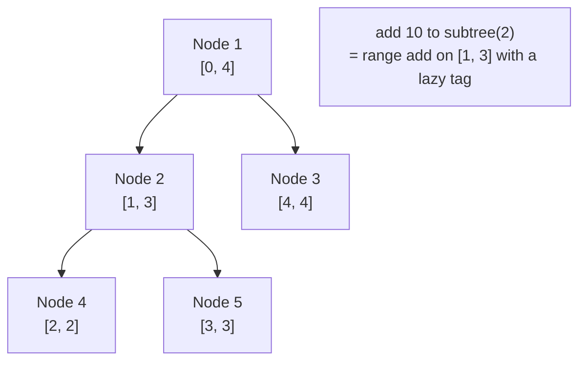
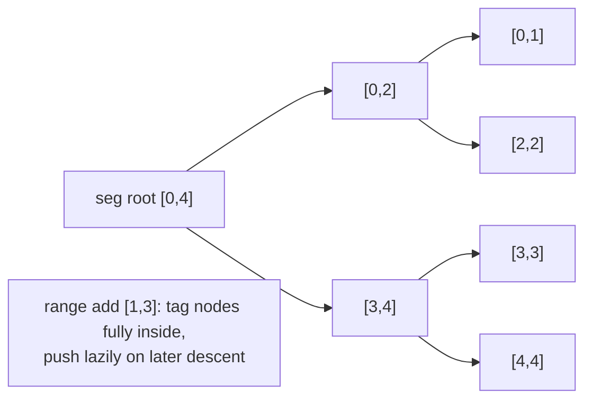

# Subtree Add + Subtree Sum via Euler Tour (Lazy Range Structure)

| Meta | Value |
|------|-------|
| Source | Self-contained (classic Euler-tour exercise) |
| Difficulty | Medium–Hard |
| Topics | Euler Tour Flattening, Lazy Segment Tree, Range-Update Range-Query |
| Technique | tin/tout flatten → lazy propagation over the interval $[tin[v], tout[v]]$ |
| Link | (self-contained — no external judge) |

---

## Problem Statement

You are given a rooted tree of `n` nodes (root is node `1`), each with an initial value. Process `q`
operations of two kinds:

1. `1 v d` — **add `d` to every node in the subtree of `v`** (a range add).
2. `2 v` — report the **sum of values in the subtree of `v`** (a range sum).

Both endpoints of an operation are *whole subtrees*, so this is a **range-update / range-query**
problem. Constraints: `n, q` up to $2 \cdot 10^5$, values and adds up to $10^9$ in magnitude. We
need $O(\log n)$ per operation, which means a **lazy segment tree** over the flattened array (a
plain point-update BIT cannot apply an add to a whole range and then sum a range without lazy
machinery).

**Example**
```
n = 5, q = 4
values = [1, 1, 1, 1, 1]        # nodes 1..5
edges:
  1 - 2
  1 - 3
  2 - 4
  2 - 5

tree:
        1(1)
       /    \
     2(1)   3(1)
    /   \
  4(1)  5(1)

op 2 2      -> subtree {2,4,5} sum = 1+1+1 = 3
op 1 2 10   -> add 10 to subtree of 2 -> nodes 2,4,5 become 11
op 2 2      -> subtree {2,4,5} sum = 11+11+11 = 33
op 2 1      -> subtree {1,2,3,4,5} = 1 + 11 + 11 + 1 + 11 = 35
```

---

## Why Euler Tour + Lazy Segment Tree?

Flatten with one DFS to get `tin[v]` and `tout[v]`. The subtree of `v` becomes the contiguous range
$[tin[v], tout[v]]$ in a preorder array. Then:

- `add d to subtree(v)` → **range add** on $[tin[v], tout[v]]$.
- `sum of subtree(v)` → **range sum** on $[tin[v], tout[v]]$.

Both operations are over a *range*, so the supporting structure must carry a **lazy tag** (a pending
add) on internal nodes. A lazy segment tree does both in $O(\log n)$.

| Operation type | Right tool |
|----------------|-----------|
| Point update, range sum | BIT (CSES 1137) |
| Point pair, prefix sum | BIT (CSES 1138) |
| **Range add, range sum** | **Lazy segment tree (this problem)** |

---

## Solution — Paired Python + C++

We flatten with an iterative DFS, write the initial values into the leaf positions by `tin`, then
run a standard lazy (sum + add) segment tree.

```python
import sys

class LazySeg:
    def __init__(self, base: list[int]):
        self.n = len(base)
        self.sum = [0] * (4 * self.n)
        self.lazy = [0] * (4 * self.n)
        self._build(1, 0, self.n - 1, base)

    def _build(self, node: int, l: int, r: int, base: list[int]) -> None:
        if l == r:
            self.sum[node] = base[l]
            return
        m = (l + r) // 2
        self._build(2 * node, l, m, base)
        self._build(2 * node + 1, m + 1, r, base)
        self.sum[node] = self.sum[2 * node] + self.sum[2 * node + 1]

    def _apply(self, node: int, l: int, r: int, d: int) -> None:
        self.sum[node] += d * (r - l + 1)
        self.lazy[node] += d

    def _push(self, node: int, l: int, r: int) -> None:
        if self.lazy[node]:
            m = (l + r) // 2
            self._apply(2 * node, l, m, self.lazy[node])
            self._apply(2 * node + 1, m + 1, r, self.lazy[node])
            self.lazy[node] = 0

    def update(self, ql: int, qr: int, d: int, node: int = 1, l: int = 0, r: int = -1) -> None:
        if r == -1:
            r = self.n - 1
        if qr < l or r < ql:
            return
        if ql <= l and r <= qr:
            self._apply(node, l, r, d)
            return
        self._push(node, l, r)
        m = (l + r) // 2
        self.update(ql, qr, d, 2 * node, l, m)
        self.update(ql, qr, d, 2 * node + 1, m + 1, r)
        self.sum[node] = self.sum[2 * node] + self.sum[2 * node + 1]

    def query(self, ql: int, qr: int, node: int = 1, l: int = 0, r: int = -1) -> int:
        if r == -1:
            r = self.n - 1
        if qr < l or r < ql:
            return 0
        if ql <= l and r <= qr:
            return self.sum[node]
        self._push(node, l, r)
        m = (l + r) // 2
        return self.query(ql, qr, 2 * node, l, m) + self.query(ql, qr, 2 * node + 1, m + 1, r)


def solve():
    data = sys.stdin.buffer.read().split()
    idx = 0
    n = int(data[idx]); idx += 1
    q = int(data[idx]); idx += 1
    val = [0] * (n + 1)
    for v in range(1, n + 1):
        val[v] = int(data[idx]); idx += 1
    adj = [[] for _ in range(n + 1)]
    for _ in range(n - 1):
        a = int(data[idx]); b = int(data[idx + 1]); idx += 2
        adj[a].append(b)
        adj[b].append(a)

    tin = [0] * (n + 1)
    tout = [0] * (n + 1)
    timer = 0
    stack = [(1, 0, False)]
    while stack:
        v, parent, is_exit = stack.pop()
        if is_exit:
            tout[v] = timer - 1
            continue
        tin[v] = timer
        timer += 1
        stack.append((v, parent, True))
        for u in reversed(adj[v]):
            if u != parent:
                stack.append((u, v, False))

    base = [0] * n
    for v in range(1, n + 1):
        base[tin[v]] = val[v]
    seg = LazySeg(base)

    out = []
    for _ in range(q):
        t = int(data[idx]); idx += 1
        if t == 1:
            v = int(data[idx]); d = int(data[idx + 1]); idx += 2
            seg.update(tin[v], tout[v], d)
        else:
            v = int(data[idx]); idx += 1
            out.append(str(seg.query(tin[v], tout[v])))
    sys.stdout.write("\n".join(out) + ("\n" if out else ""))


solve()
```

```cpp
#include <bits/stdc++.h>
using namespace std;

struct LazySeg {
    int n;
    vector<long long> sum, lazy;

    LazySeg(const vector<long long>& base) {
        n = (int)base.size();
        sum.assign(4 * n, 0);
        lazy.assign(4 * n, 0);
        build(1, 0, n - 1, base);
    }

    void build(int node, int l, int r, const vector<long long>& base) {
        if (l == r) {
            sum[node] = base[l];
            return;
        }
        int m = (l + r) / 2;
        build(2 * node, l, m, base);
        build(2 * node + 1, m + 1, r, base);
        sum[node] = sum[2 * node] + sum[2 * node + 1];
    }

    void applyAdd(int node, int l, int r, long long d) {
        sum[node] += d * (long long)(r - l + 1);
        lazy[node] += d;
    }

    void push(int node, int l, int r) {
        if (lazy[node]) {
            int m = (l + r) / 2;
            applyAdd(2 * node, l, m, lazy[node]);
            applyAdd(2 * node + 1, m + 1, r, lazy[node]);
            lazy[node] = 0;
        }
    }

    void update(int ql, int qr, long long d, int node, int l, int r) {
        if (qr < l || r < ql) return;
        if (ql <= l && r <= qr) {
            applyAdd(node, l, r, d);
            return;
        }
        push(node, l, r);
        int m = (l + r) / 2;
        update(ql, qr, d, 2 * node, l, m);
        update(ql, qr, d, 2 * node + 1, m + 1, r);
        sum[node] = sum[2 * node] + sum[2 * node + 1];
    }

    long long query(int ql, int qr, int node, int l, int r) {
        if (qr < l || r < ql) return 0;
        if (ql <= l && r <= qr) return sum[node];
        push(node, l, r);
        int m = (l + r) / 2;
        return query(ql, qr, 2 * node, l, m) + query(ql, qr, 2 * node + 1, m + 1, r);
    }

    void update(int ql, int qr, long long d) { update(ql, qr, d, 1, 0, n - 1); }
    long long query(int ql, int qr) { return query(ql, qr, 1, 0, n - 1); }
};

int main() {
    ios::sync_with_stdio(false);
    cin.tie(nullptr);

    int n, q;
    cin >> n >> q;
    vector<long long> val(n + 1);
    for (int v = 1; v <= n; ++v) cin >> val[v];
    vector<vector<int>> adj(n + 1);
    for (int i = 0; i < n - 1; ++i) {
        int a, b;
        cin >> a >> b;
        adj[a].push_back(b);
        adj[b].push_back(a);
    }

    vector<int> tin(n + 1, 0), tout(n + 1, 0);
    int timer = 0;
    struct Frame { int v, parent; bool is_exit; };
    vector<Frame> stk;
    stk.push_back({1, 0, false});
    while (!stk.empty()) {
        Frame f = stk.back();
        stk.pop_back();
        if (f.is_exit) {
            tout[f.v] = timer - 1;
            continue;
        }
        tin[f.v] = timer;
        timer += 1;
        stk.push_back({f.v, f.parent, true});
        for (auto it = adj[f.v].rbegin(); it != adj[f.v].rend(); ++it) {
            if (*it != f.parent) stk.push_back({*it, f.v, false});
        }
    }

    vector<long long> base(n, 0);
    for (int v = 1; v <= n; ++v) base[tin[v]] = val[v];
    LazySeg seg(base);

    string out;
    for (int i = 0; i < q; ++i) {
        int t;
        cin >> t;
        if (t == 1) {
            int v;
            long long d;
            cin >> v >> d;
            seg.update(tin[v], tout[v], d);
        } else {
            int v;
            cin >> v;
            out += to_string(seg.query(tin[v], tout[v]));
            out += '\n';
        }
    }
    cout << out;
    return 0;
}
```

---

## Trace

DFS from `1` (children in input order) gives:

| node `v` | 1 | 2 | 4 | 5 | 3 |
|----------|---|---|---|---|---|
| `tin[v]` | 0 | 1 | 2 | 3 | 4 |
| `tout[v]`| 4 | 3 | 2 | 3 | 4 |

`base` indexed by `tin` (all initial values `1`): `[1, 1, 1, 1, 1]`.

1. **`2 2`** → range sum $[tin[2], tout[2]] = [1, 3]$ → `1 + 1 + 1 = 3`. ✓
2. **`1 2 10`** → range add `+10` on $[1, 3]$. The segment tree tags the covering nodes lazily; the
   array logically becomes `[1, 11, 11, 11, 1]`.
3. **`2 2`** → range sum $[1, 3]$ → `11 + 11 + 11 = 33`. ✓
4. **`2 1`** → range sum $[0, 4]$ → `1 + 11 + 11 + 11 + 1 = 35`. ✓

The lazy tag from step 2 is **pushed down** only when steps 3 and 4 descend into the affected
subtrees, keeping every operation $O(\log n)$.

---

## Mermaid





---

## Math & Complexity

A lazy node holds a pending add `t`; applying it to a segment of length `len` adds `t * len` to the
stored sum:

$$\text{sum}_{\text{node}} \mathrel{+}= t \cdot \text{len}, \qquad \text{lazy}_{\text{node}} \mathrel{+}= t.$$

Correctness reuses the subtree-as-interval identity, now for *both* the update and the query:

$$\text{add to subtree}(v) \equiv \text{range-add } [tin[v], tout[v]], \qquad \text{sum subtree}(v) \equiv \text{range-sum } [tin[v], tout[v]].$$

| Phase | Time | Space |
|-------|------|-------|
| Flatten (iterative DFS) | $O(n)$ | $O(n)$ |
| Build segment tree | $O(n)$ | $O(n)$ |
| Each range add / range sum | $O(\log n)$ | — |
| Total | $O((n + q)\log n)$ | $O(n)$ |

Adds of $10^9$ applied across $2 \cdot 10^5$ nodes overflow 32 bits, so C++ uses `long long`
throughout (`sum`, `lazy`, and the `d * len` product).

---

## Takeaway

When **both** the update and the query target a **whole subtree**, flatten once with `tin/tout` and
put a **lazy segment tree** over the array. The Euler-tour interval makes "subtree" mean "range," and
lazy propagation is what lets a single add cover that range and a single query sum it — both in
$O(\log n)$.
