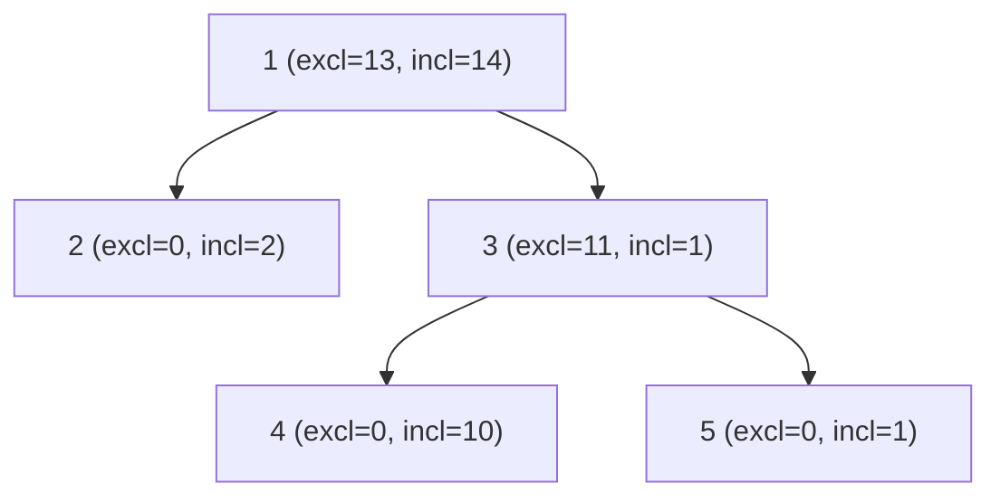

# Maximum-Weight Independent Set on a Tree (Subtree DP)

| Meta | Value |
|------|-------|
| Source | Classic (self-contained) |
| Difficulty | Medium |
| Topics | Tree DP, Include/Exclude States, Postorder |
| Link | — (self-contained) |

---

## Problem Statement
You are given a tree of `n` nodes; node `v` has weight `w[v]` (weights may be large positive
integers). An **independent set** is a subset of nodes with **no two adjacent** (no chosen node is
the parent or child of another chosen node). Find the **maximum total weight** of an independent
set.

```text
Input:
n = 5
weights w[1..5] = [3, 2, 1, 10, 1]
edges:
1 2
1 3
3 4
3 5

Tree:        1 (3)
            /    \
        2 (2)    3 (1)
                /    \
            4 (10)   5 (1)

Answer: 15   (choose nodes 2, 4, 5 -> 2 + 10 + 1 = 13?  No: best is 1? )
             Best independent set = {2, 4, 5} weight 13, or {1, 4, 5} weight 14,
             or {2, 4, 5} ... the optimum is {1, 4, 5} = 3 + 10 + 1 = 14.
```

(The worked trace below confirms the optimum is **14**, achieved by `{1, 4, 5}`.)

---

## Approach (WHY)

Root the tree at node `1`. For each node `v` keep two states over its subtree:

- $dp[v][0]$ — best weight in `v`'s subtree when `v` is **excluded**.
- $dp[v][1]$ — best weight in `v`'s subtree when `v` is **included**.

Why include/exclude? The only constraint that crosses the boundary between a node and its parent is
adjacency. If `v` is **included**, none of its children may be included, so each child must use its
*excluded* value. If `v` is **excluded**, each child is free to take whichever of its two states is
larger. That gives the recurrences:

$$
dp[v][1] = w[v] + \sum_{c \in \text{children}(v)} dp[c][0],
$$
$$
dp[v][0] = \sum_{c \in \text{children}(v)} \max\big(dp[c][0],\, dp[c][1]\big).
$$

The final answer is $\max(dp[\text{root}][0], dp[\text{root}][1])$. Each node only needs its
children's finished values, so we aggregate in **postorder**, iteratively, so chains of up to
$n = 2 \times 10^5$ nodes do not overflow the call stack.

```python
import sys

def max_weight_independent_set(n, w, edges):
    adj = [[] for _ in range(n + 1)]
    for a, b in edges:
        adj[a].append(b)
        adj[b].append(a)

    parent = [0] * (n + 1)
    order = []
    parent[1] = -1
    seen = [False] * (n + 1)
    seen[1] = True
    stack = [1]
    while stack:                          # iterative rooting -> preorder
        node = stack.pop()
        order.append(node)
        for nxt in adj[node]:
            if not seen[nxt]:
                seen[nxt] = True
                parent[nxt] = node
                stack.append(nxt)

    dp_excl = [0] * (n + 1)               # v excluded
    dp_incl = [0] * (n + 1)               # v included
    for v in range(1, n + 1):
        dp_incl[v] = w[v]
    for node in reversed(order):          # postorder: children first
        for nxt in adj[node]:
            if nxt == parent[node]:
                continue
            best_child = dp_excl[nxt] if dp_excl[nxt] > dp_incl[nxt] else dp_incl[nxt]
            dp_excl[node] += best_child   # child free to choose its best
            dp_incl[node] += dp_excl[nxt] # child must be excluded
    return max(dp_excl[1], dp_incl[1])
```

```cpp
#include <bits/stdc++.h>
using namespace std;

long long max_weight_independent_set(int n, const vector<long long>& w,
                                     const vector<pair<int,int>>& edges) {
    vector<vector<int>> adj(n + 1);
    for (auto [a, b] : edges) {
        adj[a].push_back(b);
        adj[b].push_back(a);
    }

    vector<int> parent(n + 1, 0), order;
    parent[1] = -1;
    vector<char> seen(n + 1, 0);
    seen[1] = 1;
    vector<int> stk = {1};
    while (!stk.empty()) {                 // iterative rooting -> preorder
        int node = stk.back(); stk.pop_back();
        order.push_back(node);
        for (int nxt : adj[node]) {
            if (!seen[nxt]) {
                seen[nxt] = 1;
                parent[nxt] = node;
                stk.push_back(nxt);
            }
        }
    }

    vector<long long> dp_excl(n + 1, 0);   // v excluded
    vector<long long> dp_incl(n + 1, 0);   // v included
    for (int v = 1; v <= n; ++v)
        dp_incl[v] = w[v];
    for (int i = (int)order.size() - 1; i >= 0; --i) {  // postorder
        int node = order[i];
        for (int nxt : adj[node]) {
            if (nxt == parent[node]) continue;
            long long best_child = max(dp_excl[nxt], dp_incl[nxt]);
            dp_excl[node] += best_child;   // child free to choose its best
            dp_incl[node] += dp_excl[nxt]; // child must be excluded
        }
    }
    return max(dp_excl[1], dp_incl[1]);
}
```

> Use `long long` (and `const long long INF = 1e18` if you need a sentinel): with up to
> $2 \times 10^5$ nodes and large weights, a 32-bit accumulator overflows. The iterative postorder
> avoids recursion-depth limits on deep trees.

---

## Trace — `n = 5`, `w = [_,3,2,1,10,1]`, edges `{1-2, 1-3, 3-4, 3-5}`

Rooted at `1`: children `1→[2,3]`, `3→[4,5]`. Postorder: `2, 4, 5, 3, 1`.
Init `dp_incl[v] = w[v]`, `dp_excl[v] = 0`.

| node | children | dp_excl (Σ max child) | dp_incl (w + Σ excl child) |
|------|----------|------------------------|-----------------------------|
| 2 | — | 0 | 2 |
| 4 | — | 0 | 10 |
| 5 | — | 0 | 1 |
| 3 | 4,5 | max(0,10)+max(0,1)=11 | 1 + (0 + 0) = 1 |
| 1 | 2,3 | max(0,2)+max(11,1)=2+11=13 | 3 + (0 + 11) = 14 |

Answer = $\max(dp\_excl[1], dp\_incl[1]) = \max(13, 14) = 14$, set `{1, 4, 5}`. ✓ Including the root
forces node 3 excluded, but the heavy leaves 4 and 5 are still freely chosen below it.

---

## Mermaid

Each node reports `(excl, incl)`; a parent's *included* value sums its children's *excluded*
values, while its *excluded* value sums each child's best.



Node `3`'s `excl = 11` (take both heavy children) beats its `incl = 1`, so the root prefers to be
included and pairs with the strong excluded-subtree below.

---

## Math / Complexity

$$
dp[v][1] = w[v] + \sum_{c} dp[c][0], \qquad
dp[v][0] = \sum_{c} \max(dp[c][0], dp[c][1]).
$$

| Metric | Value |
|--------|-------|
| Time | $O(n)$ — single postorder pass |
| Space | $O(n)$ — adjacency, parent, two dp arrays, explicit stack |

---

## Takeaway
Maximum-weight independent set on a tree is the canonical **include/exclude subtree DP**. The
adjacency constraint only couples a node to its children, so two states per node — "I'm in" vs
"I'm out" — fully capture it, and a single **postorder** aggregation produces the optimum.
