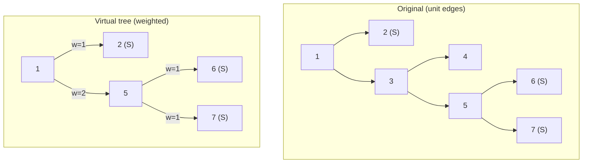

# Virtual Tree — Sum of Pairwise Distances over a Query Set

| Meta | Value |
|------|-------|
| Source | Self-contained (classic auxiliary-tree exercise) |
| Difficulty | Hard |
| Topics | Virtual Tree, Tree DP, LCA, Euler Tour, Compressed Edge Weights |
| Technique | Build auxiliary tree, count subtree marked nodes, weight each compressed edge by split |
| Link | (self-contained — no external judge) |

---

## Problem Statement

You are given an **unweighted** tree of `n` nodes (edges have length `1`). You must answer `q`
queries. Each query gives a set `S` of `k` marked nodes; output

$$
\sum_{\{u, v\} \subseteq S} \operatorname{dist}(u, v),
$$

the sum of distances over all **unordered pairs** of marked nodes, where $\operatorname{dist}$ is the
number of edges on the tree path. Constraints: `n` up to $2 \cdot 10^5$, and $\sum k \le 2 \cdot
10^5$. A direct $O(k^2)$ per query is too slow; we build a **virtual tree** and aggregate by edge.

**Example**
```
n = 7
edges (unweighted):
  1-2, 1-3, 3-4, 3-5, 5-6, 5-7

tree:
        1
       / \
      2   3
         / \
        4   5
           / \
          6   7

Query: S = {2, 6, 7}, k = 3
  dist(2,6) = 2->1->3->5->6 = 4
  dist(2,7) = 2->1->3->5->7 = 4
  dist(6,7) = 6->5->7        = 2
  Answer = 4 + 4 + 2 = 10
```

---

## Why a Virtual Tree?

The sum of pairwise distances decomposes **edge by edge**. For any edge `e` of the tree, its
contribution to the total is

$$
(\text{edges spanned}) \times (\text{pairs separated by } e),
$$

and pairs separated by `e` is $c \cdot (k - c)$ where `c` is the number of marked nodes on one side.
Most original edges carry the *same* marked-count on both endpoints along a chain, so they can be
**collapsed** into a single compressed virtual edge of weight = chain length. The virtual tree gives
us exactly those compressed edges in $O(k)$, so we compute each contribution once.

For each compressed edge from parent `p` to child `c`:

- weight $w = depth[c] - depth[p]$ (original number of edges),
- `sub[c]` = number of marked nodes in `c`'s virtual subtree,
- contribution $= w \cdot sub[c] \cdot (k - sub[c])$.

Summing over all compressed edges yields the answer.

---

## Solution — Paired Python + C++

We build the virtual tree, compute `sub[]` by post-order, then accumulate the edge contributions.

```python
import sys

def sum_pairwise_distances(marked, tin, tout, up, depth, LOG):
    k = len(set(marked))
    nodes = sorted(set(marked), key=lambda v: tin[v])
    extra = []
    for i in range(len(nodes) - 1):
        extra.append(lca(nodes[i], nodes[i + 1], up, depth, LOG))
    nodes = sorted(set(nodes) | set(extra), key=lambda v: tin[v])

    children = {v: [] for v in nodes}
    def is_anc(u, v):
        return tin[u] <= tin[v] <= tout[u]
    stack = [nodes[0]]
    for v in nodes[1:]:
        while not is_anc(stack[-1], v):
            stack.pop()
        children[stack[-1]].append(v)
        stack.append(v)
    root = nodes[0]

    marked_set = set(marked)
    # iterative post-order
    order = []
    st = [root]
    while st:
        v = st.pop()
        order.append(v)
        for c in children[v]:
            st.append(c)

    sub = {v: 0 for v in nodes}
    total = 0
    for v in reversed(order):
        s = 1 if v in marked_set else 0
        for c in children[v]:
            s += sub[c]
            w = depth[c] - depth[v]            # compressed edge weight
            total += w * sub[c] * (k - sub[c])
        sub[v] = s
    return total
```

```cpp
#include <bits/stdc++.h>
using namespace std;

const long long INF = 1e18;

int LOG;
vector<vector<int>> up;
vector<int> depthv, tin, tout;

int lca(int a, int b) {
    if (depthv[a] < depthv[b]) swap(a, b);
    int diff = depthv[a] - depthv[b];
    for (int k = 0; k < LOG; ++k)
        if (diff & (1 << k)) a = up[k][a];
    if (a == b) return a;
    for (int k = LOG - 1; k >= 0; --k)
        if (up[k][a] != up[k][b]) { a = up[k][a]; b = up[k][b]; }
    return up[0][a];
}

long long sum_pairwise_distances(vector<int> marked) {
    sort(marked.begin(), marked.end(),
         [](int a, int b) { return tin[a] < tin[b]; });
    marked.erase(unique(marked.begin(), marked.end()), marked.end());
    long long k = (long long)marked.size();

    vector<int> nodes = marked;
    for (size_t i = 0; i + 1 < marked.size(); ++i)
        nodes.push_back(lca(marked[i], marked[i + 1]));
    sort(nodes.begin(), nodes.end(),
         [](int a, int b) { return tin[a] < tin[b]; });
    nodes.erase(unique(nodes.begin(), nodes.end()), nodes.end());

    unordered_map<int, vector<int>> children;
    for (int v : nodes) children[v];
    auto is_anc = [](int u, int v) {
        return tin[u] <= tin[v] && tin[v] <= tout[u];
    };
    vector<int> st = {nodes[0]};
    for (size_t i = 1; i < nodes.size(); ++i) {
        int v = nodes[i];
        while (!is_anc(st.back(), v)) st.pop_back();
        children[st.back()].push_back(v);
        st.push_back(v);
    }
    int root = nodes[0];

    unordered_set<int> marked_set(marked.begin(), marked.end());
    vector<int> order;
    vector<int> s2 = {root};
    while (!s2.empty()) {
        int v = s2.back(); s2.pop_back();
        order.push_back(v);
        for (int c : children[v]) s2.push_back(c);
    }

    unordered_map<int, long long> sub;
    long long total = 0;
    for (int i = (int)order.size() - 1; i >= 0; --i) {
        int v = order[i];
        long long s = marked_set.count(v) ? 1 : 0;
        for (int c : children[v]) {
            s += sub[c];
            long long w = depthv[c] - depthv[v];   // compressed edge weight
            total += w * sub[c] * (k - sub[c]);
        }
        sub[v] = s;
    }
    return total;
}
```

---

## Trace — Query `{2, 6, 7}`

Root at `1`; preorder tin visits `1,2,3,4,5,6,7`. Depths: `d1=0, d2=1, d3=1, d5=2, d6=3, d7=3`.

1. **Sorted marked:** `[2, 6, 7]`, `k = 3`.
2. **Consecutive LCAs:** `lca(2,6)=1`, `lca(6,7)=5`. Combined set `{1,2,5,6,7}`.
3. **Stack sweep** children: `1→{2,5}`, `5→{6,7}`.
4. **Post-order `sub` + contributions:**
   - `2` marked → `sub=1`.
   - `6` marked → `sub=1`.
   - `7` marked → `sub=1`.
   - `5`: not marked, children `6,7`. Edge `5→6` w = `d6-d5 = 1`, contrib `1·1·(3-1)=2`.
     Edge `5→7` w = `1`, contrib `1·1·2 = 2`. `sub[5]=2`.
   - `1`: children `2,5`. Edge `1→2` w = `d2-d1 = 1`, contrib `1·1·(3-1)=2`.
     Edge `1→5` w = `d5-d1 = 2`, contrib `2·2·(3-2)=4`. `sub[1]=3`.
5. **Total = 2 + 2 + 2 + 4 = 10.** ✔ (matches the brute force above)

---

## Mermaid — Compression and Edge Weights



The chain `1 &rarr; 3 &rarr; 5` collapses into one compressed edge `1 &rarr; 5` of weight `2`, while
node `3` (which is `lca` of nothing in `S` beyond `1`) and node `4` vanish entirely.

---

## Math & Complexity

The identity used is the **edge-splitting** form of pairwise distance sums:

$$
\sum_{\{u,v\}\subseteq S}\operatorname{dist}(u,v)
= \sum_{e=(p,c)} w(e)\cdot sub[c]\cdot\bigl(k - sub[c]\bigr),
$$

valid because each tree edge is counted once per pair whose path crosses it, and compressed edges
inherit the original weight $w = depth[c]-depth[p]$.

| Phase | Cost |
|-------|------|
| Preprocess (Euler + binary lifting) | $O(n \log n)$ |
| Build virtual tree | $O(k \log k)$ |
| Post-order DP | $O(k)$ |
| **Per query** | $O(k \log k)$ |
| **All queries** | $O\!\left(n \log n + \big(\sum k\big)\log n\right)$ |

Use `long long` for `total`: with $k$ up to $2 \cdot 10^5$ and weights up to $n$, the sum can reach
roughly $10^{15}$.

---

## Takeaway

Pairwise-distance sums over query sets reduce to a **single linear pass over a virtual tree**, where
each compressed edge contributes $w \cdot c \cdot (k - c)$. Closing the marked set under consecutive
LCAs preserves every split point, so the $O(k)$ auxiliary tree carries all the information of the
full $O(n)$ tree for this query — turning an $O(k^2)$ or $O(n)$ computation into $O(k \log k)$.
