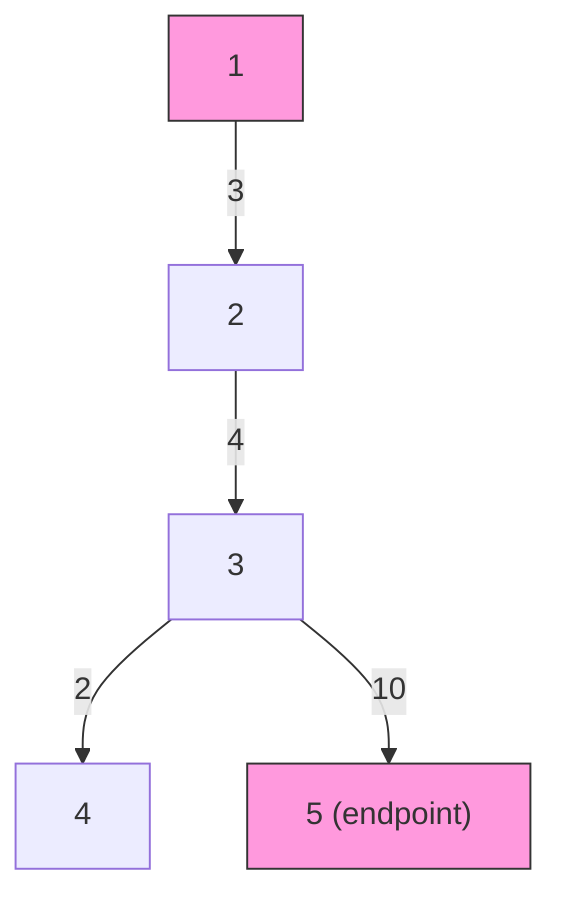

# Weighted Tree Diameter (DFS DP)

| Meta | Value |
|------|-------|
| Source | Self-contained classic |
| Difficulty | Medium |
| Topics | Trees, DFS, Tree DP, Weighted Diameter |
| Link | — (self-contained) |

---

## Problem Statement
You are given a tree with `n` nodes and `n - 1` **weighted** edges. The weight of a path is the sum
of the weights of its edges. Find the **weighted diameter**: the maximum weight over all simple
paths in the tree.

Edge weights can be large (up to $10^9$), so accumulated path weights require 64-bit integers.

**Example**
```
n = 5
edges (u, v, w):
  1 - 2  (3)
  2 - 3  (4)
  3 - 4  (2)
  3 - 5  (10)

        1
        | 3
        2
        | 4
        3
      2/ \10
      4   5

Heaviest path: 1 - 2 - 3 - 5 = 3 + 4 + 10 = 17.
Weighted diameter = 17.
```

---

## WHY This Works
Root the tree anywhere. For a node `v`, let `down(v)` be the maximum weight of a path that starts at
`v` and goes strictly downward. Any simple path has a single **highest** node (its "turning point");
at that node the path is composed of the **two heaviest downward branches**. Therefore:

$$
\text{diameter} = \max_{v}\bigl(\text{down}_1(v) + \text{down}_2(v)\bigr),
\qquad
\text{down}(v) = \max_{c}\bigl(\text{down}(c) + w(v, c)\bigr).
$$

Because a tree has a unique path between any two nodes, every path is counted exactly once at its
turning node — so scanning all nodes and combining the top-two child contributions is both correct
and exhaustive. We compute `down` bottom-up in one iterative post-order pass to stay safe for
$n$ up to $2 \times 10^5$.

---

## Solution (paired Python + C++)

```python
def weighted_tree_diameter(n, edges):
    adj = [[] for _ in range(n + 1)]
    for u, v, w in edges:
        adj[u].append((v, w))
        adj[v].append((u, w))

    parent = [0] * (n + 1)
    pw = [0] * (n + 1)                     # weight of edge to parent
    order = []
    visited = [False] * (n + 1)
    st = [1]
    visited[1] = True
    while st:                              # iterative DFS for post-order
        x = st.pop()
        order.append(x)
        for y, w in adj[x]:
            if not visited[y]:
                visited[y] = True
                parent[y] = x
                pw[y] = w
                st.append(y)

    down = [0] * (n + 1)
    best = 0
    for x in reversed(order):              # children before parents
        d1 = d2 = 0
        for y, w in adj[x]:
            if y != parent[x]:
                d = down[y] + w
                if d > d1:
                    d2, d1 = d1, d
                elif d > d2:
                    d2 = d
        down[x] = d1
        if d1 + d2 > best:
            best = d1 + d2                 # path turning at x
    return best
```

```cpp
#include <bits/stdc++.h>
using namespace std;

const long long INF = 1e18;

long long weighted_tree_diameter(int n, const vector<array<long long,3>>& edges) {
    vector<vector<pair<int,long long>>> adj(n + 1);
    for (const auto& e : edges) {
        int u = (int)e[0], v = (int)e[1];
        long long w = e[2];
        adj[u].push_back({v, w});
        adj[v].push_back({u, w});
    }

    vector<int> parent(n + 1, 0);
    vector<int> order;
    vector<char> visited(n + 1, false);
    vector<int> st = {1};
    visited[1] = true;
    while (!st.empty()) {                  // iterative DFS for post-order
        int x = st.back(); st.pop_back();
        order.push_back(x);
        for (auto [y, w] : adj[x]) {
            if (!visited[y]) {
                visited[y] = true;
                parent[y] = x;
                st.push_back(y);
            }
        }
    }

    vector<long long> down(n + 1, 0);
    long long best = 0;
    for (int i = (int)order.size() - 1; i >= 0; --i) {  // children before parents
        int x = order[i];
        long long d1 = 0, d2 = 0;
        for (auto [y, w] : adj[x]) {
            if (y != parent[x]) {
                long long d = down[y] + w;
                if (d > d1) {
                    d2 = d1; d1 = d;
                } else if (d > d2) {
                    d2 = d;
                }
            }
        }
        down[x] = d1;
        if (d1 + d2 > best) best = d1 + d2;             // path turning at x
    }
    (void)INF;
    return best;
}
```

---

## Trace — the example tree (rooted at `1`)

Post-order (children first): `4, 5, 3, 2, 1`.

| Node `x` | child contributions `down[y]+w` | `d1` | `d2` | `down[x]` | `d1+d2` |
|----------|----------------------------------|------|------|-----------|---------|
| 4 | (none) | 0 | 0 | 0 | 0 |
| 5 | (none) | 0 | 0 | 0 | 0 |
| 3 | `4`: 0+2=2, `5`: 0+10=10 | 10 | 2 | 10 | 12 |
| 2 | `3`: 10+4=14 | 14 | 0 | 14 | 14 |
| 1 | `2`: 14+3=17 | 17 | 0 | 17 | 17 |

`best` peaks at node `1` with `17`. **Weighted diameter = 17**, the path `1-2-3-5`.

---

## Mermaid



Pink nodes `1` and `5` are the weighted-diameter endpoints; the turn happens at the highest node `1`.

---

## Math & Complexity
Each node and edge is processed a constant number of times across the two linear passes:

$$
O(n + m) = O(n), \qquad m = n - 1.
$$

Space is $O(n)$. Because weights reach $10^9$ and a path may chain $2\times10^5$ of them, the running
sum can reach $\approx 2\times10^{14}$ — well within `long long` ($< 9.2\times10^{18}$) but far beyond
32-bit `int`. Always accumulate in `long long`.

---

## Takeaway
The **weighted diameter** is found in one DFS DP: keep the **two heaviest downward branches** at each
node and maximize their sum over all turning points. It is the weighted twin of the unweighted DP in
[02-tree-diameter-centroid.md](../guide/02-tree-diameter-centroid.md) — just swap `+1` for
`+ weight` and use 64-bit integers.
