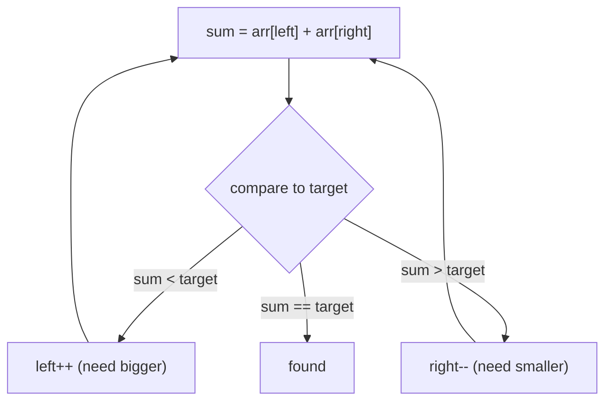

# Two Pointers — Complete Guide (Beginner → Advanced)

> "Two pointers" is a family of techniques that use **two indices** moving through data to turn
> an O(n²) nested loop into a single O(n) pass — usually on sorted arrays, strings, or linked
> lists.

---

## Table of Contents
1. [The Core Idea](#1-the-core-idea)
2. [Variant A: Opposite Ends (Converging)](#2-variant-a-opposite-ends-converging)
3. [Variant B: Same Direction (Fast/Slow)](#3-variant-b-same-direction-fastslow)
4. [Variant C: Two Sequences (Merge)](#4-variant-c-two-sequences-merge)
5. [When Does It Apply?](#5-when-does-it-apply)
6. [Correctness Reasoning](#6-correctness-reasoning)
7. [Pattern Catalog](#7-pattern-catalog)
8. [Cheat Sheet](#8-cheat-sheet)

---

## 1. The Core Idea

Instead of checking every pair `(i, j)` with two nested loops, we maintain two pointers and
move them intelligently so that **each pointer traverses the array at most once**. Total work
drops from `O(n²)` to `O(n)`.

The art is the **invariant**: a property you maintain that guarantees you never miss a valid
answer while skipping pairs that cannot be answers.

---

## 2. Variant A: Opposite Ends (Converging)

Pointers start at both ends and move toward each other. Classic on **sorted** arrays.

```
left ->                    <- right
[ 1 ,  3 ,  4 ,  6 ,  8 , 11 ]
```

**Two Sum (sorted):** find a pair summing to `target`.
- If `arr[left] + arr[right] < target` → sum too small → move `left` right (increase sum).
- If `> target` → move `right` left (decrease sum).
- If `==` → found.



Other uses: valid palindrome, container with most water, reverse in place, 3Sum (fix one +
two-pointer the rest).

---

## 3. Variant B: Same Direction (Fast/Slow)

Both pointers start near the front; one moves faster or only advances on a condition.

### In-place filtering (slow = write pointer)
Remove duplicates / move zeros: `slow` marks where the next kept element goes, `fast` scans.

```
[0, 1, 0, 3, 12]  ->  move non-zeros forward
slow writes:  1 then 3 then 12 ; remaining filled with 0
```

### Floyd's cycle detection (tortoise & hare)
`slow` moves 1 step, `fast` moves 2. If there's a cycle they meet; the gap closes by 1 each
step (see LinkedLists guide).

---

## 4. Variant C: Two Sequences (Merge)

One pointer per array; advance whichever is smaller. Core of **merge sort's merge step**,
merging sorted lists, intersection/union of sorted arrays.

```
A: 1  4  7        B: 2  3  9
i^               j^
take min(A[i], B[j]), advance that pointer
```

---

## 5. When Does It Apply?

Two pointers shines when:
- The array/string is **sorted** (or you can sort it), enabling monotonic decisions.
- You're looking for **pairs/triplets** with a sum/difference condition.
- You need an **in-place** rearrangement (partitioning, dedup, move).
- You're **merging** two ordered sequences.
- You need **cycle detection** in a linked list.

If the data isn't sorted and order can't be exploited, a hash map may be better.

---

## 6. Correctness Reasoning

The converging two-pointer correctness rests on **monotonicity**. In sorted Two Sum, when
`arr[left] + arr[right] > target`, *every* pair `(left', right)` with `left' > left` is even
larger, so `arr[right]` can never be part of a solution — we safely discard it by doing
`right--`. Symmetrically for the small case. Thus no valid pair is ever skipped:

$$
\text{If } a_l + a_r > t \text{ and array sorted} \Rightarrow a_{l'} + a_r > t \;\; \forall\, l' \ge l
$$

Each step eliminates one row or column of the implicit pair matrix, so we finish in `O(n)`.

---

## 7. Pattern Catalog

| Problem type | Pointer setup |
|--------------|---------------|
| Pair sum in sorted array | opposite ends |
| 3Sum / 4Sum | fix one + opposite ends |
| Palindrome check | opposite ends |
| Container with most water | opposite ends, move shorter wall |
| Trapping rain water | opposite ends + running max |
| Remove duplicates / move zeros | fast/slow write |
| Merge sorted arrays/lists | one pointer each |
| Cycle detection / find middle | fast (2x) / slow (1x) |
| Partition (Dutch flag) | three pointers |

---

## 8. Cheat Sheet

```
Opposite ends (sorted):  left=0, right=n-1; move based on comparison
Fast/slow (in place):    slow=write index, fast=scan index
Merge:                   i, j per array; advance smaller
Cycle:                   slow+=1, fast+=2; meet => cycle

Time:  O(n) typical (O(n log n) if a sort is needed first)
Space: O(1) — pointers only
```

> **Mental model:** Two pointers replace a 2-D search over pairs with a 1-D walk, using the
> data's order (or a write/scan split) to prove that skipped pairs can't be answers.
