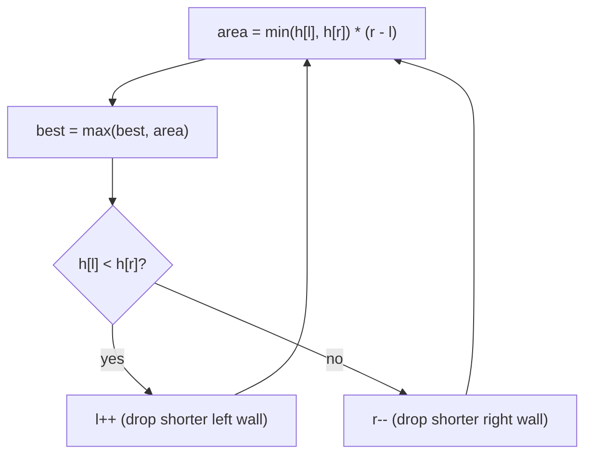

# Container With Most Water

| Meta | Value |
|------|-------|
| Source | LeetCode #11 |
| Difficulty | Medium |
| Topics | Two Pointers, Greedy, Array |
| Link | https://leetcode.com/problems/container-with-most-water/ |

---

## Problem Statement
Given `height[]` where each element is a vertical line at that x-coordinate, pick two lines that
together with the x-axis form a container holding the **most water**. Return the max area.

**Example**
```
Input:  height = [1, 8, 6, 2, 5, 4, 8, 3, 7]
Output: 49        // lines at index 1 (h=8) and index 8 (h=7)
```

---

## Area Formula

For lines at indices `i < j`, the container's area is limited by the **shorter** line:

$$
\text{area}(i, j) = \min(h_i, h_j) \times (j - i)
$$

width = `j − i`, height = the shorter wall (water spills over the lower one).

---

## Brute Force — O(n²)
Check all pairs. Too slow for large `n`.

---

## Two Pointers — O(n)

Start with the **widest** container: `left = 0`, `right = n − 1`. Then repeatedly move the
pointer at the **shorter** line inward.

### Why move the shorter line?
The width always shrinks as pointers converge. The only way to possibly get a *larger* area is
to increase the limiting height. Moving the **taller** line can never help (height still capped
by the shorter one, width smaller). Moving the **shorter** line is the only move that *might*
find a taller wall. So we discard the shorter line — it cannot pair with anything better than
what we just computed.



---

## Code

```python
def max_area(height):
    left, right = 0, len(height) - 1
    best = 0
    while left < right:
        area = min(height[left], height[right]) * (right - left)
        best = max(best, area)
        if height[left] < height[right]:
            left += 1
        else:
            right -= 1
    return best
```

```cpp
int maxArea(vector<int>& height) {
    int left = 0, right = (int)height.size() - 1;
    int best = 0;
    while (left < right) {
        int area = min(height[left], height[right]) * (right - left);
        best = max(best, area);
        if (height[left] < height[right])
            left += 1;
        else
            right -= 1;
    }
    return best;
}
```

---

## Iteration Trace — `[1, 8, 6, 2, 5, 4, 8, 3, 7]`

| left | right | h[left] | h[right] | width | area = min·width | best | move |
|------|-------|---------|----------|-------|------------------|------|------|
| 0 | 8 | 1 | 7 | 8 | 1·8 = 8 | 8 | left++ (1<7) |
| 1 | 8 | 8 | 7 | 7 | 7·7 = 49 | **49** | right-- (8≥7) |
| 1 | 7 | 8 | 3 | 6 | 3·6 = 18 | 49 | right-- |
| 1 | 6 | 8 | 8 | 5 | 8·5 = 40 | 49 | right-- |
| 1 | 5 | 8 | 4 | 4 | 4·4 = 16 | 49 | right-- |
| 1 | 4 | 8 | 5 | 3 | 5·3 = 15 | 49 | right-- |
| 1 | 3 | 8 | 2 | 2 | 2·2 = 4 | 49 | right-- |
| 1 | 2 | 8 | 6 | 1 | 6·1 = 6 | 49 | right-- |
| 1 | 1 | — | — | stop | | 49 | |

Answer = **49** (index 1 & 8).

---

## Proof the Greedy Move Is Safe

Suppose `h[left] < h[right]`. For *any* `j` with `left < j < right`, the pair `(left, j)` has:
- width `j − left < right − left` (smaller), and
- height `min(h[left], h[j]) ≤ h[left]` (still capped by the short left wall).

So `area(left, j) ≤ h[left] · (right − left) = area(left, right)`, which we already recorded.
Therefore `left` can be discarded without losing the optimum.

---

## Complexity

| Approach | Time | Space |
|----------|------|-------|
| Brute force | O(n²) | O(1) |
| **Two pointers** | **O(n)** | O(1) |

## Takeaway
A converging two-pointer with a **greedy elimination argument**: always discard the side that
provably cannot improve. This same reasoning powers Trapping Rain Water.
