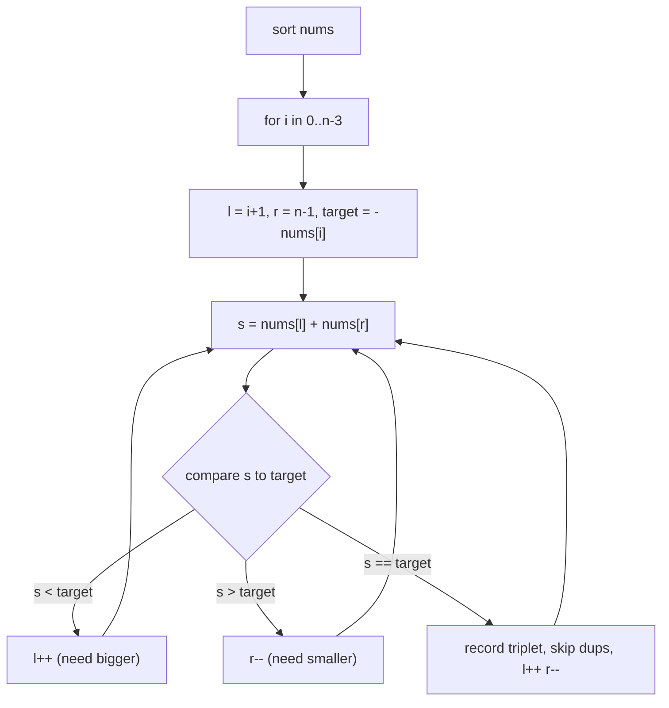

# 3Sum

| Meta | Value |
|------|-------|
| Source | LeetCode #15 |
| Difficulty | Medium |
| Topics | Two Pointers, Sorting, Array |
| Link | https://leetcode.com/problems/3sum/ |

---

## Problem Statement
Return all **unique triplets** `[a, b, c]` from `nums` such that `a + b + c = 0`. The solution
set must not contain duplicate triplets.

**Example**
```
Input:  nums = [-1, 0, 1, 2, -1, -4]
Output: [[-1, -1, 2], [-1, 0, 1]]
```

---

## Strategy — Sort, Then Fix One + Two Pointers

A triplet summing to 0 means: fix the first number `nums[i]`, and find a **pair** in the rest
summing to `−nums[i]`. On a **sorted** array, that pair search is a classic converging
two-pointer in O(n). Doing this for each `i` gives `O(n²)` overall — far better than the
`O(n³)` brute force.

$$
nums[i] + nums[l] + nums[r] = 0 \;\Longleftrightarrow\; nums[l] + nums[r] = -nums[i]
$$



---

## Code

```python
def three_sum(nums):
    nums.sort()
    res = []
    n = len(nums)
    for i in range(n - 2):
        if nums[i] > 0:                 # all remaining are positive -> no zero sum
            break
        if i > 0 and nums[i] == nums[i - 1]:
            continue                    # skip duplicate fixed element
        l, r = i + 1, n - 1
        while l < r:
            s = nums[i] + nums[l] + nums[r]
            if s < 0:
                l += 1
            elif s > 0:
                r -= 1
            else:
                res.append([nums[i], nums[l], nums[r]])
                l += 1
                r -= 1
                while l < r and nums[l] == nums[l - 1]:   # skip dup left
                    l += 1
                while l < r and nums[r] == nums[r + 1]:   # skip dup right
                    r -= 1
    return res
```

```cpp
vector<vector<int>> threeSum(vector<int>& nums) {
    sort(nums.begin(), nums.end());
    vector<vector<int>> res;
    int n = (int)nums.size();
    for (int i = 0; i < n - 2; i++) {
        if (nums[i] > 0)                    // all remaining are positive -> no zero sum
            break;
        if (i > 0 && nums[i] == nums[i - 1])
            continue;                       // skip duplicate fixed element
        int l = i + 1, r = n - 1;
        while (l < r) {
            long long s = (long long)nums[i] + nums[l] + nums[r];
            if (s < 0) {
                l += 1;
            } else if (s > 0) {
                r -= 1;
            } else {
                res.push_back({nums[i], nums[l], nums[r]});
                l += 1;
                r -= 1;
                while (l < r && nums[l] == nums[l - 1])   // skip dup left
                    l += 1;
                while (l < r && nums[r] == nums[r + 1])   // skip dup right
                    r -= 1;
            }
        }
    }
    return res;
}
```

---

## Handling Duplicates (the tricky part)

Three places enforce uniqueness:
1. **Outer skip:** if `nums[i] == nums[i-1]`, skip — the previous `i` already explored all
   triplets containing this value.
2. **Inner left skip:** after recording, advance `l` past equal values.
3. **Inner right skip:** after recording, retreat `r` past equal values.

---

## Iteration Trace — `nums = [-1, 0, 1, 2, -1, -4]`

After sorting: `[-4, -1, -1, 0, 1, 2]`

| i | nums[i] | target=−nums[i] | l,r walk | triplets found |
|---|---------|-----------------|----------|----------------|
| 0 | -4 | 4 | pairs in `[-1,-1,0,1,2]` summing to 4 → none reach 4 | — |
| 1 | -1 | 1 | (l=2,r=5): -1+2=1 ✓ → `[-1,-1,2]`; then (3,4): 0+1=1 ✓ → `[-1,0,1]` | `[-1,-1,2]`, `[-1,0,1]` |
| 2 | -1 | — | skipped (dup of i=1) | — |
| 3 | 0 | 0 | (l=4,r=5): 1+2=3 >0 → r--; l<r ends | — |

Final: `[[-1, -1, 2], [-1, 0, 1]]` ✓

The `nums[i] > 0` break also prunes: once the fixed number is positive, three positives can't
sum to zero.

---

## Complexity

| Approach | Time | Space |
|----------|------|-------|
| Brute force | O(n³) | O(1) |
| **Sort + two pointers** | **O(n²)** | O(1) or O(n) for sort |

Sorting is `O(n log n)`; the dominant cost is the `O(n²)` pair scanning.

## Takeaway
**Reduce k-Sum to (k−1)-Sum by fixing one element and recursing.** 3Sum = fix one + 2Sum;
4Sum = fix one + 3Sum. Sorting first unlocks both the two-pointer scan and easy duplicate
skipping.
