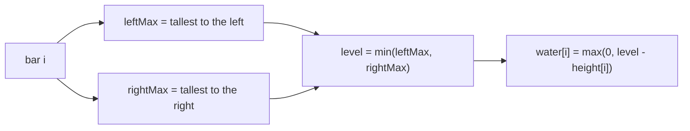

# Trapping Rain Water

| Meta | Value |
|------|-------|
| Source | LeetCode #42 |
| Difficulty | Hard |
| Topics | Two Pointers, Dynamic Programming, Stack |
| Link | https://leetcode.com/problems/trapping-rain-water/ |

---

## Problem Statement
Given `height[]` representing an elevation map (bar widths = 1), compute how much **rainwater**
is trapped after raining.

**Example**
```
Input:  height = [0,1,0,2,1,0,1,3,2,1,2,1]
Output: 6
```

```
        █
   █~~~~███~█
 █~██~████████
[0,1,0,2,1,0,1,3,2,1,2,1]   '~' = trapped water (6 units)
```

---

## Key Insight — Water Above Each Bar

The water sitting on top of bar `i` is bounded by the tallest wall to its **left** and the
tallest wall to its **right**. Water level = the shorter of those two maxima. So:

$$
\text{water}[i] = \max\Big(0,\; \min(\text{leftMax}[i], \text{rightMax}[i]) - \text{height}[i]\Big)
$$

Total trapped water = sum over all `i`.



---

## Approach 1: Precompute Prefix/Suffix Maxima — O(n) time, O(n) space

```python
def trap_dp(height):
    n = len(height)
    if n == 0:
        return 0
    left = [0] * n
    right = [0] * n
    left[0] = height[0]
    for i in range(1, n):
        left[i] = max(left[i - 1], height[i])
    right[n - 1] = height[n - 1]
    for i in range(n - 2, -1, -1):
        right[i] = max(right[i + 1], height[i])
    return sum(min(left[i], right[i]) - height[i] for i in range(n))
```

```cpp
int trapDp(vector<int>& height) {
    int n = (int)height.size();
    if (n == 0)
        return 0;
    vector<int> left(n, 0);
    vector<int> right(n, 0);
    left[0] = height[0];
    for (int i = 1; i < n; i++)
        left[i] = max(left[i - 1], height[i]);
    right[n - 1] = height[n - 1];
    for (int i = n - 2; i >= 0; i--)
        right[i] = max(right[i + 1], height[i]);
    int total = 0;
    for (int i = 0; i < n; i++)
        total += min(left[i], right[i]) - height[i];
    return total;
}
```

---

## Approach 2: Two Pointers — O(n) time, O(1) space (optimal)

Maintain `left`/`right` pointers and running `leftMax`/`rightMax`. The insight: we always
process the side whose running max is **smaller**, because that side's water level is already
determined by its own max (the opposite side is guaranteed taller).

```python
def trap(height):
    if not height:
        return 0
    l, r = 0, len(height) - 1
    left_max = right_max = 0
    water = 0
    while l < r:
        if height[l] < height[r]:
            # left wall is the bottleneck side
            if height[l] >= left_max:
                left_max = height[l]
            else:
                water += left_max - height[l]
            l += 1
        else:
            if height[r] >= right_max:
                right_max = height[r]
            else:
                water += right_max - height[r]
            r -= 1
    return water
```

```cpp
int trap(vector<int>& height) {
    if (height.empty())
        return 0;
    int l = 0, r = (int)height.size() - 1;
    int left_max = 0, right_max = 0;
    int water = 0;
    while (l < r) {
        if (height[l] < height[r]) {
            // left wall is the bottleneck side
            if (height[l] >= left_max)
                left_max = height[l];
            else
                water += left_max - height[l];
            l += 1;
        } else {
            if (height[r] >= right_max)
                right_max = height[r];
            else
                water += right_max - height[r];
            r -= 1;
        }
    }
    return water;
}
```

### Why processing the smaller side is safe
If `height[l] < height[r]`, then `right_max ≥ height[r] > height[l]`. So whatever the true
`rightMax` for position `l` is, it's **at least** `height[r]`, which already exceeds the left
side. Hence `min(leftMax, rightMax)` for the left position equals `leftMax` — we can commit to
the left side's water using only `left_max`, without knowing the full right side.

---

## Iteration Trace (partial) — `[0,1,0,2,1,0,1,3,2,1,2,1]`

| l | r | h[l] | h[r] | leftMax | rightMax | add | water |
|---|---|------|------|---------|----------|-----|-------|
| 0 | 11 | 0 | 1 | 0 | 0 | leftMax=0 | 0 |
| 1 | 11 | 1 | 1 | 1 | 0 | h[r]≥rMax→rMax=1 | 0 |
| 1 | 10 | 1 | 2 | 1 | 1 | leftMax=1 | 0 |
| 2 | 10 | 0 | 2 | 1 | 1 | 1−0=1 | 1 |
| 3 | 10 | 2 | 2 | 2 | 1 | h[r]<… side: rMax=2 | 1 |
| … | … | | | | | accumulate | … → 6 |

Total ends at **6**.

---

## Complexity Comparison

| Approach | Time | Space |
|----------|------|-------|
| Brute (per-bar scan) | O(n²) | O(1) |
| DP prefix/suffix | O(n) | O(n) |
| Monotonic stack | O(n) | O(n) |
| **Two pointers** | **O(n)** | **O(1)** |

## Takeaway
Two pointers + running maxima eliminates the need to store full prefix/suffix arrays by
*committing to the provably-bounded side first*. This "process the smaller running max" trick is
the hallmark of converging two-pointer optimizations.
