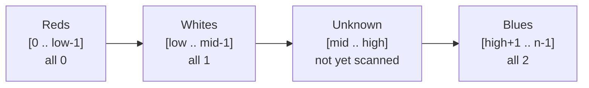
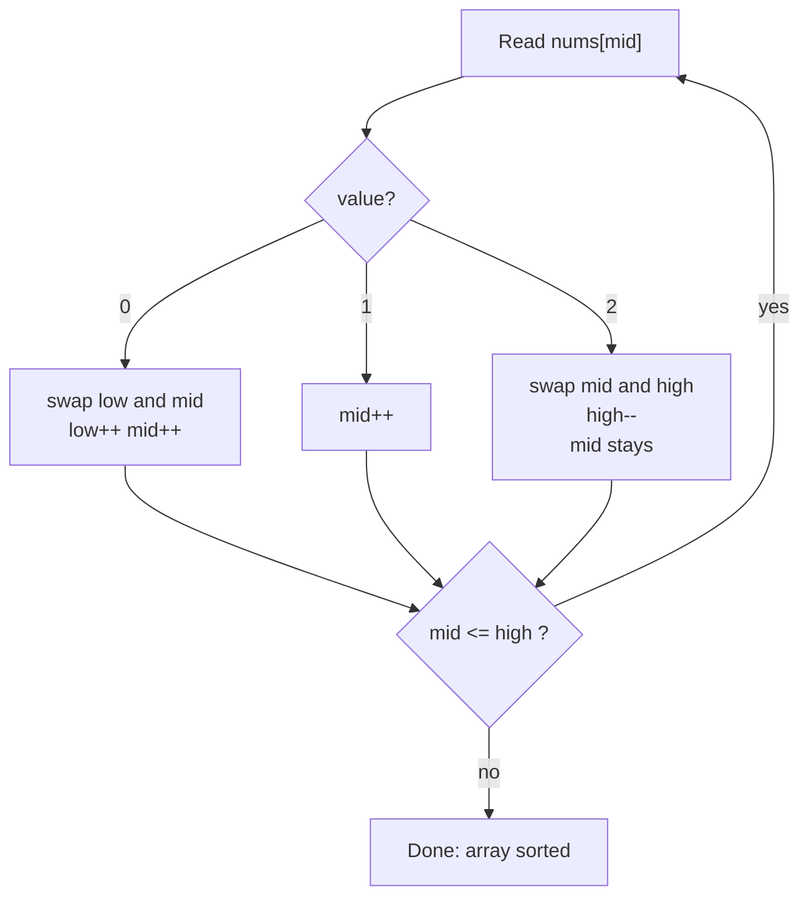

# Sort Colors

| Field | Value |
| --- | --- |
| **Source** | LeetCode #75 |
| **Difficulty** | Medium |
| **Topics** | Two Pointers, Array, Sorting, Dutch National Flag |
| **Link** | https://leetcode.com/problems/sort-colors/ |

## Problem Statement

Given an array `nums` with `n` objects colored red, white, or blue, sort them **in-place** so that objects of the same color are adjacent, with the colors in the order red, white, and blue.

We use the integers `0`, `1`, and `2` to represent the colors red, white, and blue respectively.

You must solve this problem **without using the library's sort function**.

```text
Input:  nums = [2, 0, 2, 1, 1, 0]
Output: [0, 0, 1, 1, 2, 2]

Input:  nums = [2, 0, 1]
Output: [0, 1, 2]
```

Constraints:

- $1 \le n = \texttt{nums.length} \le 300$
- $\texttt{nums}[i] \in \{0, 1, 2\}$

Because the alphabet has only three distinct keys, this is the canonical **Dutch National Flag** problem posed by Edsger Dijkstra. The goal is a single in-place pass with $O(1)$ extra space.

---

## Approach 1 — Counting Sort (Two Pass)

Since values are restricted to $\{0, 1, 2\}$, we can simply **count** how many of each value exist, then **overwrite** the array with that many `0`s, then `1`s, then `2`s.

- **Pass 1:** tally counts `c0`, `c1`, `c2`.
- **Pass 2:** write `c0` zeros, then `c1` ones, then `c2` twos back into `nums`.

This is correct and easy, but it reads the data **twice**. It also conceptually "looks at" the values an extra time. We can do better with a single pass.

```python
# Approach 1: Counting sort (two pass)
def sortColors(nums: list[int]) -> None:
    # Pass 1: count occurrences of each color
    count = [0, 0, 0]
    for x in nums:
        count[x] += 1

    # Pass 2: overwrite the array in order 0, 1, 2
    i = 0
    for color in range(3):          # color = 0, then 1, then 2
        for _ in range(count[color]):
            nums[i] = color
            i += 1
```

```cpp
// Approach 1: Counting sort (two pass)
#include <vector>
using namespace std;

void sortColors(vector<int>& nums) {
    // Pass 1: count occurrences of each color
    int count[3] = {0, 0, 0};
    for (int x : nums) {
        count[x]++;
    }

    // Pass 2: overwrite the array in order 0, 1, 2
    int i = 0;
    for (int color = 0; color < 3; color++) {   // color = 0, then 1, then 2
        for (int k = 0; k < count[color]; k++) {
            nums[i] = color;
            i++;
        }
    }
}
```

**Time** $O(n)$, **Space** $O(1)$, but **two passes** over the data.

---

## Approach 2 — Dutch National Flag (One Pass, Three Pointers)

We maintain **three pointers** that partition the array into four contiguous regions. At every moment the following **invariants** hold:

| Region | Index range | Meaning |
| --- | --- | --- |
| Reds | `[0 .. low-1]` | all `0` (finalized) |
| Whites | `[low .. mid-1]` | all `1` (finalized) |
| Unknown | `[mid .. high]` | not yet examined |
| Blues | `[high+1 .. n-1]` | all `2` (finalized) |

We scan with `mid`. Each step inspects `nums[mid]` and shrinks the unknown region:

1. **`nums[mid] == 0`** — it belongs at the left boundary. Swap `nums[low]` and `nums[mid]`. Both `low` and `mid` advance. (We *can* advance `mid` here because whatever came out of `nums[low]` was already examined — it was a `1` from the whites region, or `low == mid`.)
2. **`nums[mid] == 1`** — already in the correct middle region. Just advance `mid`.
3. **`nums[mid] == 2`** — it belongs at the right boundary. Swap `nums[mid]` and `nums[high]`, then **decrement `high`**. **`mid` does NOT advance.**

The loop continues while `mid <= high`. Once `mid` passes `high`, the unknown region is empty and the array is sorted.

### Why does `mid` NOT advance after swapping with `high`?

When we hit case 3 (`nums[mid] == 2`), we swap it toward the back with `nums[high]`. The element that *comes back* from position `high` is a **previously unexamined** value — it was sitting inside the unknown region `[mid .. high]`. It could be a `0`, `1`, or `2`. Since we have **not yet classified** it, we must re-inspect position `mid` on the next iteration. Advancing `mid` would skip an unprocessed element and could leave a `0` stranded on the wrong side.

Contrast this with case 1 (`nums[mid] == 0`): the element swapped *into* `mid` came from position `low`, which lies in the **whites region** `[low .. mid-1]` (already examined and known to be `1`), or `low == mid` so we swap an element with itself. Either way the incoming value is already known, so it is safe to advance `mid`.

> **Mnemonic:** swapping toward the **`low`** side pulls in *known* data → advance `mid`. Swapping toward the **`high`** side pulls in *unknown* data → hold `mid` still.

```python
# Approach 2: Dutch National Flag (one pass, three pointers)
def sortColors(nums: list[int]) -> None:
    low, mid, high = 0, 0, len(nums) - 1

    # Invariants:
    #   [0 .. low-1]   == 0   (reds, finalized)
    #   [low .. mid-1] == 1   (whites, finalized)
    #   [mid .. high]  == ?   (unknown, still to scan)
    #   [high+1 .. ]   == 2   (blues, finalized)
    while mid <= high:
        if nums[mid] == 0:
            # 0 belongs at the left boundary; incoming value is known -> advance mid
            nums[low], nums[mid] = nums[mid], nums[low]
            low += 1
            mid += 1
        elif nums[mid] == 1:
            # 1 is already in the correct region -> just move on
            mid += 1
        else:  # nums[mid] == 2
            # 2 belongs at the right boundary; incoming value is UNKNOWN -> hold mid
            nums[mid], nums[high] = nums[high], nums[mid]
            high -= 1
```

```cpp
// Approach 2: Dutch National Flag (one pass, three pointers)
#include <vector>
using namespace std;

void sortColors(vector<int>& nums) {
    int low = 0, mid = 0, high = (int)nums.size() - 1;

    // Invariants:
    //   [0 .. low-1]   == 0   (reds, finalized)
    //   [low .. mid-1] == 1   (whites, finalized)
    //   [mid .. high]  == ?   (unknown, still to scan)
    //   [high+1 .. ]   == 2   (blues, finalized)
    while (mid <= high) {
        if (nums[mid] == 0) {
            // 0 belongs at the left boundary; incoming value is known -> advance mid
            swap(nums[low], nums[mid]);
            low++;
            mid++;
        } else if (nums[mid] == 1) {
            // 1 is already in the correct region -> just move on
            mid++;
        } else { // nums[mid] == 2
            // 2 belongs at the right boundary; incoming value is UNKNOWN -> hold mid
            swap(nums[mid], nums[high]);
            high--;
        }
    }
}
```

---

## Iteration Trace (One-Pass on `[2, 0, 2, 1, 1, 0]`)

We start with `low = 0`, `mid = 0`, `high = 5`. Each row shows the pointer values **before** acting on `nums[mid]`, the decision taken, and the array **after** the step.

| Step | low | mid | high | nums[mid] | Action | Array after step |
| --- | --- | --- | --- | --- | --- | --- |
| 0 | 0 | 0 | 5 | 2 | swap(mid,high), high-- | `[0, 0, 2, 1, 1, 2]` |
| 1 | 0 | 0 | 4 | 0 | swap(low,mid), low++, mid++ | `[0, 0, 2, 1, 1, 2]` |
| 2 | 1 | 1 | 4 | 0 | swap(low,mid), low++, mid++ | `[0, 0, 2, 1, 1, 2]` |
| 3 | 2 | 2 | 4 | 2 | swap(mid,high), high-- | `[0, 0, 1, 1, 2, 2]` |
| 4 | 2 | 2 | 3 | 1 | mid++ | `[0, 0, 1, 1, 2, 2]` |
| 5 | 2 | 3 | 3 | 1 | mid++ | `[0, 0, 1, 1, 2, 2]` |
| 6 | 2 | 4 | 3 | — | `mid > high`, stop | `[0, 0, 1, 1, 2, 2]` |

Notice **step 0**: after swapping the `2` to the back, `mid` stays at `0`. On the next step we re-examine the freshly arrived `0`, which proves exactly why `mid` must not advance in case 3. Final result: `[0, 0, 1, 1, 2, 2]`. ✅

The total number of pointer advances is bounded: `mid` and `low` only move right, `high` only moves left, so the loop runs at most $n$ times — confirming the single-pass $O(n)$ bound.

---

## Region Invariant Diagram





As the algorithm runs, the unknown region $[\text{mid} .. \text{high}]$ strictly shrinks each iteration — either `mid` increases or `high` decreases — so the process terminates in at most $n$ steps.

---

## Complexity

| Approach | Time | Space | Passes |
| --- | --- | --- | --- |
| Counting sort | $O(n)$ | $O(1)$ | 2 |
| Dutch National Flag | $O(n)$ | $O(1)$ | 1 |

Both use constant extra space (the three counters / three pointers are $O(1)$). The Dutch National Flag wins by touching each element essentially once, making it the preferred FAANG-interview answer.

---

## Takeaway

- **Dutch National Flag** is the go-to in-place pattern whenever the key space is a small fixed set (here, three colors). It generalizes the partition step of quicksort to three buckets.
- Keep the four invariant regions crisp: reds `[0..low-1]`, whites `[low..mid-1]`, unknown `[mid..high]`, blues `[high+1..]`.
- The subtle rule is the asymmetry of the two swaps: swapping toward `low` brings in an **already-classified** element (safe to advance `mid`), while swapping toward `high` brings in an **unexamined** element (must re-inspect, so `mid` stays).
- The loop condition is `mid <= high`; when `mid` crosses `high` the unknown region is empty and the array is fully sorted in a single pass with $O(1)$ space.
