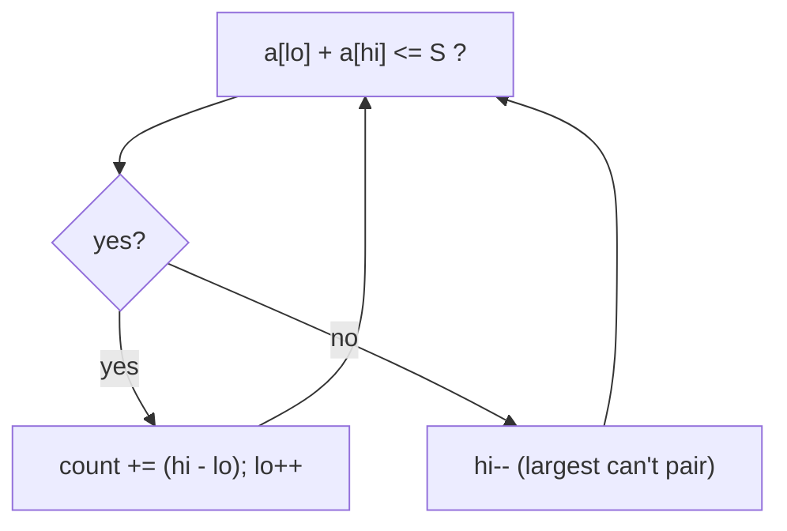

# Two Sets II / Sum Pairing (AtCoder & Two-Pointer Variants)

| Meta | Value |
|------|-------|
| Source | AtCoder-style two-pointer / pairing problems (e.g. ABC "Pairs", Educational DP-adjacent) |
| Difficulty | Medium |
| Topics | Two Pointers, Sorting, Counting, Binary Search |
| Link | https://atcoder.jp/contests/abc153/tasks/abc153_e (pattern reference) |

---

## Representative Problem — Count Pairs With Sum ≤ S
Given an array `a` of `n` numbers and a value `S`, count the number of **unordered pairs**
`(i, j)`, `i < j`, with `a[i] + a[j] ≤ S`. (`n` up to `2·10⁵`, so `O(n²)` is too slow.)

**Example**
```
a = [1, 4, 2, 3], S = 5
Pairs ≤ 5: (1,4),(1,2),(1,3),(2,3) -> 4 pairs
```

---

## Two Pointers After Sorting — O(n log n)

Sort the array. Use `lo = 0`, `hi = n − 1`. For the current largest element `a[hi]`:

- If `a[lo] + a[hi] ≤ S`, then **every** element between `lo` and `hi` also pairs with `a[hi]`
  (they're all ≤ `a[hi]` and ≥ `a[lo]`). That's `hi − lo` valid pairs in one shot. Advance `lo`.
- Otherwise `a[hi]` is too big to pair even with the smallest → decrement `hi`.



```python
def count_pairs_at_most(a, S):
    a.sort()
    lo, hi = 0, len(a) - 1
    count = 0
    while lo < hi:
        if a[lo] + a[hi] <= S:
            count += hi - lo           # all of lo+1..hi pair with lo
            lo += 1
        else:
            hi -= 1
    return count
```

```cpp
long long count_pairs_at_most(vector<int>& a, long long S) {
    sort(a.begin(), a.end());
    int lo = 0, hi = (int)a.size() - 1;
    long long count = 0;
    while (lo < hi) {
        if ((long long)a[lo] + a[hi] <= S) {
            count += hi - lo;          // all of lo+1..hi pair with lo
            lo += 1;
        } else {
            hi -= 1;
        }
    }
    return count;
}
```

### The "count a whole block at once" trick
When `a[lo] + a[hi] ≤ S` with the array sorted, **every** index `k` in `(lo, hi]` satisfies
`a[lo] + a[k] ≤ a[lo] + a[hi] ≤ S`. So instead of checking each, we add `hi − lo` pairs in O(1)
and move `lo` forward — this is what makes it linear after sorting.

---

## Trace — `a = [1, 2, 3, 4]` (sorted), `S = 5`

| lo | hi | a[lo]+a[hi] | ≤ 5? | count += | count | move |
|----|----|-------------|------|----------|-------|------|
| 0 | 3 | 1+4=5 | yes | hi−lo=3 | 3 | lo=1 |
| 1 | 3 | 2+4=6 | no | — | 3 | hi=2 |
| 1 | 2 | 2+3=5 | yes | hi−lo=1 | 4 | lo=2 |
| 2 | 2 | lo==hi stop | | | **4** | |

Total **4** pairs ✓ — matching `(1,4),(1,2),(1,3),(2,3)`.

---

## Alternative — Binary Search per Element — O(n log n)
For each `a[i]`, binary search the largest index `j > i` with `a[j] ≤ S − a[i]`. Sum the counts.
Same complexity, but the two-pointer version has a smaller constant and is simpler.

```python
import bisect
def count_pairs_bs(a, S):
    a.sort()
    count = 0
    for i in range(len(a)):
        # how many j > i with a[j] <= S - a[i]
        hi = bisect.bisect_right(a, S - a[i], i + 1) - 1
        if hi > i:
            count += hi - i
    return count
```

```cpp
long long count_pairs_bs(vector<int>& a, long long S) {
    sort(a.begin(), a.end());
    long long count = 0;
    int n = (int)a.size();
    for (int i = 0; i < n; i++) {
        // how many j > i with a[j] <= S - a[i]
        int hi = (int)(upper_bound(a.begin() + i + 1, a.end(), (long long)(S - a[i])) - a.begin()) - 1;
        if (hi > i)
            count += hi - i;
    }
    return count;
}
```

---

## Related: Two Sets II (AtCoder/CSES counting DP)
A different "two sets" problem asks: in how many ways can `{1..n}` be split into **two subsets
of equal sum**? That's a **subset-sum counting DP**, not two pointers — included here as a
caution that "two sets / pairing" titles can hide different techniques. The pairing/counting
above is the two-pointer flavor; partition-into-equal-sum is DP over
`target = n(n+1)/4` (only feasible when `n(n+1)/2` is even).

---

## Complexity

| Approach | Time | Space |
|----------|------|-------|
| Brute force | O(n²) | O(1) |
| **Two pointers** | **O(n log n)** | O(1) |
| Binary search per element | O(n log n) | O(1) |

---

## Takeaway
Sorting unlocks the **converging two-pointer** counting trick: when the extremes satisfy the
condition, an entire block does too, countable in O(1). "Count pairs with sum ≤/≥/= S" is a
staple of AtCoder/Codeforces — reach for sort + two pointers before anything fancier.
