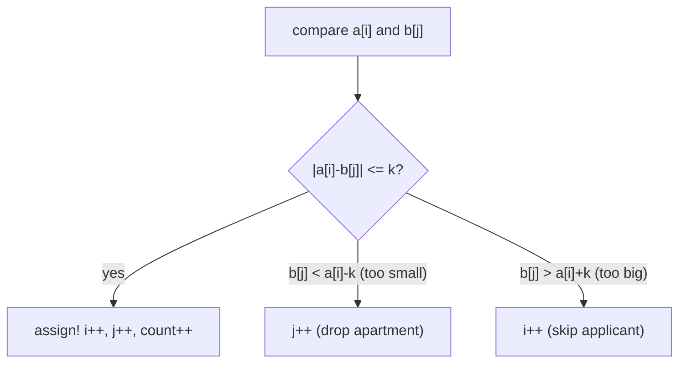

# Apartments (CSES — Greedy Two Pointers)

| Meta | Value |
|------|-------|
| Source | CSES Problem Set — Sorting and Searching |
| Difficulty | Easy–Medium |
| Topics | Two Pointers, Greedy, Sorting |
| Link | https://cses.fi/problemset/task/1084 |

---

## Problem Statement
There are `n` applicants and `m` apartments. Applicant `i` wants an apartment whose size is
within `±k` of their desired size `a[i]`. Each apartment can be given to at most one applicant.
Maximize the number of applicants who get an apartment.

Formally, applicant with desire `a` accepts an apartment of size `b` iff:

$$
|a - b| \le k \quad\Longleftrightarrow\quad a - k \le b \le a + k
$$

**Example**
```
applicants = [60, 45, 80, 60], apartments = [30, 60, 75], k = 5
Output: 2
```

---

## Greedy + Two Pointers

Sort **both** arrays. Then sweep two pointers `i` (applicants) and `j` (apartments). At each
step, compare the smallest remaining applicant with the smallest remaining apartment:

- **Match** (`|a[i] − b[j]| ≤ k`): assign it, advance **both** → one happy applicant.
- **Apartment too small** (`b[j] < a[i] − k`): this apartment is too small for *every* remaining
  (larger) applicant → discard it, advance `j`.
- **Apartment too big** (`b[j] > a[i] + k`): this applicant can't use this or any larger
  apartment → skip the applicant, advance `i`.



```python
def apartments(applicants, apartments_, k):
    applicants.sort()
    apartments_.sort()
    i = j = count = 0
    while i < len(applicants) and j < len(apartments_):
        if abs(applicants[i] - apartments_[j]) <= k:
            count += 1                 # match
            i += 1
            j += 1
        elif apartments_[j] < applicants[i] - k:
            j += 1                     # apartment too small for anyone left
        else:                          # apartment too big for this applicant
            i += 1
    return count
```

```cpp
int apartments(vector<int>& applicants, vector<int>& apartments_, int k) {
    sort(applicants.begin(), applicants.end());
    sort(apartments_.begin(), apartments_.end());
    int i = 0, j = 0, count = 0;
    while (i < (int)applicants.size() && j < (int)apartments_.size()) {
        if (abs(applicants[i] - apartments_[j]) <= k) {
            count += 1;                // match
            i += 1;
            j += 1;
        } else if (apartments_[j] < applicants[i] - k) {
            j += 1;                    // apartment too small for anyone left
        } else {                       // apartment too big for this applicant
            i += 1;
        }
    }
    return count;
}
```

---

## Why the Greedy Is Optimal (Exchange Argument)

Because both arrays are sorted, the smallest applicant should take the **smallest acceptable**
apartment. Suppose an optimal solution gave that applicant a larger apartment instead. We could
**swap** to give them the smallest acceptable one without reducing the count — the larger
apartment is then free for someone who needs it more (or no worse). Repeating this exchange
transforms any optimal solution into the greedy one, proving the greedy is optimal.

The discard rules are forced:
- An apartment smaller than `a[i] − k` is below every remaining applicant's range (they're all
  ≥ `a[i]`), so it can never be used → safe to drop.
- An apartment larger than `a[i] + k` exceeds this applicant's range; since applicants only get
  larger, only future applicants might use it — so we skip the applicant, not the apartment.

---

## Trace — `a = [45, 60, 60, 80]`, `b = [30, 60, 75]`, `k = 5` (both sorted)

| i | j | a[i] | b[j] | relation | action | count |
|---|---|------|------|----------|--------|-------|
| 0 | 0 | 45 | 30 | 30 < 45−5=40 → too small | j++ | 0 |
| 0 | 1 | 45 | 60 | 60 > 45+5=50 → too big | i++ | 0 |
| 1 | 1 | 60 | 60 | \|0\| ≤ 5 → match | i++, j++ | 1 |
| 2 | 2 | 60 | 75 | 75 > 65 → too big | i++ | 1 |
| 3 | 2 | 80 | 75 | \|5\| ≤ 5 → match | i++, j++ | **2** |

Two applicants housed → answer **2** ✓.

---

## Complexity

| Metric | Value |
|--------|-------|
| Time   | O(n log n + m log m) — dominated by sorting |
| Space  | O(1) extra |

The two-pointer sweep itself is O(n + m): each pointer advances monotonically and never resets.

---

## Takeaway
"Match items from two sorted lists under a tolerance" is the classic **greedy two-pointer
matching** pattern. Sort both, sweep once, and discard the element that provably can't be matched
by anything remaining. The same template solves *Boats to Save People* and *Assign Cookies*.
