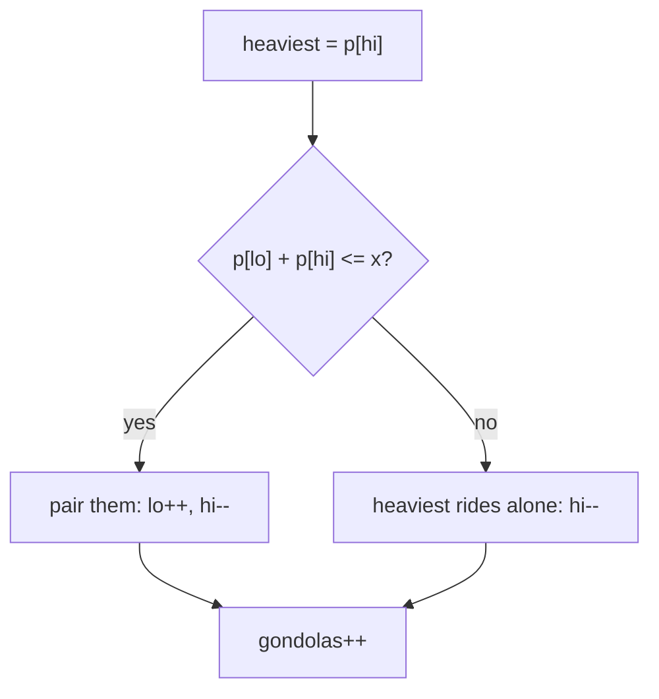

# Ferris Wheel (CSES — Two Pointers Pairing)

| Meta | Value |
|------|-------|
| Source | CSES Problem Set — Sorting and Searching |
| Difficulty | Easy–Medium |
| Topics | Two Pointers, Greedy, Sorting |
| Link | https://cses.fi/problemset/task/1090 |

---

## Problem Statement
There are `n` children with weights `p[i]`. Each gondola holds **at most 2** children and has a
weight limit `x`. Find the **minimum number of gondolas** needed to carry everyone.

**Example**
```
weights = [7, 2, 3, 9], x = 10
Output: 3
   gondola 1: 9 alone (9+2=11 > 10)   ... actually 9 alone
   gondola 2: 7 + 3 = 10
   gondola 3: 2 alone
```

---

## Greedy — Pair the Lightest With the Heaviest

Sort weights. Use two pointers: `lo` (lightest remaining) and `hi` (heaviest remaining). For the
current heaviest child, try to pair them with the lightest child:

- If `p[lo] + p[hi] <= x` → they share a gondola; advance **both** pointers.
- Else the heaviest must ride **alone**; advance only `hi`.

Either way, one gondola is used and `hi` moves inward.



```python
def ferris_wheel(weights, x):
    weights.sort()
    lo, hi = 0, len(weights) - 1
    gondolas = 0
    while lo <= hi:
        if weights[lo] + weights[hi] <= x:
            lo += 1                    # lightest also boards
        hi -= 1                        # heaviest always boards
        gondolas += 1
    return gondolas
```

```cpp
int ferris_wheel(vector<int>& weights, int x) {
    sort(weights.begin(), weights.end());
    int lo = 0, hi = (int)weights.size() - 1;
    int gondolas = 0;
    while (lo <= hi) {
        if (weights[lo] + weights[hi] <= x)
            lo += 1;                   // lightest also boards
        hi -= 1;                       // heaviest always boards
        gondolas += 1;
    }
    return gondolas;
}
```

---

## Why Greedy Is Optimal

Consider the **heaviest** child. They must occupy a gondola no matter what. The best possible
companion is the **lightest** child — if even the lightest can't fit with them, *no one* can, so
the heaviest rides alone. If the lightest *does* fit, pairing them is never worse: it uses one
gondola for two children, the maximum efficiency.

Formally, by an exchange argument: any optimal pairing can be rearranged so the heaviest is
paired with the lightest compatible child without increasing the gondola count. Thus greedy is
optimal.

---

## Trace — `weights = [2, 3, 7, 9]` (sorted), `x = 10`

| lo | hi | p[lo] | p[hi] | sum ≤ 10? | action | gondolas |
|----|----|-------|-------|-----------|--------|----------|
| 0 | 3 | 2 | 9 | 11 > 10 → no | 9 alone; hi=2 | 1 |
| 0 | 2 | 2 | 7 | 9 ≤ 10 → yes | pair; lo=1, hi=1 | 2 |
| 1 | 1 | 3 | 3 | lo==hi: same child | rides alone; hi=0 | 3 |
| 1 | 0 | — | — | lo > hi: stop | | **3** |

Answer **3** gondolas ✓. Note when `lo == hi` (one child left), the loop still counts a gondola
for that single child and terminates.

---

## Complexity

| Metric | Value |
|--------|-------|
| Time   | O(n log n) — sorting dominates |
| Space  | O(1) extra |

The two-pointer pass is O(n): `hi` decreases every iteration, `lo` only increases, so they meet
in at most `n` steps.

---

## Edge Cases
- All children too heavy to pair → each takes a gondola → answer `n`.
- All very light (every pair fits) → answer `⌈n/2⌉`.
- Single child → 1 gondola.

## Takeaway
"Pair items to minimize groups under a capacity limit" → **sort, then greedily match lightest +
heaviest** with converging pointers. This is the same structure as *Boats to Save People*
(LeetCode 881) — recognizing it lets you reuse a 6-line solution.
