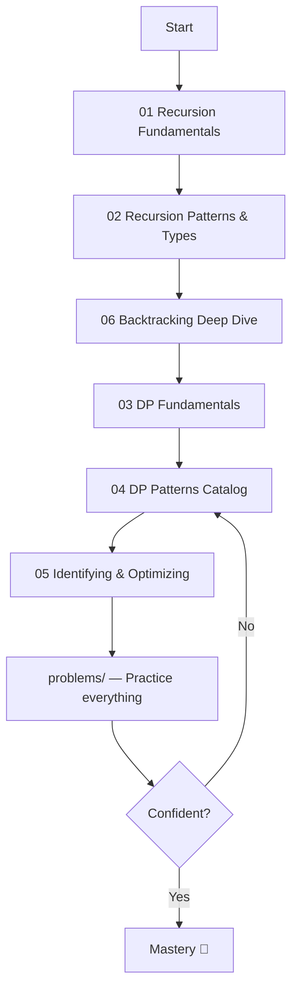
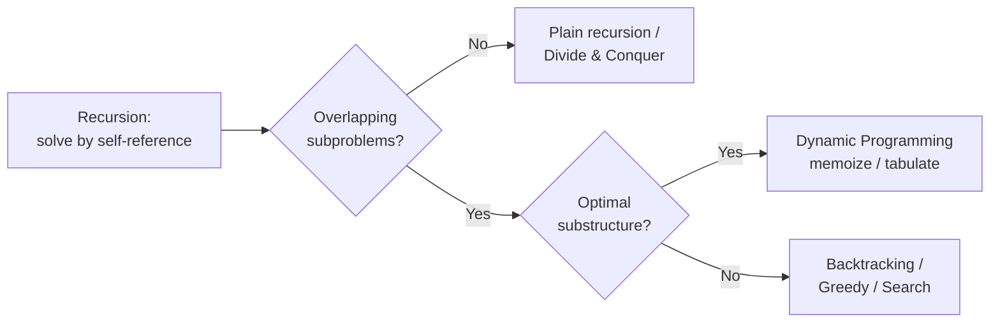

# 🧠 Recursion & Dynamic Programming — Complete End‑to‑End Guide

A deep, practical, diagram‑driven course on **Recursion** and **Dynamic Programming (DP)** — from the absolute basics to advanced competitive‑programming techniques, plus a large categorized **problems** library (LeetCode, Codeforces, and classic problems).

> 💻 **Every concept comes with both Python and C++ code** so you can follow along in either language.

---

## 📚 How to use this guide

Read the guides in order if you are starting fresh. If you already know the basics, jump to the pattern catalogs and the problems folder.

---

## 🗂️ Contents

### Guides (`guide/`)
| # | File | What you learn |
|---|------|----------------|
| 01 | [Recursion Fundamentals](guide/01-recursion-fundamentals.md) | Call stack, base/recursive cases, recurrence, tracing, complexity |
| 02 | [Recursion Patterns & Types](guide/02-recursion-patterns.md) | Linear, binary, tail, tree, backtracking, divide & conquer, mutual |
| 03 | [DP Fundamentals](guide/03-dp-fundamentals.md) | Overlapping subproblems, optimal substructure, memo vs tabulation |
| 04 | [DP Patterns Catalog](guide/04-dp-patterns.md) | 15+ DP patterns with templates and diagrams |
| 05 | [Identifying & Optimizing](guide/05-identifying-and-optimizing.md) | How to spot DP, state design, space optimization, debugging |
| 06 | [Backtracking: Beginner's Guide](guide/06-backtracking.md) | Choose/explore/un-choose, pruning, subsets/permutations/N-Queens — from scratch |

### Problems (`problems/`)
A categorized, ever‑growing list with links, difficulty, pattern tags, and solution approaches.
See [problems/README.md](problems/README.md).

---

## 🧭 The 30‑second mental model

> **Recursion** is *how* you express the solution.
> **Dynamic Programming** is recursion **+ remembering answers** so you never solve the same subproblem twice.

---

## ✅ Learning checklist

- [ ] I can write any recursion by defining its **base case** and **recurrence**.
- [ ] I can draw the **recursion tree** and read off the time complexity.
- [ ] I can recognize **overlapping subproblems** and add **memoization**.
- [ ] I can convert top‑down memoization into **bottom‑up tabulation**.
- [ ] I can **optimize space** (rolling arrays / variables).
- [ ] I can identify the correct **DP pattern** for a new problem.
- [ ] I have solved at least 3 problems from each pattern in `problems/`.

Happy solving! 🚀
