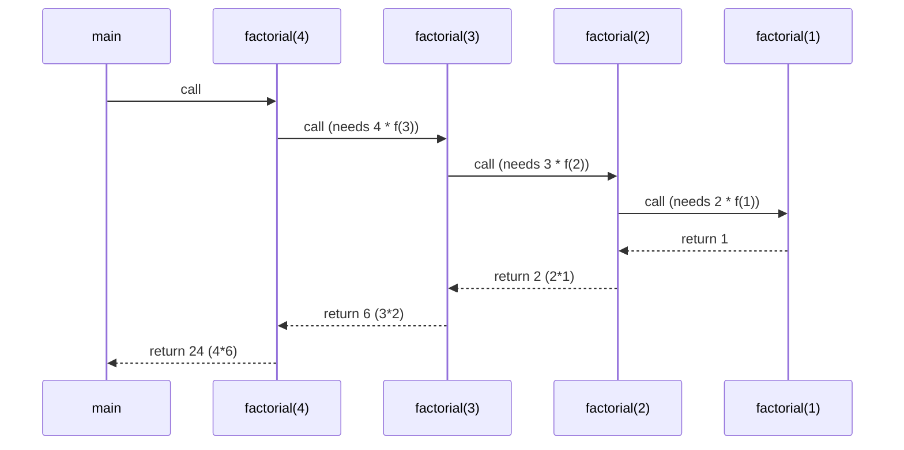
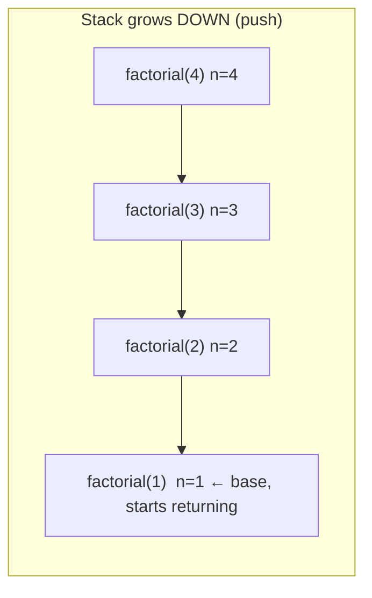
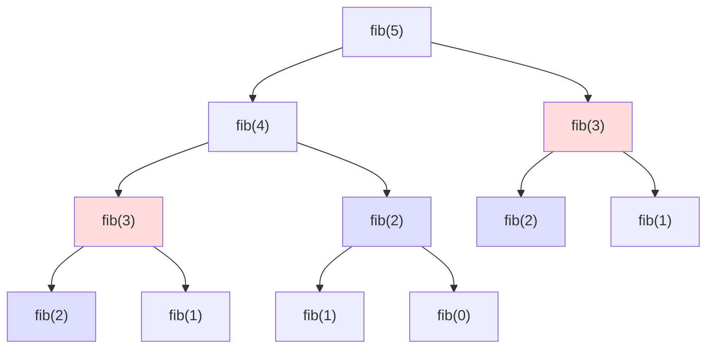
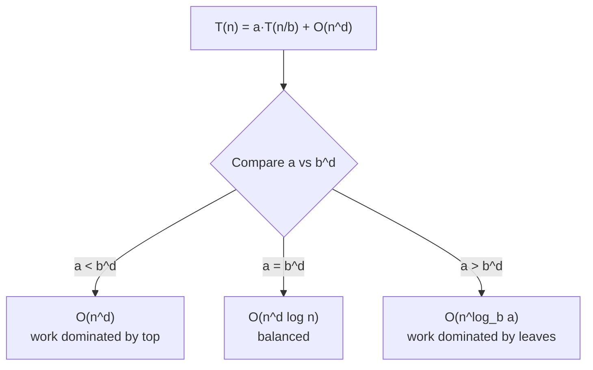
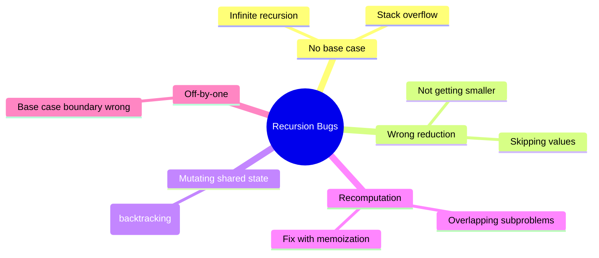

# 01 — Recursion Fundamentals

> **Recursion** is a technique where a function solves a problem by calling **itself** on a smaller version of the same problem, until it reaches a case simple enough to answer directly.

---

## 1. The two mandatory ingredients

Every correct recursion has exactly two parts:

1. **Base case(s)** — the smallest input(s) you can answer *without* recursing. This stops the recursion.
2. **Recursive case** — you reduce the problem to a **smaller** subproblem and combine its result.

```mermaid
flowchart TD
    A[Call f(n)] --> B{Is n a base case?}
    B -- Yes --> C[Return base value directly]
    B -- No --> D[Reduce to smaller problem f(n-1)]
    D --> E[Combine result and return]
    D -.recurse.-> A
```

> ⚠️ **The #1 cause of `StackOverflow`/infinite recursion**: a missing base case, or a recursive call that does **not** move toward the base case.

### Minimal template

**Python**
```python
def solve(problem):
    # 1. Base case: smallest solvable instance
    if is_base_case(problem):
        return base_answer(problem)

    # 2. Recursive case: shrink the problem
    smaller = reduce(problem)
    sub = solve(smaller)

    # 3. Combine
    return combine(problem, sub)
```

**C++**
```cpp
Return solve(Problem problem) {
    // 1. Base case: smallest solvable instance
    if (isBaseCase(problem))
        return baseAnswer(problem);

    // 2. Recursive case: shrink the problem
    Problem smaller = reduce(problem);
    Return sub = solve(smaller);

    // 3. Combine
    return combine(problem, sub);
}
```

---

## 2. The call stack — what *actually* happens

Each function call gets a **stack frame** holding its local variables and the position to return to. Recursion pushes frames going **down**, and pops them while **returning up**.

Consider `factorial(4)`:

**Python**
```python
def factorial(n):
    if n <= 1:          # base case
        return 1
    return n * factorial(n - 1)   # recursive case
```

**C++**
```cpp
long long factorial(int n) {
    if (n <= 1) return 1;              // base case
    return (long long)n * factorial(n - 1);  // recursive case
}
```



### Stack growth visualization



> 💡 **Key insight:** Work *before* the recursive call happens on the way **down**; work *after* the recursive call happens on the way **up**.

### 🔢 Iteration trace — `factorial(4)` frame by frame

The table makes the **two phases** explicit: frames are *pushed* going down (no value yet), then *resolved* going up.

| Step | Action | Active frame | Stack (top → bottom) | Returns |
|---|---|---|---|---|
| 1 | call | `factorial(4)` | `[4]` | — (waits for `f(3)`) |
| 2 | call | `factorial(3)` | `[4,3]` | — (waits for `f(2)`) |
| 3 | call | `factorial(2)` | `[4,3,2]` | — (waits for `f(1)`) |
| 4 | call | `factorial(1)` | `[4,3,2,1]` | **base** → `1` |
| 5 | return | `factorial(2)` | `[4,3,2]` | `2 * 1 = 2` |
| 6 | return | `factorial(3)` | `[4,3]` | `3 * 2 = 6` |
| 7 | return | `factorial(4)` | `[4]` | `4 * 6 = 24` |

> Steps 1–4 are the **descent** (push). Step 4 hits the base case. Steps 5–7 are the **ascent** (pop + multiply). Max stack depth = 4 = the input — hence $O(n)$ space.

---

## 3. Recurrence relations — the math of recursion

A **recurrence relation** expresses a function's value in terms of smaller inputs. It is the bridge between recursion and DP.

| Problem | Recurrence | Base case |
|---|---|---|
| Factorial | $f(n) = n \cdot f(n-1)$ | $f(0)=f(1)=1$ |
| Fibonacci | $F(n) = F(n-1) + F(n-2)$ | $F(0)=0,\ F(1)=1$ |
| Sum 1..n | $S(n) = n + S(n-1)$ | $S(0)=0$ |
| Power | $p(b,n) = b \cdot p(b,n-1)$ | $p(b,0)=1$ |

Write the recurrence **first**. Once you have it, both the recursive code and the DP solution follow almost mechanically.

#### 📐 Math — closing the simplest recurrences
"Solving" a recurrence means finding a **closed form** $f(n)$ that needs no recursion.

**Arithmetic-style** (constant new work per level): $T(n)=T(n-1)+c \Rightarrow T(n)=T(0)+c\,n=\Theta(n)$ — factorial, linear sum, array traversal.

**Linear-work** (work grows with `n`): $T(n)=T(n-1)+c\,n \Rightarrow c\sum_{k=1}^{n}k = c\,\frac{n(n+1)}{2}=\Theta(n^2)$, the **triangular number**.

| Closed form | Why it holds |
|---|---|
| $\displaystyle\sum_{k=1}^{n} k = \frac{n(n+1)}{2}$ | Pair $1{+}n,\,2{+}(n{-}1),\dots$ → $n/2$ pairs each summing to $n{+}1$. |
| $\displaystyle\sum_{k=1}^{n} k^2 = \frac{n(n+1)(2n+1)}{6}$ | Appears when work per level is $\Theta(k^2)$. |
| $\displaystyle\sum_{k=0}^{n} 2^k = 2^{n+1}-1$ | Geometric — appears in `hanoi`, subset trees. |

---

## 4. The recursion tree (and why naive recursion can explode)

Naive Fibonacci:

**Python**
```python
def fib(n):
    if n < 2:
        return n
    return fib(n - 1) + fib(n - 2)
```

**C++**
```cpp
long long fib(int n) {
    if (n < 2) return n;
    return fib(n - 1) + fib(n - 2);
}
```



Notice `fib(3)` and `fib(2)` are computed **multiple times** (highlighted). This is the **overlapping subproblems** signal that screams *"use Dynamic Programming!"* — covered in [guide 03](03-dp-fundamentals.md).

- Number of calls for `fib(n)` ≈ $O(\varphi^n)$ — **exponential**.
- With memoization it drops to $O(n)$ — **linear**.

### 🔢 Iteration trace — naive vs memoized call explosion

Counting the **calls** each `fib(n)` makes shows exactly why naive recursion is unusable while memoization is linear. Let $C(n)$ = number of calls in the naive tree: $C(n)=C(n-1)+C(n-2)+1$.

| `n` | `fib(n)` | Naive calls $C(n)$ | Memoized calls | Speed‑up |
|---|---|---|---|---|
| 5 | 5 | 15 | 9 | 1.7× |
| 10 | 55 | 177 | 19 | 9× |
| 20 | 6 765 | 21 891 | 39 | 561× |
| 30 | 832 040 | 2 692 537 | 59 | 45 636× |
| 40 | 102 334 155 | 331 160 281 | 79 | 4.2 million× |

> The naive column roughly **multiplies by $\varphi\approx1.618$ per step** (each row ≈ 1.6× the previous), while the memoized column grows by a constant $2$ per step ($2n-1$ calls). That is the visceral difference between $O(\varphi^n)$ and $O(n)$.

#### 📐 Math — why $\varphi^n$? the characteristic equation
The *equal* branching recurrence $T(n)=2T(n-1)+c$ solves to $c(2^{n+1}-1)=\Theta(2^n)$ via the geometric sum $\sum_{k=0}^{n}2^k=2^{n+1}-1$ (also Hanoi's exact $2^n-1$ moves). But Fibonacci branches *unequally*. Guess $F(n)=x^n$ in $F(n)=F(n-1)+F(n-2)$:
$$x^2=x+1\;\Rightarrow\;x^2-x-1=0\;\Rightarrow\;\varphi=\tfrac{1+\sqrt5}{2}\approx1.618,\quad \psi=\tfrac{1-\sqrt5}{2}\approx-0.618.$$
The blend $F(n)=A\varphi^n+B\psi^n$ with $F(0)=0,\,F(1)=1$ gives **Binet's formula** $F(n)=\dfrac{\varphi^n-\psi^n}{\sqrt5}$. Since $|\psi|<1$, $F(n)\approx\varphi^n/\sqrt5$ — so naive `fib` is $O(\varphi^n)$, not $O(2^n)$: the branching factor is the golden ratio.

---

## 5. Time & space complexity of recursion

Two reliable methods:

### A) Count nodes in the recursion tree
Total work = (number of calls) × (work per call, excluding sub‑calls).

### B) The recurrence for running time
Translate the algorithm into a time recurrence, then solve it.

| Recurrence | Solution | Example |
|---|---|---|
| $T(n)=T(n-1)+O(1)$ | $O(n)$ | factorial, linear sum |
| $T(n)=T(n-1)+O(n)$ | $O(n^2)$ | naive selection-ish |
| $T(n)=2T(n-1)+O(1)$ | $O(2^n)$ | naive Fibonacci, subsets |
| $T(n)=2T(n/2)+O(n)$ | $O(n\log n)$ | merge sort |
| $T(n)=2T(n/2)+O(1)$ | $O(n)$ | tree traversal |
| $T(n)=T(n/2)+O(1)$ | $O(\log n)$ | binary search |

### The Master Theorem (for divide & conquer)

For $T(n) = a\,T(n/b) + O(n^d)$:

$$
T(n) =
\begin{cases}
O(n^d) & \text{if } a < b^d \\
O(n^d \log n) & \text{if } a = b^d \\
O(n^{\log_b a}) & \text{if } a > b^d
\end{cases}
$$



### Space complexity
Recursion uses stack space proportional to the **maximum depth** of the recursion (the longest root‑to‑leaf path), **not** the total number of calls.

- `factorial(n)` → depth $n$ → $O(n)$ stack.
- Balanced divide & conquer → depth $\log n$ → $O(\log n)$ stack.

#### 📐 Math — recursion-tree derivation of the Master Theorem
For $T(n)=a\,T(n/b)+f(n)$: level $k$ has $a^k$ nodes of size $n/b^k$, the tree height is $\log_b n$, and the **leaf count** is $a^{\log_b n}=n^{\log_b a}$. Summing work per level,
$$T(n)=\sum_{k=0}^{\log_b n} a^k\,f\!\left(\tfrac{n}{b^k}\right),$$
and comparing root work $\Theta(n^d)$ against leaf work $\Theta(n^{\log_b a})$ — i.e. $a$ vs $b^d$ — yields the three cases above.

| Algorithm | $a,b,d$ | Compare | Complexity |
|---|---|---|---|
| Merge sort | $a{=}2,b{=}2,d{=}1$ | $2 = 2^1$ | $\Theta(n\log n)$ |
| Binary search | $a{=}1,b{=}2,d{=}0$ | $1 = 2^0$ | $\Theta(\log n)$ |
| Karatsuba | $a{=}3,b{=}2,d{=}1$ | $3 > 2$ | $\Theta(n^{\log_2 3}){\approx}\Theta(n^{1.585})$ |
| Strassen | $a{=}7,b{=}2,d{=}2$ | $7 > 4$ | $\Theta(n^{\log_2 7}){\approx}\Theta(n^{2.807})$ |

For uneven splits the Master Theorem fails; **Akra–Bazzi** finds the unique $p$ with $\sum_i a_i/b_i^{\,p}=1$, then $T(n)=\Theta\!\big(n^p(1+\int_1^n f(u)/u^{p+1}\,du)\big)$, reducing to $p=\log_b a$ for a single term.

---

## 6. Tracing recursion by hand (do this until it's automatic)

`power(2, 3)`:

**Python**
```python
def power(b, n):
    if n == 0:
        return 1
    return b * power(b, n - 1)
```

**C++**
```cpp
long long power(int b, int n) {
    if (n == 0) return 1;
    return (long long)b * power(b, n - 1);
}
```

```
power(2,3)
= 2 * power(2,2)
        = 2 * power(2,1)
                = 2 * power(2,0)
                        = 1            ← base case
                = 2 * 1 = 2
        = 2 * 2 = 4
= 2 * 4 = 8
```

> 🧪 **Practice habit:** For any new recursion, hand‑trace a small input and draw the tree before trusting the code.

---

## 7. Recursion vs Iteration

| Aspect | Recursion | Iteration |
|---|---|---|
| Readability | Often cleaner for trees/divide‑and‑conquer | Cleaner for simple loops |
| Memory | Uses call stack ($O(\text{depth})$) | Usually $O(1)$ extra |
| Risk | Stack overflow on deep input | No stack risk |
| Conversion | Any recursion → iteration with explicit stack | — |

Every recursion can be rewritten iteratively (sometimes using an explicit stack). Recursion trades a little performance for a lot of clarity.

---

## 8. Common pitfalls & how to avoid them



- **Always** verify the recursive call moves toward the base case.
- For backtracking, **undo** any state changes after the recursive call (see [guide 02](02-recursion-patterns.md)).
- If the recursion tree repeats subproblems → memoize (see [guide 03](03-dp-fundamentals.md)).

---

## 9. Quick self‑test

1. Write `sumDigits(n)` recursively. Base case? Recurrence?
2. What is the stack depth of `fib(10)` (naive)? What is its call count roughly?
3. Convert `factorial` to an iterative version.
4. For $T(n) = 2T(n/2) + O(n)$, what is the complexity and which classic algorithm matches it?

<details>
<summary>Answers</summary>

1. `sumDigits(n) = n%10 + sumDigits(n//10)`, base `n == 0 → 0`.
2. Depth = 10 (the `fib(n-1)` chain). Call count ≈ $O(\varphi^{10}) \approx 177$.
3. `r=1; for i in 2..n: r*=i; return r`.
4. $O(n\log n)$ — merge sort.

</details>

---

**Next:** [02 — Recursion Patterns & Types →](02-recursion-patterns.md)
