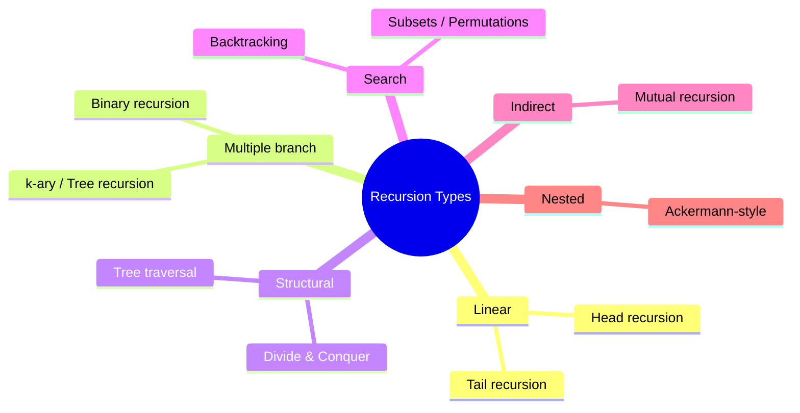
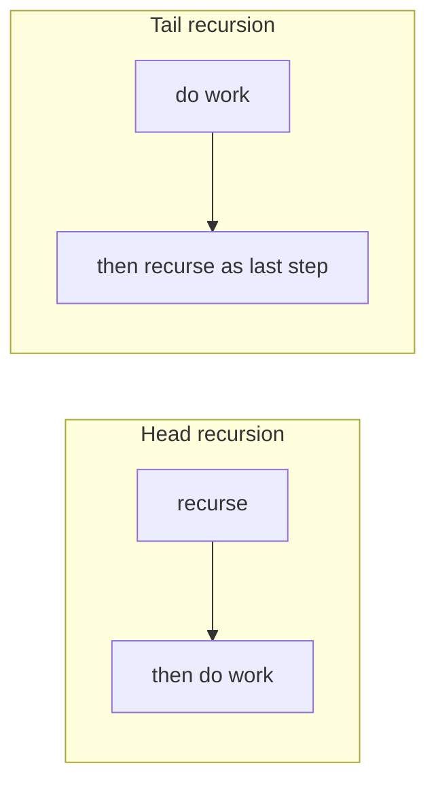
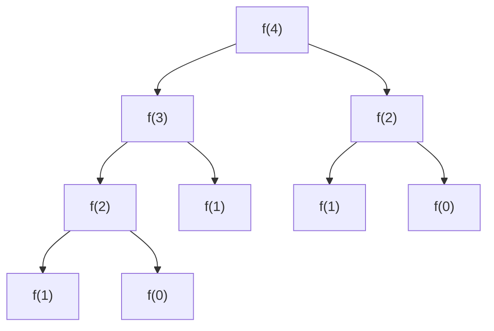
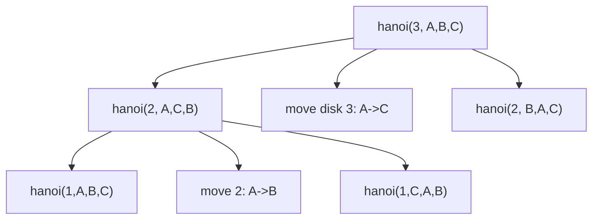
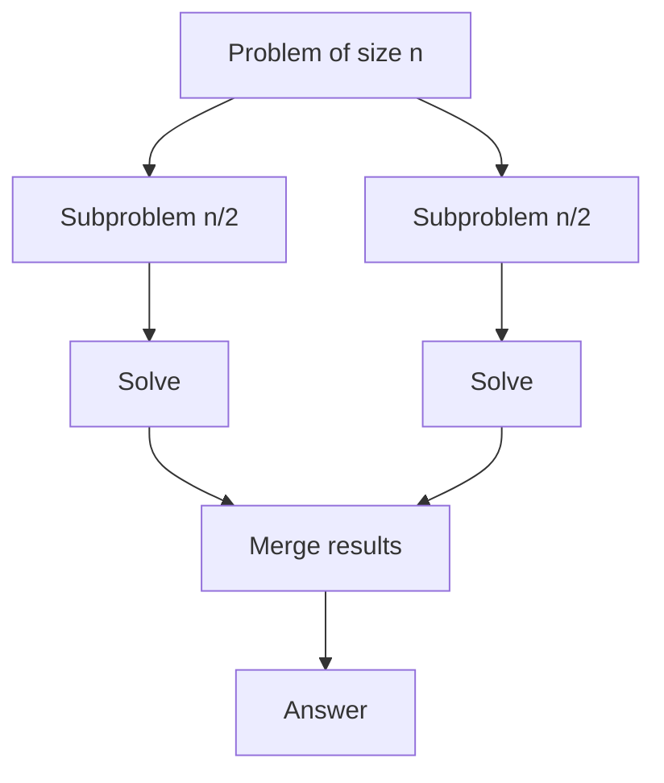
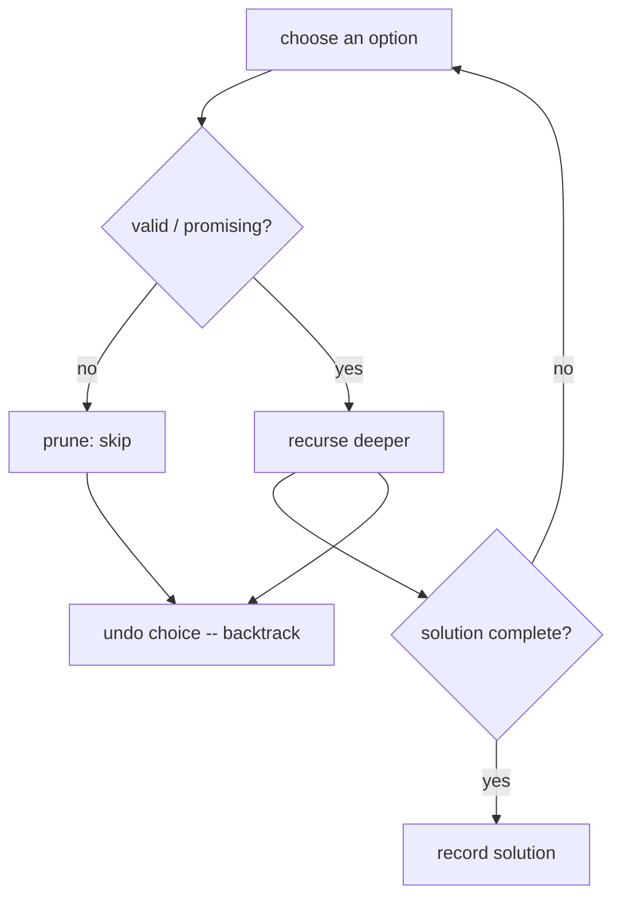
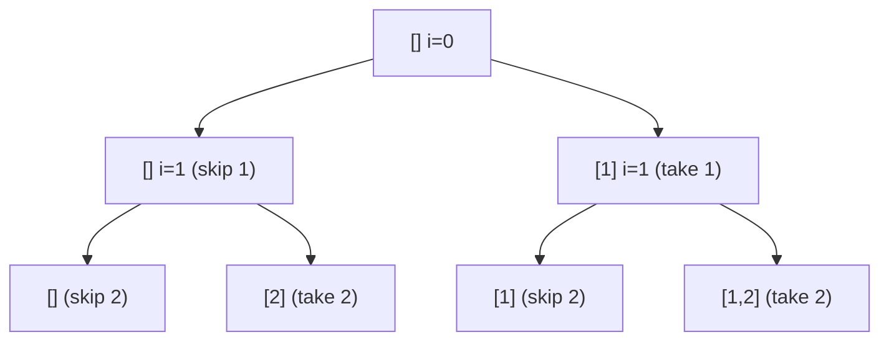
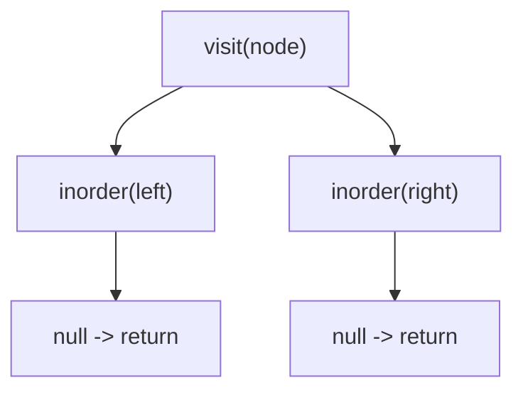
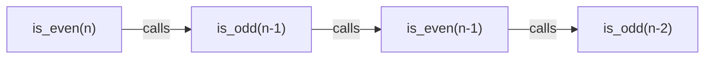
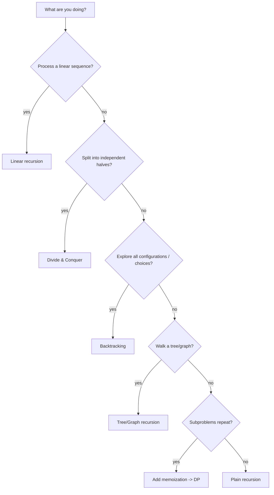

# 02 — Recursion Patterns & Types

Recursion comes in recognizable shapes. Knowing the shape tells you the complexity, the risks, and the typical use cases. This guide catalogs every major pattern with diagrams and runnable templates.



---

## 1. Linear recursion (one call per step)

The function makes **at most one** recursive call. Depth grows linearly.

### Head recursion — work happens *after* the call (on the way up)

**Python**
```python
def print_ascending(n):
    if n == 0:
        return
    print_ascending(n - 1)   # recurse first
    print(n)                 # then act  ->  prints 1,2,3,...,n
```

**C++**
```cpp
void printAscending(int n) {
    if (n == 0) return;
    printAscending(n - 1);   // recurse first
    cout << n << "\n";        // then act -> prints 1,2,...,n
}
```

### Tail recursion — recursive call is the **last** action

**Python**
```python
def print_descending(n):
    if n == 0:
        return
    print(n)                 # act first
    print_descending(n - 1)  # tail call  ->  prints n,n-1,...,1
```

**C++**
```cpp
void printDescending(int n) {
    if (n == 0) return;
    cout << n << "\n";        // act first
    printDescending(n - 1);  // tail call -> prints n,n-1,...,1
}
```



> **Tail‑call optimization (TCO):** Some languages (Scheme, Scala, some C++ compilers) reuse the same stack frame for tail calls, turning recursion into a loop ($O(1)$ stack). **Python and Java do *not* do TCO** — deep tail recursion still overflows.

#### 📐 Math & cost
One call per level with $\Theta(1)$ extra work telescopes into a linear sum:
$$T(n) = T(n-1) + \Theta(1) = \sum_{k=1}^{n}\Theta(1) = \Theta(n).$$
Head and tail recursion have **identical** time cost ($\Theta(n)$); they differ only in *when* work runs (on the way up vs down) and whether TCO collapses the stack from $O(n)$ to $O(1)$. If each level instead did $\Theta(n)$ work (e.g. concatenating a list), the cost becomes $T(n)=T(n-1)+\Theta(n)=\Theta(n^2)$ via the triangular-number identity $\sum_{k=1}^{n} k=\tfrac{n(n+1)}{2}$.

---

## 2. Binary & tree (multiple) recursion

Two or more recursive calls per invocation. Recursion tree **branches** → often exponential unless memoized or the branches shrink fast.

**Python**
```python
def fib(n):
    if n < 2:
        return n
    return fib(n - 1) + fib(n - 2)   # two calls => binary recursion
```

**C++**
```cpp
long long fib(int n) {
    if (n < 2) return n;
    return fib(n - 1) + fib(n - 2);  // two calls => binary recursion
}
```



Use cases: tree problems, generating combinations, naive Fibonacci, Tower of Hanoi.

#### 📐 Math — why naive Fibonacci is $O(\varphi^n)$, not $O(2^n)$
Guess $F(n)=x^n$ in $F(n)=F(n-1)+F(n-2)$ to get the **characteristic equation**
$$x^2 = x + 1 \;\Rightarrow\; x=\varphi=\tfrac{1+\sqrt5}{2}\approx 1.618 \quad\text{or}\quad \psi=\tfrac{1-\sqrt5}{2}\approx -0.618.$$
The general solution is $F(n)=A\varphi^n+B\psi^n$; fixing $F(0)=0,F(1)=1$ yields **Binet's formula** $F(n)=\dfrac{\varphi^n-\psi^n}{\sqrt5}$. Because $|\psi|<1$, $F(n)\approx\varphi^n/\sqrt5$, and the naive tree makes $\approx 2F(n+1)-1=\Theta(\varphi^n)$ calls — the branching factor is the **golden ratio**, not 2. Memoizing collapses this to $\Theta(n)$.

### Tower of Hanoi (classic binary recursion)

**Python**
```python
def hanoi(n, src, aux, dst):
    if n == 0:
        return
    hanoi(n - 1, src, dst, aux)        # move top n-1 to aux
    print(f"Move disk {n}: {src} -> {dst}")
    hanoi(n - 1, aux, src, dst)        # move n-1 from aux to dst
```

**C++**
```cpp
void hanoi(int n, char src, char aux, char dst) {
    if (n == 0) return;
    hanoi(n - 1, src, dst, aux);        // move top n-1 to aux
    cout << "Move disk " << n << ": " << src << " -> " << dst << "\n";
    hanoi(n - 1, aux, src, dst);        // move n-1 from aux to dst
}
```



- Moves required: $2^n - 1$. Time $O(2^n)$, stack depth $O(n)$.

#### 📐 Math — proving the $2^n-1$ move count
Moving $n$ disks = move the top $n-1$ aside, move the big disk, move the $n-1$ back: $M(n)=2M(n-1)+1,\ M(0)=0$. Unrolling the recurrence gives a geometric series:
$$M(n)=2M(n-1)+1=2^2M(n-2)+2+1=\dots=\sum_{k=0}^{n-1}2^k = 2^n-1.$$
Induction confirms it: $M(n)=2(2^{n-1}-1)+1=2^n-1$. The recursion tree is a *perfect* binary tree of height $n$, so time is $\Theta(2^n)$ while only $O(n)$ frames are live at once.

#### 🔢 Iteration trace — `hanoi(3, A, B, C)` move by move

Reading the printed moves in order shows the $2^3-1 = 7$ moves, and how the recursion interleaves the two halves around the middle "big disk" move (move 4).

| # | Move | From → To | Produced by | Disk on top of recursion |
|---|---|---|---|---|
| 1 | disk 1 | A → C | `hanoi(1,A,B,C)` | bottom of left subtree |
| 2 | disk 2 | A → B | `hanoi(2,A,C,B)` | — |
| 3 | disk 1 | C → B | `hanoi(1,C,A,B)` | left subtree done (3 moves) |
| 4 | **disk 3** | **A → C** | root call | the single biggest disk |
| 5 | disk 1 | B → A | `hanoi(1,B,C,A)` | right subtree begins |
| 6 | disk 2 | B → C | `hanoi(2,B,A,C)` | — |
| 7 | disk 1 | A → C | `hanoi(1,A,B,C)` | right subtree done (3 moves) |

> Pattern: **3 moves** (left subtree) **+ 1 move** (big disk) **+ 3 moves** (right subtree) $= 7 = 2^3-1$, mirroring $M(3)=2M(2)+1$. Disk 1 (the smallest) moves on every **odd** step — exactly half the moves.

---

## 3. Divide & Conquer

Split the problem into **independent** subproblems, solve each, then **merge**. The subproblems do **not** overlap (that's what separates D&C from DP).



### Merge sort

**Python**
```python
def merge_sort(a):
    if len(a) <= 1:
        return a
    mid = len(a) // 2
    left  = merge_sort(a[:mid])     # divide
    right = merge_sort(a[mid:])     # divide
    return merge(left, right)       # conquer / combine

def merge(l, r):
    res, i, j = [], 0, 0
    while i < len(l) and j < len(r):
        if l[i] <= r[j]:
            res.append(l[i]); i += 1
        else:
            res.append(r[j]); j += 1
    res.extend(l[i:]); res.extend(r[j:])
    return res
```

**C++**
```cpp
vector<int> merge(const vector<int>& l, const vector<int>& r) {
    vector<int> res;
    size_t i = 0, j = 0;
    while (i < l.size() && j < r.size())
        res.push_back(l[i] <= r[j] ? l[i++] : r[j++]);
    while (i < l.size()) res.push_back(l[i++]);
    while (j < r.size()) res.push_back(r[j++]);
    return res;
}

vector<int> mergeSort(vector<int> a) {
    if (a.size() <= 1) return a;
    size_t mid = a.size() / 2;
    vector<int> left  = mergeSort({a.begin(), a.begin() + mid});  // divide
    vector<int> right = mergeSort({a.begin() + mid, a.end()});    // divide
    return merge(left, right);                                    // combine
}
```

#### 🔢 Iteration trace — `merge_sort([5,2,4,1,3])`

Divide‑and‑conquer has two visible phases: **splitting down** to singletons, then **merging up** in sorted order. Indentation = recursion depth.

```
DIVIDE (going down)                    MERGE (coming up)
[5,2,4,1,3]
├─ [5,2]                               merge([2,5],[1,3,4]) -> [1,2,3,4,5]
│  ├─ [5]            ← base
│  └─ [2]            ← base            merge([5],[2])       -> [2,5]
└─ [4,1,3]                             merge([4],[1,3])     -> [1,3,4]
   ├─ [4]           ← base
   └─ [1,3]                            merge([1],[3])       -> [1,3]
      ├─ [1]        ← base
      └─ [3]        ← base
```

The `merge([2,5], [1,3,4])` step itself is an iteration over two pointers `i, j`:

| Step | `l[i]` | `r[j]` | Compare | Append | Result so far |
|---|---|---|---|---|---|
| 1 | 2 | 1 | 2 > 1 | `1` (from r) | `[1]` |
| 2 | 2 | 3 | 2 ≤ 3 | `2` (from l) | `[1,2]` |
| 3 | 5 | 3 | 5 > 3 | `3` (from r) | `[1,2,3]` |
| 4 | 5 | 4 | 5 > 4 | `4` (from r) | `[1,2,3,4]` |
| 5 | 5 | — | r empty | `5` (drain l) | `[1,2,3,4,5]` |

> Each level merges a total of $n$ elements, and there are $\log_2 n$ levels → the classic $O(n\log n)$.

| Algorithm | Recurrence | Complexity |
|---|---|---|
| Binary search | $T(n)=T(n/2)+O(1)$ | $O(\log n)$ |
| Merge sort | $T(n)=2T(n/2)+O(n)$ | $O(n\log n)$ |
| Quick sort (avg) | $T(n)=2T(n/2)+O(n)$ | $O(n\log n)$ |
| Karatsuba mult. | $T(n)=3T(n/2)+O(n)$ | $O(n^{1.585})$ |

#### 📐 Math — the Master Theorem in action
For $T(n)=a\,T(n/b)+\Theta(n^d)$, the recursion tree has $a^k$ nodes of size $n/b^k$ at level $k$, so the leaf count is $a^{\log_b n}=n^{\log_b a}$. Comparing root work $n^d$ to leaf work $n^{\log_b a}$ gives three regimes:
$$T(n)=\begin{cases}\Theta(n^d) & a<b^d\ \text{(root-heavy)}\\ \Theta(n^d\log n) & a=b^d\ \text{(balanced)}\\ \Theta(n^{\log_b a}) & a>b^d\ \text{(leaf-heavy)}\end{cases}$$
- **Merge sort** $a{=}2,b{=}2,d{=}1$: $2=2^1\Rightarrow\Theta(n\log n)$.
- **Karatsuba** replaces 4 sub-multiplies with **3** ($ac,\,bd,\,(a{+}b)(c{+}d)$), so $a$ falls from 4 to 3, dropping the exponent from $\log_2 4=2$ to $\log_2 3\approx 1.585$.
- **Strassen** uses $7$ size-$n/2$ multiplies → $\Theta(n^{\log_2 7})=\Theta(n^{2.807})$.

---

## 4. Backtracking — recursion that explores & undoes

> 📘 **This is a big topic with its own dedicated, beginner-friendly walkthrough:** see [06 — Backtracking: A Complete Beginner's Guide](06-backtracking.md). The summary below is the quick reference.

Backtracking builds a solution **incrementally**, abandons a path the moment it can't lead to a valid solution ("prune"), and **undoes** the last choice to try alternatives.



### Universal backtracking template

**Python**
```python
def backtrack(state, choices, result):
    if is_goal(state):
        result.append(snapshot(state))
        return
    for choice in choices:
        if not is_valid(state, choice):
            continue
        make(state, choice)          # 1. choose
        backtrack(state, choices, result)   # 2. explore
        undo(state, choice)          # 3. un-choose (BACKTRACK)
```

**C++**
```cpp
void backtrack(State& state, vector<Choice>& choices, vector<Snapshot>& result) {
    if (isGoal(state)) {
        result.push_back(snapshot(state));
        return;
    }
    for (auto& choice : choices) {
        if (!isValid(state, choice)) continue;
        make(state, choice);                 // 1. choose
        backtrack(state, choices, result);   // 2. explore
        undo(state, choice);                 // 3. un-choose (BACKTRACK)
    }
}
```

### Example — generate all subsets (the power set)

**Python**
```python
def subsets(nums):
    res, path = [], []
    def dfs(i):
        if i == len(nums):
            res.append(path[:])      # snapshot
            return
        # choice 1: exclude nums[i]
        dfs(i + 1)
        # choice 2: include nums[i]
        path.append(nums[i])
        dfs(i + 1)
        path.pop()                   # backtrack
    dfs(0)
    return res
```

**C++**
```cpp
void dfs(int i, vector<int>& nums, vector<int>& path, vector<vector<int>>& res) {
    if (i == (int)nums.size()) {
        res.push_back(path);         // snapshot (copied automatically)
        return;
    }
    dfs(i + 1, nums, path, res);     // choice 1: exclude nums[i]
    path.push_back(nums[i]);         // choice 2: include nums[i]
    dfs(i + 1, nums, path, res);
    path.pop_back();                 // backtrack
}

vector<vector<int>> subsets(vector<int>& nums) {
    vector<vector<int>> res; vector<int> path;
    dfs(0, nums, path, res);
    return res;
}
```



### The "subset/permutation/combination" family
| Goal | Branching | Count | Complexity |
|---|---|---|---|
| Subsets | take / skip each | $2^n$ | $O(2^n \cdot n)$ |
| Permutations | pick each unused | $n!$ | $O(n! \cdot n)$ |
| Combinations $\binom{n}{k}$ | pick / skip with limit | $\binom{n}{k}$ | output‑sensitive |
| N‑Queens | place per row + prune | ≪ $n^n$ | strong pruning |

> 🔑 **Backtracking = DFS + state restoration.** The `undo` step is what makes it backtracking instead of plain recursion.

#### 📐 Math — counting the leaves of each family
Cost equals the number of state-space-tree nodes, $\Theta(b^d\cdot w)$ for branching $b$, depth $d$, per-node work $w$.
- **Subsets:** a binary take/skip at each of $n$ items → $\sum_{k=0}^{n}\binom{n}{k}=2^n$ leaves.
- **Permutations:** shrinking branching $n,(n-1),\dots,1$ → $n!$ leaves.
- **Combinations $\binom{n}{k}$:** a start index removes reorderings → $\binom{n}{k}=\frac{n!}{k!(n-k)!}$ leaves; the work is *output-sensitive*.
- **Pruning** lowers the *effective* branching factor $b_\text{eff}\ll b$, which is why N-Queens explores far fewer than $n^n$ nodes (full counting in [guide 06](06-backtracking.md)).

---

## 5. Tree recursion (structural)

Recursion that mirrors a data structure's shape — most naturally trees.

**Python**
```python
def inorder(node):
    if node is None:          # base case: empty subtree
        return
    inorder(node.left)        # recurse left
    visit(node.val)           # process root
    inorder(node.right)       # recurse right
```

**C++**
```cpp
void inorder(Node* node) {
    if (node == nullptr) return;   // base case: empty subtree
    inorder(node->left);           // recurse left
    visit(node->val);              // process root
    inorder(node->right);          // recurse right
}
```



- Time $O(n)$ (each node visited once), space $O(h)$ where $h$ = tree height.

#### 📐 Math — linear visits and counting tree shapes
Every node is touched once, so $T(n)=\Theta(n)$; equivalently the balanced recurrence $T(n)=2T(n/2)+\Theta(1)$ solves to $\Theta(n)$ (leaf-heavy Master case). Stack use equals height: $\Theta(\log n)$ when balanced, $\Theta(n)$ when skewed. The number of *distinct shapes* a binary recursion can take is a **Catalan number**:
$$C_n=\frac{1}{n+1}\binom{2n}{n}\sim\frac{4^n}{n^{3/2}\sqrt\pi},\qquad C_n=\sum_{k=0}^{n-1}C_k\,C_{n-1-k},$$
which counts binary search trees on $n$ keys, balanced-parenthesis strings, and polygon triangulations — so *traversing* one tree is $\Theta(n)$ but *enumerating* all shapes is exponential.

---

## 6. Mutual (indirect) recursion

Two or more functions call **each other**.

**Python**
```python
def is_even(n):
    if n == 0: return True
    return is_odd(n - 1)

def is_odd(n):
    if n == 0: return False
    return is_even(n - 1)
```

**C++**
```cpp
bool isOdd(int n);                 // forward declaration
bool isEven(int n) { return n == 0 ? true  : isOdd(n - 1); }
bool isOdd(int n)  { return n == 0 ? false : isEven(n - 1); }
```



Used in: parsers (grammar rules calling each other), state machines.

#### 📐 Math & termination
The two functions alternate, each call lowering $n$ by 1, so the chain has length $n$: total work $\Theta(n)$, stack depth $\Theta(n)$. **Termination** needs a *well-founded measure* (here $n\ge 0$) that strictly decreases on every cross-call; if no quantity provably shrinks across *both* functions, the mutual recursion may never stop.

---

## 7. Nested recursion (advanced / rare)

A recursive call appears **inside the argument** of another recursive call. Grows extremely fast (e.g., the Ackermann function) — mostly of theoretical interest.

**Python**
```python
def ackermann(m, n):
    if m == 0:
        return n + 1
    if n == 0:
        return ackermann(m - 1, 1)
    return ackermann(m - 1, ackermann(m, n - 1))   # nested!
```

**C++**
```cpp
long long ackermann(long long m, long long n) {
    if (m == 0) return n + 1;
    if (n == 0) return ackermann(m - 1, 1);
    return ackermann(m - 1, ackermann(m, n - 1));  // nested!
}
```

#### 📐 Math — growth beyond primitive recursion
Ackermann is the classic **total but non-primitive-recursive** function — it grows faster than any fixed tower of exponentials. Row by row:
$$A(1,n)=n+2,\quad A(2,n)=2n+3,\quad A(3,n)=2^{n+3}-3,\quad A(4,n)=\underbrace{2^{2^{\cdot^{\cdot^{2}}}}}_{n+3}-3.$$
Already $A(4,2)$ has $19{,}729$ digits. The lesson: a recursion can **terminate** yet be **computationally infeasible** — termination and efficiency are independent properties.

---

## 8. Choosing the right recursion pattern



---

## 9. Converting recursion → iteration (with an explicit stack)

When recursion depth risks overflow, simulate the call stack manually:

**Python**
```python
# Recursive DFS
def dfs(node):
    if not node: return
    visit(node)
    dfs(node.left)
    dfs(node.right)

# Iterative DFS (explicit stack)
def dfs_iter(root):
    stack = [root]
    while stack:
        node = stack.pop()
        if not node: continue
        visit(node)
        stack.append(node.right)   # push right first
        stack.append(node.left)    # so left is processed first
```

**C++**
```cpp
// Iterative DFS (explicit stack)
void dfsIter(Node* root) {
    stack<Node*> st;
    st.push(root);
    while (!st.empty()) {
        Node* node = st.top(); st.pop();
        if (!node) continue;
        visit(node);
        st.push(node->right);   // push right first
        st.push(node->left);    // so left is processed first
    }
}
```

---

## 10. Pattern → complexity cheat sheet

| Pattern | Typical time | Stack space | Watch out for |
|---|---|---|---|
| Linear (head/tail) | $O(n)$ | $O(n)$ | deep input → overflow |
| Binary (naive) | $O(2^n)$ | $O(n)$ | overlapping → memoize |
| Divide & Conquer | $O(n\log n)$ | $O(\log n)$ | balanced split |
| Backtracking | $O(b^d)$ | $O(d)$ | prune aggressively |
| Tree recursion | $O(n)$ | $O(h)$ | skewed tree → $O(n)$ depth |
| Mutual | depends | depends | termination across both |

---

**Next:** [03 — Dynamic Programming Fundamentals →](03-dp-fundamentals.md)
