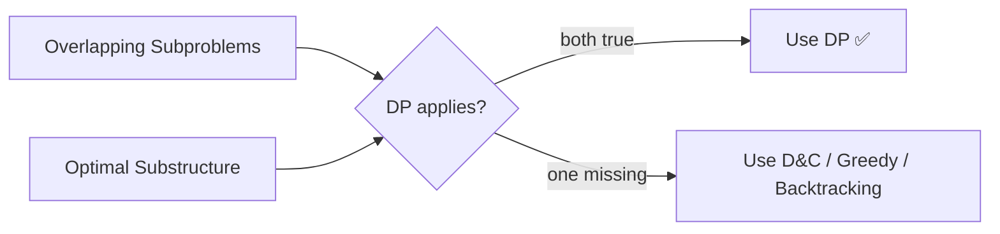
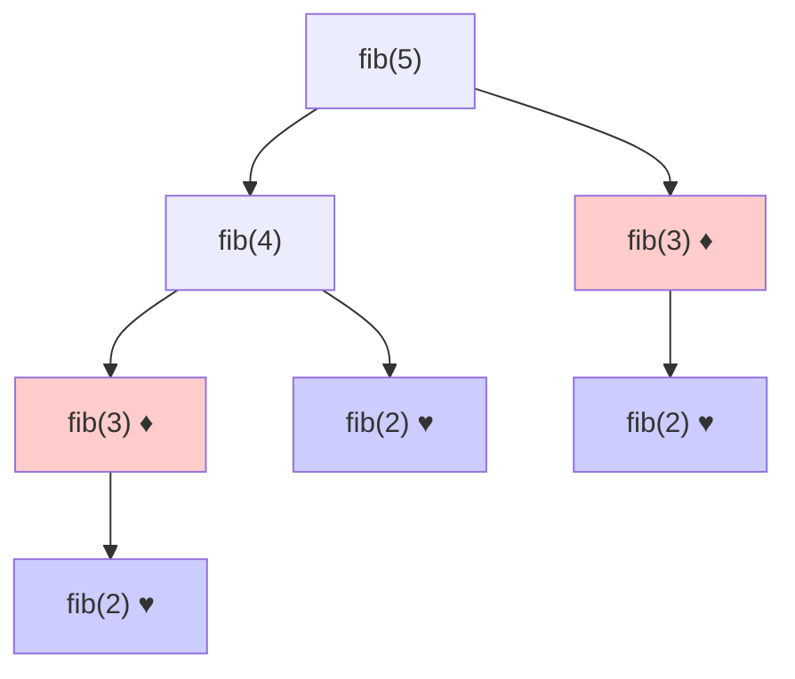
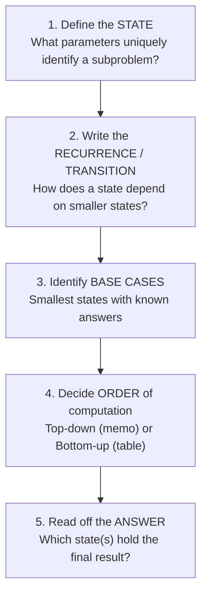
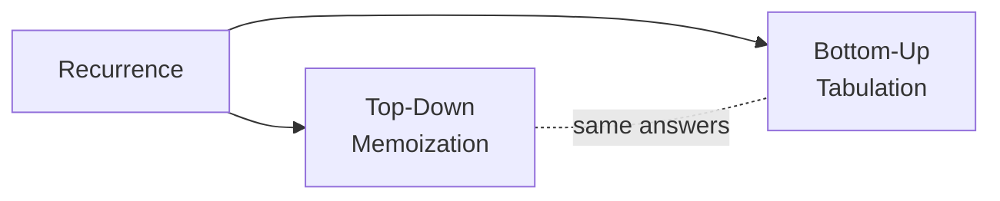
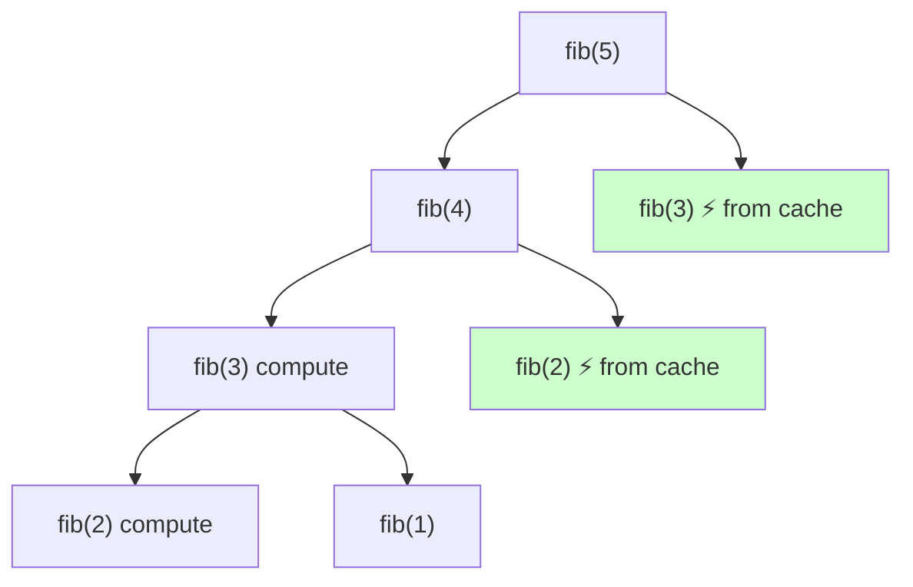
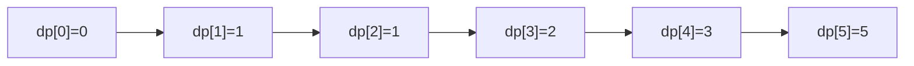
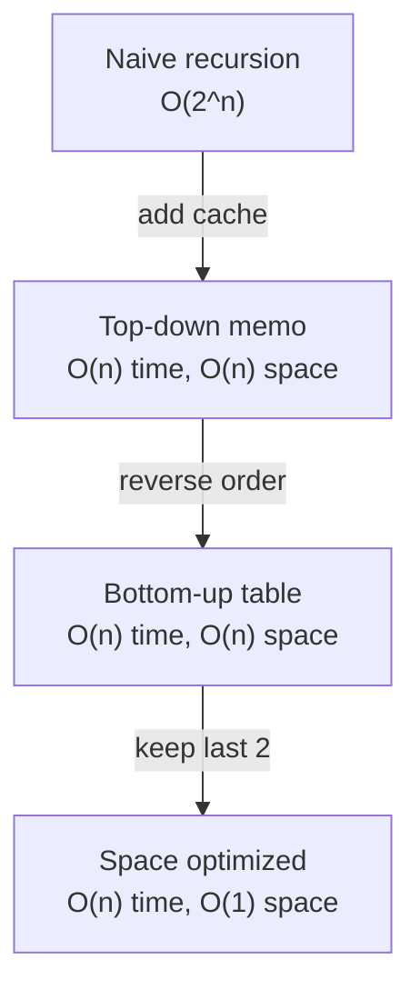
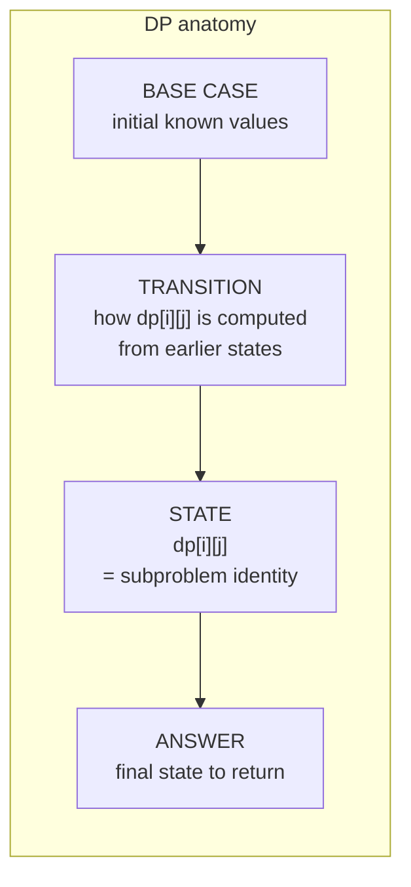
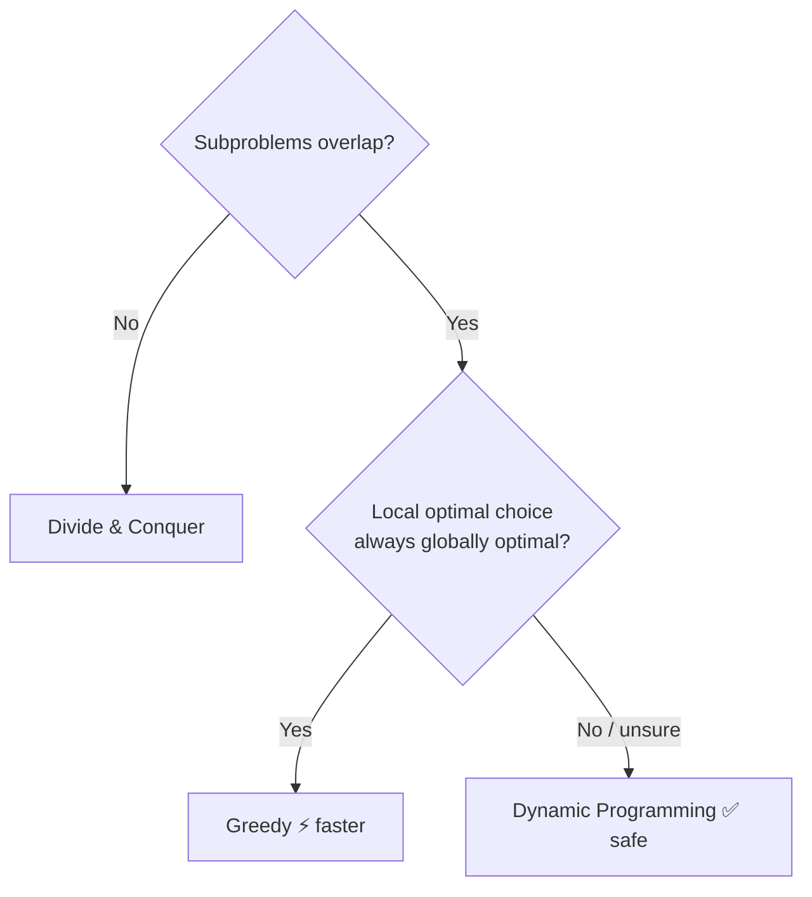
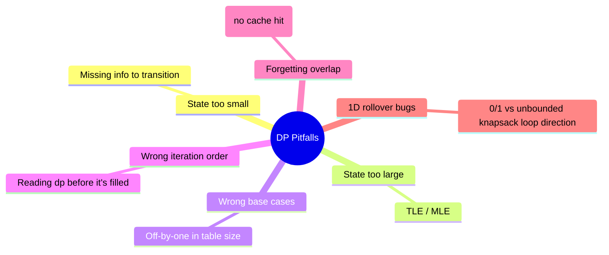

# 03 — Dynamic Programming Fundamentals

> **Dynamic Programming (DP)** = recursion **+ memory**. You break a problem into subproblems, solve each subproblem **once**, store its answer, and reuse it. DP applies when subproblems **overlap** and the problem has **optimal substructure**.

---

## 1. The two pillars (a problem needs BOTH for DP)



### Pillar 1 — Overlapping subproblems
The same subproblem is solved **many times** in the naive recursion tree. (If subproblems are all distinct → Divide & Conquer, not DP.)


`fib(3)` and `fib(2)` recur — **overlap**.

### Pillar 2 — Optimal substructure
The optimal solution of the whole is built from optimal solutions of its parts. Example: the shortest path A→C through B = shortest(A→B) + shortest(B→C).

> ❌ **Counter‑example:** *Longest simple path* in a graph has **no** optimal substructure (combining two longest sub‑paths may revisit a node) → not solvable by simple DP.

#### 📐 Math — Bellman's Principle of Optimality
Optimal substructure is formalized by **Bellman**: if $V(s)$ is the optimal value at state $s$, with decisions $a\in A(s)$ of cost $c(s,a)$ leading to $s'=T(s,a)$,
$$V(s)=\min_{a\in A(s)}\big[\,c(s,a)+V(T(s,a))\,\big].$$
This **Bellman equation** is the master template; every recurrence in [guide 04](04-dp-patterns.md) is a special case (shortest path $V(u)=\min_{(u,v)}w(u,v)+V(v)$; coin change $V(a)=\min_c 1+V(a-c)$; knapsack $V=\max(\text{skip},\,v_i+V(i{-}1,w{-}w_i))$). **Why composing optima is valid (proof sketch):** if an optimal whole-solution used a *sub*-optimal piece, swapping in that piece's true optimum can only improve (or tie) the whole — contradicting optimality. ∎ For **counting** problems replace $\min/\max$ with a sum: $\#(s)=\sum_{a\in A(s)}\#(T(s,a))$ (climbing stairs $W(n)=W(n{-}1)+W(n{-}2)$).

---

## 2. The DP recipe (5 steps that never change)



Keep these five on a sticky note. Every DP problem in `problems/` is solved by filling them in.

---

## 3. Two ways to implement DP



### A) Top‑Down (Memoization) — recursion + cache
Write the natural recursion, then **cache** each result. Computes only the states you actually need (lazy).

**Python** — the `@lru_cache` decorator caches automatically:
```python
from functools import lru_cache

@lru_cache(maxsize=None)
def fib(n):
    if n < 2:
        return n
    return fib(n - 1) + fib(n - 2)
```

**C++** — the idiomatic equivalent uses an `unordered_map` as the cache:
```cpp
unordered_map<int, long long> cache;

long long fib(int n) {
    if (n < 2) return n;
    auto it = cache.find(n);
    if (it != cache.end()) return it->second;   // cached? reuse
    return cache[n] = fib(n - 1) + fib(n - 2);
}
```

Manual cache version (shows the mechanism):

**Python**
```python
def fib(n, memo=None):
    if memo is None:
        memo = {}
    if n < 2:
        return n
    if n in memo:                 # already computed? reuse!
        return memo[n]
    memo[n] = fib(n-1, memo) + fib(n-2, memo)
    return memo[n]
```

**C++**
```cpp
vector<long long> memo;           // sized n+1, filled with -1

long long fib(int n) {
    if (n < 2) return n;
    if (memo[n] != -1) return memo[n];   // already computed? reuse!
    return memo[n] = fib(n - 1) + fib(n - 2);
}
// caller: memo.assign(n + 1, -1); fib(n);
```


Cached nodes (green) return instantly → tree collapses from exponential to linear.

### B) Bottom‑Up (Tabulation) — iterative table filling
Solve smallest subproblems first, build up. No recursion → no stack overflow.

**Python**
```python
def fib(n):
    if n < 2:
        return n
    dp = [0] * (n + 1)
    dp[1] = 1
    for i in range(2, n + 1):
        dp[i] = dp[i-1] + dp[i-2]   # transition
    return dp[n]
```

**C++**
```cpp
long long fib(int n) {
    if (n < 2) return n;
    vector<long long> dp(n + 1, 0);
    dp[1] = 1;
    for (int i = 2; i <= n; ++i)
        dp[i] = dp[i-1] + dp[i-2];   // transition
    return dp[n];
}
```



### Memoization vs Tabulation — when to use which

| | Top‑Down (Memo) | Bottom‑Up (Table) |
|---|---|---|
| Style | Recursive | Iterative |
| Computes | Only needed states (lazy) | All states (eager) |
| Stack risk | Yes (deep recursion) | No |
| Easier to write from recurrence | ✅ Usually | Sometimes harder ordering |
| Space optimization | Harder | ✅ Easy (rolling arrays) |
| Best when | Sparse state space, tricky order | Dense states, want speed/space |

> 🧭 **Strategy:** Derive the recurrence → write top‑down memo first (easy, mirrors the math) → if needed, convert to bottom‑up for speed/space.

---

## 4. From recursion to DP — the full transformation (worked example)

**Problem:** Climbing stairs — you can climb 1 or 2 steps; how many distinct ways to reach step `n`?

**Step 1 — State:** `ways(i)` = number of ways to reach step `i`.

**Step 2 — Recurrence:** to reach `i`, you came from `i-1` (1 step) or `i-2` (2 steps):
$$ways(i) = ways(i-1) + ways(i-2)$$

**Step 3 — Base cases:** `ways(0)=1` (stay), `ways(1)=1`.



```python
# 1) Naive  O(2^n)
def ways(n):
    if n <= 1: return 1
    return ways(n-1) + ways(n-2)

# 2) Memoized  O(n)
def ways(n, memo={}):
    if n <= 1: return 1
    if n in memo: return memo[n]
    memo[n] = ways(n-1, memo) + ways(n-2, memo)
    return memo[n]

# 3) Tabulation  O(n) time, O(n) space
def ways(n):
    if n <= 1: return 1
    dp = [0]*(n+1); dp[0]=dp[1]=1
    for i in range(2, n+1):
        dp[i] = dp[i-1] + dp[i-2]
    return dp[n]

# 4) Space optimized  O(1) space
def ways(n):
    a, b = 1, 1
    for _ in range(2, n+1):
        a, b = b, a + b
    return b
```

**C++** (same four stages)
```cpp
// 1) Naive  O(2^n)
long long waysNaive(int n) {
    if (n <= 1) return 1;
    return waysNaive(n-1) + waysNaive(n-2);
}

// 2) Memoized  O(n)
vector<long long> memo;                       // sized n+1 with -1
long long waysMemo(int n) {
    if (n <= 1) return 1;
    if (memo[n] != -1) return memo[n];
    return memo[n] = waysMemo(n-1) + waysMemo(n-2);
}

// 3) Tabulation  O(n) time, O(n) space
long long waysTab(int n) {
    if (n <= 1) return 1;
    vector<long long> dp(n+1);
    dp[0] = dp[1] = 1;
    for (int i = 2; i <= n; ++i) dp[i] = dp[i-1] + dp[i-2];
    return dp[n];
}

// 4) Space optimized  O(1) space
long long waysOpt(int n) {
    long long a = 1, b = 1;
    for (int i = 2; i <= n; ++i) { long long c = a + b; a = b; b = c; }
    return b;
}
```

This 4‑stage ladder (naive → memo → table → space‑optimized) is the heartbeat of nearly every DP solution.

### 🔢 Iteration trace — filling `dp` for `n = 6`

Watch the table fill left‑to‑right; every cell is just the sum of the two before it. The two scalars `a, b` in the space‑optimized version are simply a *sliding window* over this same row.

| `i` | rule | `dp[i]` | `a` (=`dp[i-2]`) | `b` (=`dp[i-1]`) |
|---|---|---|---|---|
| 0 | base | **1** | — | — |
| 1 | base | **1** | 1 | 1 |
| 2 | `dp[1]+dp[0]` | **2** | 1 | 2 |
| 3 | `dp[2]+dp[1]` | **3** | 2 | 3 |
| 4 | `dp[3]+dp[2]` | **5** | 3 | 5 |
| 5 | `dp[4]+dp[3]` | **8** | 5 | 8 |
| 6 | `dp[5]+dp[4]` | **13** | 8 | 13 |

> Answer `ways(6) = 13`. Notice each row only ever reads the **previous two** values — that is the proof that two scalars suffice and the table can be dropped ($O(n)\to O(1)$ space).

---

## 5. State, transition, and answer — the vocabulary



- **State** must capture *everything* needed to make future decisions, and *nothing* irrelevant (smaller state = less time/space).
- **Transition** is just your recurrence relation.
- Getting the **state design** right is 80% of solving a DP problem.

---

## 6. Counting the cost of a DP

$$\text{Time} = (\text{number of states}) \times (\text{work per transition})$$
$$\text{Space} = (\text{number of states stored})\ \text{— often reducible}$$

| DP | States | Work/transition | Time | Space (naive → optimized) |
|---|---|---|---|---|
| Fibonacci | $n$ | $O(1)$ | $O(n)$ | $O(n)\to O(1)$ |
| 0/1 Knapsack | $n\cdot W$ | $O(1)$ | $O(nW)$ | $O(nW)\to O(W)$ |
| LCS | $n\cdot m$ | $O(1)$ | $O(nm)$ | $O(nm)\to O(m)$ |
| Matrix chain | $n^2$ | $O(n)$ | $O(n^3)$ | $O(n^2)$ |
| Interval/LIS (n²) | $n$ | $O(n)$ | $O(n^2)$ | $O(n)$ |

#### 📐 Math — DP as a DAG of states (why ordering works)
Memoization guarantees each state computes once, so $\text{Time}=|S|\times\tau$ exactly — Fibonacci has $|S|=n+1$ states and $\tau=O(1)$ → $O(n)$, collapsing the uncached $\Theta(\varphi^n)$ repetition. Model each state as a node with an edge $s\to s'$ whenever computing $s$ reads $s'$; correctness requires this to be a **Directed Acyclic Graph**.
- **Tabulation** = evaluating nodes in a **topological order** (every dependency filled first). The "loop direction" rules (knapsack down vs up, interval by increasing length) are hand-built topological sorts.
- **Memoization** = a lazy DFS over the same DAG, computing a node the first time it is visited.
- A **cycle** in the dependency graph breaks plain DP → use fixed-point iteration (Bellman–Ford relaxation, value iteration).

Summing out-degrees, $\sum_s\deg^+(s)=|S|\cdot\bar\tau$, recovers the states × transition formula rigorously.

**Pseudo-polynomial trap:** Knapsack's $O(nW)$ *looks* polynomial but $W$ can be exponential in its bit-length $\log W$. With input size $L=n\log W$ bits, $nW=n\cdot2^{\log W}$ is exponential in $L$ — which is why subset-sum / knapsack are **NP-hard** yet tractable when $W$ is numerically small: the DP exploits the *value* of $W$, not its encoded length.

---

## 7. Reconstructing the actual solution (not just the value)

DP often returns an optimal **value** (e.g., min cost). To recover the **choices**, either store parent pointers or backtrack through the table.

```python
# LCS length + reconstruction
def lcs(a, b):
    n, m = len(a), len(b)
    dp = [[0]*(m+1) for _ in range(n+1)]
    for i in range(1, n+1):
        for j in range(1, m+1):
            if a[i-1] == b[j-1]:
                dp[i][j] = dp[i-1][j-1] + 1
            else:
                dp[i][j] = max(dp[i-1][j], dp[i][j-1])
    # backtrack to build the subsequence
    i, j, out = n, m, []
    while i > 0 and j > 0:
        if a[i-1] == b[j-1]:
            out.append(a[i-1]); i -= 1; j -= 1
        elif dp[i-1][j] >= dp[i][j-1]:
            i -= 1
        else:
            j -= 1
    return dp[n][m], ''.join(reversed(out))
```

**C++**
```cpp
pair<int, string> lcs(const string& a, const string& b) {
    int n = a.size(), m = b.size();
    vector<vector<int>> dp(n+1, vector<int>(m+1, 0));
    for (int i = 1; i <= n; ++i)
        for (int j = 1; j <= m; ++j)
            if (a[i-1] == b[j-1]) dp[i][j] = dp[i-1][j-1] + 1;
            else                  dp[i][j] = max(dp[i-1][j], dp[i][j-1]);
    // backtrack to build the subsequence
    int i = n, j = m; string out;
    while (i > 0 && j > 0) {
        if (a[i-1] == b[j-1]) { out += a[i-1]; --i; --j; }
        else if (dp[i-1][j] >= dp[i][j-1]) --i;
        else --j;
    }
    reverse(out.begin(), out.end());
    return {dp[n][m], out};
}
```

```mermaid
flowchart TD
    A["Fill dp table"] --> B["Start at dp[n][m]"]
    B --> C{a[i]==b[j]?}
    C -- yes --> D["take char, move diagonally i--, j--"]
    C -- no --> E["move toward larger neighbor"]
    D --> F{reached border?}
    E --> F
    F -- no --> C
    F -- yes --> G["reverse collected chars"]
```

### 🔢 Iteration trace — `lcs("AGCAT", "GAC")`

**Phase 1 — fill the grid** (rows = `A G C A T`, cols = `G A C`). Each cell is `dp[i-1][j-1]+1` on a match (↖), else `max(↑, ←)`:

| | ∅ | G | A | C |
|---|---|---|---|---|
| **∅** | 0 | 0 | 0 | 0 |
| **A** | 0 | 0 | **1** | 1 |
| **G** | 0 | **1** | 1 | 1 |
| **C** | 0 | 1 | 1 | **2** |
| **A** | 0 | 1 | **2** | 2 |
| **T** | 0 | 1 | 2 | 2 |

The bottom‑right cell `dp[5][3] = 2` is the LCS **length**.

**Phase 2 — backtrack** from `dp[5][3]` to recover the actual subsequence:

| At `(i,j)` | `a[i-1]` vs `b[j-1]` | Decision | Collected |
|---|---|---|---|
| (5,3) `T`,`C` | mismatch, ↑=2 ≥ ←=2 | move up | `""` |
| (4,3) `A`,`C` | mismatch, ↑=2 ≥ ←=1 | move up | `""` |
| (3,3) `C`,`C` | **match** | take `C`, go ↖ | `"C"` |
| (2,2) `G`,`A` | mismatch, ↑=1 ≥ ←=0 | move up | `"C"` |
| (1,2) `A`,`A` | **match** | take `A`, go ↖ | `"CA"` |
| (0,1) | border reached | stop | — |

> Reverse `"CA"` → LCS = **`"AC"`** of length 2. Backtracking always walks **diagonally on matches** and toward the **larger neighbor** on mismatches.

---

## 8. DP vs Greedy vs Divide & Conquer



- **Greedy** is faster but only works when local choices are provably optimal (e.g., interval scheduling, Huffman). DP is the safe fallback that considers all choices.
- **D&C** solves independent subproblems; DP solves overlapping ones.

---

## 9. Common beginner mistakes



- **Iteration order matters** in tabulation: a state must be computed *after* all states it depends on.
- For 1D rolled knapsack, **loop direction encodes 0/1 vs unbounded** (see [guide 04](04-dp-patterns.md)).

---

## 10. Self‑test

1. Name the two properties a problem must have for DP.
2. Convert this to memoized form: `f(n)=f(n-1)+f(n-3)`, `f(0)=f(1)=f(2)=1`.
3. Why can bottom‑up avoid stack overflow but top‑down cannot?
4. Time complexity of a DP with $n\cdot m$ states and $O(k)$ transition?

<details><summary>Answers</summary>

1. Overlapping subproblems + optimal substructure.
2. Cache results in a dict keyed by `n`; return cached value if present.
3. Bottom‑up is iterative (no recursion frames); top‑down recurses to depth `n`.
4. $O(n \cdot m \cdot k)$.

</details>

---

**Next:** [04 — DP Patterns Catalog →](04-dp-patterns.md)
