# 04 — DP Patterns Catalog

The fastest way to get good at DP is to recognize **patterns**. Almost every DP problem is a variation of one of these ~15 templates. For each: the signal that triggers it, the state/transition, a diagram, and a code template.

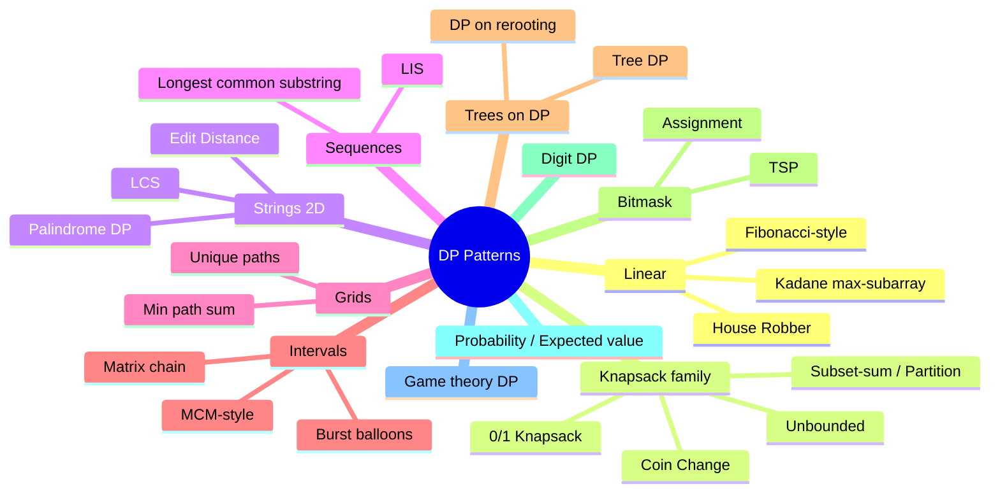

> Legend used below: **Signal** = how to recognize it · **State** = subproblem identity · **Transition** = recurrence.

---

## Pattern 1 — Linear / 1D DP ("Fibonacci family")

**Signal:** answer for index `i` depends on a constant number of previous indices.

**State:** `dp[i]` = answer considering the first `i` elements (or ending at `i`).

### 1a. Climbing Stairs / Fibonacci
$$dp[i] = dp[i-1] + dp[i-2]$$

### 1b. House Robber (can't rob adjacent houses)

**Python**
```python
def rob(nums):
    prev2, prev1 = 0, 0
    for x in nums:
        prev2, prev1 = prev1, max(prev1, prev2 + x)
    return prev1
```

**C++**
```cpp
int rob(vector<int>& nums) {
    int prev2 = 0, prev1 = 0;
    for (int x : nums) {
        int cur = max(prev1, prev2 + x);
        prev2 = prev1; prev1 = cur;
    }
    return prev1;
}
```
$$dp[i] = \max(dp[i-1],\ dp[i-2] + nums[i])$$

```mermaid
flowchart LR
    A["dp[i-2]<br/>(rob i, skip i-1)"] -->|+nums[i]| C["max"]
    B["dp[i-1]<br/>(skip i)"] --> C
    C --> D["dp[i]"]
```

### 1c. Kadane — Maximum Subarray
$$dp[i] = \max(nums[i],\ dp[i-1] + nums[i])$$

**Python**
```python
def max_subarray(nums):
    best = cur = nums[0]
    for x in nums[1:]:
        cur = max(x, cur + x)
        best = max(best, cur)
    return best
```

**C++**
```cpp
int maxSubarray(vector<int>& nums) {
    int best = nums[0], cur = nums[0];
    for (int i = 1; i < (int)nums.size(); ++i) {
        cur = max(nums[i], cur + nums[i]);
        best = max(best, cur);
    }
    return best;
}
```

#### 📐 Math — closed forms & why these recurrences
- **Climbing Stairs** *is* Fibonacci: $dp[n]=F(n+1)=\dfrac{\varphi^{n+1}-\psi^{n+1}}{\sqrt5}$ with $\varphi=\tfrac{1+\sqrt5}{2}$ — a genuine closed form.
- **House Robber** swaps $+$ for $\max$: $dp[i]=\max(dp[i-1],\,dp[i-2]+a_i)$. The $\max$ removes the closed form but keeps $O(n)$ states → $O(n)$ time, $O(1)$ space (two scalars).
- **Kadane** is the running recurrence $dp[i]=\max(a_i,\,dp[i-1]+a_i)$: extend the previous subarray only when it helps ($dp[i-1]>0$), else restart; answer $=\max_i dp[i]$.

#### 🔢 Iteration trace — House Robber on `[2, 7, 9, 3, 1]`

Two rolling scalars: `prev1` = best up to the current house, `prev2` = best up to the one before. Each house picks **skip** (`prev1`) vs **rob** (`prev2 + x`).

| House `x` | `prev2 + x` (rob) | `prev1` (skip) | new best = `max` | `prev2` | `prev1` |
|---|---|---|---|---|---|
| start | — | — | — | 0 | 0 |
| 2 | 0+2 = **2** | 0 | **2** | 0 | 2 |
| 7 | 0+7 = **7** | 2 | **7** | 2 | 7 |
| 9 | 2+9 = **11** | 7 | **11** | 7 | 11 |
| 3 | 7+3 = 10 | **11** | **11** | 11 | 11 |
| 1 | 11+1 = **12** | 11 | **12** | 11 | 12 |

> Answer **12** = rob houses `2 + 9 + 1`. At house `3` the robber *skips* (10 < 11); at house `1` robbing wins (12 > 11). This is the $\max$ recurrence resolving conflicts step by step.

---

## Pattern 2 — 0/1 Knapsack (the most important pattern)

**Signal:** choose a subset of items, each used **at most once**, to optimize value under a capacity/constraint.

**State:** `dp[i][w]` = best value using first `i` items with capacity `w`.

**Transition (take it or leave it):**
$$dp[i][w] = \max\big(\underbrace{dp[i-1][w]}_{\text{skip}},\ \underbrace{dp[i-1][w-wt_i] + val_i}_{\text{take if } w\ge wt_i}\big)$$

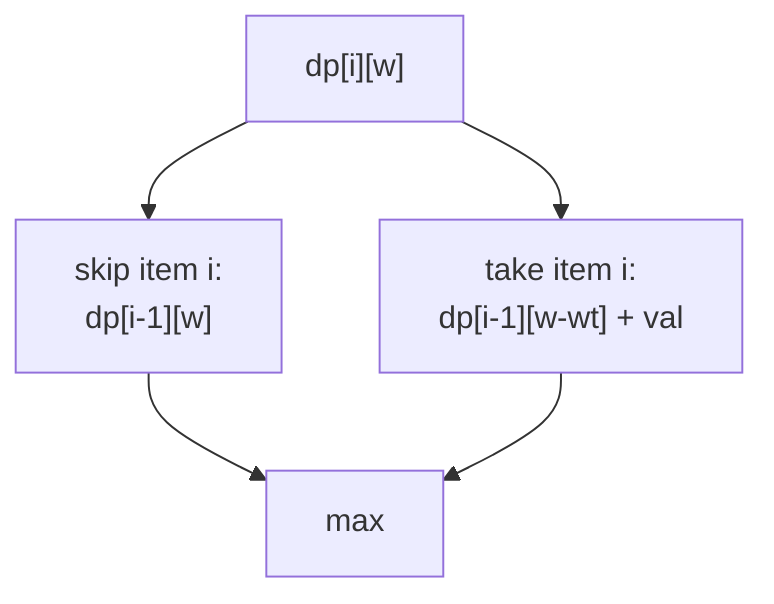

**Python**
```python
def knapsack(weights, values, W):
    n = len(weights)
    dp = [0]*(W+1)
    for i in range(n):
        # iterate capacity DOWNWARD -> each item used at most once
        for w in range(W, weights[i]-1, -1):
            dp[w] = max(dp[w], dp[w-weights[i]] + values[i])
    return dp[W]
```

**C++**
```cpp
int knapsack(vector<int>& weights, vector<int>& values, int W) {
    int n = weights.size();
    vector<int> dp(W+1, 0);
    for (int i = 0; i < n; ++i)
        // iterate capacity DOWNWARD -> each item used at most once
        for (int w = W; w >= weights[i]; --w)
            dp[w] = max(dp[w], dp[w - weights[i]] + values[i]);
    return dp[W];
}
```

> 🔑 **Direction rule (memorize):**
> - **0/1 knapsack** → inner loop **decreasing** capacity (item used once).
> - **Unbounded knapsack** → inner loop **increasing** capacity (item reusable).

#### 🔢 Iteration trace — 1D knapsack, `W = 5`

Items `(weight, value)`: `(2, 3), (3, 4), (4, 5)`. The 1D array `dp[w]` is rewritten **right‑to‑left** after each item so each item is used at most once.

| After item | dp[0] | dp[1] | dp[2] | dp[3] | dp[4] | dp[5] |
|---|---|---|---|---|---|---|
| (init) | 0 | 0 | 0 | 0 | 0 | 0 |
| (2,3) | 0 | 0 | **3** | 3 | 3 | 3 |
| (3,4) | 0 | 0 | 3 | **4** | 4 | **7** |
| (4,5) | 0 | 0 | 3 | 4 | **5** | 7 |

Walking the last‑but‑one row at `w = 5`: `dp[5] = max(dp[5]=3, dp[5-3]+4 = dp[2]+4 = 3+4) = 7` (take items 1 and 2, weight 2+3=5, value 3+4=7).

> Answer **7**. Why loop **downward**? Updating `dp[5]` reads `dp[2]` which must still be the *previous* item's value — going right‑to‑left guarantees we never reuse the same item twice in one pass.

### Sub‑variants of knapsack
| Problem | Tweak |
|---|---|
| Subset Sum | values = weights, ask "can we hit exactly S?" boolean dp |
| Equal Partition | subset sum to `total/2` |
| Count of Subsets with sum S | `dp[w] += dp[w-num]` |
| Target Sum (+/-) | transform to subset‑sum |
| Last Stone Weight II | minimize `|S - 2·subset|` |

```python
# Subset sum (boolean)
def can_partition(nums):
    total = sum(nums)
    if total % 2: return False
    target = total // 2
    dp = [False]*(target+1); dp[0] = True
    for num in nums:
        for w in range(target, num-1, -1):
            dp[w] = dp[w] or dp[w-num]
    return dp[target]
```

**C++**
```cpp
bool canPartition(vector<int>& nums) {
    int total = accumulate(nums.begin(), nums.end(), 0);
    if (total % 2) return false;
    int target = total / 2;
    vector<char> dp(target+1, false); dp[0] = true;
    for (int num : nums)
        for (int w = target; w >= num; --w)
            dp[w] = dp[w] || dp[w - num];
    return dp[target];
}
```

#### 📐 Math — knapsack as integer optimization
0/1 Knapsack is the integer program $\max\sum_i v_i x_i$ subject to $\sum_i w_i x_i\le W,\ x_i\in\{0,1\}$; the recurrence simply enumerates the two values of $x_i$. On the rolled 1D array the **loop direction encodes the constraint**:
$$\text{capacity decreasing}\Rightarrow x_i\in\{0,1\}\ (\text{once});\qquad \text{increasing}\Rightarrow x_i\in\mathbb Z_{\ge0}\ (\text{unbounded}).$$
The $O(nW)$ cost is **pseudo-polynomial**: $W$ can be exponential in its bit-length $\log W$, which is exactly why subset-sum / knapsack are NP-hard yet fast for small numeric $W$.

---

## Pattern 3 — Unbounded Knapsack / Coin Change

**Signal:** items reusable **unlimited** times.

### Coin Change — minimum coins to make amount

$$dp[a] = \min_{c \in coins}\big(dp[a-c] + 1\big)$$

**Python**
```python
def coin_change(coins, amount):
    INF = float('inf')
    dp = [0] + [INF]*amount
    for a in range(1, amount+1):
        for c in coins:
            if c <= a:
                dp[a] = min(dp[a], dp[a-c] + 1)
    return dp[amount] if dp[amount] != INF else -1
```

**C++**
```cpp
int coinChange(vector<int>& coins, int amount) {
    const int INF = 1e9;
    vector<int> dp(amount+1, INF); dp[0] = 0;
    for (int a = 1; a <= amount; ++a)
        for (int c : coins)
            if (c <= a) dp[a] = min(dp[a], dp[a-c] + 1);
    return dp[amount] == INF ? -1 : dp[amount];
}
```

### Coin Change II — number of ways (combinations)

**Python**
```python
def change(amount, coins):
    dp = [1] + [0]*amount
    for c in coins:               # coin outer => combinations (no double count)
        for a in range(c, amount+1):
            dp[a] += dp[a-c]
    return dp[amount]
```

**C++**
```cpp
int change(int amount, vector<int>& coins) {
    vector<long long> dp(amount+1, 0); dp[0] = 1;
    for (int c : coins)               // coin outer => combinations
        for (int a = c; a <= amount; ++a)
            dp[a] += dp[a-c];
    return (int)dp[amount];
}
```

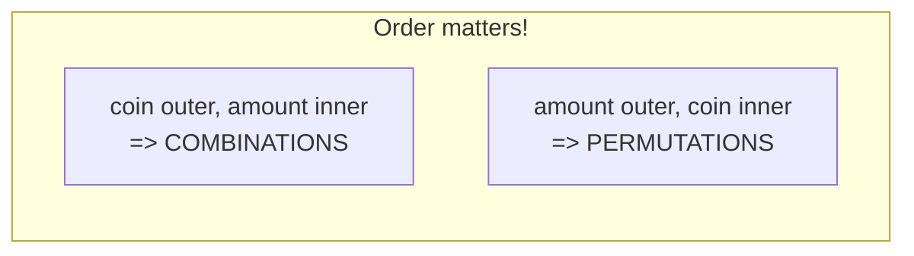

> 🔑 **Loop order controls combinations vs permutations.** Coin outer = combinations; amount outer = ordered ways.

#### 🔢 Iteration trace — min coins for `amount = 6`, coins `{1, 3, 4}`

`dp[a]` = fewest coins to make `a`; start `dp[0]=0`, everything else `∞`. For each amount try every coin `c ≤ a`:

| `a` | `dp[a-1]+1` | `dp[a-3]+1` | `dp[a-4]+1` | `dp[a]` = min | best choice |
|---|---|---|---|---|---|
| 0 | — | — | — | **0** | empty |
| 1 | dp[0]+1=1 | — | — | **1** | `1` |
| 2 | dp[1]+1=2 | — | — | **2** | `1+1` |
| 3 | dp[2]+1=3 | dp[0]+1=1 | — | **1** | `3` |
| 4 | dp[3]+1=2 | dp[1]+1=2 | dp[0]+1=1 | **1** | `4` |
| 5 | dp[4]+1=2 | dp[2]+1=3 | dp[1]+1=2 | **2** | `4+1` |
| 6 | dp[5]+1=3 | dp[3]+1=2 | dp[2]+1=3 | **2** | `3+3` |

> Answer **2** coins (`3+3`). Note the greedy trap: greedily taking the biggest coin gives `4+1+1 = 3` coins — the DP's full `min` over coins finds the true optimum `3+3 = 2`.

#### 📐 Math — why loop order flips the count
Counting uses the **sum rule** $dp[a]\mathrel{+}=dp[a-c]$. Coin loop **outside** fixes a coin order, so each multiset is counted once → *combinations*. Amount loop **outside** lets every order recur → *permutations* (compositions). Min-coins reuses the same states with the **min** combinator $dp[a]=\min_c dp[a-c]+1$. Greedy can fail (coins $\{1,3,4\}$, amount 6: greedy $4{+}1{+}1=3$ coins, DP $3{+}3=2$), so the full min over coins is mandatory.

---

## Pattern 4 — 2D String DP (LCS family)

**Signal:** two sequences, compare/align/transform them.

### Longest Common Subsequence (LCS)
$$
dp[i][j] =
\begin{cases}
dp[i-1][j-1] + 1 & a_i = b_j \\
\max(dp[i-1][j],\ dp[i][j-1]) & a_i \ne b_j
\end{cases}
$$

```mermaid
flowchart TD
    A["dp[i][j]"] --> M{a[i] == b[j]?}
    M -- yes --> D["dp[i-1][j-1] + 1<br/>(diagonal)"]
    M -- no --> N["max(dp[i-1][j], dp[i][j-1])<br/>(top / left)"]
```

Table view for `a="ABCBDAB"`, `b="BDCAB"` (each cell looks up‑left / up / left):

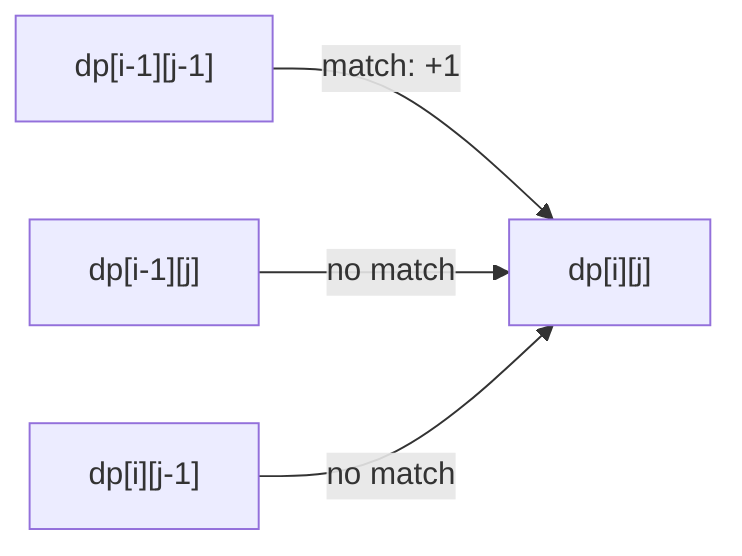

### Edit Distance (Levenshtein)
$$
dp[i][j] = \min\begin{cases}
dp[i-1][j] + 1 & \text{delete} \\
dp[i][j-1] + 1 & \text{insert} \\
dp[i-1][j-1] + [a_i \ne b_j] & \text{replace/match}
\end{cases}
$$

**Python**
```python
def edit_distance(a, b):
    n, m = len(a), len(b)
    dp = [[0]*(m+1) for _ in range(n+1)]
    for i in range(n+1): dp[i][0] = i
    for j in range(m+1): dp[0][j] = j
    for i in range(1, n+1):
        for j in range(1, m+1):
            if a[i-1] == b[j-1]:
                dp[i][j] = dp[i-1][j-1]
            else:
                dp[i][j] = 1 + min(dp[i-1][j], dp[i][j-1], dp[i-1][j-1])
    return dp[n][m]
```

**C++**
```cpp
int editDistance(const string& a, const string& b) {
    int n = a.size(), m = b.size();
    vector<vector<int>> dp(n+1, vector<int>(m+1, 0));
    for (int i = 0; i <= n; ++i) dp[i][0] = i;
    for (int j = 0; j <= m; ++j) dp[0][j] = j;
    for (int i = 1; i <= n; ++i)
        for (int j = 1; j <= m; ++j)
            if (a[i-1] == b[j-1]) dp[i][j] = dp[i-1][j-1];
            else dp[i][j] = 1 + min({dp[i-1][j], dp[i][j-1], dp[i-1][j-1]});
    return dp[n][m];
}
```

### String DP siblings
| Problem | Core idea |
|---|---|
| Longest Common Substring | like LCS but reset to 0 on mismatch |
| Distinct Subsequences | count ways `s` forms `t` |
| Wildcard / Regex Matching | dp over pattern vs text with `*`,`?` |
| Interleaving String | `dp[i][j]` from two sources |
| Shortest Common Supersequence | `n+m-LCS` |

#### 📐 Math — why the LCS recurrence is shaped this way
On a **match**, the shared character must end some LCS, so the problem shrinks in *both* strings → diagonal $+1$. On a **mismatch**, at least one last character is unused, so drop one side and take the better of up/left. With $\Theta(nm)$ states and $O(1)$ work, time is $O(nm)$. **Edit Distance** is the same grid with three unit-cost edits — insert (left), delete (up), replace (diagonal) — and the diagonal is free on a match.

#### 🔢 Iteration trace — Edit Distance `"horse" → "ros"`

Row 0 / column 0 are the base cases (cost = turn a string into `""` by deleting every char). Each inner cell is `dp[i-1][j-1]` on a match, else `1 + min(↑ delete, ← insert, ↖ replace)`:

| | ∅ | r | o | s |
|---|---|---|---|---|
| **∅** | 0 | 1 | 2 | 3 |
| **h** | 1 | 1 | 2 | 3 |
| **o** | 2 | 2 | **1** | 2 |
| **r** | 3 | **2** | 2 | 2 |
| **s** | 4 | 3 | 3 | **2** |
| **e** | 5 | 4 | 4 | **3** |

> Answer `dp[5][3] = 3`. One optimal script of 3 edits: `horse → rorse` (replace `h→r`) `→ rose` (delete `r`) `→ ros` (delete `e`). The `o,o` and `s,s` matches copy the diagonal with **no `+1`**, which is what keeps the distance small.

---

## Pattern 5 — Palindrome DP

**Signal:** substrings, "is palindrome", longest/least cuts.

### Longest Palindromic Subsequence
$= $ LCS of `s` and `reverse(s)`. Or directly:
$$dp[i][j] = \begin{cases} dp[i+1][j-1]+2 & s_i=s_j \\ \max(dp[i+1][j], dp[i][j-1]) & \text{else}\end{cases}$$

```mermaid
flowchart TD
    A["dp[i][j] over s[i..j]"] --> M{s[i]==s[j]?}
    M -- yes --> D["dp[i+1][j-1] + 2"]
    M -- no --> N["max(dp[i+1][j], dp[i][j-1])"]
```

> ⚠️ Iterate by **increasing substring length** (or `i` descending, `j` ascending) so `dp[i+1][...]` is ready.

**Python**
```python
def longest_pal_subseq(s):
    n = len(s)
    dp = [[0]*n for _ in range(n)]
    for i in range(n-1, -1, -1):
        dp[i][i] = 1
        for j in range(i+1, n):
            if s[i] == s[j]:
                dp[i][j] = dp[i+1][j-1] + 2
            else:
                dp[i][j] = max(dp[i+1][j], dp[i][j-1])
    return dp[0][n-1]
```

**C++**
```cpp
int longestPalSubseq(const string& s) {
    int n = s.size();
    vector<vector<int>> dp(n, vector<int>(n, 0));
    for (int i = n-1; i >= 0; --i) {
        dp[i][i] = 1;
        for (int j = i+1; j < n; ++j)
            if (s[i] == s[j]) dp[i][j] = dp[i+1][j-1] + 2;
            else dp[i][j] = max(dp[i+1][j], dp[i][j-1]);
    }
    return dp[0][n-1];
}
```

#### 📐 Math — palindrome DP identities
The Longest Palindromic Subsequence equals $\text{LCS}(s,\text{reverse}(s))$ — a subsequence palindromic in $s$ is exactly one common to $s$ and its reverse. The range recurrence adds $2$ on a matching pair of ends ($dp[i+1][j-1]+2$) and otherwise drops an end. **Counting** palindromic substrings instead ORs/sums a boolean range table; the expand-around-centre view gives the same $O(n^2)$ over $2n-1$ centres.

---

## Pattern 6 — Longest Increasing Subsequence (LIS)

**Signal:** longest/optimal subsequence respecting an order.

**$O(n^2)$ DP:** `dp[i]` = LIS ending at `i`.
$$dp[i] = 1 + \max_{j<i,\ a_j<a_i} dp[j]$$

**$O(n\log n)$** with patience sorting / binary search:

**Python**
```python
import bisect
def lis(nums):
    tails = []
    for x in nums:
        i = bisect.bisect_left(tails, x)
        if i == len(tails):
            tails.append(x)
        else:
            tails[i] = x
    return len(tails)
```

**C++**
```cpp
int lis(vector<int>& nums) {
    vector<int> tails;
    for (int x : nums) {
        auto it = lower_bound(tails.begin(), tails.end(), x);
        if (it == tails.end()) tails.push_back(x);
        else *it = x;
    }
    return tails.size();
}
```

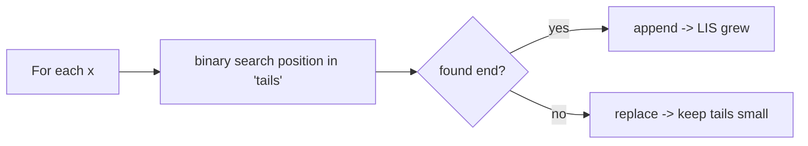

#### 🔢 Iteration trace — LIS of `[10, 9, 2, 5, 3, 7, 101, 18]`

`tails[k]` = smallest possible tail of an increasing subsequence of length `k+1`. `bisect_left` finds where `x` belongs; **append** if it extends, else **overwrite** to keep tails minimal.

| `x` | position | action | `tails` | LIS len |
|---|---|---|---|---|
| 10 | 0 (end) | append | `[10]` | 1 |
| 9 | 0 | overwrite | `[9]` | 1 |
| 2 | 0 | overwrite | `[2]` | 1 |
| 5 | 1 (end) | append | `[2, 5]` | 2 |
| 3 | 1 | overwrite | `[2, 3]` | 2 |
| 7 | 2 (end) | append | `[2, 3, 7]` | 3 |
| 101 | 3 (end) | append | `[2, 3, 7, 101]` | 4 |
| 18 | 3 | overwrite | `[2, 3, 7, 18]` | **4** |

> Answer **4** (e.g. `2, 3, 7, 18`). `tails` is **not** itself a valid subsequence — it only tracks lengths — but its final size is exactly the LIS length. Overwriting `101→18` keeps options open for future larger appends without changing the length.

LIS relatives: Russian Doll Envelopes, Largest Divisible Subset, Max length chain, Box stacking.

#### 📐 Math — why patience sorting is correct
`tails[k]` holds the smallest possible tail of an increasing subsequence of length $k+1$, and it stays **sorted**, so `bisect_left` locates the replace point in $O(\log n)$ → $O(n\log n)$ overall. Keeping each tail minimal never blocks a future extension, so $|\text{tails}|$ equals the LIS length. This is **Dilworth's theorem** in action: the fewest decreasing subsequences that cover the array equals the longest increasing one.

---

## Pattern 7 — Grid / 2D path DP

**Signal:** move on a grid (usually right/down), count paths or optimize cost.

### Unique Paths
$$dp[i][j] = dp[i-1][j] + dp[i][j-1]$$

### Minimum Path Sum
$$dp[i][j] = grid[i][j] + \min(dp[i-1][j],\ dp[i][j-1])$$

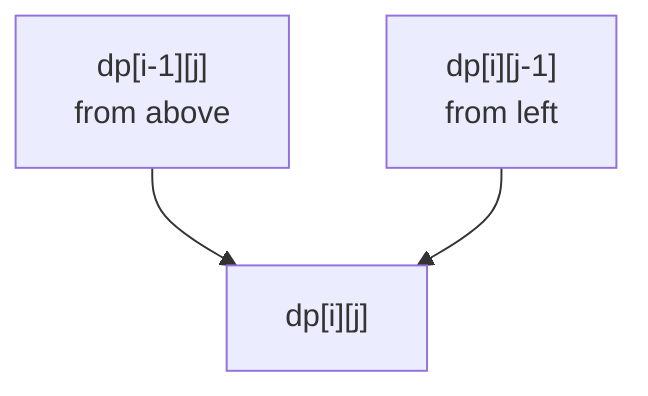

**Python**
```python
def min_path_sum(grid):
    m, n = len(grid), len(grid[0])
    dp = [float('inf')]*n
    dp[0] = 0
    for i in range(m):
        dp[0] += grid[i][0] if i else 0
        for j in range(1, n):
            dp[j] = grid[i][j] + min(dp[j], dp[j-1])
    return dp[n-1]
```

**C++**
```cpp
int minPathSum(vector<vector<int>>& grid) {
    int m = grid.size(), n = grid[0].size();
    const int INF = 1e9;
    vector<int> dp(n, INF); dp[0] = 0;
    for (int i = 0; i < m; ++i) {
        if (i) dp[0] += grid[i][0];
        for (int j = 1; j < n; ++j)
            dp[j] = grid[i][j] + min(dp[j], dp[j-1]);
    }
    return dp[n-1];
}
```

Grid relatives: Dungeon Game (reverse DP), Cherry Pickup (two agents → 3D/4D state), Minimum Falling Path, Triangle.

#### 📐 Math — grid DP is Pascal's triangle
**Unique Paths** counts monotone lattice paths: $(m-1)$ downs and $(n-1)$ rights in any order, so the closed form is $\binom{m+n-2}{m-1}=\frac{(m+n-2)!}{(m-1)!\,(n-1)!}$. The recurrence $dp[i][j]=dp[i-1][j]+dp[i][j-1]$ is literally **Pascal's rule** $\binom{r}{c}=\binom{r-1}{c}+\binom{r-1}{c-1}$ laid on a grid. Swap $+$ for $\min$ and add the cell cost → **Min Path Sum**: same DAG, optimization combinator.

---

## Pattern 8 — Interval / Range DP

**Signal:** answer for a range `[i,j]` is built from splitting at some `k` inside it. Cost combines two sub‑ranges.

**State:** `dp[i][j]` over interval `[i..j]`.
**Transition:** $dp[i][j] = \min/\max_{i \le k < j}\big(dp[i][k] + dp[k+1][j] + cost(i,k,j)\big)$

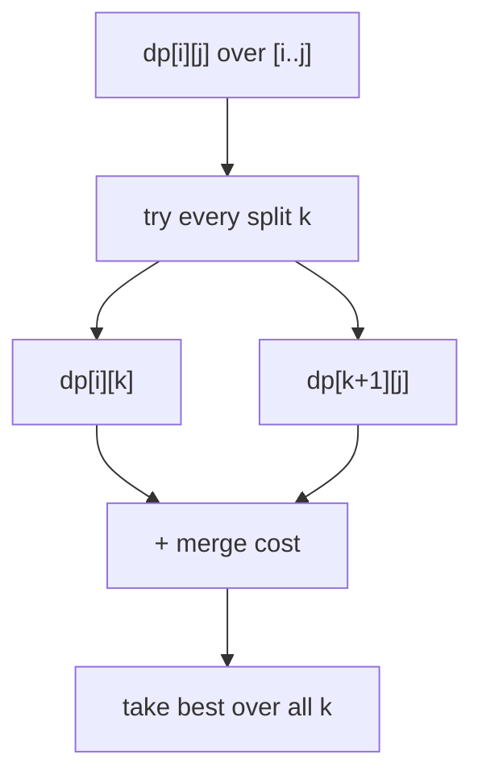

### Matrix Chain Multiplication

**Python**
```python
def matrix_chain(dims):           # dims has length n+1
    n = len(dims) - 1
    dp = [[0]*(n+1) for _ in range(n+1)]
    for length in range(2, n+1):
        for i in range(1, n-length+2):
            j = i + length - 1
            dp[i][j] = float('inf')
            for k in range(i, j):
                cost = dp[i][k] + dp[k+1][j] + dims[i-1]*dims[k]*dims[j]
                dp[i][j] = min(dp[i][j], cost)
    return dp[1][n]
```

**C++**
```cpp
int matrixChain(vector<int>& dims) {        // dims has length n+1
    int n = dims.size() - 1;
    vector<vector<int>> dp(n+1, vector<int>(n+1, 0));
    for (int len = 2; len <= n; ++len)
        for (int i = 1; i + len - 1 <= n; ++i) {
            int j = i + len - 1;
            dp[i][j] = INT_MAX;
            for (int k = i; k < j; ++k) {
                int cost = dp[i][k] + dp[k+1][j] + dims[i-1]*dims[k]*dims[j];
                dp[i][j] = min(dp[i][j], cost);
            }
        }
    return dp[1][n];
}
```

Interval relatives: Burst Balloons, Minimum Cost to Cut a Stick, Stone Game variants, Palindrome Partitioning II, Boolean Parenthesization.

> ⏱️ Interval DP is usually $O(n^3)$: $O(n^2)$ states × $O(n)$ split choices.

#### 🔢 Iteration trace — Matrix Chain, dims `[40, 20, 30, 10]`

Three matrices $A_1(40{\times}20),\,A_2(20{\times}30),\,A_3(30{\times}10)$. `dp[i][j]` = min scalar multiplications to multiply $A_i..A_j$. Fill by **increasing chain length**:

| length | interval | splits tried `k` | cost | `dp[i][j]` |
|---|---|---|---|---|
| 1 | [1,1],[2,2],[3,3] | — | 0 | **0** each |
| 2 | [1,2] | k=1 | `0+0+40·20·30` = 24000 | **24000** |
| 2 | [2,3] | k=2 | `0+0+20·30·10` = 6000 | **6000** |
| 3 | [1,3] | k=1 | `dp[1][1]+dp[2][3]+40·20·10` = 0+6000+8000 = **14000** | **14000** |
| 3 | [1,3] | k=2 | `dp[1][2]+dp[3][3]+40·30·10` = 24000+0+12000 = 36000 | (worse) |

> Answer `dp[1][3] = 14000`, achieved by split `k=1` → `A_1·(A_2·A_3)`. The other parenthesization `(A_1·A_2)·A_3` costs 36000 — over 2.5× more. Interval DP wins by trying **every split point** and keeping the best.

#### 📐 Math — counting splits and Catalan parenthesizations
There are $\Theta(n^2)$ intervals, each trying $\Theta(n)$ split points $k$ → the canonical $\Theta(n^3)$. The number of *distinct full parenthesizations* the splits explore is the **Catalan number** $C_{n-1}=\frac1n\binom{2n-2}{n-1}\sim 4^n/n^{1.5}$ — DP collapses that exponential set to $\Theta(n^3)$. If the merge cost obeys the **quadrangle inequality**, the optimal split is monotone and **Knuth's optimization** drops it to $\Theta(n^2)$ (see [guide 05](05-identifying-and-optimizing.md)).

---

## Pattern 9 — DP on Trees

**Signal:** optimize over a tree; a node's answer depends on its children's answers.

**State:** often two values per node (e.g., "include node" vs "exclude node").

### House Robber III (rob a tree)

**Python**
```python
def rob(root):
    def dfs(node):
        if not node: return (0, 0)        # (rob_this, skip_this)
        l = dfs(node.left)
        r = dfs(node.right)
        rob_this  = node.val + l[1] + r[1]    # can't rob children
        skip_this = max(l) + max(r)           # children free to choose
        return (rob_this, skip_this)
    return max(dfs(root))
```

**C++**
```cpp
pair<int,int> dfs(TreeNode* node) {           // {rob_this, skip_this}
    if (!node) return {0, 0};
    auto l = dfs(node->left);
    auto r = dfs(node->right);
    int robThis  = node->val + l.second + r.second;   // can't rob children
    int skipThis = max(l.first, l.second) + max(r.first, r.second);
    return {robThis, skipThis};
}
int rob(TreeNode* root) {
    auto a = dfs(root);
    return max(a.first, a.second);
}
```

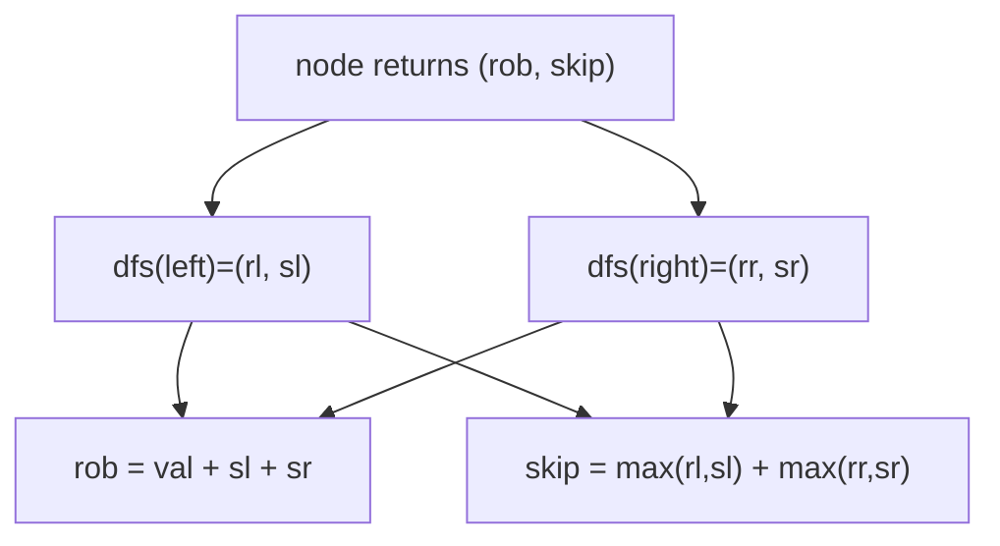

Tree DP relatives: Diameter of tree, Binary Tree Max Path Sum, Distribute coins, Rerooting DP (sum of distances).

#### 📐 Math — why tree DP is linear
Each node returns a small fixed tuple (e.g. `(rob, skip)`) combined from its children in $O(1)$, so total cost is $\sum_{\text{nodes}}O(1)=O(n)$ with stack depth $O(h)$. The include/exclude pair encodes "can't take a node and its child" — the tree analogue of House Robber's $dp[i-1]$ vs $dp[i-2]$. **Rerooting** computes the answer for *every* node as root in $O(n)$ using two DFS passes (aggregate up, then push contributions back down).

---

## Pattern 10 — Bitmask DP

**Signal:** $n \le \sim 20$, you must track a **set** of "used" elements. State includes a bitmask of which elements are taken.

**State:** `dp[mask][...]` where bit `j` of `mask` = element `j` used.

### Traveling Salesman Problem (TSP)

**Python**
```python
def tsp(dist):
    n = len(dist)
    INF = float('inf')
    dp = [[INF]*n for _ in range(1<<n)]
    dp[1][0] = 0                              # start at city 0
    for mask in range(1<<n):
        for u in range(n):
            if not (mask >> u) & 1: continue
            if dp[mask][u] == INF: continue
            for v in range(n):
                if (mask >> v) & 1: continue
                nm = mask | (1<<v)
                dp[nm][v] = min(dp[nm][v], dp[mask][u] + dist[u][v])
    return min(dp[(1<<n)-1][u] + dist[u][0] for u in range(n))
```

**C++**
```cpp
int tsp(vector<vector<int>>& dist) {
    int n = dist.size();
    const int INF = 1e9;
    vector<vector<int>> dp(1<<n, vector<int>(n, INF));
    dp[1][0] = 0;                              // start at city 0
    for (int mask = 0; mask < (1<<n); ++mask)
        for (int u = 0; u < n; ++u) {
            if (!((mask >> u) & 1) || dp[mask][u] == INF) continue;
            for (int v = 0; v < n; ++v) {
                if ((mask >> v) & 1) continue;
                int nm = mask | (1<<v);
                dp[nm][v] = min(dp[nm][v], dp[mask][u] + dist[u][v]);
            }
        }
    int best = INF;
    for (int u = 0; u < n; ++u) best = min(best, dp[(1<<n)-1][u] + dist[u][0]);
    return best;
}
```

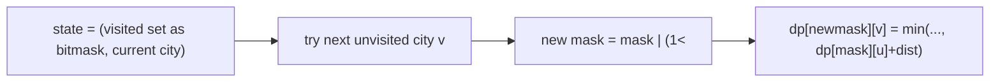

- Complexity: $O(2^n \cdot n^2)$. Bitmask DP relatives: Assignment problem, "Partition to K equal subsets", "Shortest Superstring", "Number of ways to wear hats".

#### 🔢 Iteration trace — TSP on 3 cities

Distances (symmetric): `dist[0][1]=10, dist[0][2]=15, dist[1][2]=20`. `dp[mask][u]` = shortest path that **visits exactly the cities in `mask`** and ends at `u`. Masks are written as bits `c2 c1 c0`. Start: `dp[001][0] = 0`.

| `mask` (visited) | end `u` | from | `dp` value |
|---|---|---|---|
| `001` = {0} | 0 | start | **0** |
| `011` = {0,1} | 1 | dp[001][0]+dist[0][1] | **10** |
| `101` = {0,2} | 2 | dp[001][0]+dist[0][2] | **15** |
| `111` = {0,1,2} | 2 | dp[011][1]+dist[1][2] = 10+20 | **30** |
| `111` = {0,1,2} | 1 | dp[101][2]+dist[2][1] = 15+20 | **35** |

Close the tour back to city 0: `min(dp[111][1]+dist[1][0], dp[111][2]+dist[2][0]) = min(35+10, 30+15) = min(45, 45) = 45`.

> Answer **45** (tour `0→1→2→0` or its reverse). The bitmask lets two different *orders* that reach the same `(visited set, last city)` share one cell — collapsing $n!$ tours into $2^n\cdot n$ states.

#### 📐 Math — why bitmask beats brute force
A state is (visited-set, current vertex): $2^n\cdot n$ states with $O(n)$ transition → $\Theta(2^n n^2)$. It **merges every visit order that reaches the same set+vertex**, versus the $n!$ of raw permutations ($2^n n^2 \ll n!$ once $n\gtrsim 10$). Subset-partition variants iterate submasks, costing $\sum_{\text{mask}}2^{\text{popcount(mask)}}=\sum_k\binom nk 2^k=3^n$ by the binomial theorem.

---

## Pattern 11 — Digit DP

**Signal:** count numbers in a range `[L, R]` satisfying a digit property (e.g., count numbers with no `4`, digit sum divisible by k).

**State:** `dp[pos][tight][...extra]` building the number digit by digit.

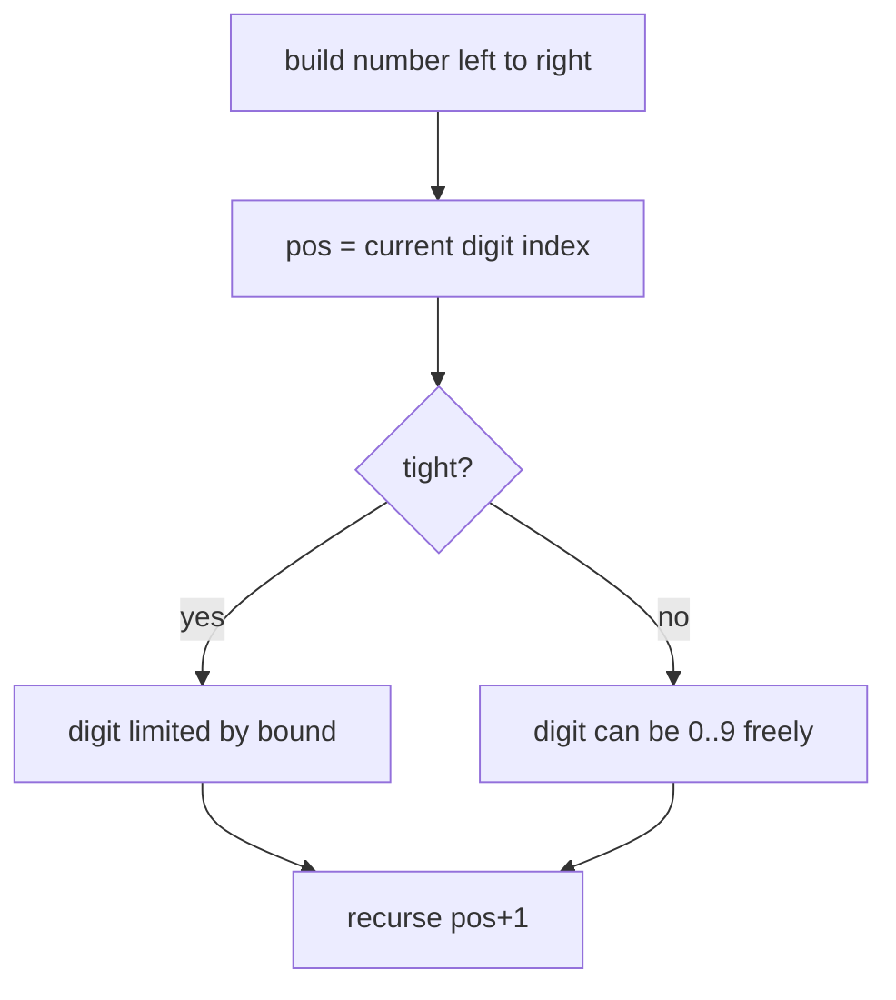

```python
def count_le(num_str, prop_ok):
    from functools import lru_cache
    digits = list(map(int, num_str))
    n = len(digits)
    @lru_cache(None)
    def dp(pos, tight, state):
        if pos == n:
            return 1 if prop_ok(state) else 0
        limit = digits[pos] if tight else 9
        total = 0
        for d in range(0, limit+1):
            total += dp(pos+1, tight and d == limit, next_state(state, d))
        return total
    return dp(0, True, initial_state)
```

```cpp
// digits[], n, and memo[pos][state] (sized for the chosen state range) are set up by the caller.
// next_state / prop_ok / initial_state are problem-specific.
long long dp(int pos, bool tight, int state) {
    if (pos == n) return prop_ok(state) ? 1 : 0;
    if (!tight && memo[pos][state] != -1) return memo[pos][state];  // cache only when free
    int limit = tight ? digits[pos] : 9;
    long long total = 0;
    for (int d = 0; d <= limit; ++d)
        total += dp(pos + 1, tight && d == limit, next_state(state, d));
    if (!tight) memo[pos][state] = total;
    return total;
}
// caller: count_le(R) = dp(0, true, initial_state) after loading R's digits.
```

Answer for `[L,R]` = `count_le(R) - count_le(L-1)`.

#### 📐 Math — range counting by prefix subtraction
Digit DP builds numbers $\le N$ left-to-right with a `tight` flag marking whether the prefix equals $N$'s prefix. States $=\text{positions}\times 2\times\text{extra}$, each branching over $\le 10$ digits → $O(\text{len}\cdot 10\cdot\text{extra})$. The range answer uses the **inclusion identity** $\#[L,R]=f(R)-f(L-1)$ — the discrete analogue of a definite integral $\int_L^R$.

---

## Pattern 12 — DP with "buy/sell stock" / state machine

**Signal:** a small set of discrete states with transitions between them per step (hold / not‑hold / cooldown).

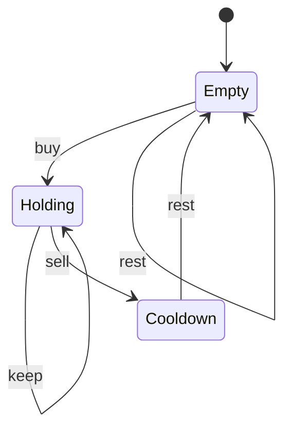

**Python**
```python
# Best Time to Buy/Sell with cooldown
def max_profit(prices):
    hold, empty, cooldown = float('-inf'), 0, 0
    for p in prices:
        hold, empty, cooldown = (
            max(hold, empty - p),       # buy or keep holding
            max(empty, cooldown),       # rest while empty
            hold + p                    # sell -> cooldown
        )
    return max(empty, cooldown)
```

**C++**
```cpp
int maxProfit(vector<int>& prices) {
    int hold = INT_MIN, empty = 0, cooldown = 0;
    for (int p : prices) {
        int nHold = max(hold, empty - p);   // buy or keep holding
        int nEmpty = max(empty, cooldown);  // rest while empty
        int nCool = hold + p;               // sell -> cooldown
        hold = nHold; empty = nEmpty; cooldown = nCool;
    }
    return max(empty, cooldown);
}
```

Relatives: stock with K transactions, with transaction fee, with cooldown — all are state‑machine DPs.

#### 📐 Math — DP as a finite automaton
Each step the system occupies one of a constant set of states (empty / holding / cooldown); transitions are the allowed actions. With $|Q|$ states the cost is $O(n\cdot|Q|)$. Adding "at most $k$ transactions" multiplies the state space by $k$ → $O(nk)$; a fee or cooldown only edits transition formulas, not the asymptotics. It is deterministic **value iteration** over a small state graph.

---

## Pattern 13 — Partition / "cut the sequence into groups"

**Signal:** split an array/string into segments to optimize a per‑segment cost.

**State:** `dp[i]` = best for the prefix of length `i`.
$$dp[i] = \min_{j<i}\big(dp[j] + cost(j, i)\big)$$

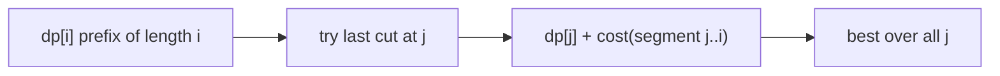

Relatives: Palindrome Partitioning II, Word Break, Partition Array for Max Sum, Minimum cost to split, Decode Ways.

```python
# Word Break
def word_break(s, words):
    wordset = set(words)
    dp = [True] + [False]*len(s)
    for i in range(1, len(s)+1):
        for j in range(i):
            if dp[j] and s[j:i] in wordset:
                dp[i] = True
                break
    return dp[-1]
```

**C++**
```cpp
bool wordBreak(string s, vector<string>& words) {
    unordered_set<string> wordset(words.begin(), words.end());
    int n = s.size();
    vector<char> dp(n+1, false); dp[0] = true;
    for (int i = 1; i <= n; ++i)
        for (int j = 0; j < i; ++j)
            if (dp[j] && wordset.count(s.substr(j, i - j))) {
                dp[i] = true; break;
            }
    return dp[n];
}
```

#### 📐 Math — last-cut partition recurrence
Partition DP fixes the **last segment**: $dp[i]=\bigoplus_{j<i}\big(dp[j]\,\square\,\text{cost}(j,i)\big)$, where $\square,\oplus$ are problem-specific (OR for Word Break feasibility, $\min+$ for min-cost, $\sum$ for counting like Decode Ways). With $n$ prefixes and $O(n)$ cut choices each, cost is $O(n^2)$ times segment-cost. Word Break has $2^{n}$ candidate segmentations but only $n{+}1$ prefix-states, so memoization is what collapses the blow-up.

---

## Pattern 14 — Probability / Expected‑value DP

**Signal:** "probability that...", "expected number of...".

**State:** `dp[...]` = probability/expectation of a configuration; transitions weighted by probabilities.

```python
# Knight probability on chessboard (stays on board after k moves)
def knight_probability(n, k, r, c):
    moves = [(1,2),(2,1),(-1,2),(-2,1),(1,-2),(2,-1),(-1,-2),(-2,-1)]
    dp = [[0]*n for _ in range(n)]
    dp[r][c] = 1
    for _ in range(k):
        ndp = [[0]*n for _ in range(n)]
        for i in range(n):
            for j in range(n):
                if dp[i][j]:
                    for di, dj in moves:
                        x, y = i+di, j+dj
                        if 0 <= x < n and 0 <= y < n:
                            ndp[x][y] += dp[i][j] / 8.0
        dp = ndp
    return sum(map(sum, dp))
```

**C++**
```cpp
double knightProbability(int n, int k, int r, int c) {
    int moves[8][2] = {{1,2},{2,1},{-1,2},{-2,1},{1,-2},{2,-1},{-1,-2},{-2,-1}};
    vector<vector<double>> dp(n, vector<double>(n, 0));
    dp[r][c] = 1;
    for (int step = 0; step < k; ++step) {
        vector<vector<double>> ndp(n, vector<double>(n, 0));
        for (int i = 0; i < n; ++i)
            for (int j = 0; j < n; ++j)
                if (dp[i][j])
                    for (auto& m : moves) {
                        int x = i + m[0], y = j + m[1];
                        if (x >= 0 && x < n && y >= 0 && y < n)
                            ndp[x][y] += dp[i][j] / 8.0;
                    }
        dp = ndp;
    }
    double total = 0;
    for (auto& row : dp) for (double v : row) total += v;
    return total;
}
```

#### 📐 Math — probabilities and expectations
Probability DP weights each transition by its chance and **sums** them (law of total probability): $P(s)=\sum_a P(a)\,P(s\to s'_a)$, with outgoing weights summing to 1. Expected values use **linearity of expectation** $E[s]=\sum_a P(a)\,(\text{reward}+E[s'_a])$ — a linear system solvable directly by DP when the state graph is acyclic (else by iteration / Gaussian elimination).

---

## Pattern 15 — Game Theory DP (minimax)

**Signal:** two players alternate, both play optimally; decide winner or optimal score.

**State:** `dp[i][j]` = best score difference the current player can achieve on range `[i,j]`.
$$dp[i][j] = \max\big(a_i - dp[i+1][j],\ a_j - dp[i][j-1]\big)$$

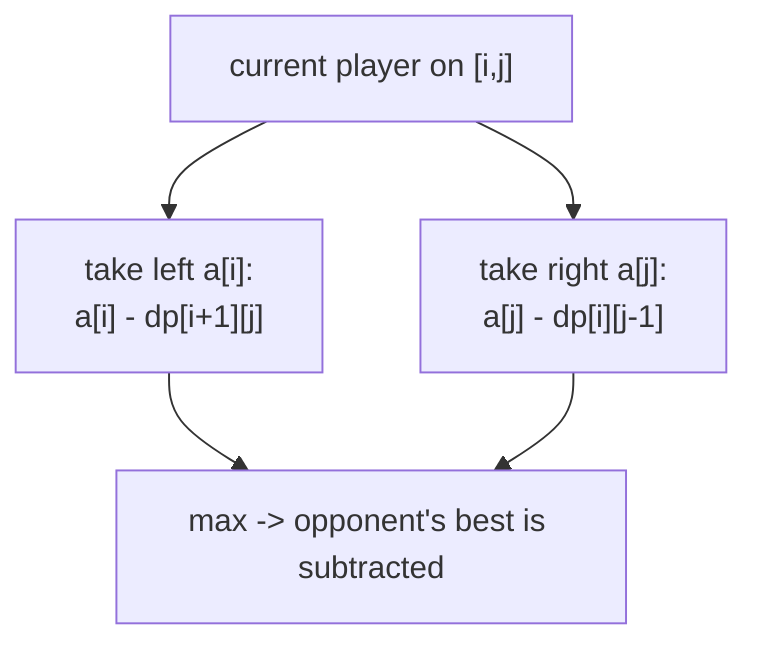

```python
# Stone Game / Predict the Winner
def predict_winner(nums):
    n = len(nums)
    dp = nums[:]                       # dp[i][j] collapsed to 1D over j
    for i in range(n-1, -1, -1):
        new = dp[:]
        for j in range(i+1, n):
            new[j] = max(nums[i] - new[j], nums[j] - dp[j-1])
        dp = new
    return dp[n-1] >= 0
```

**C++**
```cpp
bool predictWinner(vector<int>& nums) {
    int n = nums.size();
    vector<int> dp(nums.begin(), nums.end());   // collapsed to 1D over j
    for (int i = n-1; i >= 0; --i) {
        vector<int> next = dp;
        for (int j = i+1; j < n; ++j)
            next[j] = max(nums[i] - next[j], nums[j] - dp[j-1]);
        dp = next;
    }
    return dp[n-1] >= 0;
}
```

#### 📐 Math — zero-sum minimax as one number
Tracking the **score difference** for the player to move turns minimax into a single recurrence $dp[i][j]=\max(a_i-dp[i+1][j],\ a_j-dp[i][j-1])$. Subtracting the opponent's best encodes $V_\text{you}=-V_\text{opponent}$ (a zero-sum, finite-horizon Bellman equation). Player 1 wins iff $dp[0][n-1]\ge 0$. With $\Theta(n^2)$ ranges and $O(1)$ work, cost is $O(n^2)$.

---

## 🗺️ Master decision flow — "which pattern is this?"

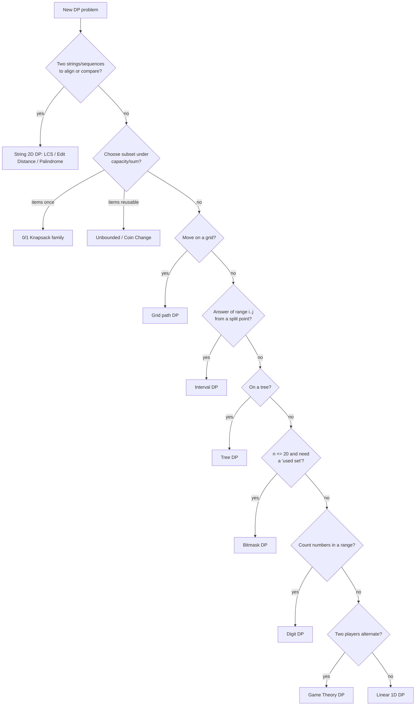

---

## 📋 Pattern quick‑reference table

| Pattern | State | Transition core | Time | Typical problems |
|---|---|---|---|---|
| Linear 1D | `dp[i]` | `f(dp[i-1], dp[i-2])` | $O(n)$ | Stairs, House Robber, Kadane |
| 0/1 Knapsack | `dp[i][w]` | take vs skip | $O(nW)$ | Knapsack, Partition, Target Sum |
| Unbounded | `dp[a]` | reuse items | $O(nA)$ | Coin Change, Rod Cutting |
| LCS / 2D string | `dp[i][j]` | match/diag vs max | $O(nm)$ | LCS, Edit Distance |
| Palindrome | `dp[i][j]` | ends equal? | $O(n^2)$ | LPS, Pal. Partition |
| LIS | `dp[i]` / tails | extend longest | $O(n\log n)$ | LIS, Envelopes |
| Grid | `dp[i][j]` | from up/left | $O(mn)$ | Unique Paths, Min Path Sum |
| Interval | `dp[i][j]` | split at k | $O(n^3)$ | MCM, Burst Balloons |
| Tree | per-node tuple | from children | $O(n)$ | Robber III, Diameter |
| Bitmask | `dp[mask][i]` | add element | $O(2^n n^2)$ | TSP, Assignment |
| Digit | `dp[pos][tight]` | place a digit | $O(\text{digits}\cdot 10)$ | Count in range |
| State machine | `dp[state]` | transitions | $O(n)$ | Stock problems |
| Partition | `dp[i]` | last cut at j | $O(n^2)$ | Word Break, Decode |
| Probability | `dp[...]` | weighted moves | varies | Knight prob. |
| Game theory | `dp[i][j]` | minimax | $O(n^2)$ | Stone Game |

---

**Next:** [05 — Identifying DP & Optimizing →](05-identifying-and-optimizing.md)
