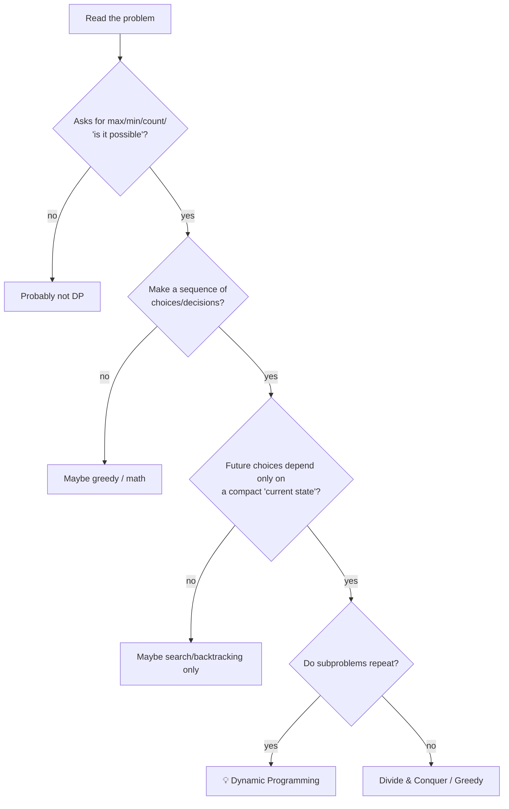
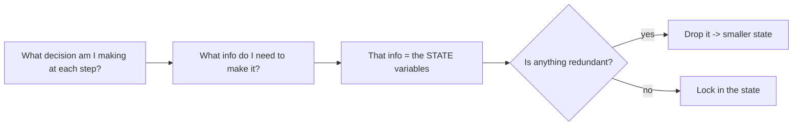
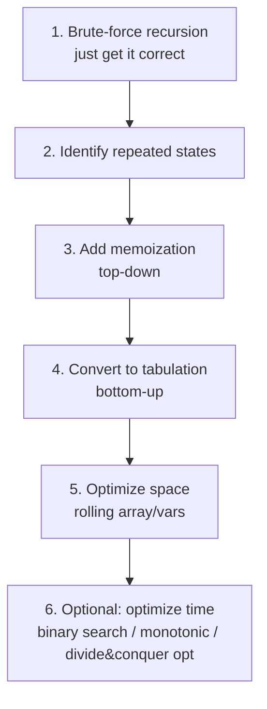
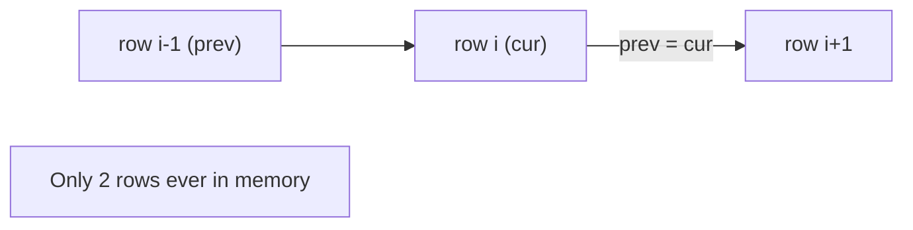
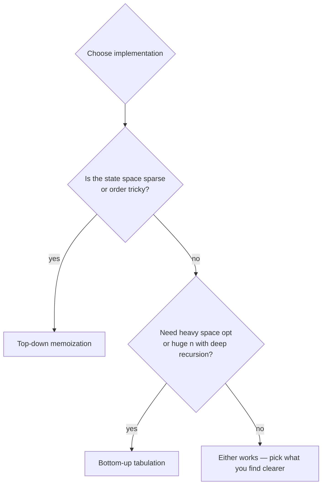
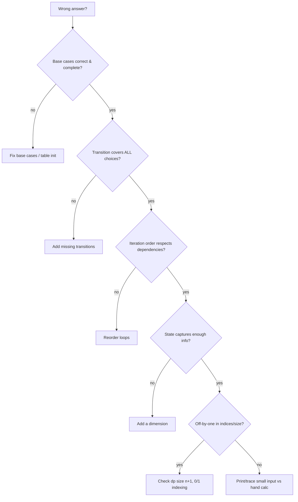
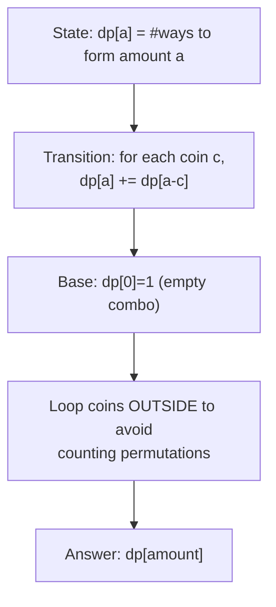

# 05 — Identifying DP & Optimizing Solutions

This guide is about the *meta‑skill*: looking at an unseen problem and (1) deciding whether it's a DP problem, (2) designing the right state, and (3) optimizing time and space. Plus a debugging checklist.

---

## 1. How to *recognize* a DP problem (the signals)



### Strong textual signals (keywords)
| Phrase in problem | Likely pattern |
|---|---|
| "number of ways / count" | counting DP |
| "minimum / maximum cost / value" | optimization DP |
| "can you / is it possible to reach" | boolean reachability DP |
| "longest / shortest subsequence" | LIS / LCS |
| "at most K / exactly K" | extra dimension in state |
| "subset / partition / pick items" | knapsack |
| "two strings" | 2D string DP |
| "in range [L, R] count numbers" | digit DP |
| "both players play optimally" | game DP |
| "grid, move right/down" | grid DP |

### The decisive test
> Ask: **"To solve the whole problem, do I keep solving the *same smaller question* over and over?"** If yes → memoize → DP.

---

## 2. Designing the STATE (the hardest, most important step)

A good state is **sufficient** (captures all info needed for future decisions) and **minimal** (nothing extra → smaller table → faster).



### State‑design worksheet (fill this for any problem)
1. **What am I iterating over?** (index in array, position in string, node in tree, remaining capacity…)
2. **What constraints carry forward?** (remaining budget, last chosen value, count used, parity…)
3. **State = (1) + (2).** Write `dp[...]` with one dimension per independent piece of info.
4. **Transition:** from the current state, enumerate each possible decision → which states do you move to?
5. **Base case & answer.**

### Examples of state expansion
| Problem twist | State change |
|---|---|
| "...at most K transactions" | add a `k` dimension: `dp[i][k]` |
| "...can skip up to M obstacles" | add `m` remaining: `dp[i][m]` |
| "...track last element chosen" | add `prev`: `dp[i][prev]` |
| "...two agents moving together" | duplicate position dims: `dp[r1][c1][r2][c2]` |
| "...modulo property" | add remainder: `dp[i][r]` |

> 🧠 **Rule of thumb:** every extra "at most K / track last / two players" almost always = **one more dimension** in the DP state.

---

## 3. From idea to code — the reliable workflow



Do **not** jump to step 5. Get a correct slow solution first; optimize second. Most interview/contest DP only needs steps 1–4.

---

## 4. Space optimization techniques

### A) Rolling array (2D → 1D) when `dp[i]` depends only on `dp[i-1]`

```python
# Before: O(n*m) space
dp = [[0]*(m+1) for _ in range(n+1)]
# After: O(m) space — keep only previous row (or even one row in place)
prev = [0]*(m+1)
for i in range(1, n+1):
    cur = [0]*(m+1)
    for j in range(1, m+1):
        cur[j] = f(prev[j], cur[j-1], prev[j-1])
    prev = cur
```

```cpp
// Before: O(n*m) space — vector<vector<int>> dp(n+1, vector<int>(m+1, 0));
// After: O(m) space — keep only the previous row
vector<int> prev(m + 1, 0);
for (int i = 1; i <= n; ++i) {
    vector<int> cur(m + 1, 0);
    for (int j = 1; j <= m; ++j)
        cur[j] = f(prev[j], cur[j - 1], prev[j - 1]);
    prev = cur;
}
```



#### 🔢 Iteration trace — watch the rolling 1D knapsack array

Same items as guide 04 — `(2,3),(3,4),(4,5)`, capacity `W=5`. The **full 2D table** (left) needs $O(nW)$ memory; the **rolled 1D array** (right) keeps only the latest row, yet ends with the identical answer.

| | full `dp[i][w]` row | rolled `dp[w]` after item |
|---|---|---|
| init | `[0,0,0,0,0,0]` | `[0,0,0,0,0,0]` |
| item (2,3) | `[0,0,3,3,3,3]` | `[0,0,3,3,3,3]` |
| item (3,4) | `[0,0,3,4,4,7]` | `[0,0,3,4,4,7]` |
| item (4,5) | `[0,0,3,4,5,7]` | `[0,0,3,4,5,7]` |

> Both reach `dp[5]=7`. The 1D version overwrites the *same* array each item (looping `w` **downward** so `dp[w-2]` is still the previous item's value). Memory drops from $O(nW)$ to $O(W)$ — the rows above are never read again, so storing them is wasted space.

### B) Single variables when `dp[i]` depends on $O(1)$ predecessors
Fibonacci / House Robber → just keep 2 variables → $O(1)$ space.

### C) In‑place 1D for knapsack
The 0/1 knapsack rolled to a single array (loop capacity downward) is the canonical example.

| Original | Optimized | When valid |
|---|---|---|
| `dp[i][w]` | `dp[w]` | depends only on previous row |
| `dp[i][j]` (strings) | two rows / one row | row `i` needs only `i-1` |
| `dp[i]` (Fib-like) | 2 scalars | needs only `i-1`, `i-2` |

> ⚠️ Space optimization can break **solution reconstruction** (you discard the table). If you must recover the actual choices, keep the full table or store parent pointers.

#### 📐 Math — the cost equation: shrink $|S|$ vs shrink $\tau$
$$\text{Time}=|S|\times\tau,\qquad |S|=\prod_d(\text{size of dimension }d),\qquad \text{Space}=O(|S|).$$
Space optimization attacks $|S|$: if $dp[i]$ reads only $dp[i-1]$, the dependency "width" is one row, so the **reachable set** at any moment is $O(m)$ not $O(nm)$ — which is exactly why rolling a 2D table to 1D (or Fibonacci to 2 scalars) is provably correct. The rule: you may drop a stored dimension whenever no future state ever reads it again. Always identify which factor ($|S|$ or $\tau$) dominates *before* optimizing — halving the smaller one is wasted effort.

---

## 5. Time optimization techniques (advanced)

```mermaid
mindmap
  root((Speed up a DP))
    Binary search
      LIS O(n^2)->O(n log n)
    Monotonic queue/stack
      sliding window max in transition
    Prefix sums
      range cost in O(1)
    Convex Hull Trick
      dp with linear transitions
    Divide & Conquer optimization
      quadrangle inequality
    Knuth optimization
      interval DP O(n^3)->O(n^2)
    Matrix exponentiation
      linear recurrence O(log n)
    SOS DP
      subset sum over masks
```

| Technique | Reduces | Trigger condition |
|---|---|---|
| Binary search on `tails` | $O(n^2)\to O(n\log n)$ | LIS-type |
| Prefix sums | $O(n)$ transition $\to O(1)$ | range sum in transition |
| Monotonic deque | $O(nk)\to O(n)$ | windowed min/max transition |
| Convex Hull Trick | $O(n^2)\to O(n\log n)$ | `dp[i]=min(dp[j]+a[j]*x)` |
| Knuth optimization | $O(n^3)\to O(n^2)$ | interval DP w/ quadrangle ineq. |
| Matrix exponentiation | $O(n)\to O(\log n)$ | constant‑coefficient linear recurrence |

> Most problems never need these — but recognizing the trigger (e.g., "transition is min over a window") tells you a speed‑up exists.

#### 📐 Math — the inequalities behind each speed-up
Each speed-up rests on a provable identity, not magic.

**Prefix sums:** $\sum_{k=i}^{j} a_k = P_j-P_{i-1}$ with $P_t=\sum_{k\le t}a_k$ collapses a range-cost transition from $O(n)$ to $O(1)$.

**LIS binary search:** the `tails` array (smallest tail per length) is *always sorted*, so the insertion point is $\texttt{lower\_bound}(tails, x)$ in $O(\log n)$ → $O(n\log n)$ total. Replacing a tail is safe because a smaller tail never reduces future extendability.

**Convex Hull Trick:** when $dp[i]=\min_{j<i}(m_j x_i+b_j)$, each $j$ is a line and $dp[i]$ is the lower envelope at $x_i$. Maintaining the lower hull gives $O(1)$ amortized (monotone slopes) or $O(\log n)$ queries → $O(n^2)\to O(n\log n)$. Line $\ell_2$ is discardable iff $\dfrac{b_3-b_1}{m_1-m_3}\le\dfrac{b_2-b_1}{m_1-m_2}$.

**Knuth optimization:** for $dp[i][j]=\min_{i\le k<j}(dp[i][k]+dp[k+1][j])+C(i,j)$, if $C$ satisfies the **quadrangle inequality** $C(a,c)+C(b,d)\le C(a,d)+C(b,c)$ ($a\le b\le c\le d$) and is monotone, the optimal split is monotone $\text{opt}[i][j-1]\le\text{opt}[i][j]\le\text{opt}[i+1][j]$, telescoping $\Theta(n^3)\to\Theta(n^2)$. The related **divide-and-conquer DP optimization** (opt monotone within a layer) gives $T(n)=2T(n/2)+O(n\log n)=O(n\log^2 n)$ per layer.

**Matrix exponentiation:** a constant-coefficient linear recurrence is a matrix power, e.g.
$$\begin{pmatrix}F_{n+1}\\ F_n\end{pmatrix}=\begin{pmatrix}1&1\\ 1&0\end{pmatrix}^{\!n}\begin{pmatrix}1\\0\end{pmatrix}.$$
Fast (binary) exponentiation $M^n=M\cdot M^{n-1}$ (odd) $=(M^{n/2})^2$ (even) computes it in $O(k^3\log n)$ for a $k\times k$ matrix → $O(n)\to O(\log n)$, essential when $n\le10^{18}$.

> 🔑 **Meta-rule:** read the *algebraic form* of the transition — windowed min → monotonic deque; linear-in-$x$ min → CHT; interval split obeying QI → Knuth; fixed linear recurrence → matrix power.

---

## 6. Top‑down vs bottom‑up — final decision guide



- **Top‑down** when: the recurrence is natural, only a fraction of states are reachable, or ordering is hard to get right.
- **Bottom‑up** when: you want $O(1)$/rolling space, want to avoid recursion limits, or the state order is simple.

---

## 7. Debugging DP — a checklist



### Practical debugging tips
- **Verify against brute force** on small inputs (write the naive recursion, compare outputs for all `n ≤ 12`).
- **Print the DP table** for a tiny case and check a few cells by hand.
- **Check table dimensions:** off‑by‑one (`n` vs `n+1`) is the most common bug.
- **Re‑examine loop direction** (the knapsack up/down trap; palindrome/interval ordering).
- **Watch integer overflow** in languages like C++/Java (use `long long` for counting DPs).

---

## 8. Complexity estimation before you code

Estimate **states × transition** and compare to limits:

| `n` constraint | Acceptable complexity | Likely intended |
|---|---|---|
| $n \le 20$ | $O(2^n)$, $O(2^n\cdot n)$ | bitmask / subsets |
| $n \le 100$ | $O(n^3)$ | interval DP |
| $n \le 1000$ | $O(n^2)$ | 2D DP / LIS n² |
| $n \le 10^5$ | $O(n\log n)$ | LIS n log n / greedy+DP |
| $n \le 10^6$ | $O(n)$ | linear DP |

> 📐 If your `states × transition` exceeds the limit, you need a different state, an optimization from §5, or it's not DP.

---

## 9. A complete worked example (idea → optimized)

**Problem:** Given coins and an amount, count the number of combinations that make the amount.



```python
def change(amount, coins):
    dp = [1] + [0]*amount       # base: one way to make 0
    for c in coins:             # coin outer => combinations only
        for a in range(c, amount+1):
            dp[a] += dp[a-c]    # transition
    return dp[amount]           # answer
```

```cpp
int change(int amount, vector<int>& coins) {
    vector<long long> dp(amount + 1, 0);
    dp[0] = 1;                          // base: one way to make 0
    for (int c : coins)                 // coin outer => combinations only
        for (int a = c; a <= amount; ++a)
            dp[a] += dp[a - c];         // transition
    return (int)dp[amount];             // answer
}
```

- States: `amount+1`. Transition: $O(1)$ per (coin, amount). Time $O(\text{coins}\cdot\text{amount})$, space $O(\text{amount})$ — already optimal.

#### 🔢 Iteration trace — counting combinations for `amount = 5`, coins `[1, 2, 5]`

`dp[a]` = number of combinations making `a`. Process **one coin at a time** (outer loop), updating `dp[a] += dp[a-c]`. Watching the array after each coin shows how combinations accumulate without double‑counting orderings:

| after coin | dp[0] | dp[1] | dp[2] | dp[3] | dp[4] | dp[5] |
|---|---|---|---|---|---|---|
| init | 1 | 0 | 0 | 0 | 0 | 0 |
| **1** | 1 | 1 | 1 | 1 | 1 | 1 |
| **2** | 1 | 1 | 2 | 2 | 3 | 3 |
| **5** | 1 | 1 | 2 | 2 | 3 | **4** |

> Answer **4** ways: `5`, `1+2+2`, `1+1+1+2`, `1+1+1+1+1`. After coin `1` every amount has exactly one all‑ones combo; coin `2` adds combos that use twos; coin `5` adds the single `{5}` combo at `dp[5]`. Because the coin loop is **outer**, `1+2+2` and `2+2+1` are counted **once**, not as separate permutations.

---

## 10. Final mastery checklist

- [ ] I can classify a new problem into one of the 15 patterns in [guide 04](04-dp-patterns.md).
- [ ] I can write the state, transition, base case, and answer before coding.
- [ ] I start with brute force, then memoize, then tabulate, then optimize.
- [ ] I can roll a 2D DP to 1D and explain when it's safe.
- [ ] I can estimate complexity from constraints and pick the right approach.
- [ ] I debug with brute‑force comparison and table printing.

---

**Practice now:** head to [../problems/README.md](../problems/README.md) and solve problems pattern‑by‑pattern. Re‑read this guide whenever you get stuck — the answer is almost always "fix the state" or "fix the order."
