# 06 — Backtracking: A Complete Beginner's Guide

> **Backtracking** is a problem‑solving technique where you build a solution **one piece at a time**, and the moment you realize the current piece can't lead to a valid full solution, you **undo it** ("backtrack") and try a different piece. It's like exploring a maze: walk down a path, and if it dead‑ends, walk back to the last junction and try another route.

This guide assumes **zero prior knowledge**. Every idea is explained slowly, with diagrams, and every code example is given in **both Python and C++**.

---

## 0. Prerequisite: make sure you understand recursion first

Backtracking is built **on top of** recursion. If recursion still feels fuzzy, read [01 — Recursion Fundamentals](01-recursion-fundamentals.md) first. The one sentence you must believe:

> A function can call **itself** to solve a smaller version of the same problem, and the computer keeps track of every unfinished call on a "stack."

That's it. Backtracking just adds **two extra ideas** to recursion: **trying choices in a loop**, and **undoing a choice** before trying the next one.

---

## 1. The core idea, explained with a real‑life analogy

Imagine you're filling out a multiple‑choice form, but you don't know the answers. A brute, systematic way to find a valid combination:

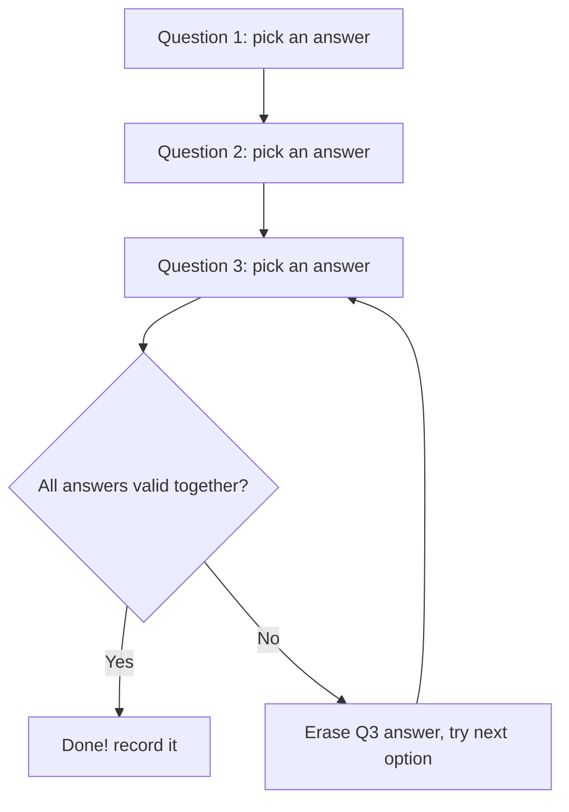

The key move is **"erase Q3's answer and try the next option."** That erasing is **backtracking**. You go back one step, restore the state to how it was, and explore a different branch.

### The three magic words: **Choose → Explore → Un‑choose**

Every backtracking algorithm is this loop, repeated recursively:

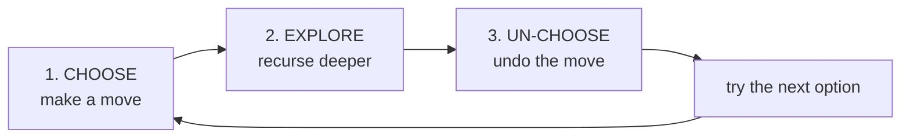

1. **Choose** — pick one of the available options and apply it to your current state.
2. **Explore** — recursively continue building the solution with that choice in place.
3. **Un‑choose** — undo the choice (restore the state), so the next option starts from a clean slate.

> 🔑 The **un‑choose** step is the single thing that separates backtracking from ordinary recursion. Without it, leftover state from one branch would corrupt the next branch.

---

## 2. The "state space tree" — how to picture backtracking

Backtracking explores a **tree of partial solutions**. Each node is a partial solution; each edge is a choice. The leaves are either complete solutions or dead ends.

Let's build all sequences using letters `A` and `B` of length 2:

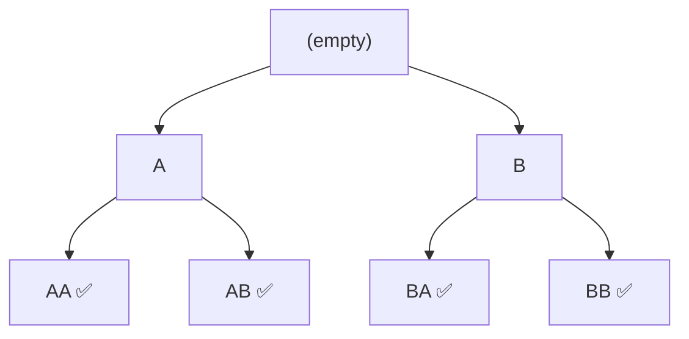

- **Root** = empty partial solution.
- **Going down** = making a choice (Choose + Explore).
- **Going back up** = undoing a choice (Un‑choose).
- **Leaves** = complete solutions we record.

Backtracking performs a **depth‑first traversal** of this tree: it goes as deep as possible, then backs up and tries the next branch.

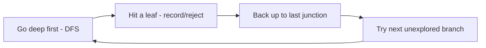

---

## 3. Your first backtracking program, line by line

**Goal:** print every sequence of `H` (heads) and `T` (tails) for `n` coin flips.

### Python
```python
def coin_sequences(n):
    path = []                       # the partial solution being built

    def backtrack(position):
        # BASE CASE: we've made a choice for every position
        if position == n:
            print("".join(path))    # 'path' is now a complete solution
            return

        for face in ("H", "T"):     # the options at this position
            path.append(face)       # 1. CHOOSE: place this face
            backtrack(position + 1) # 2. EXPLORE: fill the remaining positions
            path.pop()              # 3. UN-CHOOSE: remove it, try the other face

    backtrack(0)
```

### C++
```cpp
#include <bits/stdc++.h>
using namespace std;

void backtrack(int position, int n, string& path) {
    // BASE CASE: a choice has been made for every position
    if (position == n) {
        cout << path << "\n";       // 'path' is a complete solution
        return;
    }
    for (char face : {'H', 'T'}) {  // the options at this position
        path.push_back(face);       // 1. CHOOSE
        backtrack(position + 1, n, path); // 2. EXPLORE
        path.pop_back();            // 3. UN-CHOOSE
    }
}

int main() {
    int n = 3;
    string path = "";
    backtrack(0, n, path);
}
```

### Watch it run for `n = 2`

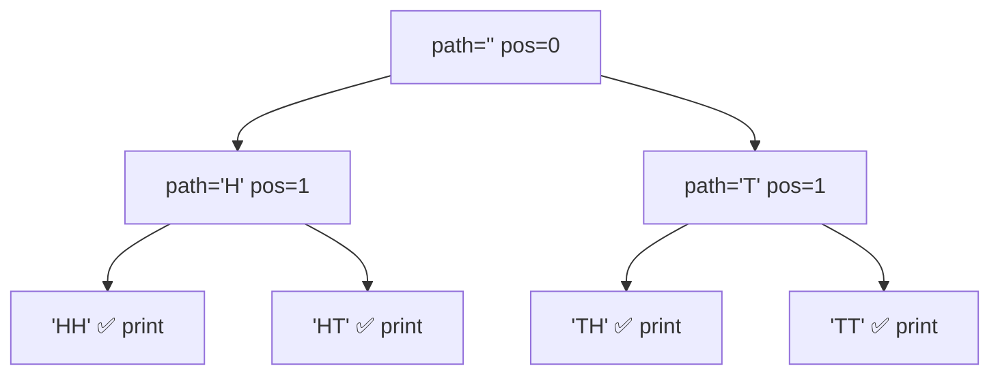

Trace of the `path` variable over time (notice how `pop` restores it):

```
append H -> [H]
  append H -> [H,H]   print "HH"
  pop      -> [H]
  append T -> [H,T]   print "HT"
  pop      -> [H]
pop        -> []
append T -> [T]
  append H -> [T,H]   print "TH"
  pop      -> [T]
  append T -> [T,T]   print "TT"
  pop      -> [T]
pop        -> []
```

> 💡 Every `append` (Choose) is eventually matched by a `pop` (Un‑choose) at the same level. This pairing keeps `path` correct for every branch.

---

## 4. The universal backtracking template (memorize this shape)

Almost every backtracking solution fits this skeleton. Learn it once, reuse it forever.

### Python
```python
def solve(problem):
    result = []
    path = []                       # current partial solution

    def backtrack(state):
        if is_complete(state):      # reached a full solution?
            result.append(path[:])  # save a COPY (important!)
            return

        for choice in options(state):
            if not is_valid(state, choice):
                continue            # PRUNE: skip choices that can't work

            make(path, choice)      # 1. CHOOSE
            backtrack(advance(state, choice))  # 2. EXPLORE
            undo(path, choice)      # 3. UN-CHOOSE (backtrack)

    backtrack(initial_state)
    return result
```

### C++
```cpp
void backtrack(State state, vector<int>& path, vector<vector<int>>& result) {
    if (isComplete(state)) {
        result.push_back(path);     // push_back copies the vector
        return;
    }
    for (int choice : options(state)) {
        if (!isValid(state, choice)) continue;  // PRUNE

        path.push_back(choice);     // 1. CHOOSE
        backtrack(advance(state, choice), path, result); // 2. EXPLORE
        path.pop_back();            // 3. UN-CHOOSE
    }
}
```

The five things you must define for any problem:

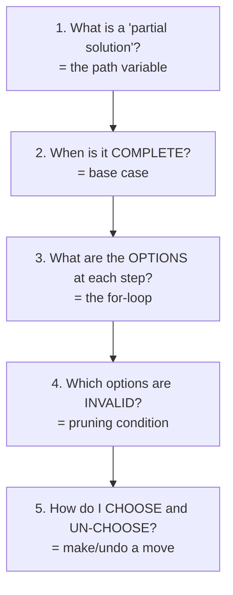

> ⚠️ **Beginner trap:** In Python you must store `path[:]` (a copy). If you store `path` directly, all saved results point to the *same* list, which keeps changing as you backtrack — so you end up with a list of identical (usually empty) results. In C++ `result.push_back(path)` copies automatically, so you're safe there.

---

## 5. Pruning — the reason backtracking is fast

A naive approach would generate **every** combination and then check each one. Backtracking is smarter: it **abandons a branch the instant it becomes hopeless**, skipping potentially enormous subtrees. This early abandonment is called **pruning**.

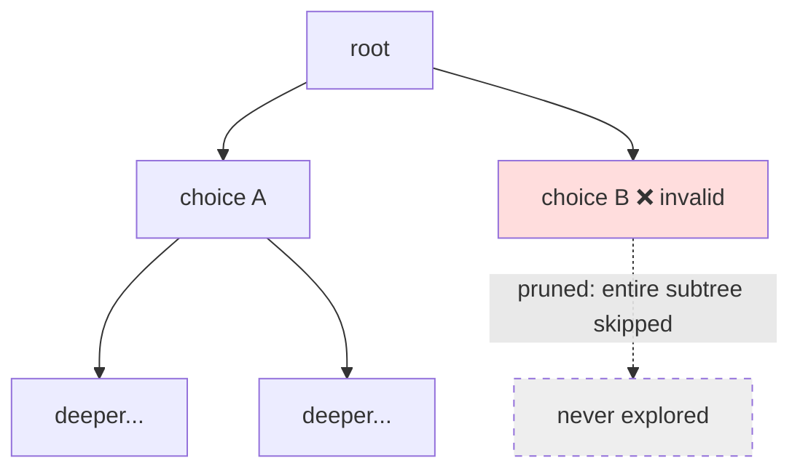

### Example: where pruning saves huge work

Suppose you're placing items that must sum to exactly 10, and you've already overshot to 12. There's no point continuing — every deeper choice only adds more. So you **prune** immediately instead of exploring thousands of doomed combinations.

```python
def backtrack(index, current_sum):
    if current_sum > target:        # PRUNE: impossible to fix by adding more
        return
    if current_sum == target:
        record_solution()
        return
    ...
```

```cpp
void backtrack(int index, int current_sum) {
    if (current_sum > target) return;   // PRUNE: adding more only overshoots
    if (current_sum == target) {
        recordSolution();
        return;
    }
    // ... try the remaining choices
}
```

> 🔑 **Good pruning is what turns an impossibly slow $O(\text{huge})$ search into something that finishes quickly.** Always ask: *"Can I tell right now that this branch is hopeless?"* If yes, return early.

---

## 6. The three classic problem families (with full Python + C++)

Almost every interview backtracking problem is a variation of these three. Understand them deeply.

### 6.1 Subsets (the power set) — "include or exclude each element"

**Problem:** given `[1, 2, 3]`, produce all subsets: `[], [1], [2], [3], [1,2], [1,3], [2,3], [1,2,3]`.

**The choice at each element:** *include it* or *exclude it*. That's 2 options per element → $2^n$ subsets.

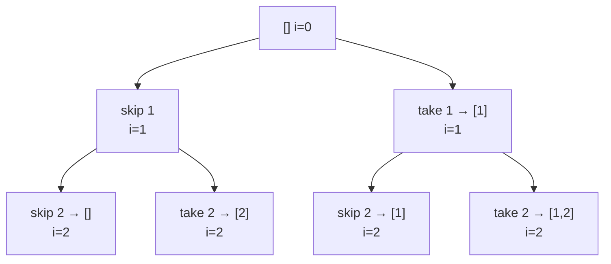

#### Python
```python
def subsets(nums):
    result, path = [], []

    def backtrack(i):
        if i == len(nums):          # decided include/exclude for every element
            result.append(path[:])  # save a copy of this subset
            return

        # Option 1: exclude nums[i]
        backtrack(i + 1)

        # Option 2: include nums[i]
        path.append(nums[i])        # CHOOSE
        backtrack(i + 1)            # EXPLORE
        path.pop()                  # UN-CHOOSE

    backtrack(0)
    return result
```

#### C++
```cpp
void backtrack(int i, vector<int>& nums, vector<int>& path,
               vector<vector<int>>& result) {
    if (i == (int)nums.size()) {
        result.push_back(path);     // save a copy
        return;
    }
    // Option 1: exclude nums[i]
    backtrack(i + 1, nums, path, result);

    // Option 2: include nums[i]
    path.push_back(nums[i]);        // CHOOSE
    backtrack(i + 1, nums, path, result); // EXPLORE
    path.pop_back();                // UN-CHOOSE
}

vector<vector<int>> subsets(vector<int>& nums) {
    vector<vector<int>> result;
    vector<int> path;
    backtrack(0, nums, path, result);
    return result;
}
```

#### 📐 Math — counting the power set
Each of the $n$ elements is independently *in* or *out*, so by the product rule there are $2^n$ subsets, forming a perfect binary decision tree: $2^n$ leaves and $2^{n+1}-1$ total nodes. Copying each subset costs $O(n)$, so total work is $O(2^n\cdot n)$. The identity $\sum_{k=0}^{n}\binom{n}{k}=2^n$ says the same thing by size — summing subsets of every size $k$ recovers the whole power set.

#### 🔢 Iteration trace — `subsets([1, 2, 3])`

At index `i` the code first recurses **excluding** `nums[i]`, then **includes** it and recurses again. Reading the leaves in the order they complete gives the full power set. `↳` marks depth:

| Order | `i` | `path` at the leaf (`i == 3`) | recorded subset |
|---|---|---|---|
| 1 | 3 | `[]` | `[]` |
| 2 | 3 | `[3]` | `[3]` |
| 3 | 3 | `[2]` | `[2]` |
| 4 | 3 | `[2,3]` | `[2,3]` |
| 5 | 3 | `[1]` | `[1]` |
| 6 | 3 | `[1,3]` | `[1,3]` |
| 7 | 3 | `[1,2]` | `[1,2]` |
| 8 | 3 | `[1,2,3]` | `[1,2,3]` |

> $2^3 = 8$ subsets. Each element doubles the count: the "exclude" branch keeps `path` as is, the "include" branch appends then `pop`s on return — so the eight leaves are exactly the binary choices `000`…`111` over the three elements.

---

### 6.2 Permutations — "arrange all elements in every order"

**Problem:** given `[1, 2, 3]`, produce all orderings: `[1,2,3], [1,3,2], [2,1,3], ...` — there are $n! = 6$.

**The choice at each step:** pick any element you **haven't used yet**. We track used elements with a boolean array.

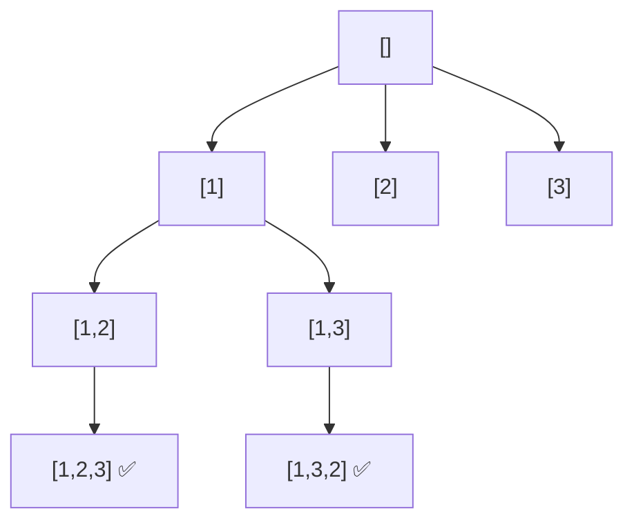

#### Python
```python
def permutations(nums):
    result, path = [], []
    used = [False] * len(nums)

    def backtrack():
        if len(path) == len(nums):  # used every element
            result.append(path[:])
            return

        for i in range(len(nums)):
            if used[i]:
                continue            # PRUNE: element already in the path
            used[i] = True          # CHOOSE
            path.append(nums[i])
            backtrack()             # EXPLORE
            path.pop()              # UN-CHOOSE
            used[i] = False

    backtrack()
    return result
```

#### C++
```cpp
void backtrack(vector<int>& nums, vector<bool>& used,
               vector<int>& path, vector<vector<int>>& result) {
    if (path.size() == nums.size()) {
        result.push_back(path);
        return;
    }
    for (int i = 0; i < (int)nums.size(); ++i) {
        if (used[i]) continue;      // PRUNE
        used[i] = true;             // CHOOSE
        path.push_back(nums[i]);
        backtrack(nums, used, path, result); // EXPLORE
        path.pop_back();            // UN-CHOOSE
        used[i] = false;
    }
}

vector<vector<int>> permute(vector<int>& nums) {
    vector<vector<int>> result;
    vector<int> path;
    vector<bool> used(nums.size(), false);
    backtrack(nums, used, path, result);
    return result;
}
```

> 💡 **Subsets vs Permutations in one line:** Subsets care about *which* elements (order doesn't matter), so we move forward with an index `i`. Permutations care about *order*, so we loop over *all* unused elements every time.

#### 📐 Math — counting orderings
The branching factor *shrinks* each level — $n$ unused choices, then $n-1$, then $n-2$ — so the leaf count is the factorial $n\cdot(n-1)\cdots 1 = n!$ and cost is $O(n!\cdot n)$. Equivalently, $n!$ counts the bijections of an $n$-element set. With repeated values the distinct count drops to the **multinomial** $\dfrac{n!}{\prod_v m_v!}$, where $m_v$ is the multiplicity of value $v$ (handled in §7).

#### 🔢 Iteration trace — `permutations([1, 2, 3])`

`used[]` marks which elements are already in `path`. At each level we loop over **all** elements and skip the used ones. The trace shows how the first branch (`1…`) fully expands before `used[0]` is cleared and we try `2…`:

| `path` | `used` | next free choices | result on completion |
|---|---|---|---|
| `[1]` | `T F F` | 2, 3 | |
| `[1,2]` | `T T F` | 3 | |
| `[1,2,3]` | `T T T` | — | **record `[1,2,3]`** |
| `[1,3]` | `T F T` | 2 | |
| `[1,3,2]` | `T T T` | — | **record `[1,3,2]`** |
| `[2]` | `F T F` | 1, 3 | … leads to `[2,1,3]`, `[2,3,1]` |
| `[3]` | `F F T` | 1, 2 | … leads to `[3,1,2]`, `[3,2,1]` |

> $3! = 6$ permutations. Branching is $3$ then $2$ then $1$ — the shrinking factorial fan‑out. Every `used[i]=True` / `path.append` is paired with `used[i]=False` / `path.pop` so sibling branches start clean.

---

### 6.3 Combinations — "choose exactly k of n"

**Problem:** choose `k = 2` numbers from `1..4`: `[1,2], [1,3], [1,4], [2,3], [2,4], [3,4]`.

**The trick:** use a `start` index so we never pick the same element twice and never produce the same combination in a different order.

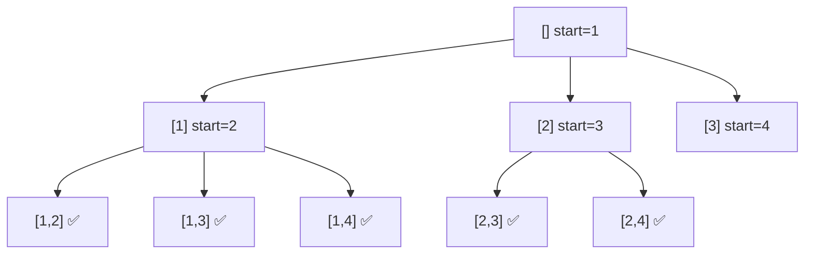

#### Python
```python
def combinations(n, k):
    result, path = [], []

    def backtrack(start):
        if len(path) == k:          # picked k numbers
            result.append(path[:])
            return

        # 'start' ensures we only go forward → no duplicates, no reordering
        for num in range(start, n + 1):
            path.append(num)        # CHOOSE
            backtrack(num + 1)      # EXPLORE (next pick starts after num)
            path.pop()              # UN-CHOOSE

    backtrack(1)
    return result
```

#### C++
```cpp
void backtrack(int start, int n, int k, vector<int>& path,
               vector<vector<int>>& result) {
    if ((int)path.size() == k) {
        result.push_back(path);
        return;
    }
    for (int num = start; num <= n; ++num) {
        path.push_back(num);        // CHOOSE
        backtrack(num + 1, n, k, path, result); // EXPLORE
        path.pop_back();            // UN-CHOOSE
    }
}

vector<vector<int>> combine(int n, int k) {
    vector<vector<int>> result;
    vector<int> path;
    backtrack(1, n, k, path, result);
    return result;
}
```

> 🔑 The `start` index is the secret to combinations. By always recursing with `num + 1`, you guarantee elements appear in increasing order, which eliminates duplicate sets like `[1,2]` and `[2,1]`.

#### 📐 Math — counting k-subsets
The increasing-`start` rule yields exactly $\binom{n}{k}=\frac{n!}{k!\,(n-k)!}$ leaves. Internal nodes obey the **hockey-stick identity** $\sum_{i=k}^{n}\binom{i}{k}=\binom{n+1}{k+1}$, so the work is *output-sensitive* — proportional to the number of combinations, not to $2^n$. The two branches "include `start`" vs "skip `start`" mirror **Pascal's rule** $\binom{n}{k}=\binom{n-1}{k-1}+\binom{n-1}{k}$.

---

## 7. Handling duplicates (a very common beginner stumbling block)

If the input has duplicates, e.g. `[1, 2, 2]`, naive backtracking produces duplicate results. The fix: **sort first**, then **skip a choice if it equals the previous choice at the same tree level**.

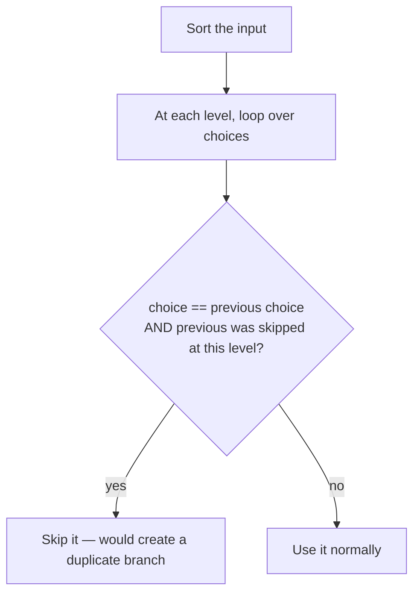

### Python (Subsets II — input may contain duplicates)
```python
def subsets_with_dup(nums):
    nums.sort()                     # bring duplicates next to each other
    result, path = [], []

    def backtrack(start):
        result.append(path[:])
        for i in range(start, len(nums)):
            # skip duplicates: same value as the previous sibling at THIS level
            if i > start and nums[i] == nums[i - 1]:
                continue
            path.append(nums[i])    # CHOOSE
            backtrack(i + 1)        # EXPLORE
            path.pop()              # UN-CHOOSE

    backtrack(0)
    return result
```

### C++
```cpp
void backtrack(int start, vector<int>& nums, vector<int>& path,
               vector<vector<int>>& result) {
    result.push_back(path);
    for (int i = start; i < (int)nums.size(); ++i) {
        if (i > start && nums[i] == nums[i - 1]) continue; // skip duplicate sibling
        path.push_back(nums[i]);    // CHOOSE
        backtrack(i + 1, nums, path, result); // EXPLORE
        path.pop_back();            // UN-CHOOSE
    }
}

vector<vector<int>> subsetsWithDup(vector<int>& nums) {
    sort(nums.begin(), nums.end()); // duplicates become adjacent
    vector<vector<int>> result;
    vector<int> path;
    backtrack(0, nums, path, result);
    return result;
}
```

> ⚠️ The condition is `i > start` (not `i > 0`). We only skip a duplicate when it's a **sibling** in the tree (same recursion level). Skipping based on `i > 0` would wrongly remove valid subsets where the duplicate is nested deeper.

#### 📐 Math — why sort-and-skip gives the exact count
Sorting groups equal values so a repeated value is used at most once per tree level. For a multiset with multiplicities $m_1,m_2,\dots$, the number of *distinct* permutations collapses from $n!$ to the **multinomial coefficient** $\dfrac{n!}{m_1!\,m_2!\cdots}$, and distinct subsets collapse from $2^n$ to $\prod_v (m_v+1)$ (each value independently contributes a chosen-count $0..m_v$). The `i > start` skip is exactly what removes the over-counting factor.

---

## 8. A harder example fully explained: N‑Queens

**Problem:** place `n` queens on an `n×n` chessboard so that no two attack each other (no shared row, column, or diagonal).

**Key insight:** place exactly **one queen per row**. Then for each row, we only choose *which column*. This already removes "two in the same row" automatically.

### What makes two queens attack each other?

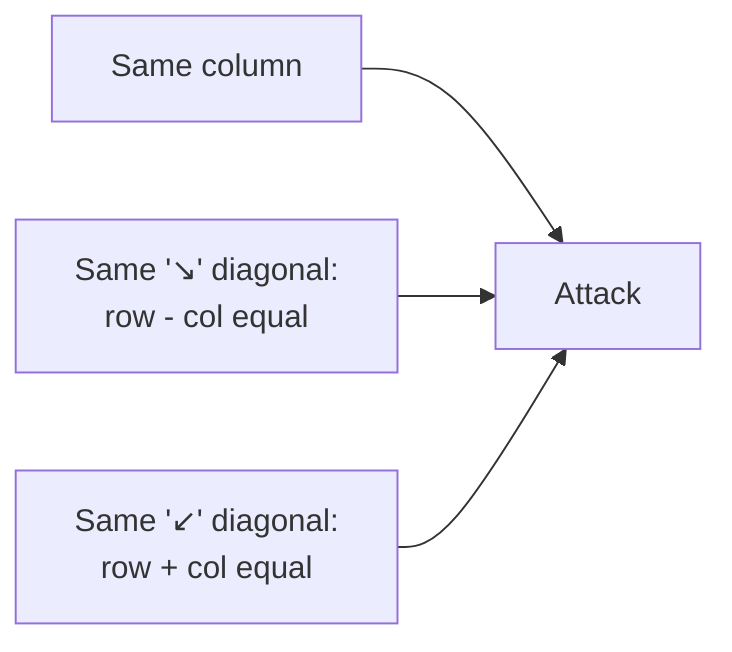

So we keep three sets: used **columns**, used **`row - col`** diagonals, and used **`row + col`** diagonals. A column is safe only if none of the three sets already contains its keys.

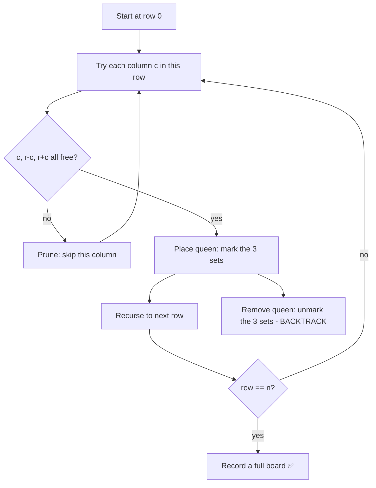

### Python
```python
def solve_n_queens(n):
    result = []
    board = [["."] * n for _ in range(n)]
    cols, diag1, diag2 = set(), set(), set()   # columns, r-c, r+c

    def backtrack(row):
        if row == n:                            # all rows filled successfully
            result.append(["".join(r) for r in board])
            return

        for col in range(n):
            # PRUNE: skip any column attacked on column or either diagonal
            if col in cols or (row - col) in diag1 or (row + col) in diag2:
                continue

            # CHOOSE: place the queen
            cols.add(col); diag1.add(row - col); diag2.add(row + col)
            board[row][col] = "Q"

            backtrack(row + 1)                  # EXPLORE next row

            # UN-CHOOSE: remove the queen
            cols.remove(col); diag1.remove(row - col); diag2.remove(row + col)
            board[row][col] = "."

    backtrack(0)
    return result
```

### C++
```cpp
void backtrack(int row, int n,
               vector<string>& board,
               set<int>& cols, set<int>& diag1, set<int>& diag2,
               vector<vector<string>>& result) {
    if (row == n) {                 // all queens placed
        result.push_back(board);
        return;
    }
    for (int col = 0; col < n; ++col) {
        // PRUNE: attacked on column or a diagonal?
        if (cols.count(col) || diag1.count(row - col) || diag2.count(row + col))
            continue;

        // CHOOSE
        cols.insert(col); diag1.insert(row - col); diag2.insert(row + col);
        board[row][col] = 'Q';

        backtrack(row + 1, n, board, cols, diag1, diag2, result); // EXPLORE

        // UN-CHOOSE
        cols.erase(col); diag1.erase(row - col); diag2.erase(row + col);
        board[row][col] = '.';
    }
}

vector<vector<string>> solveNQueens(int n) {
    vector<vector<string>> result;
    vector<string> board(n, string(n, '.'));
    set<int> cols, diag1, diag2;
    backtrack(0, n, board, cols, diag1, diag2, result);
    return result;
}
```

> 🔑 Why `row - col` and `row + col`? Every cell on the same `↘` diagonal has the **same `row - col`**; every cell on the same `↙` diagonal has the **same `row + col`**. Storing those values lets us check "is this diagonal already taken?" in $O(1)$.

#### 🔢 Iteration trace — solving 4‑Queens

The search places one queen per row, backtracking whenever a row has no safe column. A column `c` in row `r` is safe only if `c`, `r-c`, and `r+c` are all unused. This trace follows the path to the **first** solution (columns 0‑indexed):

| Row | Try col | Safe? | Why | Action |
|---|---|---|---|---|
| 0 | 0 | ✅ | board empty | place (0,0) → row 1 |
| 1 | 0 | ❌ | col 0 used | skip |
| 1 | 1 | ❌ | `r-c = 0` used by (0,0) | skip |
| 1 | 2 | ✅ | all free | place (1,2) → row 2 |
| 2 | 0,1,2,3 | ❌ | every col hits a used col/diagonal | **dead end → backtrack to row 1** |
| 1 | 3 | ✅ | all free | replace → place (1,3) → row 2 |
| 2 | 0 | ❌ | col 0 used by (0,0) | skip |
| 2 | 1 | ✅ | all free | place (2,1) → row 3 |
| 3 | 0..3 | ❌ | `r-c = 1` (col 2) clashes with (2,1); others used | **dead end → cascade back to row 0** |
| 0 | 1 | ✅ | restart | place (0,1) → row 1 |
| 1 | 3 | ✅ | all free | place (1,3) → row 2 |
| 2 | 0 | ✅ | all free | place (2,0) → row 3 |
| 3 | 2 | ✅ | all free | place (3,2) → **row 4 = n: solution!** |

> The first valid board puts queens at columns **`[1, 3, 0, 2]`** (one per row). 4‑Queens has exactly **2** solutions (this and its mirror `[2, 0, 3, 1]`). Notice how a fully‑blocked row triggers cascading backtracking — that undo‑and‑retry is the engine of the search.

```
. Q . .
. . . Q
Q . . .
. . Q .
```

#### 📐 Math — diagonals and the effect of pruning
Two queens at $(r_1,c_1),(r_2,c_2)$ attack diagonally iff $r_1-c_1=r_2-c_2$ (↘) or $r_1+c_1=r_2+c_2$ (↙); these invariants are why the $r\pm c$ keys give $O(1)$ safety checks. Placing one queen per row already cuts the raw space from $n^n$ to $n!$; the column and diagonal constraints prune far more, leaving an *effective* branching factor $b_\text{eff}\ll n$ and $\approx b_\text{eff}^{\,n}$ explored nodes. The **solution count** has no closed form (it grows roughly like $n!\,c^n$ with $c\approx0.39$) — precisely why pruning power is measured empirically.

---

## 9. Complexity: how to reason about backtracking cost

Backtracking explores a tree, so its cost ≈ **(number of nodes) × (work per node)**.

$$
\text{cost} \;\approx\; \underbrace{b^{\,d}}_{\text{nodes in the tree}} \times\; w
\qquad\text{where } b=\text{branching factor},\; d=\text{solution depth},\; w=\text{work per node}.
$$

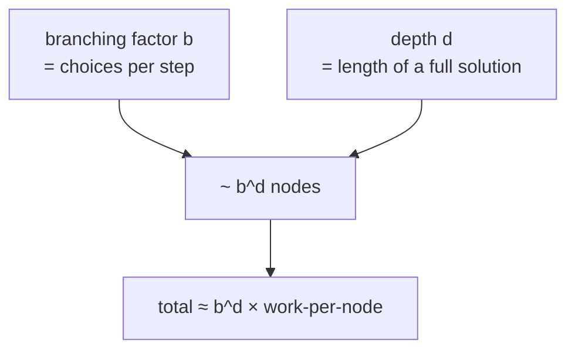

| Problem | Branching | Depth | Rough complexity |
|---|---|---|---|
| Subsets | 2 (take/skip) | n | $O(2^n \cdot n)$ |
| Permutations | n (then n‑1, …) | n | $O(n! \cdot n)$ |
| Combinations (n choose k) | shrinking | k | output‑sensitive |
| N‑Queens | n per row | n | far below $n^n$ thanks to pruning |

> Two truths: (1) Backtracking is usually **exponential** in the worst case — that's expected for "explore all possibilities." (2) **Pruning** is what makes it practical, by chopping off branches before they explode.

> 📐 **When backtracking should become DP:** if different branches reach the *same* sub-state, the search tree is really a **DAG** and caching collapses repeated subtrees. The payoff is huge when *paths* are exponential but *distinct states* are polynomial — e.g. Word Break has $2^n$ candidate segmentations yet only $n{+}1$ prefix-states, so memoization gives $O(n^2)$. Quick test: *"do sibling branches ever ask the identical question?"* If yes, add memoization.

---

## 10. Backtracking vs related techniques

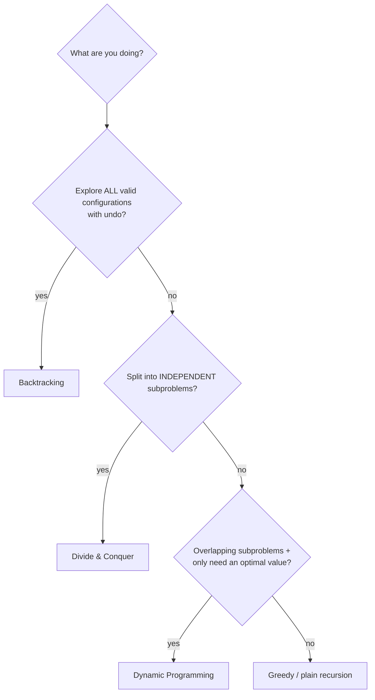

- **Backtracking vs plain recursion:** backtracking *undoes* state and *prunes*; plain recursion often just computes and returns.
- **Backtracking vs DP:** backtracking enumerates actual solutions/configurations; DP remembers answers to overlapping subproblems to avoid recomputation. Sometimes you **combine** them (memoized backtracking).
- **Backtracking vs brute force:** brute force generates everything then filters; backtracking filters *while* generating (pruning), so it's far faster.

---

## 11. Common mistakes checklist (read this before every submission)

```mermaid
mindmap
  root((Backtracking Bugs))
    Forgot to undo
      State leaks into sibling branches
    Saved a reference not a copy
      All results look identical (Python path[:])
    Wrong base case
      Off-by-one in 'complete' check
    Weak/no pruning
      Times out on big inputs
    Duplicate results
      Forgot sort + skip-equal-sibling
    Mutating input while iterating
      Use start index or used[] correctly
```

- [ ] Every **Choose** has a matching **Un‑choose** at the same level.
- [ ] You save a **copy** of the path (`path[:]` in Python; C++ copies on `push_back`).
- [ ] The **base case** correctly detects a complete solution.
- [ ] You **prune** invalid/hopeless branches as early as possible.
- [ ] Duplicates handled with **sort + skip equal sibling** when needed.
- [ ] `used[]` / `start` index correctly prevents reusing elements.

---

## 12. Practice path

You now have the full toolkit. Apply it to the problems in [../problems/01-recursion-backtracking.md](../problems/01-recursion-backtracking.md), in this order:

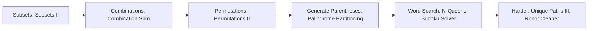

For each problem, write the **five definitions** from §4 before coding, then fill in the template. With practice, the Choose → Explore → Un‑choose rhythm becomes automatic.

---

**Related guides:** [01 — Recursion Fundamentals](01-recursion-fundamentals.md) · [02 — Recursion Patterns](02-recursion-patterns.md) · [03 — DP Fundamentals](03-dp-fundamentals.md)
