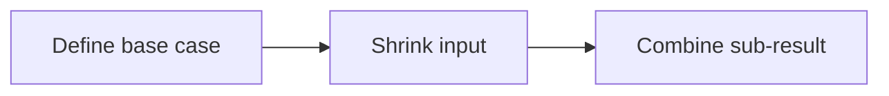
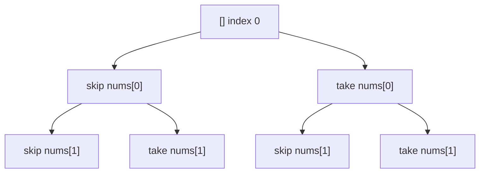
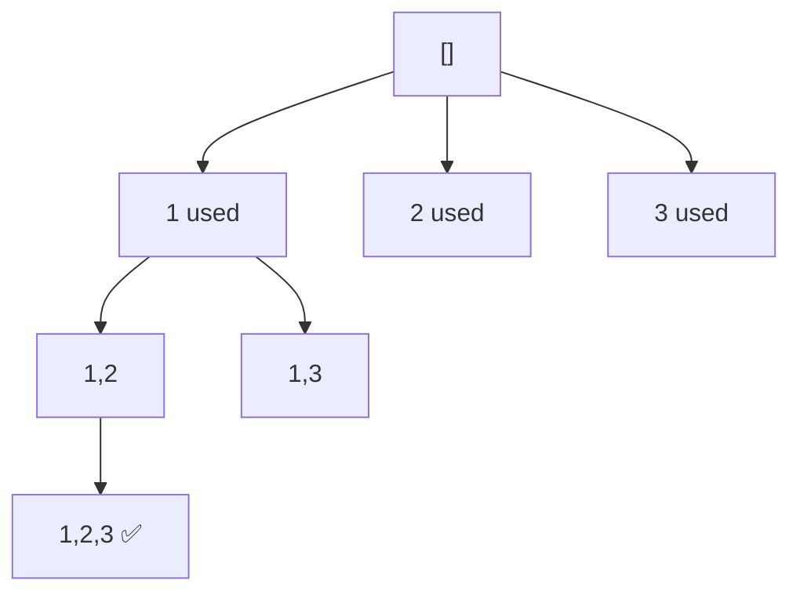
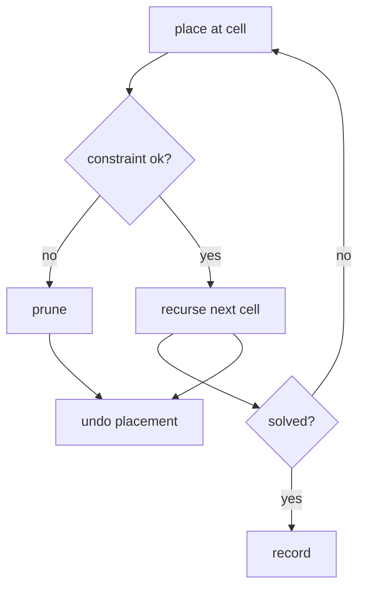
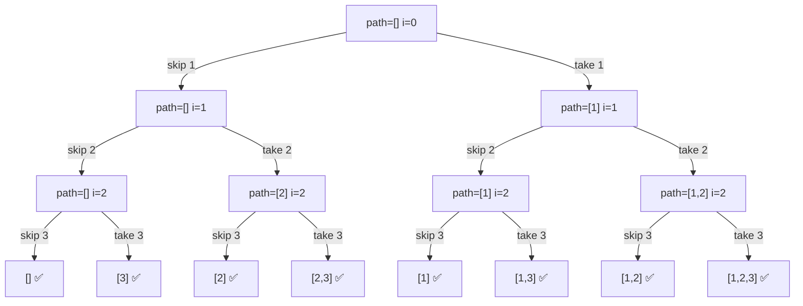
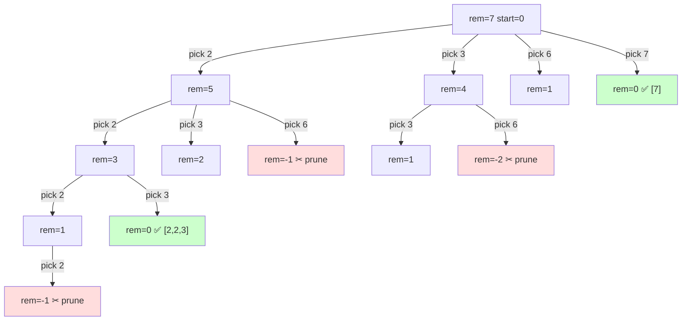
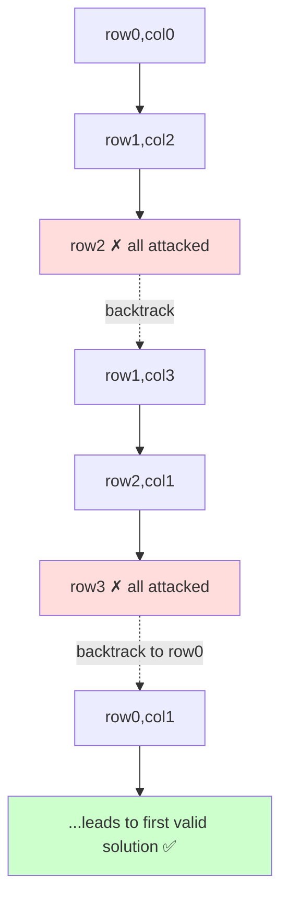

# 01 — Recursion & Backtracking Problems

> Build the recursive muscle: base case + recurrence, then exploration + undo. Patterns covered: linear recursion, divide & conquer, subsets, permutations, combinations, grid/board backtracking, constraint pruning.

Difficulty: 🟢 Easy · 🟡 Medium · 🔴 Hard · Source: LC=LeetCode, CF=Codeforces, GFG, Classic

---

## A. Warm‑up pure recursion



| # | Problem | Src | Diff | Core idea (state / recurrence) |
|---|---|---|---|---|
| 1 | Factorial | Classic | 🟢 | `f(n)=n*f(n-1)`, base `f(0)=1` |
| 2 | Sum of digits | Classic | 🟢 | `f(n)=n%10+f(n//10)` |
| 3 | Power `x^n` | LC 50 | 🟡 | fast power: `x^n=(x^{n/2})^2` → $O(\log n)$ |
| 4 | Reverse a string | Classic | 🟢 | swap ends, recurse inward |
| 5 | Fibonacci Number | LC 509 | 🟢 | `f(n)=f(n-1)+f(n-2)` (then memoize) |
| 6 | Tower of Hanoi | Classic | 🟡 | move n‑1 → aux, move 1, move n‑1 → dst |
| 7 | GCD (Euclid) | Classic | 🟢 | `gcd(a,b)=gcd(b, a%b)` |
| 8 | Print all binary strings of length n | GFG | 🟢 | branch 0/1 at each position |
| 9 | Pow(x, n) with negatives | LC 50 | 🟡 | handle `n<0` → `1/x^{-n}` |
| 10 | Count ways to reach nth stair | GFG | 🟢 | linear recursion → DP |

### Fast power template
```python
def power(x, n):
    if n == 0: return 1
    half = power(x, n // 2)
    return half * half * (x if n % 2 else 1)
```

### 💡 Problem-by-problem
1. **Factorial** — `n! = n·(n−1)!` with base `f(0)=1`. Each call removes one factor; depth `O(n)`. The canonical "one smaller subproblem" recursion.
2. **Sum of digits** — peel the last digit with `n%10`, recurse on `n//10`, base `f(0)=0`. Recursion length = number of digits = `O(log₁₀ n)`.
3. **Power xⁿ** — naive `x·x^(n−1)` is `O(n)`; *fast power* squares the half-result `(x^{n/2})²`, halving the exponent each step → `O(log n)`. Multiply an extra `x` when `n` is odd.
4. **Reverse a string** — swap the two ends, recurse on the inner substring; base case is an empty/one-char string. `O(n)` swaps.
5. **Fibonacci** — `f(n)=f(n−1)+f(n−2)`; naive recursion is `O(φⁿ)` because subproblems overlap → the textbook trigger to memoize down to `O(n)`.
6. **Tower of Hanoi** — move the top `n−1` disks to the auxiliary peg, move the largest disk, then move the `n−1` disks onto it. Exactly `2ⁿ−1` moves (proved in guide 02).
7. **GCD (Euclid)** — `gcd(a,b)=gcd(b, a%b)`, base `gcd(a,0)=a`. Each step shrinks the numbers quickly → `O(log min(a,b))`.
8. **Print all binary strings of length n** — at each of the `n` positions branch into `0` and `1`; the `2ⁿ` leaves are the strings. A pure two-choices tree.
9. **Pow with negatives** — reduce `n<0` to `1 / x^(−n)` then apply fast power; guard the `INT_MIN` edge case to avoid overflow when negating.
10. **Count ways to reach nth stair** — from stair `n` you arrived from `n−1` or `n−2`, so `ways(n)=ways(n−1)+ways(n−2)` — Fibonacci in disguise; memoize or use DP.

---

## B. Subsets / Combinations (take‑or‑skip tree)



| # | Problem | Src | Diff | Core idea |
|---|---|---|---|---|
| 11 | Subsets | LC 78 | 🟡 | for each element: include/exclude → $2^n$ |
| 12 | Subsets II (dups) | LC 90 | 🟡 | sort; skip duplicates at same depth |
| 13 | Combinations | LC 77 | 🟡 | pick `k` of `n`, advance start index |
| 14 | Combination Sum | LC 39 | 🟡 | reuse allowed → don't advance index |
| 15 | Combination Sum II | LC 40 | 🟡 | each used once + skip dup branches |
| 16 | Combination Sum III | LC 216 | 🟡 | k numbers, fixed sum, 1..9 |
| 17 | Letter Combinations of Phone | LC 17 | 🟡 | branch over letters per digit |
| 18 | Generate Parentheses | LC 22 | 🟡 | track open/close counts, prune invalid |
| 19 | Palindrome Partitioning | LC 131 | 🟡 | cut where prefix is palindrome, recurse rest |
| 20 | Restore IP Addresses | LC 93 | 🟡 | 4 segments, each 0‑255, prune |

### Subsets template (with dedup)

**Python**
```python
def subsets_with_dup(nums):
    nums.sort()
    res, path = [], []
    def dfs(start):
        res.append(path[:])
        for i in range(start, len(nums)):
            if i > start and nums[i] == nums[i-1]:
                continue                  # skip duplicate at this level
            path.append(nums[i])
            dfs(i + 1)
            path.pop()                    # backtrack
    dfs(0)
    return res
```

**C++**
```cpp
void dfs(int start, vector<int>& nums, vector<int>& path,
         vector<vector<int>>& res) {
    res.push_back(path);
    for (int i = start; i < (int)nums.size(); ++i) {
        if (i > start && nums[i] == nums[i-1]) continue; // skip dup at this level
        path.push_back(nums[i]);
        dfs(i + 1, nums, path, res);
        path.pop_back();                                 // backtrack
    }
}
vector<vector<int>> subsetsWithDup(vector<int>& nums) {
    sort(nums.begin(), nums.end());
    vector<vector<int>> res; vector<int> path;
    dfs(0, nums, path, res);
    return res;
}
```

### 💡 Problem-by-problem
11. **Subsets** — include/exclude each element → `2ⁿ` subsets; recurse with an advancing index so the same set never repeats in a different order (full trace in Deep Dive 1).
12. **Subsets II (dups)** — sort first so equal values are adjacent, then `if i>start and nums[i]==nums[i-1]: continue` skips a duplicate *sibling* at the same depth, preventing repeated subsets.
13. **Combinations** — choose `k` of `n`; the `start` index only moves forward so each combination appears once in increasing order. Prune when too few elements remain to fill `k`.
14. **Combination Sum** — reuse allowed, so recurse with `i` (not `i+1`); sort and break the moment a candidate exceeds the remaining target (Deep Dive 2).
15. **Combination Sum II** — each number used once (recurse `i+1`) *and* skip duplicate siblings like Subsets II, so duplicate combinations are never generated.
16. **Combination Sum III** — fixed count `k` from digits `1..9`; prune when the running sum exceeds target or too few digits remain to reach `k`.
17. **Letter Combinations of a Phone** — map each digit to its letters and branch over them; depth = number of digits, leaves = product of the letter counts.
18. **Generate Parentheses** — track counts of open and close brackets; add `(` only while `open<n` and `)` only while `close<open`, which prunes every invalid prefix before it forms.
19. **Palindrome Partitioning** — try every prefix that is a palindrome as the first cut, then recurse on the rest; backtracking enumerates all valid partitions.
20. **Restore IP Addresses** — place 3 dots to form 4 segments, each `0–255` with no leading zeros; prune any branch whose segment is out of range.

---

## C. Permutations (pick each unused)



| # | Problem | Src | Diff | Core idea |
|---|---|---|---|---|
| 21 | Permutations | LC 46 | 🟡 | `used[]` marker, pick each unused → $n!$ |
| 22 | Permutations II (dups) | LC 47 | 🟡 | sort + skip `used[i-1]` dup |
| 23 | Next Permutation | LC 31 | 🟡 | iterative; pivot + swap + reverse |
| 24 | Permutation Sequence | LC 60 | 🔴 | factorial number system |
| 25 | Beautiful Arrangement | LC 526 | 🟡 | place i where divisibility holds |

### Permutations template

**Python**
```python
def permute(nums):
    res = []
    def dfs(path, used):
        if len(path) == len(nums):
            res.append(path[:]); return
        for i in range(len(nums)):
            if used[i]: continue
            used[i] = True; path.append(nums[i])
            dfs(path, used)
            path.pop(); used[i] = False     # backtrack
    dfs([], [False]*len(nums))
    return res
```

**C++**
```cpp
void dfs(vector<int>& nums, vector<bool>& used, vector<int>& path,
         vector<vector<int>>& res) {
    if (path.size() == nums.size()) { res.push_back(path); return; }
    for (int i = 0; i < (int)nums.size(); ++i) {
        if (used[i]) continue;
        used[i] = true; path.push_back(nums[i]);
        dfs(nums, used, path, res);
        path.pop_back(); used[i] = false;   // backtrack
    }
}
vector<vector<int>> permute(vector<int>& nums) {
    vector<vector<int>> res; vector<int> path;
    vector<bool> used(nums.size(), false);
    dfs(nums, used, path, res);
    return res;
}
```

### 💡 Problem-by-problem
21. **Permutations** — a `used[]` array marks taken elements; at each level loop over *all* unused ones → `n!` orderings. (An index, as in subsets, fails because here order matters.)
22. **Permutations II (dups)** — sort, then skip `nums[i]` when `nums[i]==nums[i-1] and not used[i-1]`: the previous equal value was just undone at this level, so reusing it would repeat a permutation.
23. **Next Permutation** — *iterative*, not recursive: find the rightmost ascending pair (the pivot), swap the pivot with the next-larger element to its right, then reverse the suffix to get the smallest larger arrangement.
24. **Permutation Sequence** — avoid generating all `n!`: using the factorial number system, the first element is index `k/(n−1)!`, then recurse on the remainder — `O(n²)` instead of factorial.
25. **Beautiful Arrangement** — place value `i` at position `p` only when `i%p==0` or `p%i==0`; backtracking counts valid full placements, with the divisibility test as pruning.

---

## D. Board / grid backtracking (with pruning)



| # | Problem | Src | Diff | Core idea |
|---|---|---|---|---|
| 26 | N‑Queens | LC 51 | 🔴 | place 1 queen/row; track cols & diagonals |
| 27 | N‑Queens II (count) | LC 52 | 🔴 | same, count solutions |
| 28 | Sudoku Solver | LC 37 | 🔴 | try 1‑9 in empty cell; validate row/col/box |
| 29 | Word Search | LC 79 | 🟡 | DFS 4 dirs, mark visited, undo |
| 30 | Word Search II | LC 212 | 🔴 | trie + backtracking |
| 31 | Rat in a Maze | GFG | 🟡 | DFS path, mark/unmark |
| 32 | Knight's Tour | Classic | 🔴 | visit all cells once, backtrack |
| 33 | Unique Paths III | LC 980 | 🔴 | DFS must cover all empty cells |
| 34 | Robot Room Cleaner | LC 489 | 🔴 | DFS + relative orientation |
| 35 | Matchsticks to Square | LC 473 | 🟡 | 4 buckets, backtrack assignment |

### N‑Queens (column + diagonal pruning)

**Python**
```python
def solve_n_queens(n):
    res, cols, d1, d2 = [], set(), set(), set()
    board = [['.']*n for _ in range(n)]
    def dfs(r):
        if r == n:
            res.append([''.join(row) for row in board]); return
        for c in range(n):
            if c in cols or (r-c) in d1 or (r+c) in d2:
                continue                       # prune attacked cells
            cols.add(c); d1.add(r-c); d2.add(r+c); board[r][c]='Q'
            dfs(r+1)
            cols.remove(c); d1.remove(r-c); d2.remove(r+c); board[r][c]='.'
    dfs(0)
    return res
```

**C++**
```cpp
void dfs(int r, int n, vector<string>& board,
         set<int>& cols, set<int>& d1, set<int>& d2,
         vector<vector<string>>& res) {
    if (r == n) { res.push_back(board); return; }
    for (int c = 0; c < n; ++c) {
        if (cols.count(c) || d1.count(r-c) || d2.count(r+c))
            continue;                          // prune attacked cells
        cols.insert(c); d1.insert(r-c); d2.insert(r+c); board[r][c]='Q';
        dfs(r+1, n, board, cols, d1, d2, res);
        cols.erase(c); d1.erase(r-c); d2.erase(r+c); board[r][c]='.';
    }
}
vector<vector<string>> solveNQueens(int n) {
    vector<vector<string>> res;
    vector<string> board(n, string(n, '.'));
    set<int> cols, d1, d2;
    dfs(0, n, board, cols, d1, d2, res);
    return res;
}
```

### 💡 Problem-by-problem
26. **N-Queens** — one queen per row; track used columns and both diagonal keys `r−c`, `r+c` for `O(1)` safety checks (Deep Dive 3). Backtracking restores the three sets on retreat.
27. **N-Queens II (count)** — identical search, but only increment a counter at a full board instead of storing it, saving the board-copy memory.
28. **Sudoku Solver** — find an empty cell, try digits `1–9` that don't clash with the row, column, and 3×3 box; recurse, and undo on failure. The clash checks *are* the pruning.
29. **Word Search** — DFS from each cell matching letters in 4 directions; mark the cell visited before recursing and unmark on return so other paths can reuse it.
30. **Word Search II** — to match many words at once, store them in a **trie**; one DFS then matches all words and prunes any branch with no trie child.
31. **Rat in a Maze** — DFS through open cells marking the path; on a dead end, unmark and retreat. Enumerates all source-to-target paths.
32. **Knight's Tour** — visit every cell exactly once via knight moves, backtracking when stuck; Warnsdorff's heuristic (try the cell with fewest onward moves first) prunes massively.
33. **Unique Paths III** — DFS that must cover *all* empty cells before reaching the target; count only paths whose length equals the empty-cell count.
34. **Robot Room Cleaner** — DFS with only relative movement: track orientation and cleaned cells, and physically "return and turn back" after each direction to restore position.
35. **Matchsticks to Square** — sort sticks descending and assign each to one of 4 side-buckets; backtrack when a bucket overflows. Skipping equal buckets prunes symmetric duplicates.

---

## E. Divide & Conquer

| # | Problem | Src | Diff | Core idea |
|---|---|---|---|---|
| 36 | Merge Sort | Classic | 🟡 | split, sort halves, merge — $O(n\log n)$ |
| 37 | Quick Sort | Classic | 🟡 | partition around pivot, recurse sides |
| 38 | Binary Search | LC 704 | 🟢 | `T(n)=T(n/2)+O(1)` → $O(\log n)$ |
| 39 | Count Inversions | Classic/CF | 🟡 | merge sort + count cross pairs |
| 40 | Maximum Subarray (D&C) | LC 53 | 🟡 | left, right, cross max |
| 41 | Median of Two Sorted Arrays | LC 4 | 🔴 | binary search partition → $O(\log(m+n))$ |
| 42 | Kth Largest Element | LC 215 | 🟡 | quickselect avg $O(n)$ |
| 43 | Pow(x,n) | LC 50 | 🟡 | exponentiation by squaring |
| 44 | Different Ways to Add Parentheses | LC 241 | 🟡 | split at each operator, combine results |
| 45 | The Skyline Problem | LC 218 | 🔴 | divide & conquer merge of skylines |

### 💡 Problem-by-problem
36. **Merge Sort** — split in half, sort each recursively, merge two sorted halves in `O(n)`; `T(n)=2T(n/2)+O(n)=O(n log n)`. The model divide-and-conquer.
37. **Quick Sort** — partition around a pivot so smaller/larger sit on each side, then recurse on both; average `O(n log n)`, worst `O(n²)` on adversarial pivots.
38. **Binary Search** — halve the search range each step: `T(n)=T(n/2)+O(1)=O(log n)`. The simplest divide-and-conquer.
39. **Count Inversions** — count cross-pairs `i<j, a[i]>a[j]` while merging in merge sort → `O(n log n)` instead of the brute-force `O(n²)`.
40. **Maximum Subarray (D&C)** — the answer is the best of: max subarray fully in the left half, fully in the right, or crossing the midpoint (the crossing part is `O(n)`).
41. **Median of Two Sorted Arrays** — binary-search the partition of the *smaller* array so the combined left halves hold exactly half the elements → `O(log min(m,n))`.
42. **Kth Largest** — quickselect: partition like quicksort but recurse only into the side containing rank `k`, giving average `O(n)`.
43. **Pow(x,n)** — exponentiation by squaring — the same `O(log n)` fast power as problem 3.
44. **Different Ways to Add Parentheses** — split at each operator, recursively evaluate both sides, then combine every left result with every right result; memoization removes the overlap.
45. **The Skyline Problem** — divide the buildings, recursively build left/right skylines, and merge them with a sweep that keeps the current max height — merge sort applied to skylines.

---

## 🔬 Deep Dive 1 — Subsets, traced step by step

**Problem:** return all subsets of `nums = [1, 2, 3]`.

### The math: why there are exactly $2^n$ subsets
Each element has **2 independent choices** — *in* the subset or *out*. With $n$ elements, by the multiplication principle:

$$\text{number of subsets} = \underbrace{2 \times 2 \times \dots \times 2}_{n\text{ times}} = 2^n$$

For `n = 3` that's $2^3 = 8$ subsets. This is **why** the algorithm branches into exactly 2 recursive calls per element (take / skip): the code's shape mirrors the math.

### The recurrence
Let $S(i)$ = "all subsets decided from index $i$ onward, given the choices already in `path`". Then:

$$S(i) = \big[\text{skip } nums_i \to S(i+1)\big]\ \cup\ \big[\text{take } nums_i \to S(i+1)\big], \qquad S(n) = \{\text{record path}\}$$

### Recursion tree (every node shows `path` and the index `i`)



### Step-by-step execution order (DFS — left branch "skip" first)
The recursion visits leaves left-to-right. This table shows **what happens at each leaf**, in order:

| Step | `path` when `i == 3` | Recorded subset |
|------|----------------------|-----------------|
| 1 | `[]` | `[]` |
| 2 | `[3]` | `[3]` |
| 3 | `[2]` | `[2]` |
| 4 | `[2,3]` | `[2,3]` |
| 5 | `[1]` | `[1]` |
| 6 | `[1,3]` | `[1,3]` |
| 7 | `[1,2]` | `[1,2]` |
| 8 | `[1,2,3]` | `[1,2,3]` |

> 🔑 **Why this works:** the leaves of the tree are in bijection with the $2^n$ subsets — each root-to-leaf path encodes one independent in/out decision per element. The `append`/`pop` pair restores `path` so each branch starts clean.

---

## 🔬 Deep Dive 2 — Combination Sum, with pruning math

**Problem:** `candidates = [2, 3, 6, 7]`, `target = 7`. Find all combinations (reuse allowed) summing to 7. Answer: `[[2,2,3], [7]]`.

### Why we sort + prune
We process candidates in sorted order and keep a `remaining = target − sum`. The key inequality that lets us **prune an entire subtree**:

$$\text{if } candidates_i > remaining \ \Rightarrow\ \text{stop this branch (and all later } i\text{, since sorted)}$$

Because candidates are sorted ascending, once one candidate exceeds `remaining`, every later candidate does too — so we break out instead of exploring doomed branches.

### Recursion tree (node = `remaining`, edge = chosen candidate)



Two leaves reach `rem = 0` (green) → the two valid combinations. Red nodes are pruned the instant `remaining < 0`.

```python
def combination_sum(candidates, target):
    candidates.sort()                       # enables the prune-and-break
    res, path = [], []
    def dfs(start, remaining):
        if remaining == 0:
            res.append(path[:]); return
        for i in range(start, len(candidates)):
            if candidates[i] > remaining:   # PRUNE: sorted ⇒ all later also too big
                break
            path.append(candidates[i])
            dfs(i, remaining - candidates[i])   # i (not i+1) ⇒ reuse allowed
            path.pop()
    dfs(0, target)
    return res
```

---

## 🔬 Deep Dive 3 — N‑Queens (n = 4), state changes per step

**Why diagonals use `row−col` and `row+col`:** all cells on a "`↘`" diagonal share the same value of $row - col$; all cells on a "`↙`" diagonal share the same $row + col$. So a placement at `(r, c)` is safe iff:

$$c \notin \text{cols} \ \wedge\ (r-c) \notin \text{diag}_\searrow \ \wedge\ (r+c) \notin \text{diag}_\swarrow$$

### Step-by-step trace toward the first solution `. Q . .` / `. . . Q` / `Q . . .` / `. . Q .`

| Step | Action | row | col | cols | diag₍↘₎ (r−c) | diag₍↙₎ (r+c) | Result |
|------|--------|----|----|------|----------------|----------------|--------|
| 1 | place | 0 | 0 | {0} | {0} | {0} | try row 1 |
| 2 | row1 c=0,1 attacked → place | 1 | 2 | {0,2} | {0,-1} | {0,3} | try row 2 |
| 3 | row2 all cols attacked | 2 | — | — | — | — | **dead end → backtrack** |
| 4 | undo (1,2); try next | 1 | 3 | {0,3} | {0,-2} | {0,4} | try row 2 |
| 5 | place | 2 | 1 | {0,3,1} | {0,-2,1} | {0,4,3} | try row 3 |
| 6 | row3 all attacked | 3 | — | — | — | — | **dead end → backtrack** |
| 7 | backtrack to row 0, place | 0 | 1 | {1} | {-1} | {1} | restart cleanly |
| … | continue | … | … | … | … | … | reaches valid board ✅ |



> 🔑 **Reading the trace:** every "dead end" pops the last queen and restores the three sets to exactly their previous contents — that restoration *is* the backtracking. Pruning via the three sets means we never place a queen on an attacked cell in the first place.

---

## 🔑 Backtracking checklist
- [ ] State changes are **undone** after each recursive call.
- [ ] **Pruning** happens as early as possible (before recursing).
- [ ] Duplicates handled by **sorting + skipping** equal siblings.
- [ ] `path[:]` (copy) used when recording a snapshot.
- [ ] Base/goal condition is correct and reachable.

➡️ Next: [02 — Linear DP](02-linear-dp.md)
