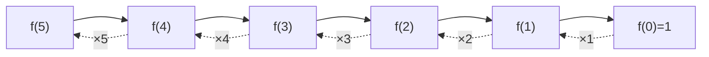

# Factorial

> Compute `n! = 1·2·…·n` recursively. Classic · 🟢 Easy

## Problem
Given a non-negative integer `n`, return `n!` (the product of all integers from `1` to `n`), with `0! = 1`.

## 🧮 Math / Recurrence
$$
f(n) = \begin{cases} 1 & n = 0 \\ n \cdot f(n-1) & n > 0 \end{cases}
$$

Unrolling the recurrence shows why it equals the product:

$$
f(n) = n \cdot (n-1) \cdot (n-2) \cdots 2 \cdot 1 = \prod_{k=1}^{n} k
$$

## 🧠 Logic
A factorial of `n` is just `n` times the factorial of the **next smaller** input. That single "one smaller subproblem" is the textbook shape of linear recursion:
- **Base case** stops the recursion at `n = 0` (an empty product is `1`).
- **Recursive case** multiplies the current `n` by the already-solved smaller problem.

The call stack grows to depth `n`, then unwinds multiplying on the way back up.

## 🔢 Iteration trace (`n = 5`)
| Call | Returns |
|------|---------|
| `f(5)` | `5 · f(4)` |
| `f(4)` | `4 · f(3)` |
| `f(3)` | `3 · f(2)` |
| `f(2)` | `2 · f(1)` |
| `f(1)` | `1 · f(0)` |
| `f(0)` | `1` (base) |

Unwinding: `1 → 1 → 2 → 6 → 24 → 120`. **Answer = 120.**



## 🐍 Python
```python
def factorial(n: int) -> int:
    if n == 0:               # base case
        return 1
    return n * factorial(n - 1)


if __name__ == "__main__":
    print(factorial(5))      # 120
```

## ⚙️ C++
```cpp
#include <iostream>
using namespace std;

long long factorial(int n) {
    if (n == 0) return 1;            // base case
    return 1LL * n * factorial(n - 1);
}

int main() {
    cout << factorial(5) << "\n";   // 120
}
```

## ⏱️ Complexity
- **Time:** `O(n)` — one multiplication per level.
- **Space:** `O(n)` recursion stack (or `O(1)` if rewritten as a loop).

> ⚠️ `n!` overflows 64-bit integers past `n = 20`; use big integers (Python handles this natively) for larger `n`.
