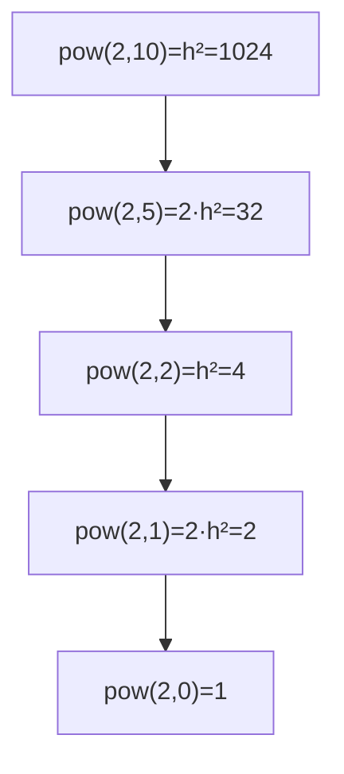

# Power `xⁿ` (Fast Exponentiation)

> Compute `xⁿ` in `O(log n)` by squaring. LC 50 · 🟡 Medium

## Problem
Given a number `x` and a non-negative integer exponent `n`, compute `xⁿ`. (Negative `n` is handled in [09-pow-with-negatives.md](09-pow-with-negatives.md).)

## 🧮 Math / Recurrence
The key identity is **exponentiation by squaring**:

$$
x^n = \begin{cases}
1 & n = 0 \\
\left(x^{n/2}\right)^2 & n \text{ even} \\
x \cdot \left(x^{\lfloor n/2 \rfloor}\right)^2 & n \text{ odd}
\end{cases}
$$

Because every step halves the exponent, the recursion depth is $\log_2 n$:

$$
T(n) = T(n/2) + O(1) = O(\log n)
$$

## 🧠 Logic
Naively `xⁿ = x · xⁿ⁻¹` costs `O(n)`. The trick is to compute `xⁿ/²` **once** and square it — reusing one result instead of multiplying `x` repeatedly. If `n` is odd we owe one extra factor of `x`. This turns linear work into logarithmic.

## 🔢 Iteration trace (`x = 2, n = 10`)
| Call | n | even/odd | builds from |
|------|---|----------|-------------|
| `pow(2,10)` | 10 | even | `pow(2,5)²` |
| `pow(2,5)`  | 5  | odd  | `2 · pow(2,2)²` |
| `pow(2,2)`  | 2  | even | `pow(2,1)²` |
| `pow(2,1)`  | 1  | odd  | `2 · pow(2,0)²` |
| `pow(2,0)`  | 0  | base | `1` |

Unwinding: `1 → 2 → 4 → 32 → 1024`. **Answer = 1024.**



## 🐍 Python
```python
def power(x: float, n: int) -> float:
    if n == 0:
        return 1.0
    half = power(x, n // 2)
    sq = half * half
    return sq * x if n % 2 else sq


if __name__ == "__main__":
    print(power(2, 10))   # 1024.0
```

## ⚙️ C++
```cpp
#include <iostream>
using namespace std;

double power(double x, long long n) {
    if (n == 0) return 1.0;
    double half = power(x, n / 2);
    double sq = half * half;
    return (n % 2) ? sq * x : sq;
}

int main() {
    cout << power(2, 10) << "\n";   // 1024
}
```

## ⏱️ Complexity
- **Time:** `O(log n)` — exponent halves each call.
- **Space:** `O(log n)` recursion stack.
