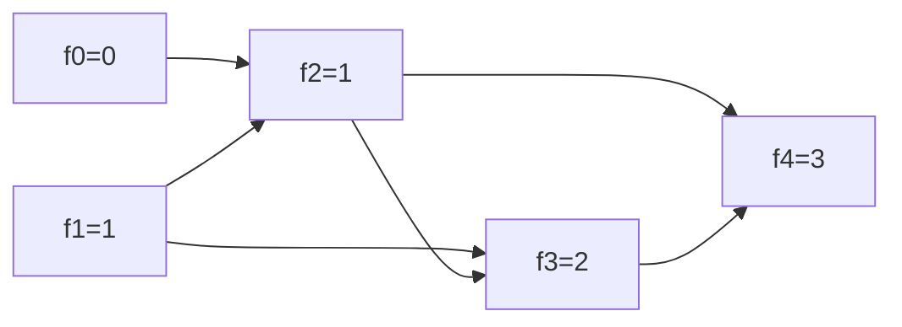

# Fibonacci Number

> `f(n) = f(n-1) + f(n-2)` — the classic overlapping-subproblem recursion. LC 509 · 🟢 Easy

## Problem
Return the `n`-th Fibonacci number, where `f(0)=0`, `f(1)=1`, and `f(n)=f(n-1)+f(n-2)`.

## 🧮 Math / Recurrence
$$
f(n) = \begin{cases}
n & n \le 1 \\
f(n-1) + f(n-2) & n \ge 2
\end{cases}
$$

Naive recursion re-solves the same subproblems, giving exponential cost proportional to the golden ratio $\varphi = \frac{1+\sqrt5}{2}$:

$$
T(n) = O(\varphi^n) \approx O(1.618^n)
$$

Memoization collapses this to $O(n)$ by storing each `f(k)` once.

## 🧠 Logic
Each Fibonacci value depends on the **two** preceding ones. Pure recursion recomputes `f(n-2)` from both `f(n-1)` and directly — an explosion of repeated work. This is the canonical trigger to **memoize** (top-down) or build a **DP** table (bottom-up). The example below shows the memoized version.

## 🔢 Iteration trace (bottom-up, `n = 6`)
| k | 0 | 1 | 2 | 3 | 4 | 5 | 6 |
|---|---|---|---|---|---|---|---|
| `f(k)` | 0 | 1 | 1 | 2 | 3 | 5 | **8** |

Each cell = sum of the two to its left. **Answer = 8.**



## 🐍 Python
```python
from functools import lru_cache


@lru_cache(maxsize=None)
def fib(n: int) -> int:
    if n <= 1:
        return n
    return fib(n - 1) + fib(n - 2)


if __name__ == "__main__":
    print(fib(6))   # 8
```

## ⚙️ C++
```cpp
#include <iostream>
#include <vector>
using namespace std;

int fib(int n) {
    if (n <= 1) return n;
    vector<int> dp(n + 1);
    dp[0] = 0; dp[1] = 1;
    for (int k = 2; k <= n; ++k)
        dp[k] = dp[k - 1] + dp[k - 2];
    return dp[n];
}

int main() {
    cout << fib(6) << "\n";   // 8
}
```

## ⏱️ Complexity
- **Naive recursion:** `O(φⁿ)` time — avoid for large `n`.
- **Memoized / DP:** `O(n)` time, `O(n)` space (or `O(1)` keeping two rolling variables).
