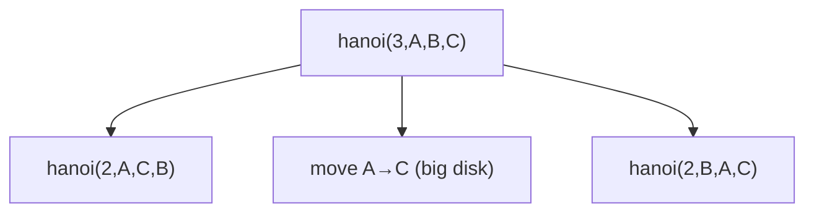

# Tower of Hanoi

> Move `n` disks across 3 pegs obeying the size rule. Classic · 🟡 Medium

## Problem
Move a stack of `n` disks from peg `A` to peg `C` using auxiliary peg `B`, such that:
1. one disk moves at a time, and
2. a larger disk is never placed on a smaller one.

List the moves (and/or count them).

## 🧮 Math / Recurrence
$$
\text{hanoi}(n, A, B, C) = \begin{cases}
\text{move 1 disk } A \to C & n = 1 \\
\text{hanoi}(n-1, A, C, B);\ \text{move } A \to C;\ \text{hanoi}(n-1, B, A, C) & n > 1
\end{cases}
$$

The move count satisfies $M(n) = 2M(n-1) + 1$ with $M(1)=1$, which solves to:

$$
M(n) = 2^n - 1
$$

## 🧠 Logic
To move the biggest disk from `A` to `C`, every smaller disk must first be parked on the spare peg `B`. So:
1. recursively move the top `n−1` disks `A → B` (using `C` as spare),
2. move the largest disk `A → C`,
3. recursively move the `n−1` disks `B → C` (using `A` as spare).

The auxiliary roles rotate at each level — that rotation is the whole trick.

## 🔢 Iteration trace (`n = 3`, 2³−1 = 7 moves)
| # | Move |
|---|------|
| 1 | A → C |
| 2 | A → B |
| 3 | C → B |
| 4 | A → C |
| 5 | B → A |
| 6 | B → C |
| 7 | A → C |



## 🐍 Python
```python
def hanoi(n: int, src: str, aux: str, dst: str) -> None:
    if n == 1:
        print(f"{src} -> {dst}")
        return
    hanoi(n - 1, src, dst, aux)
    print(f"{src} -> {dst}")
    hanoi(n - 1, aux, src, dst)


if __name__ == "__main__":
    hanoi(3, "A", "B", "C")   # 7 moves
```

## ⚙️ C++
```cpp
#include <iostream>
using namespace std;

void hanoi(int n, char src, char aux, char dst) {
    if (n == 1) { cout << src << " -> " << dst << "\n"; return; }
    hanoi(n - 1, src, dst, aux);
    cout << src << " -> " << dst << "\n";
    hanoi(n - 1, aux, src, dst);
}

int main() {
    hanoi(3, 'A', 'B', 'C');   // 7 moves
}
```

## ⏱️ Complexity
- **Time:** `O(2ⁿ)` — there are `2ⁿ−1` moves and the work is provably minimal.
- **Space:** `O(n)` recursion stack.
