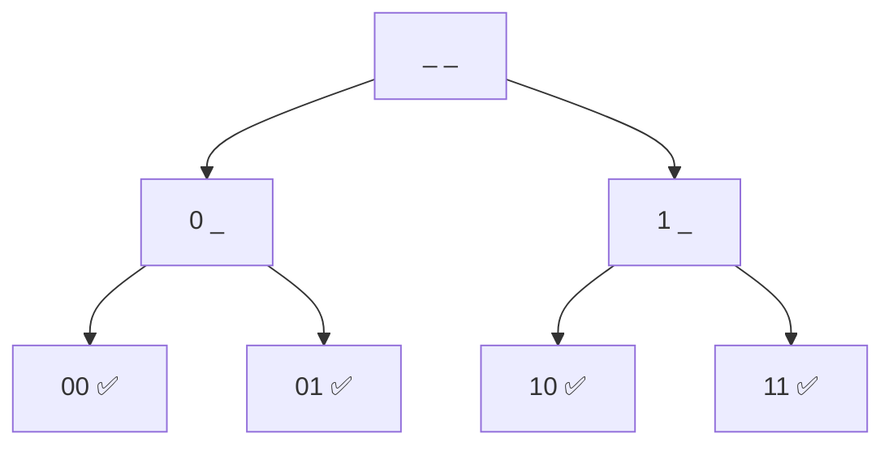

# Print All Binary Strings of Length n

> Enumerate every length-`n` string over `{0,1}`. GFG · 🟢 Easy

## Problem
Print all binary strings of length `n` (there are `2ⁿ` of them), e.g. for `n = 2`: `00, 01, 10, 11`.

## 🧮 Math / Recurrence
At each of the `n` positions there are **2 choices**, so by the multiplication principle:

$$
\text{count} = \underbrace{2 \times 2 \times \cdots \times 2}_{n} = 2^n
$$

The recursion builds the string position by position:

$$
\text{gen}(i) = \begin{cases}
\text{output string} & i = n \\
\text{place 0 at } i,\ \text{gen}(i{+}1);\ \text{place 1 at } i,\ \text{gen}(i{+}1) & i < n
\end{cases}
$$

## 🧠 Logic
Fix the character at position `i`, then let recursion fill positions `i+1 … n−1`. Two branches (`0` and `1`) at every level form a perfect binary tree of depth `n` whose `2ⁿ` leaves are the answers. This "two choices per slot" pattern is the seed of subset enumeration.

## 🔢 Iteration trace (`n = 2`)

DFS order of leaves: `00, 01, 10, 11`.

## 🐍 Python
```python
def binary_strings(n: int) -> list[str]:
    res, buf = [], ["0"] * n

    def gen(i: int) -> None:
        if i == n:
            res.append("".join(buf))
            return
        buf[i] = "0"; gen(i + 1)
        buf[i] = "1"; gen(i + 1)

    gen(0)
    return res


if __name__ == "__main__":
    print(binary_strings(2))   # ['00', '01', '10', '11']
```

## ⚙️ C++
```cpp
#include <iostream>
#include <string>
using namespace std;

void gen(int i, int n, string& buf) {
    if (i == n) { cout << buf << "\n"; return; }
    buf[i] = '0'; gen(i + 1, n, buf);
    buf[i] = '1'; gen(i + 1, n, buf);
}

int main() {
    int n = 2;
    string buf(n, '0');
    gen(0, n, buf);            // 00 01 10 11
}
```

## ⏱️ Complexity
- **Time:** `O(n · 2ⁿ)` — `2ⁿ` strings, each `O(n)` to emit.
- **Space:** `O(n)` recursion depth + buffer.
