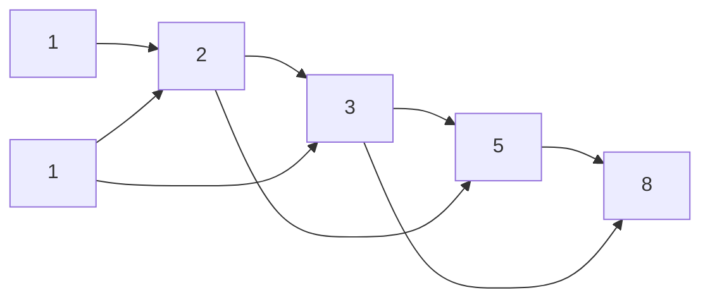

# Count Ways to Reach the n-th Stair

> Climb 1 or 2 steps at a time — Fibonacci in disguise. GFG · 🟢 Easy

## Problem
You can climb either `1` or `2` stairs in a single move. Count the distinct ways to reach the `n`-th stair from the ground.

## 🧮 Math / Recurrence
The last move into stair `n` came from either stair `n−1` (a 1-step) or stair `n−2` (a 2-step):

$$
\text{ways}(n) = \text{ways}(n-1) + \text{ways}(n-2), \qquad \text{ways}(0) = 1,\ \text{ways}(1) = 1
$$

This is the Fibonacci recurrence (shifted), so `ways(n) = fib(n+1)`.

## 🧠 Logic
Counting paths splits cleanly by the **final** step taken. Those two groups (arriving via a 1-step vs a 2-step) are disjoint and cover all possibilities, so we **add** them. Naive recursion overlaps heavily → memoize or roll two variables bottom-up.

## 🔢 Iteration trace (`n = 5`)
| stair | 0 | 1 | 2 | 3 | 4 | 5 |
|-------|---|---|---|---|---|---|
| ways  | 1 | 1 | 2 | 3 | 5 | **8** |

Each value = sum of the previous two. **Answer = 8.**



## 🐍 Python
```python
def climb_stairs(n: int) -> int:
    a, b = 1, 1                 # ways(0), ways(1)
    for _ in range(n):
        a, b = b, a + b
    return a


if __name__ == "__main__":
    print(climb_stairs(5))      # 8
```

## ⚙️ C++
```cpp
#include <iostream>
using namespace std;

long long climbStairs(int n) {
    long long a = 1, b = 1;     // ways(0), ways(1)
    for (int i = 0; i < n; ++i) {
        long long next = a + b;
        a = b; b = next;
    }
    return a;
}

int main() {
    cout << climbStairs(5) << "\n";   // 8
}
```

## ⏱️ Complexity
- **Time:** `O(n)`.
- **Space:** `O(1)` with two rolling variables.

> Generalizes: if you may climb up to `k` steps, sum the previous `k` values (a `k`-bonacci).
