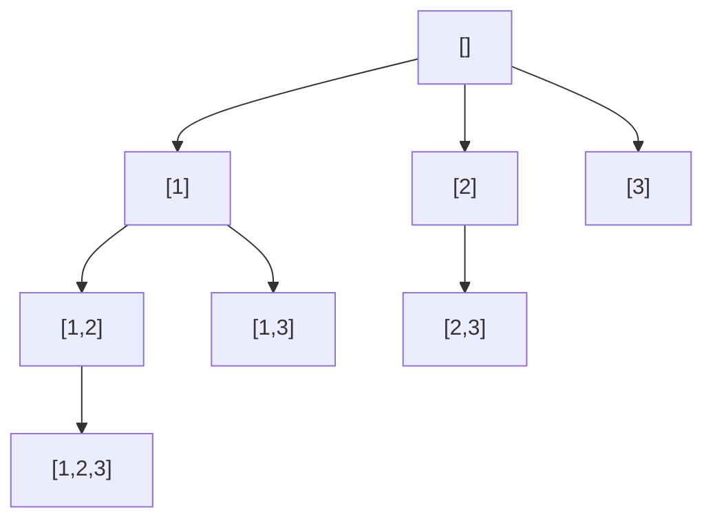

# Subsets

> Generate the power set via include/exclude. LC 78 · 🟡 Medium

## Problem
Given an array of **distinct** integers, return all possible subsets (the power set). For `[1,2,3]` there are `2³ = 8` subsets.

## 🧮 Math / Recurrence
Each element is independently **in** or **out**, so:

$$
\#\text{subsets} = 2^n
$$

DFS recurrence (start-index form), collecting `path` at every node:

$$
\text{dfs}(start) = \big\{\, \text{record } path \,\big\} \cup \bigcup_{i=start}^{n-1} \text{dfs}(i+1) \text{ after choosing } nums_i
$$

## 🧠 Logic
Two equivalent views:
- **Take/skip tree:** at index `i`, branch into "include `nums[i]`" and "exclude it." The `2ⁿ` leaves are the subsets.
- **Start-index loop:** every recursion node *is* a valid subset; the loop picks the next element to extend with, and `start` only moves forward so no subset repeats in a different order.

Backtracking (`path.pop()`) restores state after exploring each branch.

## 🔢 Iteration trace (`[1,2,3]`)

Recorded in DFS order: `[], [1], [1,2], [1,2,3], [1,3], [2], [2,3], [3]` — 8 subsets.

## 🐍 Python
```python
def subsets(nums: list[int]) -> list[list[int]]:
    res, path = [], []

    def dfs(start: int) -> None:
        res.append(path[:])                  # every node is a subset
        for i in range(start, len(nums)):
            path.append(nums[i])
            dfs(i + 1)
            path.pop()                        # backtrack

    dfs(0)
    return res


if __name__ == "__main__":
    print(subsets([1, 2, 3]))
```

## ⚙️ C++
```cpp
#include <iostream>
#include <vector>
using namespace std;

void dfs(int start, vector<int>& nums, vector<int>& path,
         vector<vector<int>>& res) {
    res.push_back(path);                       // every node is a subset
    for (int i = start; i < (int)nums.size(); ++i) {
        path.push_back(nums[i]);
        dfs(i + 1, nums, path, res);
        path.pop_back();                       // backtrack
    }
}

vector<vector<int>> subsets(vector<int>& nums) {
    vector<vector<int>> res; vector<int> path;
    dfs(0, nums, path, res);
    return res;
}

int main() {
    vector<int> nums = {1, 2, 3};
    auto all = subsets(nums);
    cout << all.size() << " subsets\n";        // 8
}
```

## ⏱️ Complexity
- **Time:** `O(n · 2ⁿ)` — `2ⁿ` subsets, each up to `O(n)` to copy.
- **Space:** `O(n)` recursion depth (excluding output).
