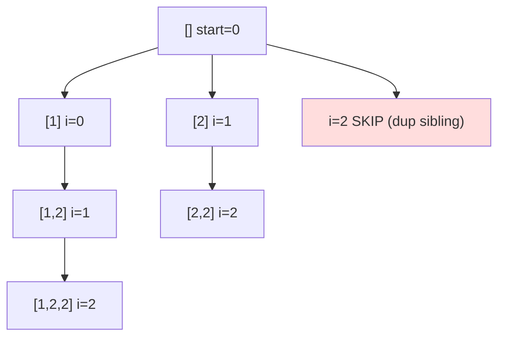

# Subsets II (with Duplicates)

> Power set of a multiset, no duplicate subsets. LC 90 · 🟡 Medium

## Problem
Given an integer array that may contain **duplicates**, return all possible subsets **without** duplicate subsets. For `[1,2,2]` the answer is `[], [1], [1,2], [1,2,2], [2], [2,2]`.

## 🧮 Math / Recurrence
Same take/skip structure as [Subsets](11-subsets.md), but with a level-dedup rule. After sorting, skip an element that equals its left neighbor **at the same recursion depth**:

$$
\text{skip } nums_i \iff i > start \ \wedge\ nums_i = nums_{i-1}
$$

## 🧠 Logic
Sorting groups equal values together. The danger is two *sibling* branches at the same level that both start with the same value — they'd generate identical subsets. The condition `i > start and nums[i] == nums[i-1]` keeps only the **first** sibling, so each distinct subset is produced exactly once. (Choosing duplicates deeper in the same branch is still allowed — that's how `[2,2]` forms.)

## 🔢 Iteration trace (`[1,2,2]` after sort)

Result: `[], [1], [1,2], [1,2,2], [2], [2,2]` — 6 unique subsets.

## 🐍 Python
```python
def subsets_with_dup(nums: list[int]) -> list[list[int]]:
    nums.sort()
    res, path = [], []

    def dfs(start: int) -> None:
        res.append(path[:])
        for i in range(start, len(nums)):
            if i > start and nums[i] == nums[i - 1]:
                continue                     # skip duplicate sibling
            path.append(nums[i])
            dfs(i + 1)
            path.pop()

    dfs(0)
    return res


if __name__ == "__main__":
    print(subsets_with_dup([2, 1, 2]))
```

## ⚙️ C++
```cpp
#include <algorithm>
#include <iostream>
#include <vector>
using namespace std;

void dfs(int start, vector<int>& nums, vector<int>& path,
         vector<vector<int>>& res) {
    res.push_back(path);
    for (int i = start; i < (int)nums.size(); ++i) {
        if (i > start && nums[i] == nums[i - 1]) continue;  // skip dup sibling
        path.push_back(nums[i]);
        dfs(i + 1, nums, path, res);
        path.pop_back();
    }
}

vector<vector<int>> subsetsWithDup(vector<int>& nums) {
    sort(nums.begin(), nums.end());
    vector<vector<int>> res; vector<int> path;
    dfs(0, nums, path, res);
    return res;
}

int main() {
    vector<int> nums = {2, 1, 2};
    cout << subsetsWithDup(nums).size() << " subsets\n";   // 6
}
```

## ⏱️ Complexity
- **Time:** `O(n · 2ⁿ)` worst case.
- **Space:** `O(n)` recursion depth.
