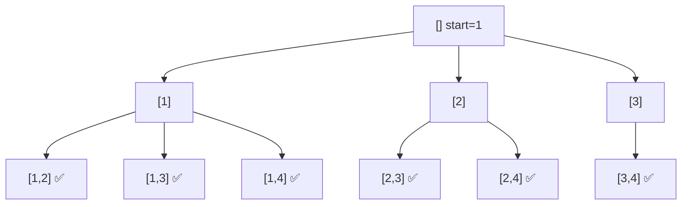

# Combinations

> Choose `k` of `n` numbers, order ignored. LC 77 · 🟡 Medium

## Problem
Return all combinations of `k` numbers chosen from `1 … n`. For `n=4, k=2`: `[1,2],[1,3],[1,4],[2,3],[2,4],[3,4]`.

## 🧮 Math / Recurrence
The count is the binomial coefficient:

$$
\binom{n}{k} = \frac{n!}{k!\,(n-k)!}
$$

DFS over an advancing `start` index, recording when the path reaches length `k`:

$$
\text{dfs}(start) = \begin{cases}
\text{record } path & |path| = k \\
\displaystyle\bigcup_{i=start}^{n} \text{dfs}(i+1) \text{ after picking } i & \text{otherwise}
\end{cases}
$$

## 🧠 Logic
Because order doesn't matter, force an **increasing** sequence: `start` only moves forward so `[1,2]` and `[2,1]` never both appear. A combination is complete once it holds `k` elements.

**Pruning:** if fewer than `k − |path|` numbers remain, stop early — the branch can never reach size `k`.

## 🔢 Iteration trace (`n=4, k=2`)

6 combinations, matching `C(4,2)=6`.

## 🐍 Python
```python
def combine(n: int, k: int) -> list[list[int]]:
    res, path = [], []

    def dfs(start: int) -> None:
        if len(path) == k:
            res.append(path[:])
            return
        # prune: need (k - len(path)) more numbers
        for i in range(start, n - (k - len(path)) + 2):
            path.append(i)
            dfs(i + 1)
            path.pop()

    dfs(1)
    return res


if __name__ == "__main__":
    print(combine(4, 2))
```

## ⚙️ C++
```cpp
#include <iostream>
#include <vector>
using namespace std;

void dfs(int start, int n, int k, vector<int>& path,
         vector<vector<int>>& res) {
    if ((int)path.size() == k) { res.push_back(path); return; }
    int need = k - (int)path.size();
    for (int i = start; i <= n - need + 1; ++i) {   // prune
        path.push_back(i);
        dfs(i + 1, n, k, path, res);
        path.pop_back();
    }
}

vector<vector<int>> combine(int n, int k) {
    vector<vector<int>> res; vector<int> path;
    dfs(1, n, k, path, res);
    return res;
}

int main() {
    cout << combine(4, 2).size() << " combinations\n";   // 6
}
```

## ⏱️ Complexity
- **Time:** `O(k · C(n,k))` — one copy per combination.
- **Space:** `O(k)` recursion depth.
