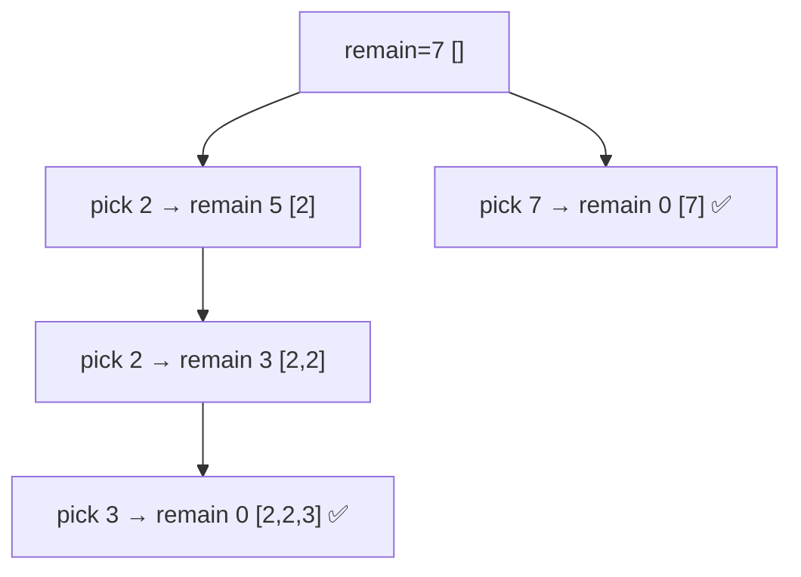

# Combination Sum

> Pick numbers (reuse allowed) that sum to a target. LC 39 · 🟡 Medium

## Problem
Given **distinct** positive integers `candidates` and a `target`, return all unique combinations that sum to `target`. Each candidate may be used **unlimited** times. For `candidates=[2,3,6,7], target=7`: `[2,2,3]` and `[7]`.

## 🧮 Math / Recurrence
Let `dfs(start, remain)` build combinations whose remaining target is `remain`:

$$
\text{dfs}(start, remain) = \begin{cases}
\text{record } path & remain = 0 \\
\text{prune} & remain < 0 \\
\displaystyle\bigcup_{i=start}^{n-1} \text{dfs}(i,\ remain - c_i) & \text{otherwise}
\end{cases}
$$

Note the recursion passes `i` (not `i+1`) — that is what permits **reuse** of the same candidate.

## 🧠 Logic
- Recurse with the **same index** `i` so a candidate can repeat.
- Keep `start` to enforce non-decreasing order, preventing permuted duplicates like `[2,3,2]`.
- **Sort + break:** once `candidates[i] > remain`, every later (larger) candidate also overflows, so stop the loop.

## 🔢 Iteration trace (`[2,3,6,7], target=7`)

Valid: `[2,2,3]`, `[7]`.

## 🐍 Python
```python
def combination_sum(candidates: list[int], target: int) -> list[list[int]]:
    candidates.sort()
    res, path = [], []

    def dfs(start: int, remain: int) -> None:
        if remain == 0:
            res.append(path[:])
            return
        for i in range(start, len(candidates)):
            if candidates[i] > remain:        # sorted → prune rest
                break
            path.append(candidates[i])
            dfs(i, remain - candidates[i])    # i (not i+1) → reuse
            path.pop()

    dfs(0, target)
    return res


if __name__ == "__main__":
    print(combination_sum([2, 3, 6, 7], 7))   # [[2, 2, 3], [7]]
```

## ⚙️ C++
```cpp
#include <algorithm>
#include <iostream>
#include <vector>
using namespace std;

void dfs(int start, int remain, vector<int>& c, vector<int>& path,
         vector<vector<int>>& res) {
    if (remain == 0) { res.push_back(path); return; }
    for (int i = start; i < (int)c.size(); ++i) {
        if (c[i] > remain) break;            // sorted → prune rest
        path.push_back(c[i]);
        dfs(i, remain - c[i], c, path, res); // reuse same index
        path.pop_back();
    }
}

vector<vector<int>> combinationSum(vector<int>& candidates, int target) {
    sort(candidates.begin(), candidates.end());
    vector<vector<int>> res; vector<int> path;
    dfs(0, target, candidates, path, res);
    return res;
}

int main() {
    vector<int> c = {2, 3, 6, 7};
    cout << combinationSum(c, 7).size() << " combinations\n";   // 2
}
```

## ⏱️ Complexity
- **Time:** exponential in the worst case — bounded by the number of valid combinations times path length.
- **Space:** `O(target / min(candidate))` recursion depth.
