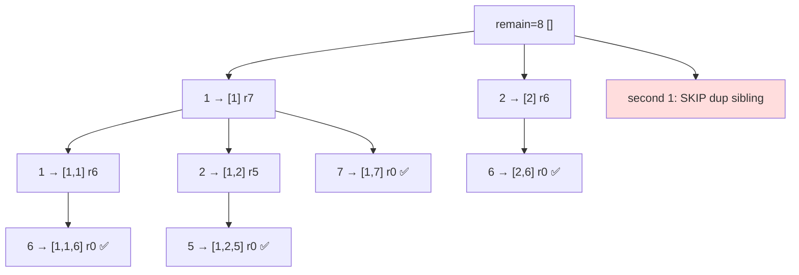

# Combination Sum II

> Each number used once, no duplicate combinations. LC 40 · 🟡 Medium

## Problem
Given `candidates` (which **may contain duplicates**) and a `target`, return all unique combinations summing to `target`. Each number may be used **at most once**. For `[10,1,2,7,6,1,5], target=8`: `[1,1,6],[1,2,5],[1,7],[2,6]`.

## 🧮 Math / Recurrence
Combine two ideas — advance the index (each used once) **and** dedup siblings (from [Subsets II](12-subsets-ii.md)):

$$
\text{dfs}(start, remain),\quad \text{skip } c_i \text{ if } i>start \wedge c_i = c_{i-1}
$$

recursing with `i+1` (consume the element).

## 🧠 Logic
- Sort so duplicates are adjacent and pruning works.
- Recurse with `i+1` → every element is consumed once.
- `i > start and c[i] == c[i-1]` skips a duplicate **sibling** at the same depth, so `[1,7]` isn't generated twice by the two `1`s.
- `c[i] > remain` → break (sorted).

## 🔢 Iteration trace (`[1,1,2,5,6,7,10], target=8`)

Result: `[1,1,6], [1,2,5], [1,7], [2,6]`.

## 🐍 Python
```python
def combination_sum2(candidates: list[int], target: int) -> list[list[int]]:
    candidates.sort()
    res, path = [], []

    def dfs(start: int, remain: int) -> None:
        if remain == 0:
            res.append(path[:])
            return
        for i in range(start, len(candidates)):
            if i > start and candidates[i] == candidates[i - 1]:
                continue                       # skip duplicate sibling
            if candidates[i] > remain:
                break
            path.append(candidates[i])
            dfs(i + 1, remain - candidates[i]) # i+1 → used once
            path.pop()

    dfs(0, target)
    return res


if __name__ == "__main__":
    print(combination_sum2([10, 1, 2, 7, 6, 1, 5], 8))
```

## ⚙️ C++
```cpp
#include <algorithm>
#include <iostream>
#include <vector>
using namespace std;

void dfs(int start, int remain, vector<int>& c, vector<int>& path,
         vector<vector<int>>& res) {
    if (remain == 0) { res.push_back(path); return; }
    for (int i = start; i < (int)c.size(); ++i) {
        if (i > start && c[i] == c[i - 1]) continue;  // skip dup sibling
        if (c[i] > remain) break;
        path.push_back(c[i]);
        dfs(i + 1, remain - c[i], c, path, res);      // used once
        path.pop_back();
    }
}

vector<vector<int>> combinationSum2(vector<int>& candidates, int target) {
    sort(candidates.begin(), candidates.end());
    vector<vector<int>> res; vector<int> path;
    dfs(0, target, candidates, path, res);
    return res;
}

int main() {
    vector<int> c = {10, 1, 2, 7, 6, 1, 5};
    cout << combinationSum2(c, 8).size() << " combinations\n";   // 4
}
```

## ⏱️ Complexity
- **Time:** `O(2ⁿ)` worst case over subsets.
- **Space:** `O(n)` recursion depth.
