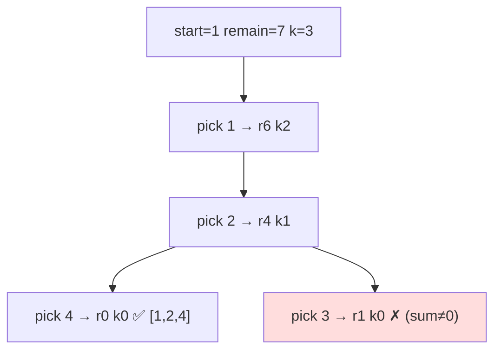

# Combination Sum III

> Exactly `k` distinct digits (1–9) summing to `n`. LC 216 · 🟡 Medium

## Problem
Find all combinations of `k` **distinct** numbers from `1…9` that add up to `n`. Each number used at most once. For `k=3, n=7`: `[1,2,4]`.

## 🧮 Math / Recurrence
DFS over digits `start…9` with two stopping signals — count `k` and remaining sum `remain`:

$$
\text{dfs}(start, remain, k) = \begin{cases}
\text{record} & k = 0 \wedge remain = 0 \\
\text{prune} & k = 0 \oplus remain = 0,\ \text{or } remain < 0 \\
\displaystyle\bigcup_{i=start}^{9} \text{dfs}(i+1,\ remain - i,\ k-1) & \text{otherwise}
\end{cases}
$$

## 🧠 Logic
Like [Combinations](13-combinations.md) restricted to digits `1–9`, but we also track the sum. A combination is valid only when **both** conditions hit zero simultaneously. Two prunes keep it fast:
- `remain < 0` → overshot the target.
- `i > remain` → since digits increase, no later digit fits either.

## 🔢 Iteration trace (`k=3, n=7`)

Only valid combination: `[1,2,4]`.

## 🐍 Python
```python
def combination_sum3(k: int, n: int) -> list[list[int]]:
    res, path = [], []

    def dfs(start: int, remain: int) -> None:
        if len(path) == k:
            if remain == 0:
                res.append(path[:])
            return
        for i in range(start, 10):
            if i > remain:                    # digits increasing → prune
                break
            path.append(i)
            dfs(i + 1, remain - i)
            path.pop()

    dfs(1, n)
    return res


if __name__ == "__main__":
    print(combination_sum3(3, 7))   # [[1, 2, 4]]
```

## ⚙️ C++
```cpp
#include <iostream>
#include <vector>
using namespace std;

void dfs(int start, int remain, int k, vector<int>& path,
         vector<vector<int>>& res) {
    if ((int)path.size() == k) {
        if (remain == 0) res.push_back(path);
        return;
    }
    for (int i = start; i <= 9; ++i) {
        if (i > remain) break;               // prune
        path.push_back(i);
        dfs(i + 1, remain - i, k, path, res);
        path.pop_back();
    }
}

vector<vector<int>> combinationSum3(int k, int n) {
    vector<vector<int>> res; vector<int> path;
    dfs(1, n, k, path, res);
    return res;
}

int main() {
    auto r = combinationSum3(3, 7);
    cout << r.size() << " combinations\n";   // 1
}
```

## ⏱️ Complexity
- **Time:** `O(C(9,k))` — at most 9-choose-`k` leaves.
- **Space:** `O(k)` recursion depth.
