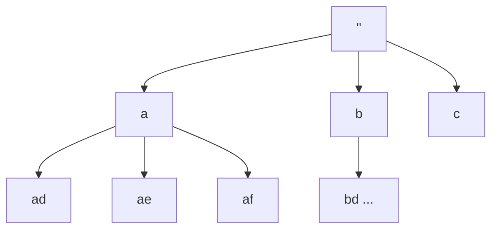

# Letter Combinations of a Phone Number

> Map digits to letters, branch over each. LC 17 · 🟡 Medium

## Problem
Given a string of digits `2–9`, return all letter combinations the number could spell on a classic phone keypad. For `"23"`: `ad, ae, af, bd, be, bf, cd, ce, cf`.

## 🧮 Math / Recurrence
With `L(d)` letters on digit `d`, the number of combinations is the product:

$$
\#\text{combos} = \prod_{d \in \text{digits}} L(d)
$$

DFS fixes one letter per position:

$$
\text{dfs}(i) = \begin{cases}
\text{record } path & i = |digits| \\
\displaystyle\bigcup_{c \,\in\, \text{map}[digits_i]} \text{dfs}(i+1) \text{ with } c & \text{otherwise}
\end{cases}
$$

## 🧠 Logic
Each digit contributes one character to the output. Recursion depth equals the number of digits; the branching factor at depth `i` is the count of letters on that digit. The Cartesian product of all letter sets is exactly the set of leaves.

## 🔢 Iteration trace (`"23"`, 2→abc, 3→def)

`3 × 3 = 9` combinations: `ad ae af bd be bf cd ce cf`.

## 🐍 Python
```python
def letter_combinations(digits: str) -> list[str]:
    if not digits:
        return []
    keypad = {
        "2": "abc", "3": "def", "4": "ghi", "5": "jkl",
        "6": "mno", "7": "pqrs", "8": "tuv", "9": "wxyz",
    }
    res, path = [], []

    def dfs(i: int) -> None:
        if i == len(digits):
            res.append("".join(path))
            return
        for c in keypad[digits[i]]:
            path.append(c)
            dfs(i + 1)
            path.pop()

    dfs(0)
    return res


if __name__ == "__main__":
    print(letter_combinations("23"))
```

## ⚙️ C++
```cpp
#include <iostream>
#include <string>
#include <vector>
using namespace std;

void dfs(int i, const string& digits, const vector<string>& pad,
         string& path, vector<string>& res) {
    if (i == (int)digits.size()) { res.push_back(path); return; }
    for (char c : pad[digits[i] - '0']) {
        path.push_back(c);
        dfs(i + 1, digits, pad, path, res);
        path.pop_back();
    }
}

vector<string> letterCombinations(string digits) {
    if (digits.empty()) return {};
    vector<string> pad = {"", "", "abc", "def", "ghi", "jkl",
                          "mno", "pqrs", "tuv", "wxyz"};
    vector<string> res; string path;
    dfs(0, digits, pad, path, res);
    return res;
}

int main() {
    cout << letterCombinations("23").size() << " combos\n";   // 9
}
```

## ⏱️ Complexity
- **Time:** `O(4ⁿ · n)` — up to 4 letters per digit, `n` digits.
- **Space:** `O(n)` recursion depth.
