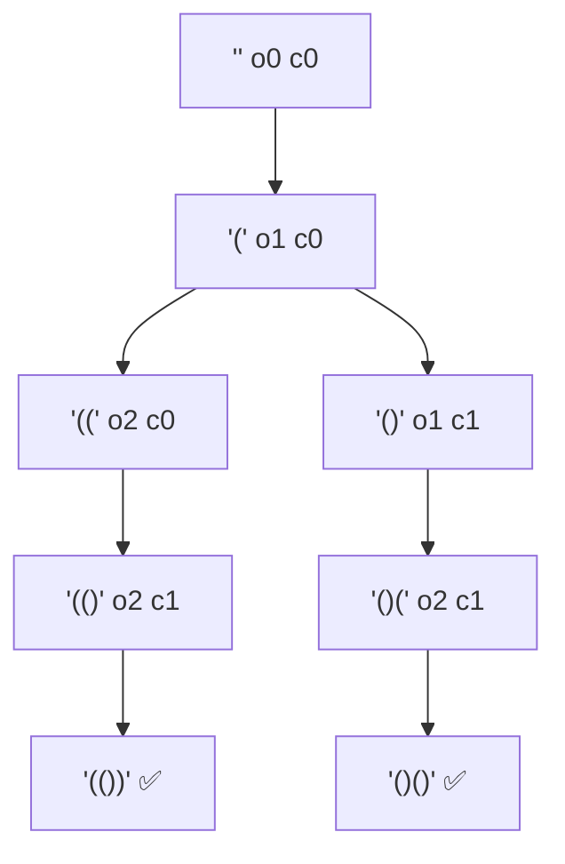

# Generate Parentheses

> All valid combinations of `n` bracket pairs. LC 22 · 🟡 Medium

## Problem
Given `n` pairs of parentheses, generate all **well-formed** combinations. For `n=3`: `((())), (()()), (())(), ()(()), ()()()`.

## 🧮 Math / Recurrence
Track how many `(` (`open`) and `)` (`close`) are placed:

$$
\text{dfs}(open, close) = \begin{cases}
\text{record} & open = close = n \\
\text{add `(' if } open < n \\
\text{add `)' if } close < open
\end{cases}
$$

The number of valid strings is the **Catalan number** $C_n = \frac{1}{n+1}\binom{2n}{n}$ (for `n=3`, that's 5).

## 🧠 Logic
Two invariants guarantee validity *as we build*, so no string is ever generated then rejected:
- add `(` only while `open < n` (don't exceed `n` opens),
- add `)` only while `close < open` (never close more than is open).

This pruning is why the algorithm produces exactly the `Cₙ` valid strings and nothing else.

## 🔢 Iteration trace (`n=2`)

For `n=2`: `(())`, `()()` — `C₂ = 2`.

## 🐍 Python
```python
def generate_parenthesis(n: int) -> list[str]:
    res, path = [], []

    def dfs(open_c: int, close_c: int) -> None:
        if open_c == n and close_c == n:
            res.append("".join(path))
            return
        if open_c < n:
            path.append("("); dfs(open_c + 1, close_c); path.pop()
        if close_c < open_c:
            path.append(")"); dfs(open_c, close_c + 1); path.pop()

    dfs(0, 0)
    return res


if __name__ == "__main__":
    print(generate_parenthesis(3))
```

## ⚙️ C++
```cpp
#include <iostream>
#include <string>
#include <vector>
using namespace std;

void dfs(int open, int close, int n, string& path, vector<string>& res) {
    if (open == n && close == n) { res.push_back(path); return; }
    if (open < n)     { path.push_back('('); dfs(open + 1, close, n, path, res); path.pop_back(); }
    if (close < open) { path.push_back(')'); dfs(open, close + 1, n, path, res); path.pop_back(); }
}

vector<string> generateParenthesis(int n) {
    vector<string> res; string path;
    dfs(0, 0, n, path, res);
    return res;
}

int main() {
    cout << generateParenthesis(3).size() << " strings\n";   // 5
}
```

## ⏱️ Complexity
- **Time:** `O(4ⁿ / √n)` — proportional to the Catalan number times string length.
- **Space:** `O(n)` recursion depth.
