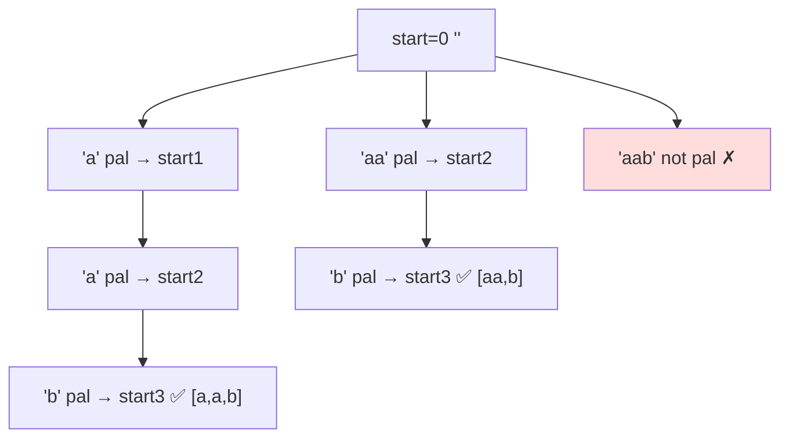

# Palindrome Partitioning

> Split a string so every part is a palindrome. LC 131 · 🟡 Medium

## Problem
Partition string `s` so that every substring of the partition is a palindrome; return all such partitionings. For `"aab"`: `[["a","a","b"],["aa","b"]]`.

## 🧮 Math / Recurrence
DFS over a cut position `start`. Try each prefix `s[start:end]`; if it is a palindrome, fix it and recurse on the rest:

$$
\text{dfs}(start) = \begin{cases}
\text{record } path & start = |s| \\
\displaystyle\bigcup_{\substack{end > start \\ s[start:end]\,\text{pal}}} \text{dfs}(end) & \text{otherwise}
\end{cases}
$$

## 🧠 Logic
Every partition is determined by where the **first** cut lands. Try all first pieces that are palindromes, then recursively partition what remains. The base case `start == len(s)` means the whole string has been consumed by palindromic pieces. A precomputed `isPal[i][j]` table makes each palindrome check `O(1)`.

## 🔢 Iteration trace (`"aab"`)

Result: `[["a","a","b"], ["aa","b"]]`.

## 🐍 Python
```python
def partition(s: str) -> list[list[str]]:
    n = len(s)
    is_pal = [[False] * n for _ in range(n)]
    for i in range(n - 1, -1, -1):
        for j in range(i, n):
            if s[i] == s[j] and (j - i < 2 or is_pal[i + 1][j - 1]):
                is_pal[i][j] = True

    res, path = [], []

    def dfs(start: int) -> None:
        if start == n:
            res.append(path[:])
            return
        for end in range(start, n):
            if is_pal[start][end]:
                path.append(s[start:end + 1])
                dfs(end + 1)
                path.pop()

    dfs(0)
    return res


if __name__ == "__main__":
    print(partition("aab"))
```

## ⚙️ C++
```cpp
#include <iostream>
#include <string>
#include <vector>
using namespace std;

void dfs(int start, const string& s, vector<vector<bool>>& isPal,
         vector<string>& path, vector<vector<string>>& res) {
    if (start == (int)s.size()) { res.push_back(path); return; }
    for (int end = start; end < (int)s.size(); ++end) {
        if (isPal[start][end]) {
            path.push_back(s.substr(start, end - start + 1));
            dfs(end + 1, s, isPal, path, res);
            path.pop_back();
        }
    }
}

vector<vector<string>> partition(string s) {
    int n = s.size();
    vector<vector<bool>> isPal(n, vector<bool>(n, false));
    for (int i = n - 1; i >= 0; --i)
        for (int j = i; j < n; ++j)
            if (s[i] == s[j] && (j - i < 2 || isPal[i + 1][j - 1]))
                isPal[i][j] = true;
    vector<vector<string>> res; vector<string> path;
    dfs(0, s, isPal, path, res);
    return res;
}

int main() {
    cout << partition("aab").size() << " partitions\n";   // 2
}
```

## ⏱️ Complexity
- **Time:** `O(n · 2ⁿ)` — up to `2ⁿ⁻¹` partitions, each `O(n)` to copy.
- **Space:** `O(n²)` palindrome table + `O(n)` recursion.
