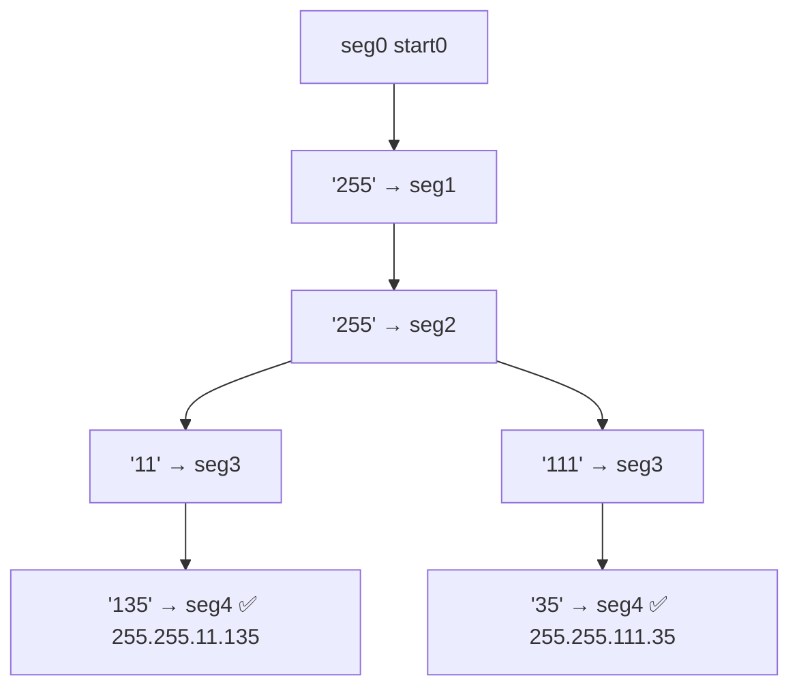

# Restore IP Addresses

> Insert 3 dots to form 4 valid octets. LC 93 · 🟡 Medium

## Problem
Given a digit string `s`, return all valid IPv4 addresses formable by inserting dots. Each of the 4 segments is `0–255` with **no leading zeros**. For `"25525511135"`: `255.255.11.135` and `255.255.111.35`.

## 🧮 Math / Recurrence
DFS placing one segment at a time; `seg` counts segments placed, `start` is the next index:

$$
\text{dfs}(start, seg) = \begin{cases}
\text{record if } start = |s| & seg = 4 \\
\displaystyle\bigcup_{len=1}^{3} \text{dfs}(start{+}len,\ seg{+}1) \text{ if } s[start:start+len] \text{ valid} & seg < 4
\end{cases}
$$

A segment is valid if its value `≤ 255` and it has no leading zero (length 1 may be `"0"`).

## 🧠 Logic
An IP has exactly 4 parts, each 1–3 digits. Branch on the length of the next octet, validating range and leading zeros immediately to prune. The answer is recorded only when **4 segments** are placed **and** all characters are consumed.

## 🔢 Iteration trace (`"25525511135"`)


## 🐍 Python
```python
def restore_ip_addresses(s: str) -> list[str]:
    res, path = [], []

    def valid(seg: str) -> bool:
        if len(seg) > 1 and seg[0] == "0":
            return False
        return int(seg) <= 255

    def dfs(start: int) -> None:
        if len(path) == 4:
            if start == len(s):
                res.append(".".join(path))
            return
        for length in range(1, 4):
            if start + length > len(s):
                break
            seg = s[start:start + length]
            if valid(seg):
                path.append(seg)
                dfs(start + length)
                path.pop()

    dfs(0)
    return res


if __name__ == "__main__":
    print(restore_ip_addresses("25525511135"))
```

## ⚙️ C++
```cpp
#include <iostream>
#include <string>
#include <vector>
using namespace std;

bool valid(const string& seg) {
    if (seg.size() > 1 && seg[0] == '0') return false;
    return stoi(seg) <= 255;
}

void dfs(int start, const string& s, vector<string>& path,
         vector<string>& res) {
    if ((int)path.size() == 4) {
        if (start == (int)s.size()) {
            string ip = path[0] + "." + path[1] + "." + path[2] + "." + path[3];
            res.push_back(ip);
        }
        return;
    }
    for (int len = 1; len <= 3 && start + len <= (int)s.size(); ++len) {
        string seg = s.substr(start, len);
        if (valid(seg)) {
            path.push_back(seg);
            dfs(start + len, s, path, res);
            path.pop_back();
        }
    }
}

vector<string> restoreIpAddresses(string s) {
    vector<string> res, path;
    dfs(0, s, path, res);
    return res;
}

int main() {
    cout << restoreIpAddresses("25525511135").size() << " IPs\n";   // 2
}
```

## ⏱️ Complexity
- **Time:** `O(1)` effectively — at most `3⁴ = 81` placements regardless of input.
- **Space:** `O(1)` depth (bounded by 4).
