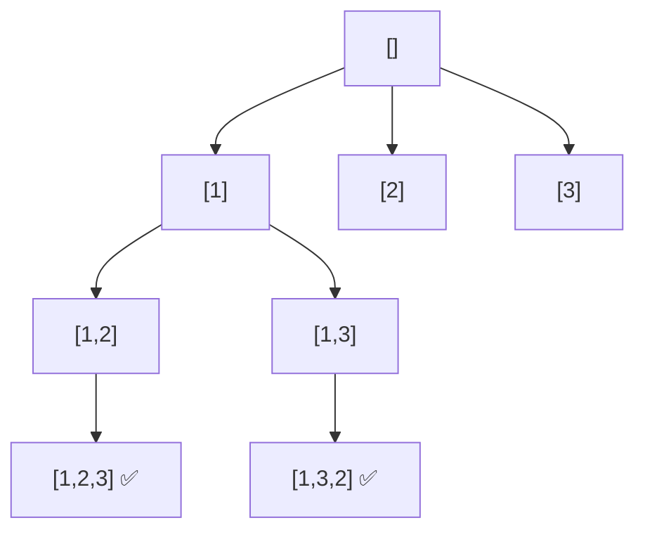

# Permutations

> All orderings of distinct numbers. LC 46 · 🟡 Medium

## Problem
Given an array of **distinct** integers, return all `n!` permutations. For `[1,2,3]`: 6 orderings.

## 🧮 Math / Recurrence
A permutation uses every element exactly once; with `n` distinct elements:

$$
\#\text{permutations} = n!
$$

DFS with a `used[]` marker — at each level pick any unused element:

$$
\text{dfs}(path) = \begin{cases}
\text{record} & |path| = n \\
\displaystyle\bigcup_{i:\ \neg used_i} \text{dfs}(path + nums_i) & \text{otherwise}
\end{cases}
$$

## 🧠 Logic
Unlike subsets/combinations (where a forward index enforces order), permutations **need** every order, so we can't use a `start` index. Instead a `used[]` boolean array tracks which elements are already in `path`; each level loops over all `n` elements and descends into the unused ones. Backtracking flips `used[i]` back to `False`.

## 🔢 Iteration trace (`[1,2,3]`)

6 leaves: `123,132,213,231,312,321`.

## 🐍 Python
```python
def permute(nums: list[int]) -> list[list[int]]:
    res, path = [], []
    used = [False] * len(nums)

    def dfs() -> None:
        if len(path) == len(nums):
            res.append(path[:])
            return
        for i in range(len(nums)):
            if used[i]:
                continue
            used[i] = True; path.append(nums[i])
            dfs()
            path.pop(); used[i] = False        # backtrack

    dfs()
    return res


if __name__ == "__main__":
    print(permute([1, 2, 3]))
```

## ⚙️ C++
```cpp
#include <iostream>
#include <vector>
using namespace std;

void dfs(vector<int>& nums, vector<bool>& used, vector<int>& path,
         vector<vector<int>>& res) {
    if (path.size() == nums.size()) { res.push_back(path); return; }
    for (int i = 0; i < (int)nums.size(); ++i) {
        if (used[i]) continue;
        used[i] = true; path.push_back(nums[i]);
        dfs(nums, used, path, res);
        path.pop_back(); used[i] = false;      // backtrack
    }
}

vector<vector<int>> permute(vector<int>& nums) {
    vector<vector<int>> res; vector<int> path;
    vector<bool> used(nums.size(), false);
    dfs(nums, used, path, res);
    return res;
}

int main() {
    vector<int> nums = {1, 2, 3};
    cout << permute(nums).size() << " permutations\n";   // 6
}
```

## ⏱️ Complexity
- **Time:** `O(n · n!)` — `n!` permutations, each `O(n)` to copy.
- **Space:** `O(n)` recursion depth + `used` array.
