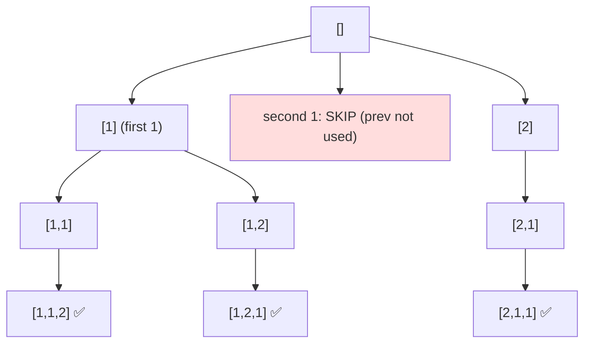

# Permutations II (with Duplicates)

> Unique orderings of a multiset. LC 47 · 🟡 Medium

## Problem
Given a collection that **may contain duplicates**, return all **unique** permutations. For `[1,1,2]`: `[1,1,2],[1,2,1],[2,1,1]`.

## 🧮 Math / Recurrence
Sort first, then at each level skip a duplicate value whose identical predecessor was **just undone**:

$$
\text{skip } nums_i \iff nums_i = nums_{i-1} \ \wedge\ \neg used_{i-1}
$$

The count is the multinomial $\dfrac{n!}{\prod_v (c_v!)}$ where `c_v` is the multiplicity of value `v`.

## 🧠 Logic
Duplicates create identical permutations if equal values are placed in different "slots" of the same shape. After sorting, the rule `nums[i]==nums[i-1] and not used[i-1]` ensures equal values are always consumed **left to right**: we only use a duplicate if its identical left neighbor is already in the current path. This canonical ordering yields each distinct permutation once.

> Why `not used[i-1]`? If `used[i-1]` is `True`, the predecessor is *in* the current path (deeper level) — a legitimate use. If it's `False`, the predecessor was undone at *this* level, so reusing the value now would duplicate a sibling.

## 🔢 Iteration trace (`[1,1,2]`)

3 unique permutations.

## 🐍 Python
```python
def permute_unique(nums: list[int]) -> list[list[int]]:
    nums.sort()
    res, path = [], []
    used = [False] * len(nums)

    def dfs() -> None:
        if len(path) == len(nums):
            res.append(path[:])
            return
        for i in range(len(nums)):
            if used[i]:
                continue
            if i > 0 and nums[i] == nums[i - 1] and not used[i - 1]:
                continue                       # skip duplicate sibling
            used[i] = True; path.append(nums[i])
            dfs()
            path.pop(); used[i] = False

    dfs()
    return res


if __name__ == "__main__":
    print(permute_unique([1, 1, 2]))
```

## ⚙️ C++
```cpp
#include <algorithm>
#include <iostream>
#include <vector>
using namespace std;

void dfs(vector<int>& nums, vector<bool>& used, vector<int>& path,
         vector<vector<int>>& res) {
    if (path.size() == nums.size()) { res.push_back(path); return; }
    for (int i = 0; i < (int)nums.size(); ++i) {
        if (used[i]) continue;
        if (i > 0 && nums[i] == nums[i - 1] && !used[i - 1]) continue; // skip dup
        used[i] = true; path.push_back(nums[i]);
        dfs(nums, used, path, res);
        path.pop_back(); used[i] = false;
    }
}

vector<vector<int>> permuteUnique(vector<int>& nums) {
    sort(nums.begin(), nums.end());
    vector<vector<int>> res; vector<int> path;
    vector<bool> used(nums.size(), false);
    dfs(nums, used, path, res);
    return res;
}

int main() {
    vector<int> nums = {1, 1, 2};
    cout << permuteUnique(nums).size() << " permutations\n";   // 3
}
```

## ⏱️ Complexity
- **Time:** `O(n · n!)` worst case (fewer with duplicates).
- **Space:** `O(n)` recursion depth.
